# Component Architecture

> **Referenced Files in This Document**
> - [App.tsx](src/App.tsx)
> - [main.tsx](src/main.tsx)
> - [Index.tsx](src/pages/Index.tsx)
> - [Navbar.tsx](src/components/Navbar.tsx)
> - [LanguageSwitcher.tsx](src/components/LanguageSwitcher.tsx)
> - [LanguageContext.tsx](src/contexts/LanguageContext.tsx)
> - [HeroSection.tsx](src/components/HeroSection.tsx)
> - [AgendaSection.tsx](src/components/AgendaSection.tsx)
> - [SpeakersSection.tsx](src/components/SpeakersSection.tsx)
> - [CountdownTimer.tsx](src/components/CountdownTimer.tsx)
> - [Footer.tsx](src/components/Footer.tsx)
> - [button.tsx](src/components/ui/button.tsx)
> - [dropdown-menu.tsx](src/components/ui/dropdown-menu.tsx)
> - [tooltip.tsx](src/components/ui/tooltip.tsx)
> - [utils.ts](src/lib/utils.ts)

## Table of Contents
1. [Introduction](#introduction)
2. [Project Structure](#project-structure)
3. [Core Components](#core-components)
4. [Architecture Overview](#architecture-overview)
5. [Detailed Component Analysis](#detailed-component-analysis)
6. [Dependency Analysis](#dependency-analysis)
7. [Performance Considerations](#performance-considerations)
8. [Troubleshooting Guide](#troubleshooting-guide)
9. [Conclusion](#conclusion)

## Introduction
This document explains the component architecture of the Syrian Community project, focusing on the hierarchical structure and composition patterns. It describes how the App component acts as the root container with providers for QueryClient, LanguageProvider, and TooltipProvider. It details how the Index page composes high-level sections such as HeroSection, AgendaSection, and SpeakersSection. It also clarifies how custom components integrate with ShadCN UI primitives and components, and illustrates composition patterns with examples like Navbar’s use of Button and DropdownMenu components. Finally, it addresses common issues in component communication and state propagation and provides best practices for organization and reusability.

## Project Structure
The application follows a clear feature-based and layer-based organization:
- Root entry point initializes the React app and mounts the App component.
- App wraps the application with provider layers for internationalization, tooltips, and data fetching.
- The Index page composes multiple section components to build the main landing page.
- Custom components are grouped under src/components, while ShadCN UI primitives live under src/components/ui.
- Utility functions centralize Tailwind class merging.

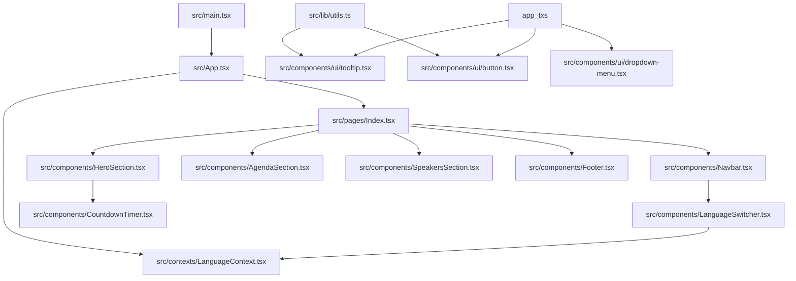

**Diagram sources**
- [main.tsx](src/main.tsx#L1-L6)
- [App.tsx](src/App.tsx#L1-L43)
- [Index.tsx](src/pages/Index.tsx#L1-L32)
- [Navbar.tsx](src/components/Navbar.tsx#L1-L123)
- [LanguageSwitcher.tsx](src/components/LanguageSwitcher.tsx#L1-L44)
- [LanguageContext.tsx](src/contexts/LanguageContext.tsx#L1-L292)
- [HeroSection.tsx](src/components/HeroSection.tsx#L1-L99)
- [AgendaSection.tsx](src/components/AgendaSection.tsx#L1-L64)
- [SpeakersSection.tsx](src/components/SpeakersSection.tsx#L1-L238)
- [CountdownTimer.tsx](src/components/CountdownTimer.tsx#L1-L78)
- [Footer.tsx](src/components/Footer.tsx#L1-L117)
- [button.tsx](src/components/ui/button.tsx#L1-L48)
- [dropdown-menu.tsx](src/components/ui/dropdown-menu.tsx#L1-L180)
- [tooltip.tsx](src/components/ui/tooltip.tsx#L1-L29)
- [utils.ts](src/lib/utils.ts#L1-L7)

**Section sources**
- [main.tsx](src/main.tsx#L1-L6)
- [App.tsx](src/App.tsx#L1-L43)
- [Index.tsx](src/pages/Index.tsx#L1-L32)

## Core Components
- App component: The root container that wires providers for QueryClient, TooltipProvider, and LanguageProvider around the application content. It also renders routing and toasts.
- Index page: The main page that composes all major sections and the Navbar/Footer.
- LanguageContext: Provides language state, translation function, and RTL direction to the app.
- ShadCN UI primitives: Reusable base components (Button, DropdownMenu, Tooltip) used by custom components.

Key provider stack and routing:
- Providers wrap the application in this order: QueryClientProvider -> TooltipProvider -> LanguageProvider -> AppContent -> Router -> Routes.
- The Index page composes sections in a logical flow from top to bottom.

**Section sources**
- [App.tsx](src/App.tsx#L1-L43)
- [Index.tsx](src/pages/Index.tsx#L1-L32)
- [LanguageContext.tsx](src/contexts/LanguageContext.tsx#L1-L292)

## Architecture Overview
The architecture is layered:
- Presentation layer: Pages and components (e.g., Index, Navbar, HeroSection).
- Composition layer: Sections composed by the Index page.
- Provider layer: Language, UI, and data providers.
- UI foundation: ShadCN primitives consumed by custom components.

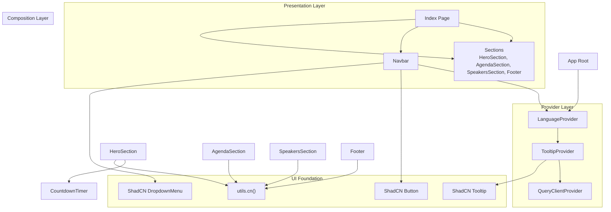

**Diagram sources**
- [App.tsx](src/App.tsx#L1-L43)
- [Index.tsx](src/pages/Index.tsx#L1-L32)
- [Navbar.tsx](src/components/Navbar.tsx#L1-L123)
- [HeroSection.tsx](src/components/HeroSection.tsx#L1-L99)
- [AgendaSection.tsx](src/components/AgendaSection.tsx#L1-L64)
- [SpeakersSection.tsx](src/components/SpeakersSection.tsx#L1-L238)
- [CountdownTimer.tsx](src/components/CountdownTimer.tsx#L1-L78)
- [Footer.tsx](src/components/Footer.tsx#L1-L117)
- [button.tsx](src/components/ui/button.tsx#L1-L48)
- [dropdown-menu.tsx](src/components/ui/dropdown-menu.tsx#L1-L180)
- [tooltip.tsx](src/components/ui/tooltip.tsx#L1-L29)
- [utils.ts](src/lib/utils.ts#L1-L7)

## Detailed Component Analysis

### App Root Container and Providers
- The App component sets up the provider stack and routes:
  - QueryClientProvider wraps the entire app for data fetching.
  - TooltipProvider enables global tooltip behavior.
  - LanguageProvider supplies language state and translation to all components.
  - Router and Routes define the Index page as the root route and a catch-all for 404.
- AppContent applies directional layout and font classes based on language and renders toasts.

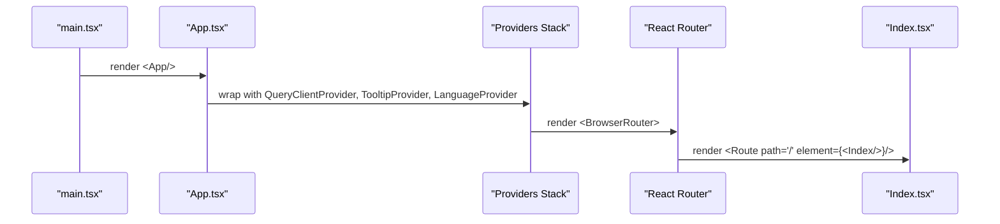

**Diagram sources**
- [main.tsx](src/main.tsx#L1-L6)
- [App.tsx](src/App.tsx#L1-L43)
- [Index.tsx](src/pages/Index.tsx#L1-L32)

**Section sources**
- [App.tsx](src/App.tsx#L1-L43)
- [main.tsx](src/main.tsx#L1-L6)

### Index Page Composition
- The Index page composes the full-page layout by importing and rendering:
  - Navbar, HeroSection, WhySection, GoalsSection, DetailsSection, AgendaSection, SpeakersSection, OrganizersSection, RegistrationSection, Footer, and ScrollToTop.
- This establishes a clear, top-to-bottom composition pattern for the landing page.

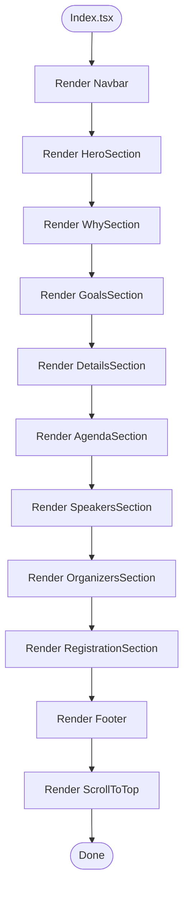

**Diagram sources**
- [Index.tsx](src/pages/Index.tsx#L1-L32)

**Section sources**
- [Index.tsx](src/pages/Index.tsx#L1-L32)

### Navbar Composition and ShadCN Integration
- Navbar integrates:
  - LanguageSwitcher for language selection.
  - Scroll behavior to navigate to sections.
  - Responsive mobile menu toggle.
- Navbar consumes:
  - Button and DropdownMenu primitives indirectly via LanguageSwitcher and internal UI patterns.
  - TooltipProvider for tooltip support.
  - LanguageContext for translations and RTL direction.

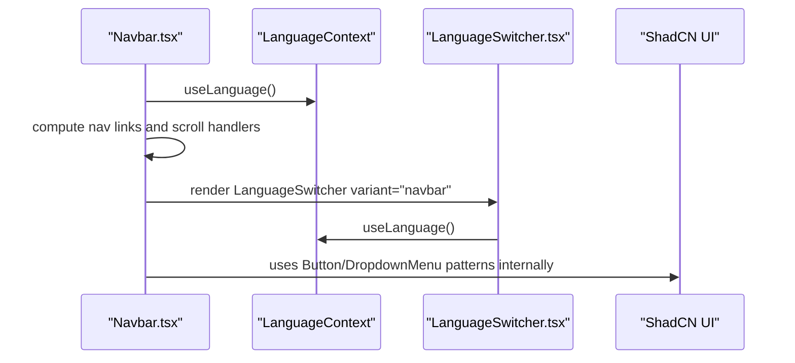

**Diagram sources**
- [Navbar.tsx](src/components/Navbar.tsx#L1-L123)
- [LanguageSwitcher.tsx](src/components/LanguageSwitcher.tsx#L1-L44)
- [LanguageContext.tsx](src/contexts/LanguageContext.tsx#L1-L292)
- [button.tsx](src/components/ui/button.tsx#L1-L48)
- [dropdown-menu.tsx](src/components/ui/dropdown-menu.tsx#L1-L180)

**Section sources**
- [Navbar.tsx](src/components/Navbar.tsx#L1-L123)
- [LanguageSwitcher.tsx](src/components/LanguageSwitcher.tsx#L1-L44)
- [LanguageContext.tsx](src/contexts/LanguageContext.tsx#L1-L292)

### HeroSection Composition and Subcomponents
- HeroSection composes:
  - Decorative assets and animations.
  - CountdownTimer for dynamic countdown display.
  - LanguageContext for localized text.
- It demonstrates composition by importing and rendering CountdownTimer as part of the hero content.

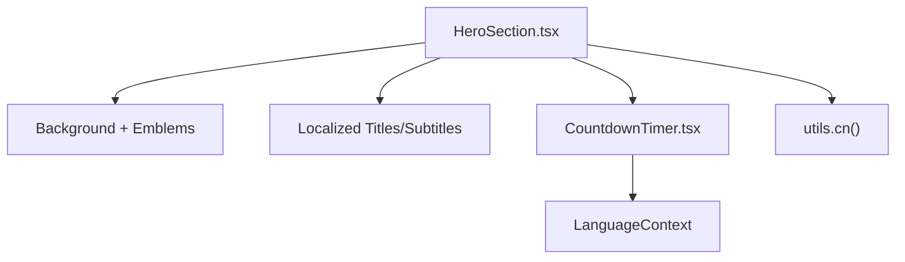

**Diagram sources**
- [HeroSection.tsx](src/components/HeroSection.tsx#L1-L99)
- [CountdownTimer.tsx](src/components/CountdownTimer.tsx#L1-L78)
- [LanguageContext.tsx](src/contexts/LanguageContext.tsx#L1-L292)
- [utils.ts](src/lib/utils.ts#L1-L7)

**Section sources**
- [HeroSection.tsx](src/components/HeroSection.tsx#L1-L99)
- [CountdownTimer.tsx](src/components/CountdownTimer.tsx#L1-L78)

### AgendaSection Composition Pattern
- AgendaSection builds a responsive grid of agenda items.
- It uses LanguageContext for localized titles and descriptions and applies Tailwind classes via utils.cn().
- The component demonstrates a clean separation between data (agenda items) and presentation.

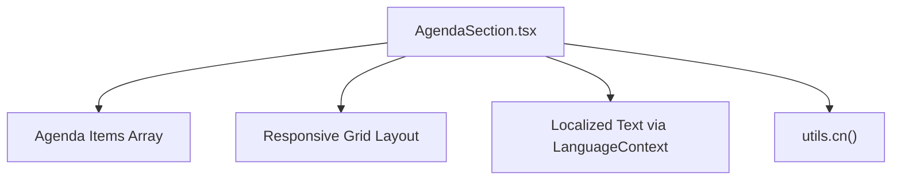

**Diagram sources**
- [AgendaSection.tsx](src/components/AgendaSection.tsx#L1-L64)
- [LanguageContext.tsx](src/contexts/LanguageContext.tsx#L1-L292)
- [utils.ts](src/lib/utils.ts#L1-L7)

**Section sources**
- [AgendaSection.tsx](src/components/AgendaSection.tsx#L1-L64)

### SpeakersSection Composition and Internationalization
- SpeakersSection defines a typed speaker list and renders a responsive grid.
- It uses LanguageContext to select localized names and roles based on current language.
- It demonstrates robust internationalization and fallbacks for missing images.

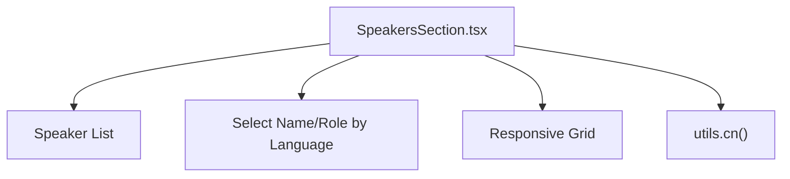

**Diagram sources**
- [SpeakersSection.tsx](src/components/SpeakersSection.tsx#L1-L238)
- [LanguageContext.tsx](src/contexts/LanguageContext.tsx#L1-L292)
- [utils.ts](src/lib/utils.ts#L1-L7)

**Section sources**
- [SpeakersSection.tsx](src/components/SpeakersSection.tsx#L1-L238)

### Footer Composition and Social Links
- Footer renders branding, social links, and localized text.
- It uses LanguageContext for dynamic subtitles and labels and Tailwind utilities via utils.cn().

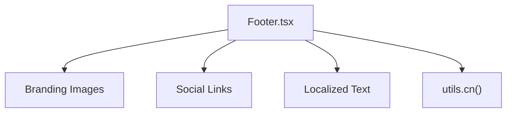

**Diagram sources**
- [Footer.tsx](src/components/Footer.tsx#L1-L117)
- [LanguageContext.tsx](src/contexts/LanguageContext.tsx#L1-L292)
- [utils.ts](src/lib/utils.ts#L1-L7)

**Section sources**
- [Footer.tsx](src/components/Footer.tsx#L1-L117)

### Relationship Between Custom Components and ShadCN UI
- Custom components consume ShadCN primitives through:
  - Direct usage of Button and DropdownMenu patterns in Navbar and LanguageSwitcher.
  - TooltipProvider enabling global tooltip behavior across the app.
  - Utilities like utils.cn() for composing Tailwind classes consistently.
- This pattern ensures consistent styling and behavior while keeping custom components focused on domain logic.

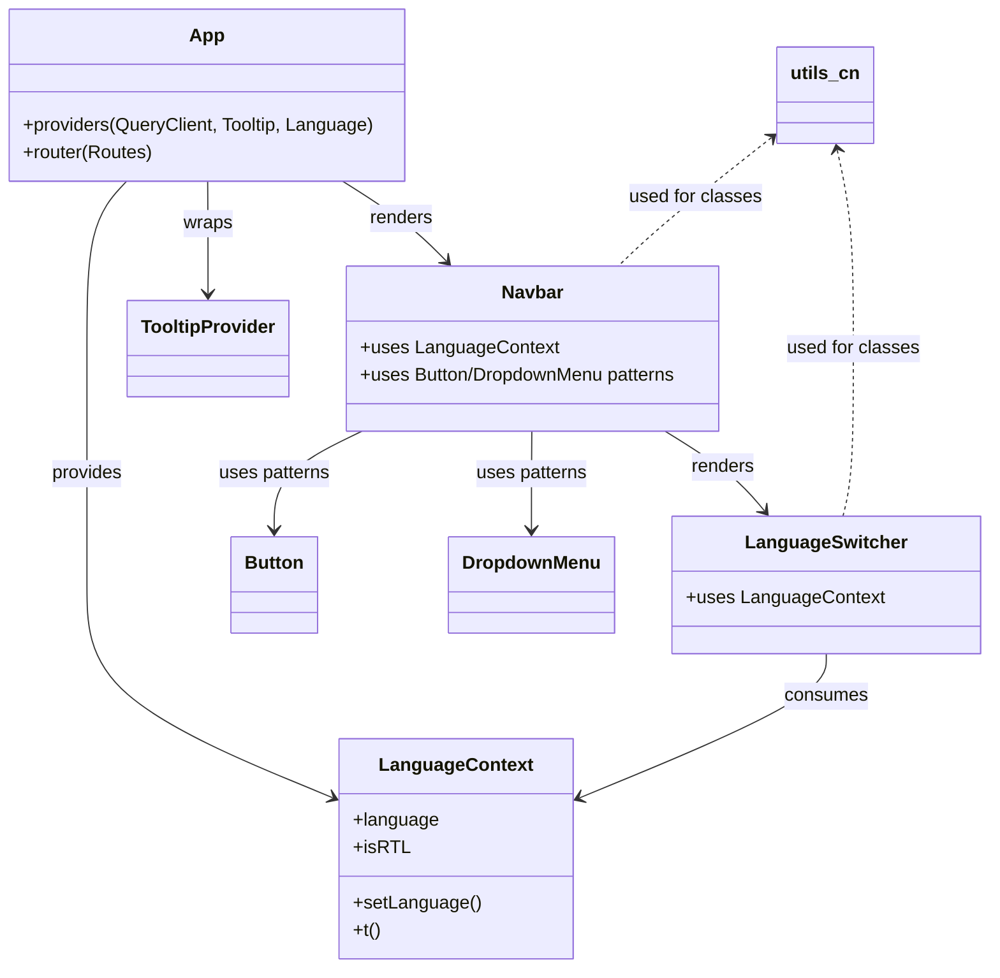

**Diagram sources**
- [App.tsx](src/App.tsx#L1-L43)
- [Navbar.tsx](src/components/Navbar.tsx#L1-L123)
- [LanguageSwitcher.tsx](src/components/LanguageSwitcher.tsx#L1-L44)
- [LanguageContext.tsx](src/contexts/LanguageContext.tsx#L1-L292)
- [button.tsx](src/components/ui/button.tsx#L1-L48)
- [dropdown-menu.tsx](src/components/ui/dropdown-menu.tsx#L1-L180)
- [tooltip.tsx](src/components/ui/tooltip.tsx#L1-L29)
- [utils.ts](src/lib/utils.ts#L1-L7)

**Section sources**
- [App.tsx](src/App.tsx#L1-L43)
- [Navbar.tsx](src/components/Navbar.tsx#L1-L123)
- [LanguageSwitcher.tsx](src/components/LanguageSwitcher.tsx#L1-L44)
- [LanguageContext.tsx](src/contexts/LanguageContext.tsx#L1-L292)
- [button.tsx](src/components/ui/button.tsx#L1-L48)
- [dropdown-menu.tsx](src/components/ui/dropdown-menu.tsx#L1-L180)
- [tooltip.tsx](src/components/ui/tooltip.tsx#L1-L29)
- [utils.ts](src/lib/utils.ts#L1-L7)

## Dependency Analysis
- Provider dependencies:
  - App depends on LanguageContext for translations and directionality.
  - Navbar depends on LanguageContext and indirectly on ShadCN UI patterns.
  - HeroSection depends on CountdownTimer and LanguageContext.
  - All sections depend on utils.cn() for Tailwind class composition.
- Routing and navigation:
  - Index page composes sections and Navbar; Navbar handles smooth scrolling to sections.
- External libraries:
  - @tanstack/react-query for data fetching.
  - @radix-ui/react-* for accessible UI primitives.
  - lucide-react for icons.

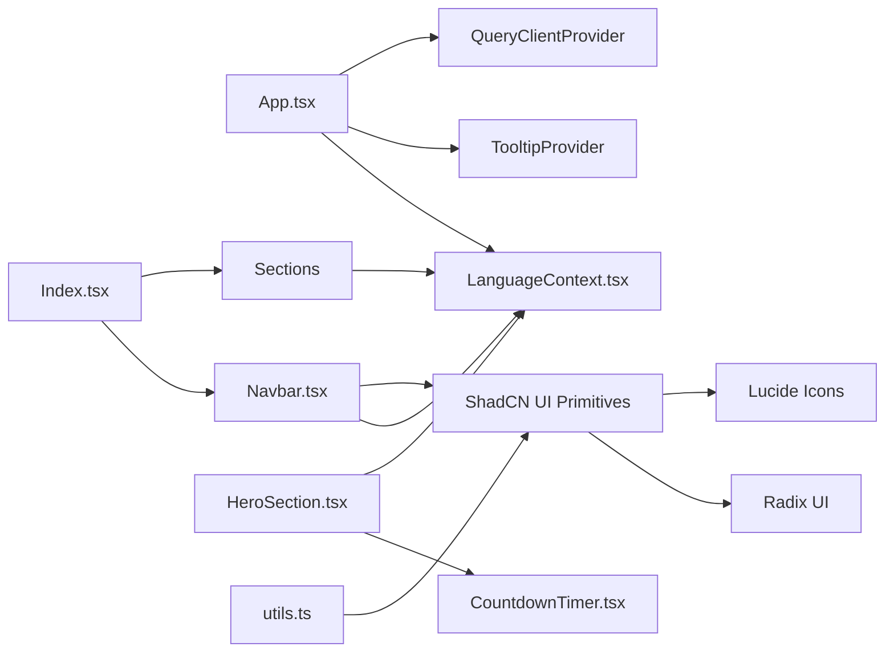

**Diagram sources**
- [App.tsx](src/App.tsx#L1-L43)
- [Index.tsx](src/pages/Index.tsx#L1-L32)
- [Navbar.tsx](src/components/Navbar.tsx#L1-L123)
- [LanguageContext.tsx](src/contexts/LanguageContext.tsx#L1-L292)
- [HeroSection.tsx](src/components/HeroSection.tsx#L1-L99)
- [CountdownTimer.tsx](src/components/CountdownTimer.tsx#L1-L78)
- [button.tsx](src/components/ui/button.tsx#L1-L48)
- [dropdown-menu.tsx](src/components/ui/dropdown-menu.tsx#L1-L180)
- [tooltip.tsx](src/components/ui/tooltip.tsx#L1-L29)
- [utils.ts](src/lib/utils.ts#L1-L7)

**Section sources**
- [App.tsx](src/App.tsx#L1-L43)
- [Index.tsx](src/pages/Index.tsx#L1-L32)
- [Navbar.tsx](src/components/Navbar.tsx#L1-L123)
- [LanguageContext.tsx](src/contexts/LanguageContext.tsx#L1-L292)
- [utils.ts](src/lib/utils.ts#L1-L7)

## Performance Considerations
- Provider layering:
  - Keep providers minimal and only where needed. The current stack is appropriate for this app’s scope.
- Rendering cost:
  - Sections are static aside from CountdownTimer; consider memoizing heavy computations if added later.
- Event listeners:
  - Navbar scroll listener is attached and cleaned up; ensure cleanup in all components that attach window events.
- Tailwind class merging:
  - utils.cn() reduces class conflicts and improves runtime performance by merging classes efficiently.

[No sources needed since this section provides general guidance]

## Troubleshooting Guide
Common issues and best practices:
- LanguageContext not wrapped:
  - Ensure LanguageProvider is present in the tree. Components using useLanguage must be descendants of the provider.
  - Symptom: errors when calling useLanguage outside provider.
- Tooltip not appearing:
  - Ensure TooltipProvider is rendered at the root level.
- Navbar scroll not working:
  - Verify anchor IDs match section IDs and that smooth scrolling is supported by the browser.
- CountdownTimer not updating:
  - Confirm interval is cleared on unmount and that the event date is correct.
- Class conflicts:
  - Use utils.cn() to merge Tailwind classes and avoid duplication.

**Section sources**
- [LanguageContext.tsx](src/contexts/LanguageContext.tsx#L269-L292)
- [App.tsx](src/App.tsx#L1-L43)
- [Navbar.tsx](src/components/Navbar.tsx#L1-L123)
- [CountdownTimer.tsx](src/components/CountdownTimer.tsx#L1-L78)
- [utils.ts](src/lib/utils.ts#L1-L7)

## Conclusion
The component architecture cleanly separates concerns across provider, composition, and UI layers. The App component serves as a robust root container with essential providers, while the Index page composes high-level sections that encapsulate domain logic. Custom components integrate ShadCN UI primitives thoughtfully, leveraging LanguageContext for internationalization and utils.cn() for consistent styling. Following the outlined composition patterns and best practices will help maintain scalability, readability, and reliability as the application evolves.