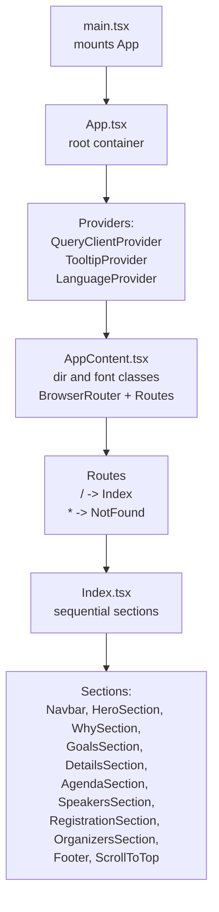
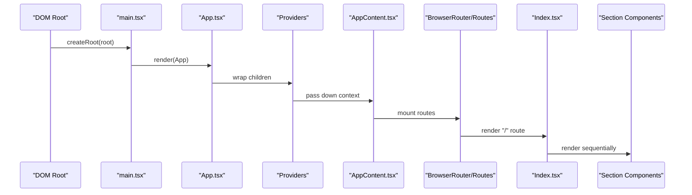
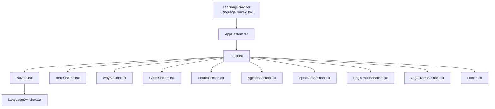
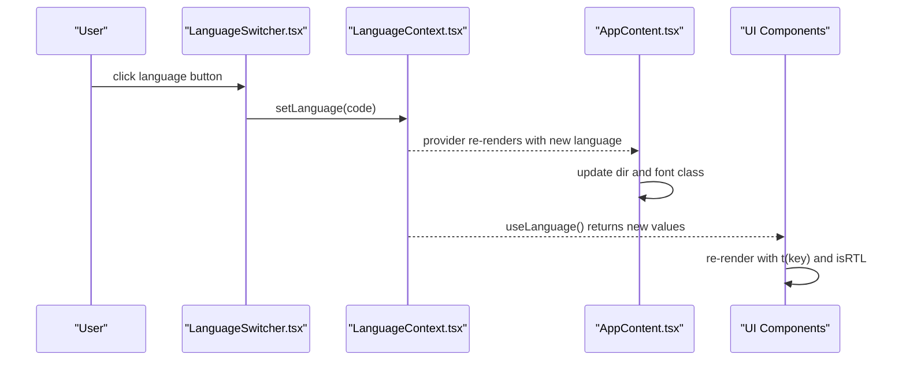
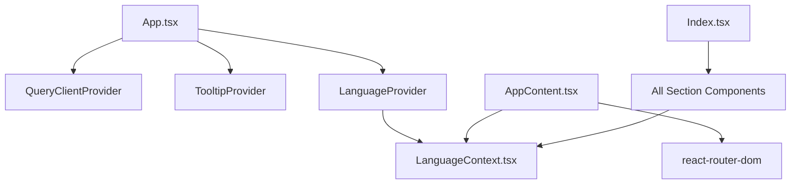

# Component Hierarchy and Composition

<cite>
**Referenced Files in This Document**
- [main.tsx](file://src/main.tsx)
- [App.tsx](file://src/App.tsx)
- [LanguageContext.tsx](file://src/contexts/LanguageContext.tsx)
- [Index.tsx](file://src/pages/Index.tsx)
- [Navbar.tsx](file://src/components/Navbar.tsx)
- [LanguageSwitcher.tsx](file://src/components/LanguageSwitcher.tsx)
- [HeroSection.tsx](file://src/components/HeroSection.tsx)
- [WhySection.tsx](file://src/components/WhySection.tsx)
- [GoalsSection.tsx](file://src/components/GoalsSection.tsx)
- [DetailsSection.tsx](file://src/components/DetailsSection.tsx)
- [AgendaSection.tsx](file://src/components/AgendaSection.tsx)
- [SpeakersSection.tsx](file://src/components/SpeakersSection.tsx)
- [RegistrationSection.tsx](file://src/components/RegistrationSection.tsx)
- [OrganizersSection.tsx](file://src/components/OrganizersSection.tsx)
- [Footer.tsx](file://src/components/Footer.tsx)
- [ScrollToTop.tsx](file://src/components/ScrollToTop.tsx)
</cite>

## Table of Contents
1. [Introduction](#introduction)
2. [Project Structure](#project-structure)
3. [Core Components](#core-components)
4. [Architecture Overview](#architecture-overview)
5. [Detailed Component Analysis](#detailed-component-analysis)
6. [Dependency Analysis](#dependency-analysis)
7. [Performance Considerations](#performance-considerations)
8. [Troubleshooting Guide](#troubleshooting-guide)
9. [Conclusion](#conclusion)

## Introduction
This document explains the component hierarchy and composition of the application, focusing on how the root container App sets up global providers, how AppContent manages routing and language-aware layout, and how the Index page composes the main UI in a sequential flow. It also details how context changes propagate through the component tree and outlines common issues and best practices.

## Project Structure
The application bootstraps at the root and mounts the App component. Providers wrap the app to supply global state and services. Routing is handled inside a language-aware wrapper that applies directionality and fonts based on the selected language.

**Diagram sources**
- [main.tsx](file://src/main.tsx#L1-L6)
- [App.tsx](file://src/App.tsx#L1-L43)
- [Index.tsx](file://src/pages/Index.tsx#L1-L32)

**Section sources**
- [main.tsx](file://src/main.tsx#L1-L6)
- [App.tsx](file://src/App.tsx#L1-L43)

## Core Components
- App: The root container that composes global providers for state and UI services.
- AppContent: A language-aware wrapper that applies direction and font classes, hosts routing, and renders toasts.
- Index: The main page that composes the full-page layout in a strict vertical sequence of sections.
- LanguageContext: Provides language, translation function, and RTL flag to the entire tree.

Key responsibilities:
- App sets up QueryClient for data fetching, TooltipProvider for UI hints, and LanguageProvider for internationalization.
- AppContent reads language state and applies dir and font classes, then mounts the router and routes.
- Index composes the page in a single column, ensuring predictable scroll and section alignment.
- LanguageContext exposes t(key) for localized strings and isRTL for layout direction.

**Section sources**
- [App.tsx](file://src/App.tsx#L1-L43)
- [LanguageContext.tsx](file://src/contexts/LanguageContext.tsx#L1-L292)
- [Index.tsx](file://src/pages/Index.tsx#L1-L32)

## Architecture Overview
The component hierarchy establishes a clear provider chain and a single-page layout. The flow is:

- Root mount -> App -> Providers -> AppContent -> Routes -> Index -> Sections

**Diagram sources**
- [main.tsx](file://src/main.tsx#L1-L6)
- [App.tsx](file://src/App.tsx#L1-L43)
- [Index.tsx](file://src/pages/Index.tsx#L1-L32)

## Detailed Component Analysis

### Provider Chain and Global Services
- QueryClientProvider: Enables TanStack Query for caching and data fetching across the app.
- TooltipProvider: Supplies tooltip behavior to UI components.
- LanguageProvider: Exposes language state, translation function, and RTL flag.

These providers are arranged so that AppContent can consume language state to apply direction and fonts, while all child components benefit from global services.

**Section sources**
- [App.tsx](file://src/App.tsx#L1-L43)
- [LanguageContext.tsx](file://src/contexts/LanguageContext.tsx#L267-L292)

### AppContent: Language-Aware Layout and Routing
AppContent reads the current language and computes:
- dir attribute for HTML directionality (rtl/ltr)
- font class based on language (Arabic uses a specific font; others use a different font)
It also renders:
- Toast containers for notifications
- BrowserRouter and Routes
- Route for "/" -> Index
- Catch-all route for unmatched paths -> NotFound

This ensures the entire UI respects language direction and typography consistently.

**Section sources**
- [App.tsx](file://src/App.tsx#L12-L31)

### Index Page: Sequential Section Composition
Index composes the main layout as a single-column sequence of sections:
- Navbar
- HeroSection
- WhySection
- GoalsSection
- DetailsSection
- AgendaSection
- SpeakersSection
- RegistrationSection
- OrganizersSection
- Footer
- ScrollToTop

The main container uses a min-height and overflow-x-hidden to prevent horizontal scrolling during layout transitions.

**Section sources**
- [Index.tsx](file://src/pages/Index.tsx#L1-L32)

### Parent-Child Relationships and Propagation
The parent-child chain is:
- App -> AppContent -> Index -> Section Components

Propagation of context changes:
- When the user switches language via LanguageSwitcher, the LanguageProvider updates state.
- All descendants that call useLanguage receive the updated language, isRTL, and t(key).
- Components like Navbar, HeroSection, WhySection, GoalsSection, AgendaSection, RegistrationSection, Footer, and others re-render with localized content and direction.

**Diagram sources**
- [LanguageContext.tsx](file://src/contexts/LanguageContext.tsx#L267-L292)
- [App.tsx](file://src/App.tsx#L12-L31)
- [Index.tsx](file://src/pages/Index.tsx#L1-L32)
- [Navbar.tsx](file://src/components/Navbar.tsx#L1-L123)
- [LanguageSwitcher.tsx](file://src/components/LanguageSwitcher.tsx#L1-L44)
- [HeroSection.tsx](file://src/components/HeroSection.tsx#L1-L99)
- [WhySection.tsx](file://src/components/WhySection.tsx#L1-L41)
- [GoalsSection.tsx](file://src/components/GoalsSection.tsx#L1-L54)
- [AgendaSection.tsx](file://src/components/AgendaSection.tsx#L1-L64)
- [RegistrationSection.tsx](file://src/components/RegistrationSection.tsx#L1-L105)
- [Footer.tsx](file://src/components/Footer.tsx#L1-L117)

### Example: Language Change Flow
When a user clicks a language option in LanguageSwitcher:
1. LanguageSwitcher invokes setLanguage(lang) from LanguageContext.
2. LanguageProvider updates the language state.
3. All components using useLanguage re-render with new values.
4. AppContent reapplies dir and font class based on the new language.
5. Navbar, Footer, and other components update labels and direction accordingly.

**Diagram sources**
- [LanguageSwitcher.tsx](file://src/components/LanguageSwitcher.tsx#L1-L44)
- [LanguageContext.tsx](file://src/contexts/LanguageContext.tsx#L267-L292)
- [App.tsx](file://src/App.tsx#L12-L31)
- [Navbar.tsx](file://src/components/Navbar.tsx#L1-L123)
- [Footer.tsx](file://src/components/Footer.tsx#L1-L117)

## Dependency Analysis
- App depends on:
  - QueryClientProvider (TanStack Query)
  - TooltipProvider (UI)
  - LanguageProvider (internationalization)
- AppContent depends on:
  - useLanguage from LanguageContext
  - react-router-dom for routing
- Index depends on:
  - All section components listed above
- Section components depend on:
  - useLanguage for localization
  - Shared assets and UI primitives

**Diagram sources**
- [App.tsx](file://src/App.tsx#L1-L43)
- [LanguageContext.tsx](file://src/contexts/LanguageContext.tsx#L267-L292)
- [Index.tsx](file://src/pages/Index.tsx#L1-L32)

**Section sources**
- [App.tsx](file://src/App.tsx#L1-L43)
- [LanguageContext.tsx](file://src/contexts/LanguageContext.tsx#L267-L292)
- [Index.tsx](file://src/pages/Index.tsx#L1-L32)

## Performance Considerations
- Provider depth: The provider chain is shallow and efficient. Keep providers near the root to minimize re-renders.
- Rendering cost: Sections are static content with images and minimal interactivity. Consider lazy-loading heavy assets if needed.
- Routing: Single-page routing avoids full reloads; keep route handlers simple to reduce navigation overhead.
- Context updates: Language changes trigger re-renders across the tree. Avoid unnecessary deep nesting to limit re-render scope.

[No sources needed since this section provides general guidance]

## Troubleshooting Guide
Common issues and resolutions:

- Context initialization order
  - Symptom: useLanguage throws an error indicating it must be used within a provider.
  - Cause: Components call useLanguage without being wrapped by LanguageProvider.
  - Fix: Ensure LanguageProvider is higher in the tree than any consumer. App already wraps AppContent with LanguageProvider, so verify consumers are rendered under Index.

  **Section sources**
  - [LanguageContext.tsx](file://src/contexts/LanguageContext.tsx#L285-L292)
  - [App.tsx](file://src/App.tsx#L33-L41)

- Routing conflicts
  - Symptom: Unexpected fallback to NotFound or missing Index content.
  - Cause: Routes ordering or path mismatch.
  - Fix: Place the catch-all route last. Ensure "/" maps to Index and verify no typos in route paths.

  **Section sources**
  - [App.tsx](file://src/App.tsx#L22-L28)

- Layout overflow management
  - Symptom: Horizontal scrollbar appears or content overflows on mobile.
  - Cause: Excessive widths or absolute positioning without overflow constraints.
  - Fix: Use overflow-x-hidden on the main container and ensure absolute overlays are constrained. Index already applies min-h-screen and overflow-x-hidden.

  **Section sources**
  - [Index.tsx](file://src/pages/Index.tsx#L13-L18)

- Direction and font not applying
  - Symptom: Text direction or font does not change when switching languages.
  - Cause: AppContent did not recompute dir or font class.
  - Fix: Verify LanguageProvider updates language and that AppContent reads useLanguage to set dir and font class.

  **Section sources**
  - [App.tsx](file://src/App.tsx#L12-L21)
  - [LanguageContext.tsx](file://src/contexts/LanguageContext.tsx#L267-L292)

## Conclusion
The component hierarchy cleanly separates concerns: App provides global services, AppContent handles language-aware layout and routing, and Index composes the main UI in a predictable sequence. Context changes propagate efficiently through the tree, enabling dynamic localization and directionality. Following the outlined best practices helps avoid common pitfalls and keeps the app responsive and maintainable.