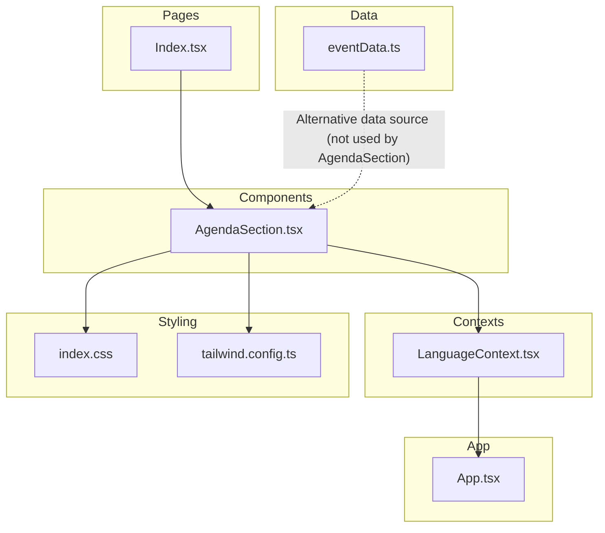
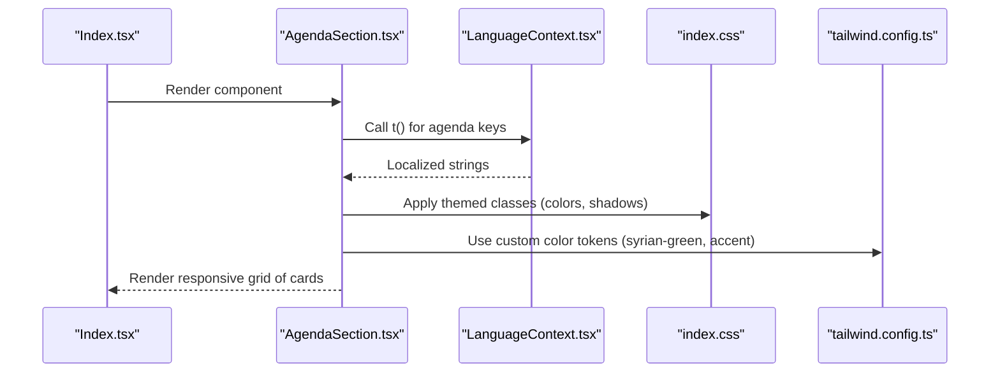
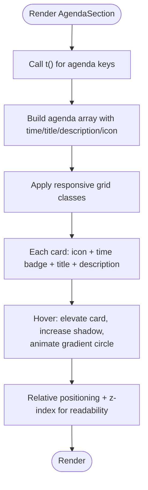
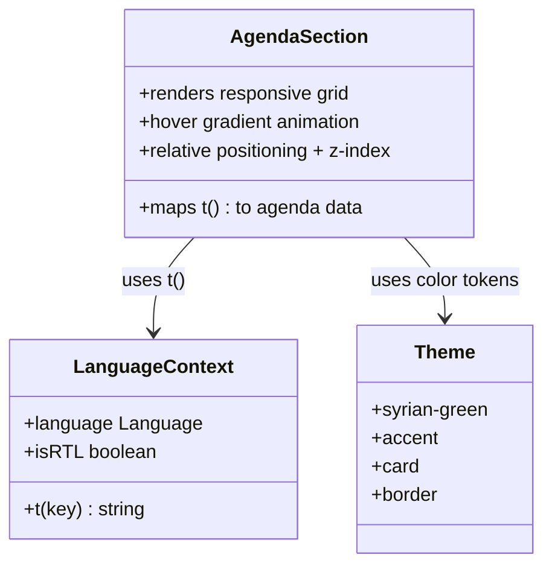
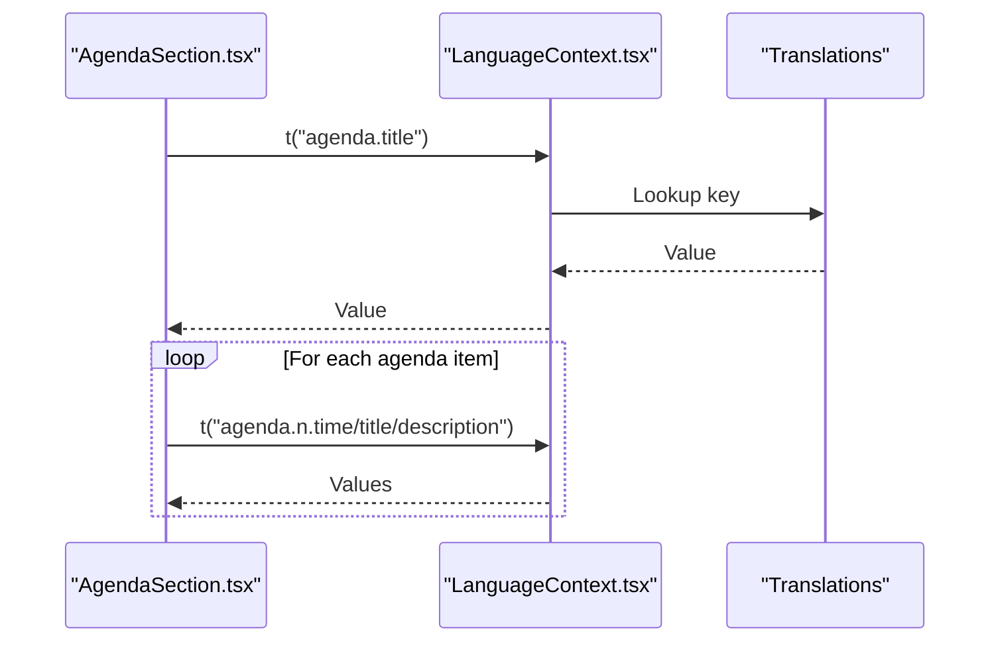
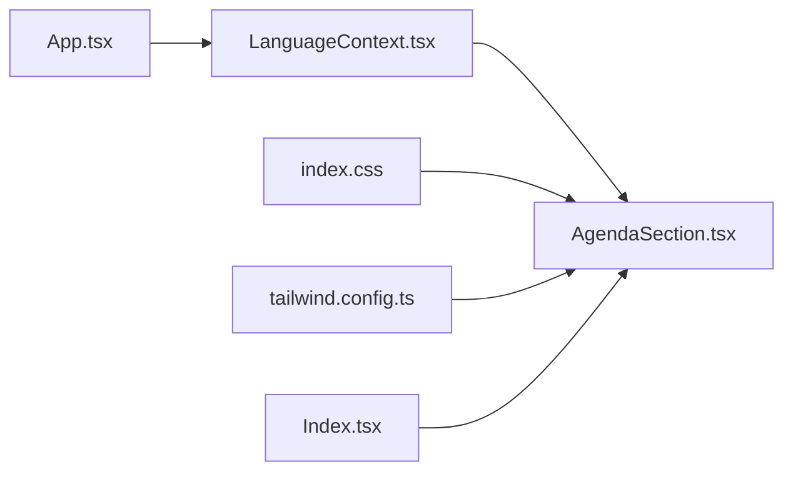

# Agenda Section

> **Referenced Files in This Document**
> - [AgendaSection.tsx](src/components/AgendaSection.tsx)
> - [LanguageContext.tsx](src/contexts/LanguageContext.tsx)
> - [Index.tsx](src/pages/Index.tsx)
> - [index.css](src/index.css)
> - [tailwind.config.ts](tailwind.config.ts)
> - [eventData.ts](src/data/eventData.ts)
> - [App.tsx](src/App.tsx)

## Table of Contents
1. [Introduction](#introduction)
2. [Project Structure](#project-structure)
3. [Core Components](#core-components)
4. [Architecture Overview](#architecture-overview)
5. [Detailed Component Analysis](#detailed-component-analysis)
6. [Dependency Analysis](#dependency-analysis)
7. [Performance Considerations](#performance-considerations)
8. [Troubleshooting Guide](#troubleshooting-guide)
9. [Conclusion](#conclusion)
10. [Appendices](#appendices)

## Introduction
The AgendaSection component presents the event schedule in a visually engaging card grid. It maps translation strings to agenda data and renders cards in a responsive grid (1–2–3 columns). The component emphasizes visual design with a floating gradient accent on hover, layered effects using relative positioning and z-index, and decorative elements that enhance visual hierarchy. It also demonstrates how to manage text truncation and emoji consistency across platforms, and provides guidance on modifying agenda items, adding new time slots, and customizing the visual design.

## Project Structure
The AgendaSection is part of the components library and is integrated into the main page layout. It relies on the LanguageContext for translations and uses Tailwind CSS utilities for responsive design and theming.

**Diagram sources**
- [Index.tsx](src/pages/Index.tsx#L1-L32)
- [AgendaSection.tsx](src/components/AgendaSection.tsx#L1-L64)
- [LanguageContext.tsx](src/contexts/LanguageContext.tsx#L1-L292)
- [eventData.ts](src/data/eventData.ts#L1-L109)
- [index.css](src/index.css#L1-L249)
- [tailwind.config.ts](tailwind.config.ts#L1-L98)
- [App.tsx](src/App.tsx#L1-L43)

**Section sources**
- [Index.tsx](src/pages/Index.tsx#L1-L32)
- [AgendaSection.tsx](src/components/AgendaSection.tsx#L1-L64)
- [LanguageContext.tsx](src/contexts/LanguageContext.tsx#L1-L292)
- [index.css](src/index.css#L1-L249)
- [tailwind.config.ts](tailwind.config.ts#L1-L98)
- [App.tsx](src/App.tsx#L1-L43)

## Core Components
- AgendaSection: Renders a responsive grid of agenda cards, each displaying time, title, description, and an emoji icon. It uses the translation function from LanguageContext to localize content and applies Tailwind utilities for layout, spacing, shadows, and hover effects.
- LanguageContext: Provides the translation function t() and manages language state, including RTL detection. Translations for agenda keys are defined in the context.
- Tailwind Theme: Defines custom colors (including syrian-green and syrian-red) and utilities that support the component’s visual design.
- Page Integration: The Index page imports and renders AgendaSection as part of the main layout.

Key implementation highlights:
- Responsive grid: Uses Tailwind grid classes to display 1 column on small screens, 2 on medium, and 3 on large screens.
- Hover effects: Elevates cards slightly, increases shadow depth, and animates a floating gradient circle positioned absolutely behind the card.
- Z-index management: The card content is placed in a relatively positioned wrapper with a higher z-index than the gradient background to ensure readable text and icons.
- Emoji icons: Predefined emoji icons are mapped to agenda entries to visually distinguish event types.

**Section sources**
- [AgendaSection.tsx](src/components/AgendaSection.tsx#L1-L64)
- [LanguageContext.tsx](src/contexts/LanguageContext.tsx#L1-L292)
- [tailwind.config.ts](tailwind.config.ts#L1-L98)
- [index.css](src/index.css#L1-L249)
- [Index.tsx](src/pages/Index.tsx#L1-L32)

## Architecture Overview
The AgendaSection composes localized content from the LanguageContext and renders a responsive grid of cards. The LanguageContext provides the t() function and language state, while Tailwind utilities and CSS variables define the visual theme and gradients.

**Diagram sources**
- [Index.tsx](src/pages/Index.tsx#L1-L32)
- [AgendaSection.tsx](src/components/AgendaSection.tsx#L1-L64)
- [LanguageContext.tsx](src/contexts/LanguageContext.tsx#L1-L292)
- [index.css](src/index.css#L1-L249)
- [tailwind.config.ts](tailwind.config.ts#L1-L98)

## Detailed Component Analysis

### AgendaSection Implementation
- Translation mapping: The component calls t() for agenda keys to localize the title, subtitle, and each agenda item’s time, title, and description. Keys follow a numbered convention (e.g., agenda.1.time, agenda.1.title).
- Card rendering: Each agenda item is rendered as a grid cell with a card layout containing an icon, a time badge, a title, and a description.
- Responsive grid: The grid uses Tailwind’s responsive modifiers to adjust columns based on screen size.
- Hover animation: A floating gradient circle appears behind the card on hover, scaling up and transitioning smoothly.
- Relative positioning and z-index: The card content is placed inside a relatively positioned wrapper with a higher z-index than the gradient background to keep text readable.
- Decorative elements: The section header includes a decorative emoji and centered typography to establish visual hierarchy.

**Diagram sources**
- [AgendaSection.tsx](src/components/AgendaSection.tsx#L1-L64)
- [LanguageContext.tsx](src/contexts/LanguageContext.tsx#L1-L292)

**Section sources**
- [AgendaSection.tsx](src/components/AgendaSection.tsx#L1-L64)
- [LanguageContext.tsx](src/contexts/LanguageContext.tsx#L1-L292)

### Visual Design Elements
- Floating gradient accent: A circular gradient element positioned absolutely at the top-right corner of each card scales up on hover, creating a layered effect behind the card content.
- Color tokens: Uses syrian-green and accent colors from the theme to style time badges and hover states.
- Typography and spacing: Centered section header with a decorative emoji, followed by cards with consistent padding, spacing, and typography hierarchy.
- Shadows and transitions: Cards receive subtle shadows and smooth transitions on hover for depth and interactivity.

**Diagram sources**
- [AgendaSection.tsx](src/components/AgendaSection.tsx#L1-L64)
- [LanguageContext.tsx](src/contexts/LanguageContext.tsx#L1-L292)
- [index.css](src/index.css#L1-L249)
- [tailwind.config.ts](tailwind.config.ts#L1-L98)

**Section sources**
- [AgendaSection.tsx](src/components/AgendaSection.tsx#L1-L64)
- [index.css](src/index.css#L1-L249)
- [tailwind.config.ts](tailwind.config.ts#L1-L98)

### Data Mapping and Translation Strings
- Translation keys: The component expects keys under agenda (e.g., agenda.title, agenda.subtitle, agenda.1.time, agenda.1.title, agenda.1.description, ..., agenda.7.time, agenda.7.title, agenda.7.description).
- LanguageContext translations: The LanguageContext defines these keys for Arabic, English, and Turkish, ensuring the component remains localized.
- Alternative data source: The repository includes an eventData.ts file with an agenda array and icons, but AgendaSection does not consume this data directly; it relies on the LanguageContext for content.

**Diagram sources**
- [AgendaSection.tsx](src/components/AgendaSection.tsx#L1-L64)
- [LanguageContext.tsx](src/contexts/LanguageContext.tsx#L1-L292)

**Section sources**
- [AgendaSection.tsx](src/components/AgendaSection.tsx#L1-L64)
- [LanguageContext.tsx](src/contexts/LanguageContext.tsx#L1-L292)
- [eventData.ts](src/data/eventData.ts#L1-L109)

### Responsive Grid Layout
- Columns: 1 column on small screens, 2 on medium, and 3 on large screens.
- Container and spacing: The grid is wrapped in a container with horizontal padding and a maximum width, with consistent gap between cards.
- Alignment: The grid is horizontally centered within the section.

**Section sources**
- [AgendaSection.tsx](src/components/AgendaSection.tsx#L1-L64)

### Hover Effects and Layered Effects
- Gradient circle: Positioned absolutely at the top-right of the card, scaled up on hover with a smooth transition.
- z-index management: The card content is placed in a wrapper with a higher z-index than the gradient background to ensure text remains readable.
- Motion: Cards lift slightly and cast a larger shadow on hover for depth.

**Section sources**
- [AgendaSection.tsx](src/components/AgendaSection.tsx#L1-L64)

### Text Truncation and Emoji Consistency
- Text truncation: The component uses short, concise titles and descriptions. If longer text is introduced, consider adding line clamping utilities or wrapping text in containers with overflow handling.
- Emoji consistency: Emojis are rendered as Unicode characters. Platform differences may affect appearance; consider using platform-safe emoji sets or fallbacks if cross-platform consistency is critical.

**Section sources**
- [AgendaSection.tsx](src/components/AgendaSection.tsx#L1-L64)

### Modifying Agenda Items and Adding New Time Slots
- Add a new slot: Extend the agenda array with a new object containing time, title, description, and an icon. Ensure the corresponding translation keys exist in the LanguageContext.
- Update translations: Add new keys for the additional slot in the LanguageContext translation maps for all supported languages.
- Icons: Choose or add an appropriate emoji icon to the agendaIcons array or pass a new icon directly in the agenda item.

**Section sources**
- [AgendaSection.tsx](src/components/AgendaSection.tsx#L1-L64)
- [LanguageContext.tsx](src/contexts/LanguageContext.tsx#L1-L292)

### Customizing Visual Design
- Colors: Adjust syrian-green and accent colors in the theme to match brand guidelines. These are defined in the Tailwind configuration and CSS variables.
- Typography: Modify font sizes and weights in the card content to suit content length or branding preferences.
- Spacing and shadows: Adjust padding, margins, and shadow utilities to change the card’s visual density.
- Animations: Modify hover animation durations or easing to fine-tune motion.

**Section sources**
- [tailwind.config.ts](tailwind.config.ts#L1-L98)
- [index.css](src/index.css#L1-L249)
- [AgendaSection.tsx](src/components/AgendaSection.tsx#L1-L64)

## Dependency Analysis
- LanguageContext dependency: AgendaSection depends on the t() function for localization and on the language state for RTL directionality.
- Styling dependency: Uses Tailwind utilities and CSS variables for colors, shadows, and responsive layout.
- Page integration: The Index page imports and renders AgendaSection, placing it within the main layout.

**Diagram sources**
- [AgendaSection.tsx](src/components/AgendaSection.tsx#L1-L64)
- [LanguageContext.tsx](src/contexts/LanguageContext.tsx#L1-L292)
- [Index.tsx](src/pages/Index.tsx#L1-L32)
- [index.css](src/index.css#L1-L249)
- [tailwind.config.ts](tailwind.config.ts#L1-L98)
- [App.tsx](src/App.tsx#L1-L43)

**Section sources**
- [AgendaSection.tsx](src/components/AgendaSection.tsx#L1-L64)
- [LanguageContext.tsx](src/contexts/LanguageContext.tsx#L1-L292)
- [Index.tsx](src/pages/Index.tsx#L1-L32)
- [App.tsx](src/App.tsx#L1-L43)

## Performance Considerations
- Rendering cost: The component renders a fixed number of cards with minimal DOM nodes. Keep the agenda array size reasonable to avoid excessive re-renders.
- CSS variables: Using CSS variables for colors reduces runtime computation and improves theme switching performance.
- Tailwind utilities: Prefer utility classes for layout and transitions to leverage compiled styles efficiently.

[No sources needed since this section provides general guidance]

## Troubleshooting Guide
- Missing translations: If a translation key is missing, t() falls back to returning the key itself. Verify that all agenda keys exist in the LanguageContext for each language.
- Emoji rendering issues: Some platforms may render emojis differently. Test across devices and browsers; consider using platform-safe emoji sets if needed.
- Hover animation not visible: Ensure the gradient background and z-index stacking are intact. Confirm that the group-hover utility is applied to the parent container.
- Responsive layout not working: Verify Tailwind breakpoints and that the grid classes are applied correctly.

**Section sources**
- [LanguageContext.tsx](src/contexts/LanguageContext.tsx#L1-L292)
- [AgendaSection.tsx](src/components/AgendaSection.tsx#L1-L64)

## Conclusion
The AgendaSection component delivers a responsive, localized, and visually appealing schedule presentation. It leverages the LanguageContext for translations, Tailwind utilities for responsive layout and theming, and subtle hover animations to enhance user engagement. By following the modification and customization guidance, you can easily adapt the agenda content and visual design to fit evolving event needs.

[No sources needed since this section summarizes without analyzing specific files]

## Appendices

### Appendix A: Translation Keys Reference
- Section header: agenda.title, agenda.subtitle
- Agenda items: agenda.1.time, agenda.1.title, agenda.1.description, …, agenda.n.time, agenda.n.title, agenda.n.description

**Section sources**
- [LanguageContext.tsx](src/contexts/LanguageContext.tsx#L1-L292)

### Appendix B: Theming Tokens
- syrian-green: Used for time badges and hover text color.
- accent: Used for the gradient background.
- card, border: Used for card backgrounds and borders.

**Section sources**
- [index.css](src/index.css#L1-L249)
- [tailwind.config.ts](tailwind.config.ts#L1-L98)