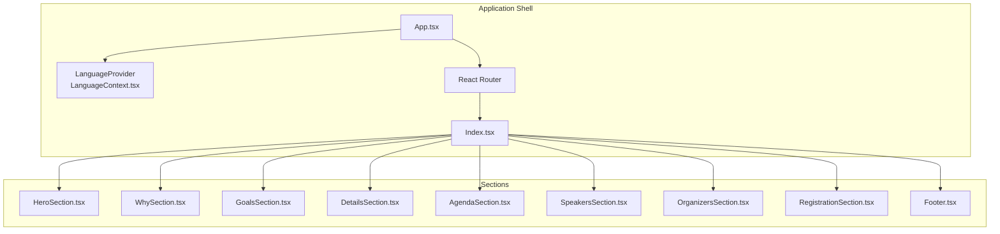
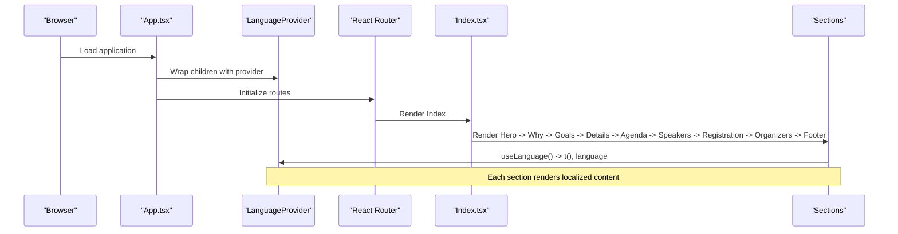
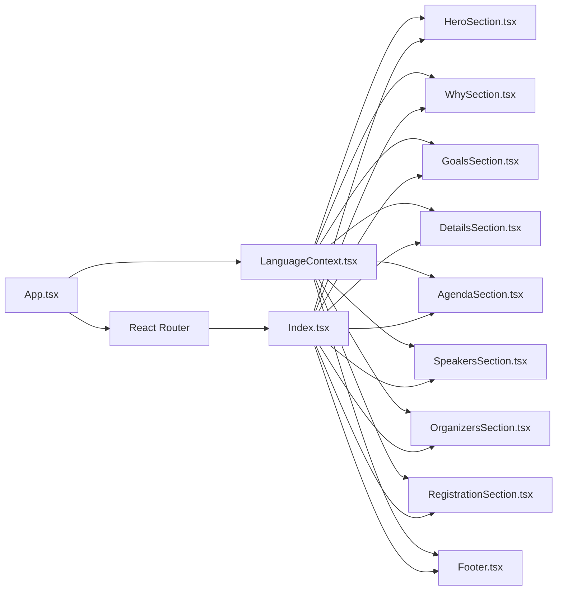

# Core Section Components

> **Referenced Files in This Document**
> - [eventData.ts](src/data/eventData.ts)
> - [LanguageContext.tsx](src/contexts/LanguageContext.tsx)
> - [App.tsx](src/App.tsx)
> - [Index.tsx](src/pages/Index.tsx)
> - [HeroSection.tsx](src/components/HeroSection.tsx)
> - [WhySection.tsx](src/components/WhySection.tsx)
> - [GoalsSection.tsx](src/components/GoalsSection.tsx)
> - [DetailsSection.tsx](src/components/DetailsSection.tsx)
> - [AgendaSection.tsx](src/components/AgendaSection.tsx)
> - [SpeakersSection.tsx](src/components/SpeakersSection.tsx)
> - [OrganizersSection.tsx](src/components/OrganizersSection.tsx)
> - [RegistrationSection.tsx](src/components/RegistrationSection.tsx)
> - [Footer.tsx](src/components/Footer.tsx)
> - [button.tsx](src/components/ui/button.tsx)
> - [utils.ts](src/lib/utils.ts)

## Table of Contents
1. [Introduction](#introduction)
2. [Project Structure](#project-structure)
3. [Core Components](#core-components)
4. [Architecture Overview](#architecture-overview)
5. [Detailed Component Analysis](#detailed-component-analysis)
6. [Dependency Analysis](#dependency-analysis)
7. [Performance Considerations](#performance-considerations)
8. [Troubleshooting Guide](#troubleshooting-guide)
9. [Conclusion](#conclusion)
10. [Appendices](#appendices)

## Introduction
This document explains the core section components that define the event website’s primary content flow. It covers how each section consumes data from the centralized event data source and uses translation via the LanguageContext provider. It also describes responsive layout techniques using Tailwind CSS, common issues such as content overflow and image loading, accessibility considerations, and best practices for extending the template for future events.

## Project Structure
The event website is organized around a set of dedicated section components rendered in sequence on the home page. The global language and translation system is provided by a context provider, and each section uses the t() function to render localized content. The event data is centralized in a single data module consumed by sections and the navigation.

**Diagram sources**
- [App.tsx](src/App.tsx#L1-L43)
- [LanguageContext.tsx](src/contexts/LanguageContext.tsx#L269-L292)
- [Index.tsx](src/pages/Index.tsx#L1-L32)

**Section sources**
- [App.tsx](src/App.tsx#L1-L43)
- [Index.tsx](src/pages/Index.tsx#L1-L32)

## Core Components
Each section component follows a consistent pattern:
- Consume the LanguageContext via the useLanguage hook to access t() and language.
- Render localized content using translation keys.
- Use Tailwind classes for responsive layouts (grid, flex, spacing).
- Reference assets and constants where applicable.

Key data sources:
- Centralized event data is defined in a single module and consumed by sections.
- Translation keys are defined in the LanguageContext and mapped per language.

Responsive layout techniques:
- Grid-based cards for Goals, Agenda, Speakers, and Details.
- Flexbox for alignment and centering.
- Container-based max widths and auto margins for centering content.
- Responsive breakpoints (sm, md, lg) to adapt to screen sizes.

Accessibility:
- Alt text on images.
- Semantic headings and landmarks.
- Focus-visible styles via Tailwind utilities.
- Proper contrast and color roles.

Common issues and mitigations:
- Content overflow: constrained containers and max-widths; overflow-hidden on sections where needed.
- Image loading: lazy loading via asset imports; fallback placeholders; object-fit utilities.
- Accessibility: aria-labels for links; semantic HTML; color contrast checks.

Best practices for extension:
- Add new translation keys to LanguageContext.
- Extend eventData with new fields and map them in sections.
- Reuse shared UI components (e.g., Button) for CTAs.
- Keep responsive patterns consistent across sections.

**Section sources**
- [LanguageContext.tsx](src/contexts/LanguageContext.tsx#L269-L292)
- [eventData.ts](src/data/eventData.ts#L1-L109)
- [button.tsx](src/components/ui/button.tsx#L1-L48)
- [utils.ts](src/lib/utils.ts#L1-L7)

## Architecture Overview
The sections are composed in a linear flow on the home page. Each section reads from the LanguageContext for localization and from eventData for content. The app shell sets up routing and the language provider.

**Diagram sources**
- [App.tsx](src/App.tsx#L1-L43)
- [LanguageContext.tsx](src/contexts/LanguageContext.tsx#L269-L292)
- [Index.tsx](src/pages/Index.tsx#L1-L32)

## Detailed Component Analysis

### HeroSection
Purpose:
- Establish the event’s visual identity and call-to-action anchor to the next section.
- Display event branding, countdown timer, and date/time badges.

Implementation highlights:
- Uses background overlay and decorative confetti animations.
- Renders localized title, subtitle, tagline, and discover-more CTA.
- Displays date and time via translation keys.
- Integrates a countdown timer component.

Responsive layout:
- Flexbox centering with container constraints.
- Grid-like arrangement for decorative elements.
- Responsive typography scales for headings.

Accessibility:
- Alt text on emblems and flags.
- Clear focus states via hover transforms.

Common issues:
- Background image sizing: ensure cover and center utilities are applied.
- Animation performance: keep confetti count reasonable.

Extensibility:
- Add new branding assets by importing and rendering conditionally.
- Introduce localized hero subtitles or taglines via eventData.

**Section sources**
- [HeroSection.tsx](src/components/HeroSection.tsx#L1-L99)

### WhySection
Purpose:
- Communicate the motivation behind the event with a strong visual background and divider.

Implementation highlights:
- Full-height section with dark overlay for readability.
- Localized title and description using t().
- Colorful divider representing national colors.

Responsive layout:
- Centered content with max-width constraints.
- Flexbox for vertical centering.

Accessibility:
- High contrast text against overlay.
- Semantic headings.

**Section sources**
- [WhySection.tsx](src/components/WhySection.tsx#L1-L41)

### GoalsSection
Purpose:
- Present the event’s objectives in a visually engaging grid.

Implementation highlights:
- Iterates over a predefined list of goals and renders icons and descriptions.
- Uses gradient backgrounds and hover effects for interactivity.
- Responsive grid with four columns on larger screens.

Responsive layout:
- Grid with 1 column on small screens, 2 on medium, 4 on large.
- Hover animations and elevation transitions.

Accessibility:
- Hover and focus states for interactive cards.
- Clear typography hierarchy.

**Section sources**
- [GoalsSection.tsx](src/components/GoalsSection.tsx#L1-L54)

### DetailsSection
Purpose:
- Provide essential event details: date, time, and location with a link to Google Maps.

Implementation highlights:
- Three-column layout for date, time, and location.
- Localized labels and values via t().
- Link to Google Maps URL for location.

Responsive layout:
- Grid with stacked columns on small screens.
- Centered content with decorative flag overlay.

Accessibility:
- External link with rel and target attributes.
- Clear labels for each detail card.

**Section sources**
- [DetailsSection.tsx](src/components/DetailsSection.tsx#L1-L65)

### AgendaSection
Purpose:
- Display the event schedule in an attractive card grid.

Implementation highlights:
- Iterates over agenda items and renders time, title, description, and emoji icons.
- Subtle gradient accents and hover animations.

Responsive layout:
- Grid with 1 column on small, 2 on medium, 3 on large.
- Relative positioning and overflow handling for decorative elements.

Accessibility:
- Semantic headings and readable text sizes.

**Section sources**
- [AgendaSection.tsx](src/components/AgendaSection.tsx#L1-L64)

### SpeakersSection
Purpose:
- Showcase participants and speakers with multilingual names and roles.

Implementation highlights:
- Defines a typed speaker list with localized fields.
- Switches content based on current language.
- Uses image placeholders when images are missing.

Responsive layout:
- Grid with 1–4 columns depending on screen size.
- Consistent card design with avatar frames.

Accessibility:
- Alt text for images.
- Clear role and name presentation.

**Section sources**
- [SpeakersSection.tsx](src/components/SpeakersSection.tsx#L1-L238)

### OrganizersSection
Purpose:
- Present the organizing bodies with localized descriptions and activities.

Implementation highlights:
- Builds organizer content based on language.
- Displays logos and structured descriptions.
- Activity tags rendered as interactive chips.

Responsive layout:
- Two main rows for each organizer with media-first layout on small screens.
- Flexible grid for activity tags.

Accessibility:
- Clear headings and readable paragraphs.
- Interactive chips with hover states.

**Section sources**
- [OrganizersSection.tsx](src/components/OrganizersSection.tsx#L1-L132)

### RegistrationSection
Purpose:
- Drive registrations with a QR code and external registration link.

Implementation highlights:
- Renders a QR code pointing to a registration URL.
- Provides localized title, subtitle, and button text.
- Uses a prominent CTA button from the shared UI library.

Responsive layout:
- Centered card with decorative glow and borders.
- Button size and padding adapted for prominence.

Accessibility:
- Clear button text and icon pairing.
- External link handling with rel and target.

**Section sources**
- [RegistrationSection.tsx](src/components/RegistrationSection.tsx#L1-L105)
- [button.tsx](src/components/ui/button.tsx#L1-L48)

### Footer
Purpose:
- Provide navigation anchors, social links, and credits.

Implementation highlights:
- Displays event title and localized subtitle.
- Social media links with custom SVG icons.
- Bottom bar with rights and links to creator and repository.

Responsive layout:
- Three-column grid on medium and above.
- Centered branding elements on small screens.

Accessibility:
- ARIA labels for social links.
- Clear footer text and links.

**Section sources**
- [Footer.tsx](src/components/Footer.tsx#L1-L117)

## Dependency Analysis
- LanguageContext provides t() and language to all sections.
- Index.tsx composes sections in a fixed order.
- App.tsx wraps the app with providers and router.
- Shared UI components (e.g., Button) are used in RegistrationSection.

**Diagram sources**
- [LanguageContext.tsx](src/contexts/LanguageContext.tsx#L269-L292)
- [App.tsx](src/App.tsx#L1-L43)
- [Index.tsx](src/pages/Index.tsx#L1-L32)

**Section sources**
- [LanguageContext.tsx](src/contexts/LanguageContext.tsx#L269-L292)
- [App.tsx](src/App.tsx#L1-L43)
- [Index.tsx](src/pages/Index.tsx#L1-L32)

## Performance Considerations
- Asset imports: Images are bundled with the build; ensure appropriate sizes and formats for fast loading.
- Animations: Keep the number of animated confetti pieces reasonable to avoid jank.
- Grid layouts: Prefer CSS Grid for complex layouts; avoid excessive reflows by minimizing dynamic content inside grids.
- Lazy loading: For large image galleries, consider lazy loading strategies; for current assets, rely on bundling.
- Font rendering: The app switches fonts based on language; ensure font weights and fallbacks are configured.

[No sources needed since this section provides general guidance]

## Troubleshooting Guide
- Content overflow:
  - Use container utilities and max-width constraints.
  - Apply overflow-hidden on parent containers when necessary.
- Image loading:
  - Ensure alt attributes are present for accessibility.
  - Use object-fit utilities for consistent cropping.
- Accessibility:
  - Verify ARIA labels for external links.
  - Confirm keyboard focus visibility.
- Localization:
  - Ensure translation keys exist for all languages.
  - Validate that language switching updates all sections.

**Section sources**
- [HeroSection.tsx](src/components/HeroSection.tsx#L1-L99)
- [DetailsSection.tsx](src/components/DetailsSection.tsx#L1-L65)
- [Footer.tsx](src/components/Footer.tsx#L1-L117)

## Conclusion
The core section components deliver a cohesive, localized, and responsive event website. They share a consistent pattern of consuming translation keys and data from a central source, enabling easy maintenance and extension. By following the outlined responsive techniques, accessibility guidelines, and best practices, teams can adapt the template for future events efficiently.

[No sources needed since this section summarizes without analyzing specific files]

## Appendices

### Data Consumption Patterns
- Centralized event data is defined in a single module and consumed by sections.
- Sections reference translation keys from the LanguageContext provider.
- The app shell initializes routing and providers.

**Section sources**
- [eventData.ts](src/data/eventData.ts#L1-L109)
- [LanguageContext.tsx](src/contexts/LanguageContext.tsx#L269-L292)
- [App.tsx](src/App.tsx#L1-L43)

### Responsive Layout Techniques
- Grid: Use grid-cols-{n} utilities to adapt columns across breakpoints.
- Flexbox: Use flex utilities for alignment and centering.
- Containers: Use container and max-width utilities to constrain content width.
- Spacing: Use padding and margin utilities consistently across sections.

**Section sources**
- [GoalsSection.tsx](src/components/GoalsSection.tsx#L1-L54)
- [AgendaSection.tsx](src/components/AgendaSection.tsx#L1-L64)
- [SpeakersSection.tsx](src/components/SpeakersSection.tsx#L1-L238)
- [DetailsSection.tsx](src/components/DetailsSection.tsx#L1-L65)

### Extending the Template
- Add new translation keys to the LanguageContext.
- Extend eventData with new fields and map them in sections.
- Reuse shared UI components (e.g., Button) for CTAs.
- Maintain consistent responsive patterns across new sections.

**Section sources**
- [LanguageContext.tsx](src/contexts/LanguageContext.tsx#L269-L292)
- [eventData.ts](src/data/eventData.ts#L1-L109)
- [button.tsx](src/components/ui/button.tsx#L1-L48)