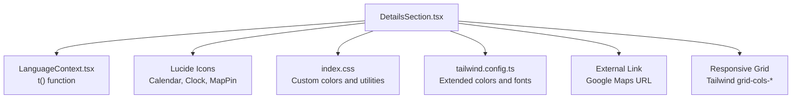
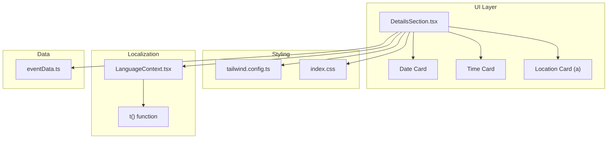
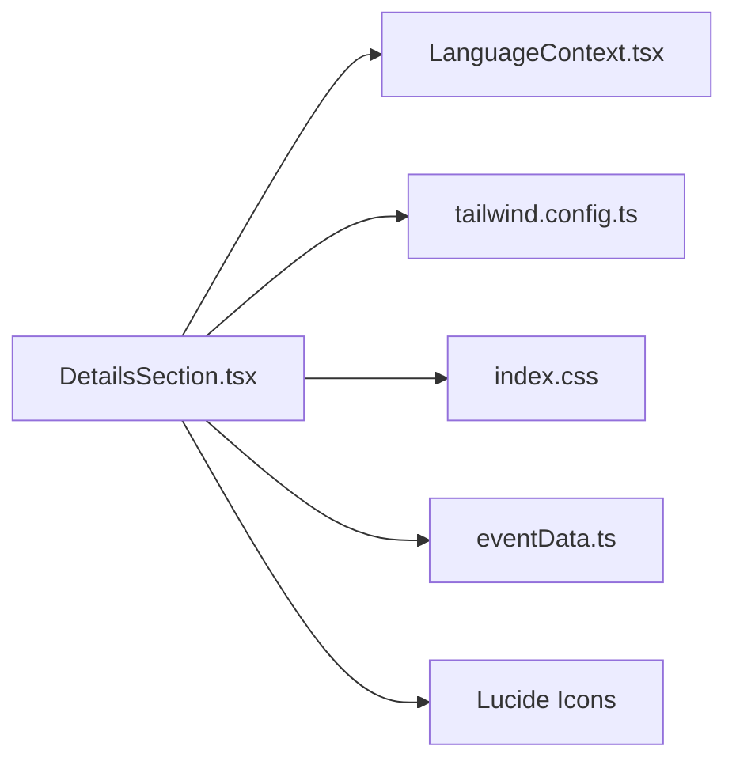

# Details Section

<cite>
**Referenced Files in This Document**
- [DetailsSection.tsx](file://src/components/DetailsSection.tsx)
- [LanguageContext.tsx](file://src/contexts/LanguageContext.tsx)
- [index.css](file://src/index.css)
- [tailwind.config.ts](file://tailwind.config.ts)
- [card.tsx](file://src/components/ui/card.tsx)
- [eventData.ts](file://src/data/eventData.ts)
- [App.tsx](file://src/App.tsx)
- [use-mobile.tsx](file://src/hooks/use-mobile.tsx)
</cite>

## Table of Contents
1. [Introduction](#introduction)
2. [Project Structure](#project-structure)
3. [Core Components](#core-components)
4. [Architecture Overview](#architecture-overview)
5. [Detailed Component Analysis](#detailed-component-analysis)
6. [Dependency Analysis](#dependency-analysis)
7. [Performance Considerations](#performance-considerations)
8. [Troubleshooting Guide](#troubleshooting-guide)
9. [Conclusion](#conclusion)

## Introduction
This document explains the DetailsSection component that presents essential event information through three interactive cards: Date, Time, and Location. It covers the green-themed background, decorative Syrian flag watermark, responsive grid layout, Lucide React icons, translated content via the t() function, and the Location card’s integration with Google Maps through an external link. Accessibility features, responsive text sizing, and common issues such as external link handling on mobile devices are addressed. Guidance is included for updating event details and customizing the color scheme.

## Project Structure
The DetailsSection is implemented as a standalone component that relies on:
- Translation context for localized text
- Tailwind CSS for theming and responsive layout
- Lucide React icons for visual cues
- A decorative watermark image positioned absolutely behind the content
- A responsive grid layout using Tailwind’s grid utilities

**Diagram sources**
- [DetailsSection.tsx](file://src/components/DetailsSection.tsx#L1-L65)
- [LanguageContext.tsx](file://src/contexts/LanguageContext.tsx#L1-L292)
- [index.css](file://src/index.css#L1-L249)
- [tailwind.config.ts](file://tailwind.config.ts#L1-L98)

**Section sources**
- [DetailsSection.tsx](file://src/components/DetailsSection.tsx#L1-L65)
- [index.css](file://src/index.css#L1-L249)
- [tailwind.config.ts](file://tailwind.config.ts#L1-L98)

## Core Components
- DetailsSection: Renders three cards with icons and translated content, applies a green background theme, and overlays a decorative Syrian flag watermark. The Location card is implemented as an anchor element linking to Google Maps.
- LanguageContext: Provides the t() function for translations and determines directionality (RTL/LTR) and font selection.
- Tailwind configuration: Extends the theme with custom colors (syrian-green, syrian-red, gold) and fonts (Bahij Koufiya for Arabic, Roboto for English/Turkish).
- index.css: Defines CSS variables for custom colors and gradients, and provides utility classes for glass-like backgrounds and glow effects.
- eventData: Supplies event metadata (date, time, venue) used by the component.

**Section sources**
- [DetailsSection.tsx](file://src/components/DetailsSection.tsx#L1-L65)
- [LanguageContext.tsx](file://src/contexts/LanguageContext.tsx#L1-L292)
- [tailwind.config.ts](file://tailwind.config.ts#L1-L98)
- [index.css](file://src/index.css#L1-L249)
- [eventData.ts](file://src/data/eventData.ts#L1-L109)

## Architecture Overview
The DetailsSection composes three cards inside a responsive grid. Each card uses Lucide icons and displays translated content from the LanguageContext. The Location card opens an external Google Maps link in a new tab with safe attributes. The section’s background uses the custom green color from the theme, and a watermark image is overlaid behind the content.

**Diagram sources**
- [DetailsSection.tsx](file://src/components/DetailsSection.tsx#L1-L65)
- [LanguageContext.tsx](file://src/contexts/LanguageContext.tsx#L1-L292)
- [tailwind.config.ts](file://tailwind.config.ts#L1-L98)
- [index.css](file://src/index.css#L1-L249)
- [eventData.ts](file://src/data/eventData.ts#L1-L109)

## Detailed Component Analysis

### Layout and Theming
- Background theme: The section uses a green background derived from the custom color palette. The green color is defined in CSS variables and mapped to Tailwind’s theme.
- Watermark: A decorative Syrian flag image is centered absolutely with reduced opacity and blur to serve as a subtle background texture.
- Responsive grid: The cards are arranged in a single column on small screens and three columns on medium screens and above, using Tailwind’s responsive grid utilities.

Accessibility and responsiveness:
- Directionality: The app sets the HTML dir attribute based on the selected language, ensuring proper text directionality.
- Fonts: The application selects a font family based on the current language, aligning with the theme’s typography choices.

**Section sources**
- [DetailsSection.tsx](file://src/components/DetailsSection.tsx#L1-L65)
- [index.css](file://src/index.css#L1-L249)
- [tailwind.config.ts](file://tailwind.config.ts#L1-L98)
- [App.tsx](file://src/App.tsx#L1-L43)

### Date Card
- Purpose: Displays the event date and day name.
- Implementation: Uses the Calendar icon and renders translated labels and values via t().
- Visuals: Hover effect scales the icon container slightly; the card maintains a translucent background with borders for depth.

**Section sources**
- [DetailsSection.tsx](file://src/components/DetailsSection.tsx#L23-L32)
- [LanguageContext.tsx](file://src/contexts/LanguageContext.tsx#L1-L292)

### Time Card
- Purpose: Shows the event time range and a timezone note.
- Implementation: Uses the Clock icon and translates labels and time values.
- Visuals: Similar hover behavior to the Date card, maintaining consistent interaction patterns.

**Section sources**
- [DetailsSection.tsx](file://src/components/DetailsSection.tsx#L34-L42)
- [LanguageContext.tsx](file://src/contexts/LanguageContext.tsx#L1-L292)

### Location Card (Google Maps Integration)
- Purpose: Presents the venue name and address and opens the event location in Google Maps.
- Implementation: Implemented as an anchor element with target and rel attributes for safe external linking. The link points to a Google Maps short URL.
- Visuals: Translucent card with hover effects mirroring the other cards. Includes a “View Map” label styled as a link-like indicator.

Accessibility and mobile considerations:
- Link semantics: The anchor element provides semantic link behavior for assistive technologies.
- External link safety: Uses target="_blank" and rel="noopener noreferrer" to prevent tabnabbing and reverse tabnabbing.
- Mobile behavior: Opening external maps apps depends on device configuration. If the link does not open a map app, users can copy the URL and open it manually in a browser or a dedicated maps app.

**Section sources**
- [DetailsSection.tsx](file://src/components/DetailsSection.tsx#L44-L58)
- [eventData.ts](file://src/data/eventData.ts#L1-L109)

### Icons and Translations
- Icons: Lucide React icons (Calendar, Clock, MapPin) are used consistently across cards to convey meaning quickly.
- Translations: The t() function retrieves localized strings for labels and values. The LanguageContext manages translations for Arabic, English, and Turkish.

**Section sources**
- [DetailsSection.tsx](file://src/components/DetailsSection.tsx#L1-L65)
- [LanguageContext.tsx](file://src/contexts/LanguageContext.tsx#L1-L292)

### Responsive Text Sizing
- Typography: Headings and labels use relative sizes with responsive modifiers (e.g., text-3xl on small screens, text-4xl on medium screens). Body text sizes scale accordingly to improve readability on various devices.
- Font families: The application switches between Bahij Koufiya (Arabic) and Roboto (English/Turkish) based on the current language.

**Section sources**
- [DetailsSection.tsx](file://src/components/DetailsSection.tsx#L1-L65)
- [App.tsx](file://src/App.tsx#L1-L43)

### Hover Effects and Interaction Patterns
- Cards: Each card uses a group hover state to scale the icon container and adjust background opacity, providing clear affordance for interactivity.
- Consistency: The same hover pattern is applied across all three cards to maintain a cohesive user experience.

**Section sources**
- [DetailsSection.tsx](file://src/components/DetailsSection.tsx#L23-L58)

### Watermark Decoration
- Placement: The Syrian flag watermark is absolutely positioned at the center of the section with reduced opacity and blur to avoid distracting from content.
- Responsiveness: The watermark remains centered regardless of screen size.

**Section sources**
- [DetailsSection.tsx](file://src/components/DetailsSection.tsx#L9-L13)

### Updating Event Details
- Where to update: Event metadata such as date, time, venue name, and address are defined in the eventData module.
- How to update: Modify the relevant fields in eventData. The DetailsSection reads these values through the t() function and displays them in the cards.

**Section sources**
- [eventData.ts](file://src/data/eventData.ts#L1-L109)
- [DetailsSection.tsx](file://src/components/DetailsSection.tsx#L23-L58)

### Customizing the Color Scheme
- Theme colors: The custom green color is defined in CSS variables and exposed through Tailwind’s theme. You can adjust the green hue/saturation/lightness in index.css to change the overall tone.
- Card backgrounds: Cards use translucent backgrounds with borders; adjust the opacity and border colors in the component’s Tailwind classes to fine-tune contrast.
- Gradient utilities: The theme defines gradient utilities; you can reuse or modify these for consistent branding.

**Section sources**
- [index.css](file://src/index.css#L1-L249)
- [tailwind.config.ts](file://tailwind.config.ts#L1-L98)
- [DetailsSection.tsx](file://src/components/DetailsSection.tsx#L1-L65)

## Dependency Analysis
The DetailsSection depends on:
- LanguageContext for translations
- Tailwind theme for colors and responsive utilities
- index.css for custom color variables and utilities
- eventData for event metadata
- Lucide icons for visual representation

**Diagram sources**
- [DetailsSection.tsx](file://src/components/DetailsSection.tsx#L1-L65)
- [LanguageContext.tsx](file://src/contexts/LanguageContext.tsx#L1-L292)
- [tailwind.config.ts](file://tailwind.config.ts#L1-L98)
- [index.css](file://src/index.css#L1-L249)
- [eventData.ts](file://src/data/eventData.ts#L1-L109)

**Section sources**
- [DetailsSection.tsx](file://src/components/DetailsSection.tsx#L1-L65)
- [LanguageContext.tsx](file://src/contexts/LanguageContext.tsx#L1-L292)
- [tailwind.config.ts](file://tailwind.config.ts#L1-L98)
- [index.css](file://src/index.css#L1-L249)
- [eventData.ts](file://src/data/eventData.ts#L1-L109)

## Performance Considerations
- Image watermark: The flag watermark is blurred and scaled down; keep the image optimized to minimize render cost.
- Transitions: The hover scale effect is lightweight; ensure no heavy computations occur during hover to maintain smooth interactions.
- External link: Opening Google Maps is off-DOM; avoid unnecessary re-renders by keeping the anchor static.

[No sources needed since this section provides general guidance]

## Troubleshooting Guide
- External link not opening on mobile:
  - Some devices require explicit user gesture to open external applications. Try tapping the “View Map” label or copying the URL and pasting into a browser.
  - Confirm the Google Maps URL is correct and reachable.
- Link security warnings:
  - The component uses target="_blank" and rel="noopener noreferrer". Verify these attributes remain intact if you customize the Location card.
- Translation not appearing:
  - Ensure keys used by t() exist in the LanguageContext translation map for the current language.
- Color contrast:
  - If text appears hard to read, adjust the card background opacity or text color classes in the component.
- Responsive layout:
  - On narrow screens, the cards stack vertically. If alignment looks off, verify Tailwind grid classes and container constraints.

**Section sources**
- [DetailsSection.tsx](file://src/components/DetailsSection.tsx#L44-L58)
- [LanguageContext.tsx](file://src/contexts/LanguageContext.tsx#L1-L292)

## Conclusion
The DetailsSection component delivers a visually coherent, accessible presentation of event essentials. Its green-themed design, translational flexibility, and responsive layout ensure usability across languages and devices. The Location card integrates seamlessly with Google Maps, while hover effects and typography enhance interactivity and readability. By updating eventData and leveraging the theme’s custom colors, you can easily maintain and evolve the section to match evolving branding and content needs.