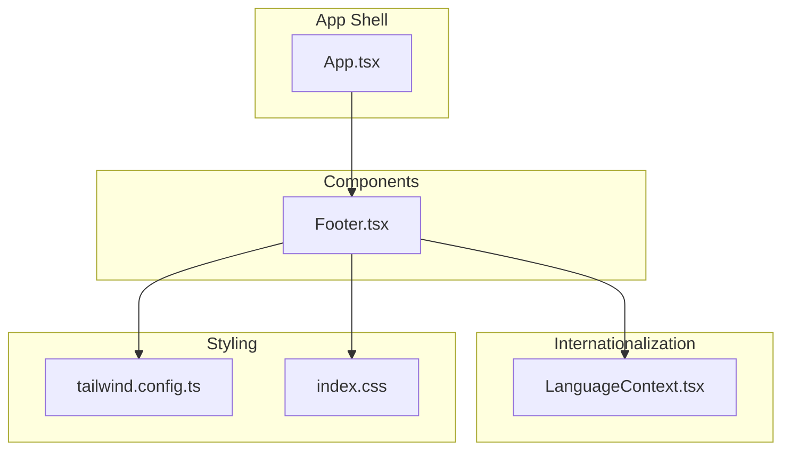
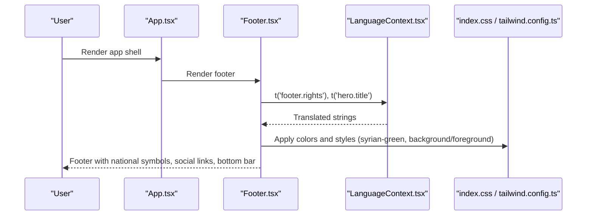
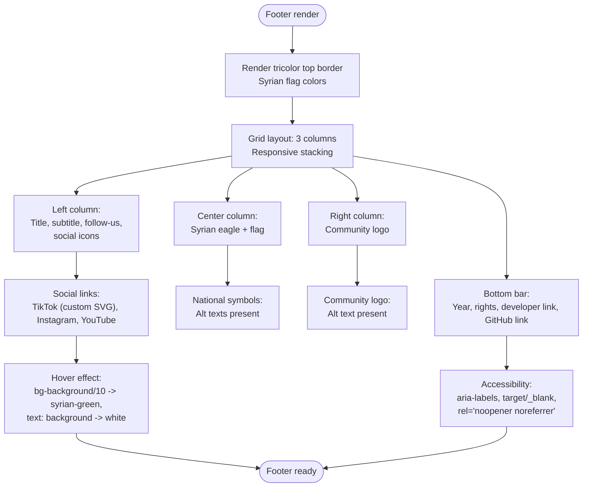
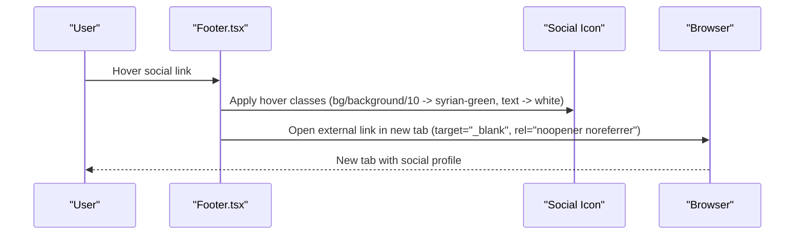
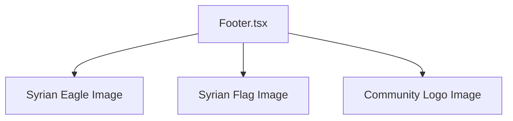
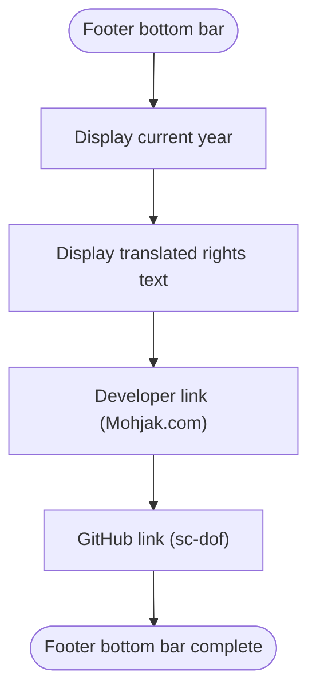
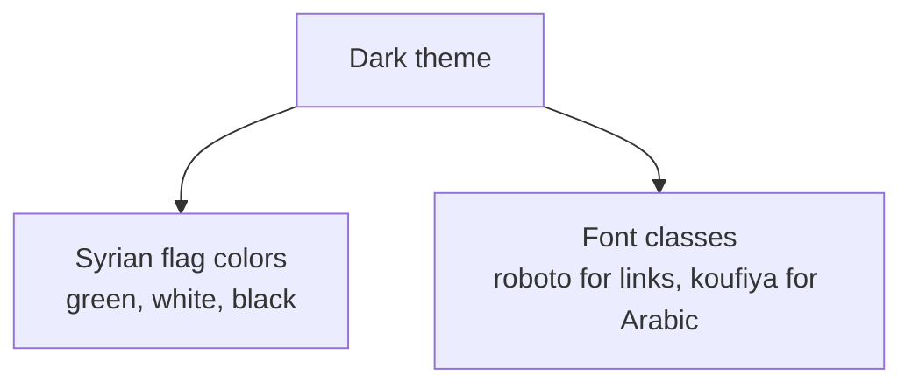
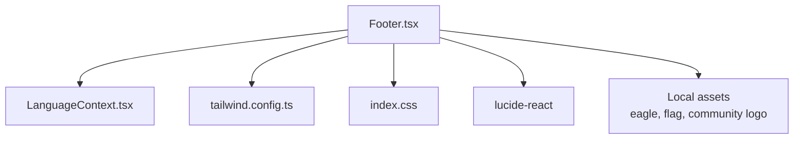

# Footer

<cite>
**Referenced Files in This Document**
- [Footer.tsx](file://src/components/Footer.tsx)
- [LanguageContext.tsx](file://src/contexts/LanguageContext.tsx)
- [index.css](file://src/index.css)
- [tailwind.config.ts](file://tailwind.config.ts)
- [App.tsx](file://src/App.tsx)
- [HeroSection.tsx](file://src/components/HeroSection.tsx)
- [WhySection.tsx](file://src/components/WhySection.tsx)
- [DetailsSection.tsx](file://src/components/DetailsSection.tsx)
- [package.json](file://package.json)
</cite>

## Table of Contents
1. [Introduction](#introduction)
2. [Project Structure](#project-structure)
3. [Core Components](#core-components)
4. [Architecture Overview](#architecture-overview)
5. [Detailed Component Analysis](#detailed-component-analysis)
6. [Dependency Analysis](#dependency-analysis)
7. [Performance Considerations](#performance-considerations)
8. [Troubleshooting Guide](#troubleshooting-guide)
9. [Conclusion](#conclusion)
10. [Appendices](#appendices)

## Introduction
This document describes the Footer component that provides site credits, social links, and navigation. It explains the implementation with a dark theme, a three-column responsive layout, and a decorative tricolor top border representing the Syrian flag. It also covers the center-aligned national symbols (Syrian eagle and flag), the right-aligned community logo, social media integration with a custom TikTok icon and standard Lucide icons for Instagram and YouTube, including hover effects and accessibility attributes. Finally, it addresses the bottom bar with copyright information, developer credit, and a GitHub link, along with guidance on updating social media URLs, modifying copyright information, and customizing visual elements.

## Project Structure
The Footer component resides under the components directory and integrates with the global design system via Tailwind CSS and the shared color palette. It relies on the LanguageContext for internationalization and uses Lucide icons for Instagram and YouTube while providing a custom SVG for TikTok.

**Diagram sources**
- [Footer.tsx](file://src/components/Footer.tsx#L1-L117)
- [LanguageContext.tsx](file://src/contexts/LanguageContext.tsx#L1-L292)
- [tailwind.config.ts](file://tailwind.config.ts#L1-L98)
- [index.css](file://src/index.css#L1-L249)
- [App.tsx](file://src/App.tsx#L1-L43)

**Section sources**
- [Footer.tsx](file://src/components/Footer.tsx#L1-L117)
- [tailwind.config.ts](file://tailwind.config.ts#L1-L98)
- [index.css](file://src/index.css#L1-L249)
- [LanguageContext.tsx](file://src/contexts/LanguageContext.tsx#L1-L292)
- [App.tsx](file://src/App.tsx#L1-L43)

## Core Components
- Footer.tsx: Implements the footer with:
  - Decorative tricolor top border (Syrian flag colors)
  - Three-column responsive layout (left: info and social; center: national symbols; right: community logo)
  - Social media links with custom TikTok icon and Lucide icons for Instagram and YouTube
  - Bottom bar with copyright, rights text from translations, developer link, and GitHub link
  - Accessibility attributes (alt texts, aria-labels) and safe external link handling (target blank, rel noopener noreferrer)
- LanguageContext.tsx: Provides translations for the footer’s text and controls RTL direction
- index.css and tailwind.config.ts: Define the design tokens and color palette, including Syrian flag colors
- App.tsx: Wraps the app with providers enabling language and routing

Key implementation references:
- Social links and icons: [Footer.tsx](file://src/components/Footer.tsx#L26-L30)
- Custom TikTok icon: [Footer.tsx](file://src/components/Footer.tsx#L8-L12)
- Tricolor top border: [Footer.tsx](file://src/components/Footer.tsx#L33-L39)
- Responsive grid layout: [Footer.tsx](file://src/components/Footer.tsx#L43-L86)
- Bottom bar with links and rights text: [Footer.tsx](file://src/components/Footer.tsx#L88-L111)
- Translation keys for rights and follow text: [LanguageContext.tsx](file://src/contexts/LanguageContext.tsx#L89-L96)

**Section sources**
- [Footer.tsx](file://src/components/Footer.tsx#L1-L117)
- [LanguageContext.tsx](file://src/contexts/LanguageContext.tsx#L1-L292)

## Architecture Overview
The Footer participates in a provider-based architecture:
- LanguageContext supplies translations and directionality
- Tailwind CSS and index.css define the color scheme and typography
- App.tsx composes providers and routes

**Diagram sources**
- [App.tsx](file://src/App.tsx#L1-L43)
- [Footer.tsx](file://src/components/Footer.tsx#L1-L117)
- [LanguageContext.tsx](file://src/contexts/LanguageContext.tsx#L1-L292)
- [index.css](file://src/index.css#L1-L249)
- [tailwind.config.ts](file://tailwind.config.ts#L1-L98)

## Detailed Component Analysis

### Footer Implementation Details
- Decorative tricolor top border:
  - Implemented as a horizontal row of three equal-width bars using Syrian flag colors
  - Positioned absolutely at the top of the footer
  - References: [Footer.tsx](file://src/components/Footer.tsx#L33-L39)
- Three-column responsive layout:
  - Uses a grid with responsive breakpoints to stack on small screens and align three columns on medium screens
  - Columns:
    - Left: event title, subtitle, and follow-us text with social icons
    - Center: Syrian eagle and flag images
    - Right: community logo
  - References: [Footer.tsx](file://src/components/Footer.tsx#L43-L86)
- Social media integration:
  - Custom TikTok icon component built with SVG
  - Instagram and YouTube via Lucide icons
  - Each link opens in a new tab with safe attributes and aria-label for accessibility
  - Hover effect transitions background to a Syrian green tone and text to white
  - References: [Footer.tsx](file://src/components/Footer.tsx#L8-L12), [Footer.tsx](file://src/components/Footer.tsx#L26-L30), [Footer.tsx](file://src/components/Footer.tsx#L51-L66)
- Bottom bar:
  - Displays current year, translated rights text, a developer link, and a GitHub link
  - Uses Roboto font class and hover color transitions
  - References: [Footer.tsx](file://src/components/Footer.tsx#L88-L111)
- Internationalization:
  - Uses LanguageContext to translate:
    - Event title and subtitle
    - Follow us label
    - Rights text
  - References: [Footer.tsx](file://src/components/Footer.tsx#L18-L23), [Footer.tsx](file://src/components/Footer.tsx#L24-L24), [LanguageContext.tsx](file://src/contexts/LanguageContext.tsx#L89-L96)

**Diagram sources**
- [Footer.tsx](file://src/components/Footer.tsx#L33-L111)

**Section sources**
- [Footer.tsx](file://src/components/Footer.tsx#L1-L117)
- [LanguageContext.tsx](file://src/contexts/LanguageContext.tsx#L1-L292)

### Social Media Icons and Hover Effects
- Custom TikTok icon:
  - Built as a reusable component with a viewBox and fill attribute
  - Used in the social links array
  - Reference: [Footer.tsx](file://src/components/Footer.tsx#L8-L12), [Footer.tsx](file://src/components/Footer.tsx#L26-L30)
- Instagram and YouTube:
  - Imported from lucide-react and rendered inside anchor tags
  - Reference: [Footer.tsx](file://src/components/Footer.tsx#L51-L66), [package.json](file://package.json#L1-L85)
- Hover effects:
  - Circular anchors with rounded-full and centered icons
  - Transition classes for background and text color changes
  - Reference: [Footer.tsx](file://src/components/Footer.tsx#L51-L66)
- Accessibility:
  - Each anchor has aria-label set to the platform name
  - Reference: [Footer.tsx](file://src/components/Footer.tsx#L51-L66)

**Diagram sources**
- [Footer.tsx](file://src/components/Footer.tsx#L51-L66)

**Section sources**
- [Footer.tsx](file://src/components/Footer.tsx#L8-L12)
- [Footer.tsx](file://src/components/Footer.tsx#L26-L30)
- [Footer.tsx](file://src/components/Footer.tsx#L51-L66)
- [package.json](file://package.json#L1-L85)

### National Symbols and Community Logo
- Center-aligned national symbols:
  - Syrian eagle and flag images are displayed together with spacing and subtle opacity/shadow
  - Alt texts included for accessibility
  - References: [Footer.tsx](file://src/components/Footer.tsx#L71-L76), [Footer.tsx](file://src/components/Footer.tsx#L73-L75)
- Right-aligned community logo:
  - Full-width image with object-contain sizing and responsive height
  - Alt text included for accessibility
  - References: [Footer.tsx](file://src/components/Footer.tsx#L78-L86), [Footer.tsx](file://src/components/Footer.tsx#L80-L84)

**Diagram sources**
- [Footer.tsx](file://src/components/Footer.tsx#L71-L86)

**Section sources**
- [Footer.tsx](file://src/components/Footer.tsx#L71-L86)

### Bottom Bar and Copyright Information
- Bottom bar displays:
  - Current year
  - Rights text from translations
  - Developer link to a personal website
  - GitHub link to the project repository
- Uses Roboto font class and hover color transitions
- References: [Footer.tsx](file://src/components/Footer.tsx#L88-L111), [LanguageContext.tsx](file://src/contexts/LanguageContext.tsx#L89-L96)

**Diagram sources**
- [Footer.tsx](file://src/components/Footer.tsx#L88-L111)
- [LanguageContext.tsx](file://src/contexts/LanguageContext.tsx#L89-L96)

**Section sources**
- [Footer.tsx](file://src/components/Footer.tsx#L88-L111)
- [LanguageContext.tsx](file://src/contexts/LanguageContext.tsx#L89-L96)

### Visual Design and Theming
- Dark theme:
  - Footer background uses the foreground color and text uses the background color
  - References: [Footer.tsx](file://src/components/Footer.tsx#L33-L33)
- Syrian flag colors:
  - Defined in the design system and used for the tricolor border and hover states
  - References: [tailwind.config.ts](file://tailwind.config.ts#L54-L58), [index.css](file://src/index.css#L55-L68)
- Typography:
  - Roboto is used for the bottom bar links; Arabic uses a cursive font while English/Turkish use Roboto
  - References: [App.tsx](file://src/App.tsx#L15-L20), [index.css](file://src/index.css#L1-L249)

**Diagram sources**
- [Footer.tsx](file://src/components/Footer.tsx#L33-L33)
- [tailwind.config.ts](file://tailwind.config.ts#L54-L58)
- [index.css](file://src/index.css#L1-L249)
- [App.tsx](file://src/App.tsx#L15-L20)

**Section sources**
- [Footer.tsx](file://src/components/Footer.tsx#L33-L33)
- [tailwind.config.ts](file://tailwind.config.ts#L54-L58)
- [index.css](file://src/index.css#L55-L68)
- [App.tsx](file://src/App.tsx#L15-L20)

## Dependency Analysis
- Footer depends on:
  - LanguageContext for translations
  - Tailwind CSS and index.css for styling and color tokens
  - Lucide icons for Instagram and YouTube
  - Local assets for national symbols and community logo
- External dependencies:
  - lucide-react for standard icons
  - react-router-dom for routing (indirectly via app shell)
- Asset management:
  - Assets are imported directly; ensure they exist in the assets directory
  - References: [Footer.tsx](file://src/components/Footer.tsx#L1-L5), [package.json](file://package.json#L1-L85)

**Diagram sources**
- [Footer.tsx](file://src/components/Footer.tsx#L1-L5)
- [LanguageContext.tsx](file://src/contexts/LanguageContext.tsx#L1-L292)
- [tailwind.config.ts](file://tailwind.config.ts#L1-L98)
- [index.css](file://src/index.css#L1-L249)
- [package.json](file://package.json#L1-L85)

**Section sources**
- [Footer.tsx](file://src/components/Footer.tsx#L1-L5)
- [package.json](file://package.json#L1-L85)

## Performance Considerations
- Asset loading:
  - Images are imported statically; ensure they are appropriately sized and compressed to minimize bundle size
  - Consider lazy-loading for non-critical images if the page becomes heavy
- Icon rendering:
  - Using Lucide icons is efficient; keep the number of icon instances reasonable
- CSS and Tailwind:
  - The design system is configured centrally; avoid duplicating styles to reduce CSS bloat
- Accessibility:
  - Alt texts and aria-labels are present; ensure they remain accurate as visuals change

[No sources needed since this section provides general guidance]

## Troubleshooting Guide
Common issues and resolutions:
- Social media links not opening externally:
  - Ensure target="_blank" and rel="noopener noreferrer" are present on anchor tags
  - References: [Footer.tsx](file://src/components/Footer.tsx#L51-L66), [Footer.tsx](file://src/components/Footer.tsx#L88-L111)
- Missing alt texts:
  - Verify alt attributes on all images (national symbols and community logo)
  - References: [Footer.tsx](file://src/components/Footer.tsx#L71-L86)
- Incorrect social media URLs:
  - Update the href values in the social links array
  - References: [Footer.tsx](file://src/components/Footer.tsx#L26-L30)
- Updating copyright information:
  - Modify the rights text key in translations and ensure the key exists
  - References: [LanguageContext.tsx](file://src/contexts/LanguageContext.tsx#L89-L96)
- Customizing visual elements:
  - Adjust the tricolor border colors via the design system tokens
  - References: [tailwind.config.ts](file://tailwind.config.ts#L54-L58), [index.css](file://src/index.css#L55-L68)
- Ensuring external links open correctly:
  - Confirm that the app shell does not override window.open behavior
  - References: [App.tsx](file://src/App.tsx#L1-L43)

**Section sources**
- [Footer.tsx](file://src/components/Footer.tsx#L26-L30)
- [Footer.tsx](file://src/components/Footer.tsx#L51-L66)
- [Footer.tsx](file://src/components/Footer.tsx#L71-L86)
- [Footer.tsx](file://src/components/Footer.tsx#L88-L111)
- [LanguageContext.tsx](file://src/contexts/LanguageContext.tsx#L89-L96)
- [tailwind.config.ts](file://tailwind.config.ts#L54-L58)
- [index.css](file://src/index.css#L55-L68)
- [App.tsx](file://src/App.tsx#L1-L43)

## Conclusion
The Footer component delivers a cohesive, accessible, and thematically aligned presentation of national symbols, social links, and legal information. Its responsive layout, decorative tricolor border, and carefully implemented accessibility attributes ensure a strong user experience across languages and devices. By centralizing styling through the design system and translations through the LanguageContext, future updates to URLs, copy, and visuals can be made efficiently and consistently.

[No sources needed since this section summarizes without analyzing specific files]

## Appendices

### How to Update Social Media URLs
- Edit the href values in the social links array
  - Reference: [Footer.tsx](file://src/components/Footer.tsx#L26-L30)
- Add or remove platforms by extending the array with new entries
  - Reference: [Footer.tsx](file://src/components/Footer.tsx#L26-L30)

### How to Modify Copyright Information
- Update the translation keys for rights text
  - Reference: [LanguageContext.tsx](file://src/contexts/LanguageContext.tsx#L89-L96)
- If adding a new link (e.g., a privacy policy), append it to the bottom bar
  - Reference: [Footer.tsx](file://src/components/Footer.tsx#L88-L111)

### How to Customize Visual Elements
- Change the tricolor border colors via design tokens
  - Reference: [tailwind.config.ts](file://tailwind.config.ts#L54-L58), [index.css](file://src/index.css#L55-L68)
- Adjust hover effects by modifying transition classes on social anchors
  - Reference: [Footer.tsx](file://src/components/Footer.tsx#L51-L66)
- Update national symbols or community logo by replacing assets and ensuring alt texts remain accurate
  - Reference: [Footer.tsx](file://src/components/Footer.tsx#L1-L5), [Footer.tsx](file://src/components/Footer.tsx#L71-L86)

### Related Patterns in the Codebase
- Tricolor divider usage elsewhere in the app:
  - References: [WhySection.tsx](file://src/components/WhySection.tsx#L29-L34), [DetailsSection.tsx](file://src/components/DetailsSection.tsx#L9-L13)
- Hero section with national emblems:
  - References: [HeroSection.tsx](file://src/components/HeroSection.tsx#L36-L67)

**Section sources**
- [Footer.tsx](file://src/components/Footer.tsx#L1-L5)
- [Footer.tsx](file://src/components/Footer.tsx#L26-L30)
- [Footer.tsx](file://src/components/Footer.tsx#L51-L66)
- [Footer.tsx](file://src/components/Footer.tsx#L71-L86)
- [Footer.tsx](file://src/components/Footer.tsx#L88-L111)
- [LanguageContext.tsx](file://src/contexts/LanguageContext.tsx#L89-L96)
- [tailwind.config.ts](file://tailwind.config.ts#L54-L58)
- [index.css](file://src/index.css#L55-L68)
- [WhySection.tsx](file://src/components/WhySection.tsx#L29-L34)
- [DetailsSection.tsx](file://src/components/DetailsSection.tsx#L9-L13)
- [HeroSection.tsx](file://src/components/HeroSection.tsx#L36-L67)