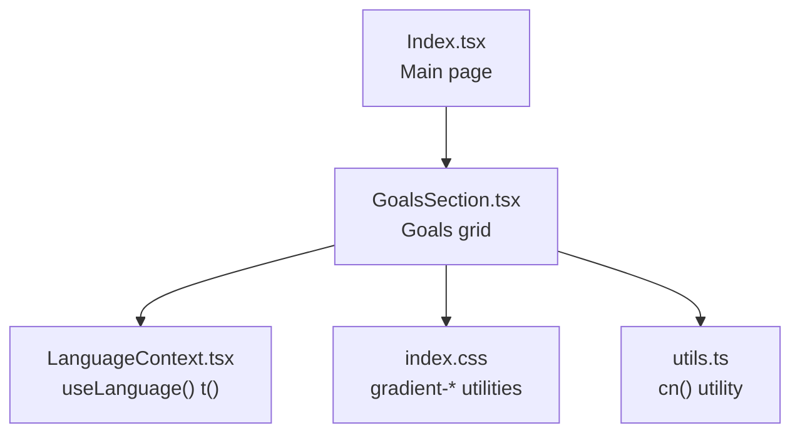
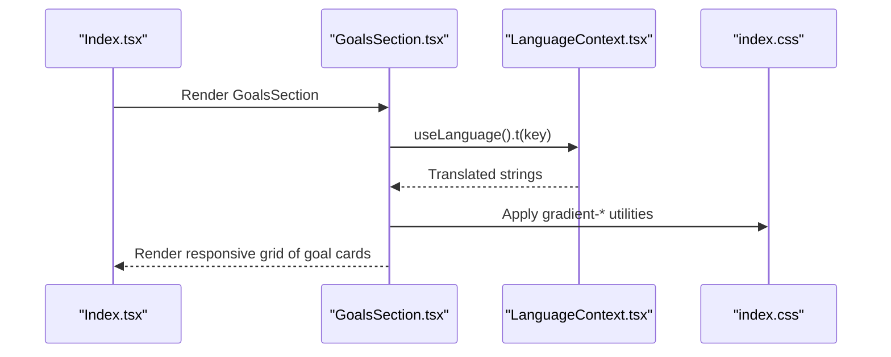
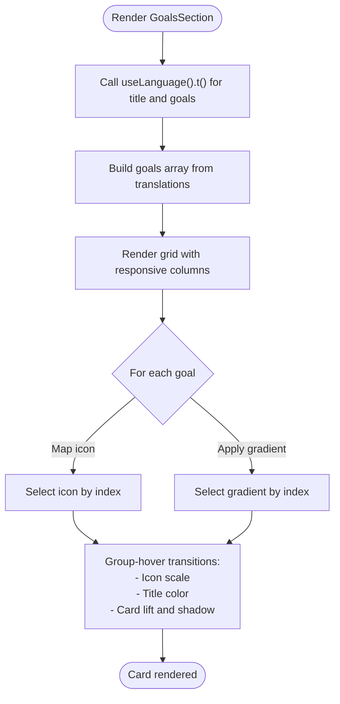
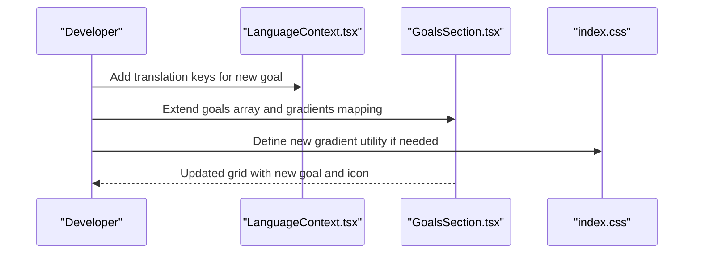
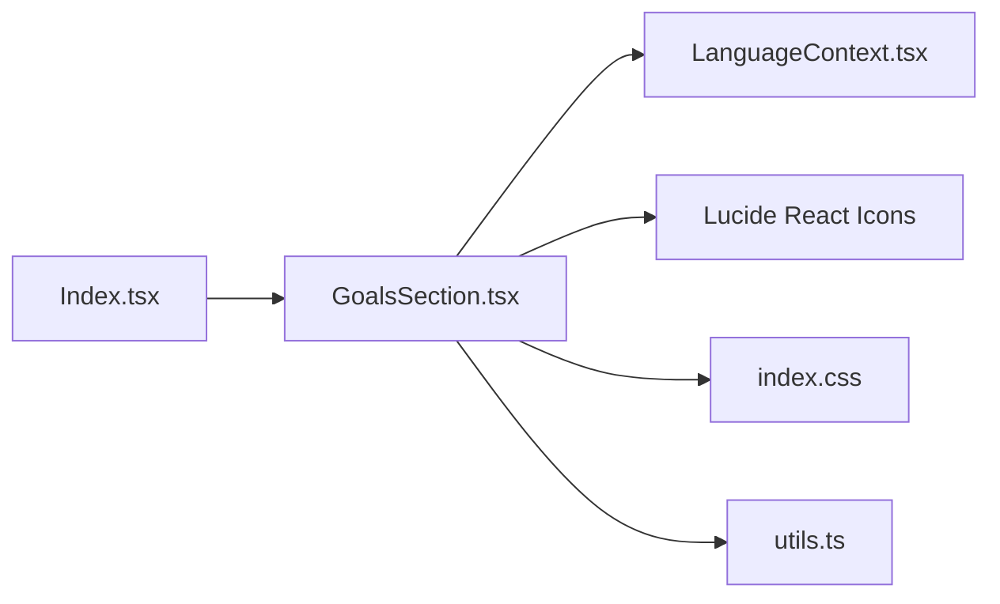

# Goals Section

> **Referenced Files in This Document**
> - [GoalsSection.tsx](src/components/GoalsSection.tsx)
> - [LanguageContext.tsx](src/contexts/LanguageContext.tsx)
> - [index.css](src/index.css)
> - [utils.ts](src/lib/utils.ts)
> - [eventData.ts](src/data/eventData.ts)
> - [Index.tsx](src/pages/Index.tsx)

## Table of Contents
1. [Introduction](#introduction)
2. [Project Structure](#project-structure)
3. [Core Components](#core-components)
4. [Architecture Overview](#architecture-overview)
5. [Detailed Component Analysis](#detailed-component-analysis)
6. [Dependency Analysis](#dependency-analysis)
7. [Performance Considerations](#performance-considerations)
8. [Troubleshooting Guide](#troubleshooting-guide)
9. [Conclusion](#conclusion)

## Introduction
This document explains the GoalsSection component that presents the event’s objectives through a grid of interactive cards. It covers how the component maps translation strings to dynamic goal objects, renders them responsively, and applies visual enhancements including color gradients, hover effects, and Tailwind group-hover utilities. It also provides guidance on adding or modifying goals and their associated icons/styles.

## Project Structure
GoalsSection is a self-contained UI component that:
- Consumes translated strings from the LanguageContext
- Uses a static list of goals defined in the component
- Renders a responsive grid of four goal cards
- Applies Tailwind utility classes for layout, spacing, shadows, and hover animations
- Uses Lucide React icons and custom gradient utilities defined in the stylesheet

**Diagram sources**
- [Index.tsx](src/pages/Index.tsx#L1-L32)
- [GoalsSection.tsx](src/components/GoalsSection.tsx#L1-L54)
- [LanguageContext.tsx](src/contexts/LanguageContext.tsx#L1-L292)
- [index.css](src/index.css#L55-L163)
- [utils.ts](src/lib/utils.ts#L1-L7)

**Section sources**
- [Index.tsx](src/pages/Index.tsx#L1-L32)
- [GoalsSection.tsx](src/components/GoalsSection.tsx#L1-L54)

## Core Components
- GoalsSection: Renders a centered title and a responsive grid of four goal cards. Each card displays an icon, a title, and a description. The component uses:
  - useLanguage() to translate the title and goal texts
  - Tailwind classes for responsive grid, spacing, shadows, and hover animations
  - Group-hover utilities to coordinate hover effects across the card and icon container
  - Gradient utilities from the stylesheet to style the icon containers

- LanguageContext: Provides the t() function and language state. GoalsSection reads:
  - goals.title
  - goals.1.title, goals.1.description
  - goals.2.title, goals.2.description
  - goals.3.title, goals.3.description
  - goals.4.title, goals.4.description

- index.css: Defines custom gradient utilities (gradient-green, gradient-gold) and color tokens used by the component.

- utils.ts: Provides the cn() utility for merging Tailwind classes safely.

**Section sources**
- [GoalsSection.tsx](src/components/GoalsSection.tsx#L1-L54)
- [LanguageContext.tsx](src/contexts/LanguageContext.tsx#L1-L292)
- [index.css](src/index.css#L55-L163)
- [utils.ts](src/lib/utils.ts#L1-L7)

## Architecture Overview
The GoalsSection component participates in a typical React flow:
- The page (Index.tsx) composes GoalsSection among other sections.
- GoalsSection uses LanguageContext to resolve translations.
- The component renders a grid of cards with consistent Tailwind styling and group-hover interactions.

**Diagram sources**
- [Index.tsx](src/pages/Index.tsx#L1-L32)
- [GoalsSection.tsx](src/components/GoalsSection.tsx#L1-L54)
- [LanguageContext.tsx](src/contexts/LanguageContext.tsx#L1-L292)
- [index.css](src/index.css#L55-L163)

## Detailed Component Analysis

### GoalsSection Implementation
- Purpose: Display four event goals as interactive cards with icons and gradient backgrounds.
- Data mapping:
  - The component defines a local goals array and maps each entry to translation keys under the goals namespace.
  - Titles and descriptions are resolved via t('goals.N.title') and t('goals.N.description').
- Grid layout:
  - Responsive grid with 1 column on small screens, 2 on medium, and 4 on large screens.
  - Cards are centered with a max width container.
- Interactive effects:
  - Hover scaling and elevation: the card lifts slightly and gains stronger shadow on hover.
  - Icon container scales up on hover.
  - Title text transitions to a brand green on hover.
- Visual styling:
  - Each card’s icon container uses a distinct gradient utility from the stylesheet.
  - Borders, rounded corners, and subtle shadows provide depth.
- Icons:
  - Four distinct icons are mapped to each card: Target, Eye, Heart, Compass.

**Diagram sources**
- [GoalsSection.tsx](src/components/GoalsSection.tsx#L1-L54)
- [LanguageContext.tsx](src/contexts/LanguageContext.tsx#L1-L292)
- [index.css](src/index.css#L55-L163)

**Section sources**
- [GoalsSection.tsx](src/components/GoalsSection.tsx#L1-L54)
- [LanguageContext.tsx](src/contexts/LanguageContext.tsx#L1-L292)

### Responsive Grid Behavior
- Columns:
  - sm: 2 columns
  - lg: 4 columns
- Spacing and container:
  - Gap between cards is controlled via gap-6.
  - Max width container centers the grid and constrains width on larger screens.
- Typography:
  - Title and descriptions use semantic sizes and leading for readability.

**Section sources**
- [GoalsSection.tsx](src/components/GoalsSection.tsx#L1-L54)

### Tailwind Group-Hover Utilities and Animations
- Group-hover coordination:
  - The card wrapper uses group on the outer div to enable group-hover selectors inside.
  - Icon container and title use group-hover to apply transforms and color transitions.
- Transitions:
  - Smooth transforms and color changes are applied with transition-all and transition-colors.
- Shadow and elevation:
  - Cards gain stronger shadows on hover and lift slightly to emphasize interactivity.

**Section sources**
- [GoalsSection.tsx](src/components/GoalsSection.tsx#L1-L54)

### Color Gradients and Theming
- Gradient utilities:
  - gradient-green and gradient-gold are defined in the stylesheet and applied to icon containers.
  - A fourth variant uses a solid background color token for contrast.
- Color tokens:
  - CSS variables define syrian-green, gold, and other brand colors used across the app.
- Consistency:
  - Hover color transitions align with the brand palette (e.g., group-hover:text-syrian-green).

**Section sources**
- [index.css](src/index.css#L55-L163)
- [GoalsSection.tsx](src/components/GoalsSection.tsx#L1-L54)

### Adding or Modifying Goals and Icons
- Steps to add a new goal:
  - Add a new entry in the goals array with t('goals.N.title') and t('goals.N.description').
  - Ensure the translation keys exist in LanguageContext.
  - Optionally add a new gradient utility in index.css if a unique background is desired.
- Steps to change icons:
  - Import the desired icon from lucide-react.
  - Update the icons array to include the new icon and adjust the mapping logic if needed.
- Styling adjustments:
  - Modify the gradients array to match the new goal count.
  - Adjust responsive grid classes if the number of columns changes.

**Diagram sources**
- [LanguageContext.tsx](src/contexts/LanguageContext.tsx#L1-L292)
- [GoalsSection.tsx](src/components/GoalsSection.tsx#L1-L54)
- [index.css](src/index.css#L55-L163)

**Section sources**
- [LanguageContext.tsx](src/contexts/LanguageContext.tsx#L1-L292)
- [GoalsSection.tsx](src/components/GoalsSection.tsx#L1-L54)
- [index.css](src/index.css#L55-L163)

## Dependency Analysis
- Internal dependencies:
  - GoalsSection depends on LanguageContext for translations.
  - GoalsSection uses Tailwind utilities and custom gradient classes from index.css.
  - GoalsSection uses Lucide React icons.
- External dependencies:
  - lucide-react for icons
  - Tailwind CSS for styling
  - React for component rendering

**Diagram sources**
- [GoalsSection.tsx](src/components/GoalsSection.tsx#L1-L54)
- [LanguageContext.tsx](src/contexts/LanguageContext.tsx#L1-L292)
- [index.css](src/index.css#L55-L163)
- [utils.ts](src/lib/utils.ts#L1-L7)
- [Index.tsx](src/pages/Index.tsx#L1-L32)

**Section sources**
- [GoalsSection.tsx](src/components/GoalsSection.tsx#L1-L54)
- [LanguageContext.tsx](src/contexts/LanguageContext.tsx#L1-L292)
- [index.css](src/index.css#L55-L163)
- [utils.ts](src/lib/utils.ts#L1-L7)
- [Index.tsx](src/pages/Index.tsx#L1-L32)

## Performance Considerations
- Rendering cost:
  - The component renders a fixed number of cards; performance impact is minimal.
- CSS and icons:
  - Using Lucide React icons ensures efficient SVG rendering.
  - Tailwind utilities are applied statically; no runtime computation overhead.
- Accessibility:
  - Ensure sufficient color contrast for text and icons against gradient backgrounds.
  - Provide focus-visible styles if the cards become interactive beyond hover.

[No sources needed since this section provides general guidance]

## Troubleshooting Guide
- Content overflow in cards:
  - Symptom: Long titles or descriptions wrap unexpectedly or overflow.
  - Resolution: Adjust text truncation or line clamp utilities; ensure adequate padding and max-width constraints.
- Icon loading issues:
  - Symptom: Icons not rendering or missing.
  - Resolution: Verify lucide-react is installed and the correct icon names are used; confirm the icons array mapping aligns with the goal count.
- Translation keys missing:
  - Symptom: Fallback keys appear instead of translated content.
  - Resolution: Add missing keys to LanguageContext translations for all supported languages.
- Hover effect inconsistencies:
  - Symptom: Hover transitions feel abrupt or inconsistent.
  - Resolution: Ensure group-hover utilities are applied consistently on the card wrapper and child elements; verify transition durations and easing are uniform.

**Section sources**
- [GoalsSection.tsx](src/components/GoalsSection.tsx#L1-L54)
- [LanguageContext.tsx](src/contexts/LanguageContext.tsx#L1-L292)

## Conclusion
GoalsSection delivers a clean, responsive presentation of event goals with consistent visual language. By leveraging translation keys, Tailwind utilities, and group-hover interactions, it provides an engaging user experience. Extending the component involves updating translations, the goals array, and optional gradient utilities, ensuring a cohesive design system across the application.