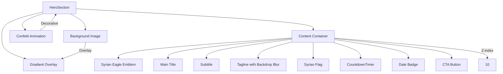

# Hero Section

> **Referenced Files in This Document**   
> - [HeroSection.tsx](src/components/HeroSection.tsx)
> - [CountdownTimer.tsx](src/components/CountdownTimer.tsx)
> - [LanguageContext.tsx](src/contexts/LanguageContext.tsx)
> - [eventData.ts](src/data/eventData.ts)
> - [index.css](src/index.css)
> - [tailwind.config.ts](tailwind.config.ts)

## Table of Contents
1. [Introduction](#introduction)
2. [Core Implementation](#core-implementation)
3. [Visual Design and Styling](#visual-design-and-styling)
4. [Animation System](#animation-system)
5. [Internationalization Support](#internationalization-support)
6. [Responsive Design](#responsive-design)
7. [Accessibility and Performance](#accessibility-and-performance)
8. [Customization Guidelines](#customization-guidelines)

## Introduction
The HeroSection component serves as the primary landing experience for the event website, creating an immersive full-viewport introduction that captures the significance of Liberation Day. This component combines visual storytelling with interactive elements to engage visitors immediately upon arrival. It features a full-screen background image with gradient overlays, decorative confetti animations, and integrates the CountdownTimer component to build anticipation for the upcoming event. The design incorporates Syrian national symbols including the Syrian eagle emblem and flag, creating a culturally resonant experience. Built with React and styled using Tailwind CSS, the component demonstrates a sophisticated implementation of modern web design principles including responsive layouts, smooth animations, and multilingual support.

## Core Implementation

The HeroSection is implemented as a React functional component that creates a full-viewport experience with layered visual elements. The component structure follows a z-index hierarchy to manage overlapping elements, with the background image at the lowest level, followed by gradient overlays, decorative elements, and content in the foreground. The component uses the `min-h-screen` class to ensure full viewport height and `flex items-center justify-center` for perfect vertical and horizontal centering of content. It imports three key assets: the main hero image (`hero-celebration.jpg`), the Syrian eagle emblem, and the Syrian flag. The component integrates the CountdownTimer as a child component, positioning it prominently within the content flow. The section is assigned an ID of "hero" to enable programmatic navigation from other parts of the application. The implementation leverages React's component composition pattern, breaking down complex UI into reusable pieces while maintaining a cohesive visual experience.

**Section sources**
- [HeroSection.tsx](src/components/HeroSection.tsx#L6-L97)

## Visual Design and Styling

The visual design of the HeroSection employs a sophisticated layering technique to create depth and visual interest. The background consists of a full-coverage image with a semi-transparent gradient overlay that runs from top to bottom, darkening the image appropriately to ensure text readability. The gradient uses variable opacity levels (60%, 40%, and 80%) to create a dynamic effect that accommodates different content sections. The component utilizes custom CSS variables defined in the `:root` declaration for consistent theming, including specific colors for the Syrian flag (red, green, black) and gold accents. Tailwind's `backdrop-blur-sm` class is applied to the tagline container, creating a frosted glass effect that enhances text legibility against the busy background. The Syrian eagle emblem features a `drop-shadow-2xl` effect for dramatic depth, while the flag image includes a subtle border and shadow for a lifted appearance. The CTA button uses a custom `gradient-gold` class with a glowing effect (`glow-gold`) on hover, creating an interactive focal point.



**Diagram sources**
- [HeroSection.tsx](src/components/HeroSection.tsx#L10-L97)
- [index.css](src/index.css#L60-L72)

## Animation System

The HeroSection implements a comprehensive animation system that enhances user engagement through subtle, purposeful motion. The component features multiple animation patterns that work in concert to create a dynamic yet not overwhelming experience. The primary animation pattern is the "fade-up" effect, applied to all content elements with staggered delays (100ms increments) to create a cascading appearance effect. The Syrian eagle emblem features a continuous floating animation (`animate-float`) that gently moves the element up and down over a 3-second cycle, creating a sense of lightness and celebration. The background includes a decorative confetti animation with 15 randomly positioned elements that fall at different speeds and angles, each with random delays and durations. These confetti pieces use the Syrian national colors (red, green, and gold) to maintain thematic consistency. The animations are defined in CSS using keyframes and applied through utility classes, with the `forwards` property ensuring elements remain in their final state after animation completion. The CTA button includes a hover animation (`hover:scale-105`) that provides tactile feedback, enhancing the interactive experience.

```mermaid
flowchart TD
Start([Animation System]) --> FadeUp["Fade-up Animation"]
FadeUp --> |Class| animate-fade-up
FadeUp --> |Duration| 0.6s
FadeUp --> |Easing| ease-out
FadeUp --> |Fill| forwards
Start --> Float["Float Animation"]
Float --> |Class| animate-float
Float --> |Duration| 3s
Float --> |Timing| ease-in-out
Float --> |Iteration| infinite
Float --> |Transform| translateY(-10px)
Start --> Confetti["Confetti Animation"]
Confetti --> |Class| animate-confetti
Confetti --> |Duration| 4-8s
Confetti --> |Timing| linear
Confetti --> |Iteration| infinite
Confetti --> |Transform| translateY(100vh) rotate(720deg)
Start --> Stagger["Stagger Delays"]
Stagger --> delay-100["delay-100: 100ms"]
Stagger --> delay-200["delay-200: 200ms"]
Stagger --> delay-300["delay-300: 300ms"]
Stagger --> delay-400["delay-400: 400ms"]
Stagger --> delay-500["delay-500: 500ms"]
Start --> Hover["Hover Animations"]
Hover --> CTA["CTA Button: hover:scale-105"]
Hover --> Duration["Duration: 300ms"]
```

**Diagram sources**
- [HeroSection.tsx](src/components/HeroSection.tsx#L38-L84)
- [index.css](src/index.css#L175-L248)

## Internationalization Support

The HeroSection component fully supports multilingual content through the translation function `t()` provided by the LanguageContext. The component accesses the translation system via the `useLanguage()` hook, which returns both the current language setting and the translation function. All visible text content in the HeroSection is rendered through translation keys rather than hardcoded strings, enabling seamless language switching. The component displays different content based on the selected language (Arabic, English, or Turkish), with appropriate text direction handling (RTL for Arabic). The translation system is implemented as a nested object structure with language codes as top-level keys and dot-separated path keys for specific content elements. The `t()` function includes fallback behavior, returning the key itself if a translation is missing. The CountdownTimer component also supports internationalization, with time unit labels (Days, Hours, Minutes, Seconds) translated according to the current language setting. The system automatically applies the appropriate font family based on language, using Bahij Koufiya for Arabic and Roboto for English and Turkish, ensuring optimal text rendering for each language.

```mermaid
classDiagram
class LanguageContext {
+language : Language
+setLanguage(lang : Language)
+t(key : string) : string
+isRTL : boolean
}
class HeroSection {
+t : (key : string) => string
+language : Language
+isRTL : boolean
}
class CountdownTimer {
+language : Language
+labels : Record~Language, Record~string, string~~
+currentLabels : Record~string, string~
}
class Translations {
+ar : Record~string, string~
+en : Record~string, string~
+tr : Record~string, string~
}
HeroSection --> LanguageContext : uses
CountdownTimer --> LanguageContext : uses
LanguageContext --> Translations : contains
note right of HeroSection
Uses translation keys :
- hero.title
- hero.subtitle
- hero.tagline
- hero.discoverMore
- hero.date
- hero.day
- event.time
end note
note right of CountdownTimer
Uses language-specific labels :
- days, hours, minutes, seconds
in Arabic, English, and Turkish
end note
```

**Diagram sources**
- [HeroSection.tsx](src/components/HeroSection.tsx#L7-L8)
- [LanguageContext.tsx](src/contexts/LanguageContext.tsx#L12-L264)
- [CountdownTimer.tsx](src/components/CountdownTimer.tsx#L40-L46)

## Responsive Design

The HeroSection implements a comprehensive responsive design strategy using Tailwind CSS's breakpoint system to ensure optimal viewing across all device sizes. The component uses relative units and flexible layouts to adapt to different screen dimensions, with specific adjustments at key breakpoints (sm: 640px, md: 768px, lg: 1024px). Text elements scale appropriately with viewport size, using classes like `text-4xl sm:text-6xl md:text-7xl` for the main title to ensure readability on both mobile and desktop devices. The content container uses `max-w-5xl mx-auto` to constrain width on larger screens while remaining full-width on smaller devices. Image dimensions are responsive, with the Syrian eagle emblem scaling from `w-24 h-24` on mobile to `w-32 h-32` on larger screens. The layout maintains its vertical centering and visual hierarchy across all breakpoints, with appropriate spacing adjustments using Tailwind's margin and padding utilities. The component also respects the global font family selection based on language, ensuring proper text rendering and layout for both RTL and LTR languages. The responsive design prioritizes content legibility and visual impact on all devices, with careful consideration given to touch target sizes and interaction patterns on mobile devices.

**Section sources**
- [HeroSection.tsx](src/components/HeroSection.tsx#L47-L88)
- [tailwind.config.ts](tailwind.config.ts#L7-L97)

## Accessibility and Performance

The HeroSection component addresses key accessibility and performance considerations to ensure an inclusive and efficient user experience. For accessibility, the component includes appropriate alt text for all decorative images, with the Syrian eagle having the Arabic description "العقاب السوري" and the flag described as "علم سوريا الحرة". The full-viewport layout is implemented with proper semantic HTML using the `<section>` element with an ID for programmatic navigation. The animations are designed with user comfort in mind, using moderate durations and easing functions to avoid triggering vestibular disorders. The component avoids auto-playing audio or video that could be distracting for users with attention disorders. For performance, the background image optimization is critical, though specific optimization techniques are not visible in the code. The confetti animation uses CSS transforms and opacity changes rather than layout or paint-intensive properties for smooth 60fps performance. The CountdownTimer component efficiently updates only once per second using setInterval, with proper cleanup in the useEffect cleanup function to prevent memory leaks. The component minimizes re-renders by using stable references and avoiding inline function definitions in the render method. The use of Tailwind's JIT compiler ensures only used utility classes are included in the final CSS bundle, reducing payload size.

**Section sources**
- [HeroSection.tsx](src/components/HeroSection.tsx#L40-L43)
- [CountdownTimer.tsx](src/components/CountdownTimer.tsx#L32-L38)
- [index.css](src/index.css#L175-L248)

## Customization Guidelines

Customizing the HeroSection for future events requires modifications to several key areas while maintaining the overall design system. To update the event content, modify the translation strings in the LanguageContext for the hero section keys (hero.title, hero.subtitle, etc.) and update the eventData.ts file with new dates and details. For visual customization, replace the hero image, Syrian eagle, and flag assets with new images while maintaining similar dimensions for consistent layout. The color scheme can be adjusted by modifying the CSS variables in index.css, particularly the --syrian-red, --syrian-green, and --gold variables, which will automatically propagate to all components using these colors. Animation parameters can be customized by editing the keyframe definitions in index.css, such as adjusting the float amplitude or confetti fall speed. The responsive behavior can be fine-tuned by adjusting the Tailwind classes on text elements and containers. When adding new elements, follow the existing animation sequence by using the staggered delay classes (delay-100, delay-200, etc.) to maintain the cascading entrance effect. Ensure any new images are optimized for web delivery to maintain performance, and verify that all interactive elements maintain sufficient contrast ratios for accessibility compliance.

**Section sources**
- [HeroSection.tsx](src/components/HeroSection.tsx#L1-L97)
- [index.css](src/index.css#L60-L72)
- [LanguageContext.tsx](src/contexts/LanguageContext.tsx#L12-L264)
- [eventData.ts](src/data/eventData.ts#L1-L109)