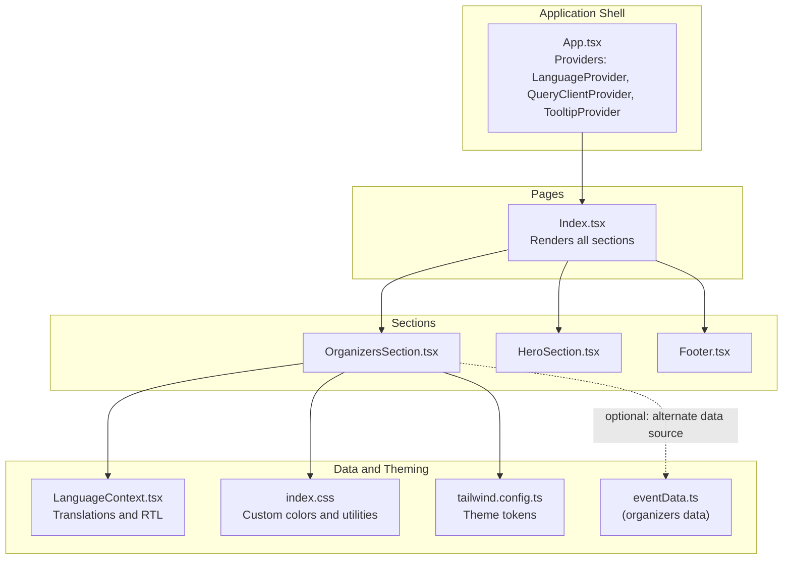
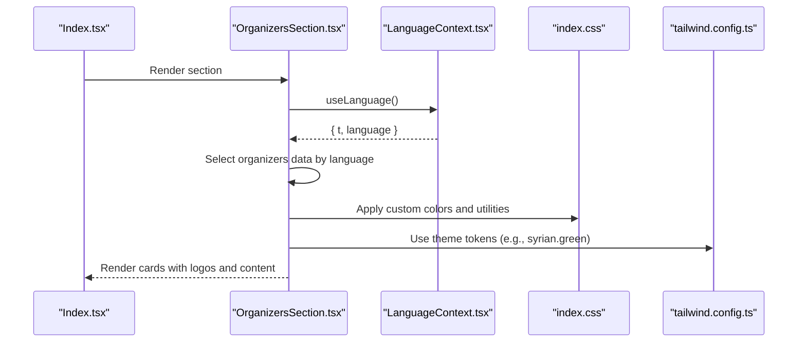
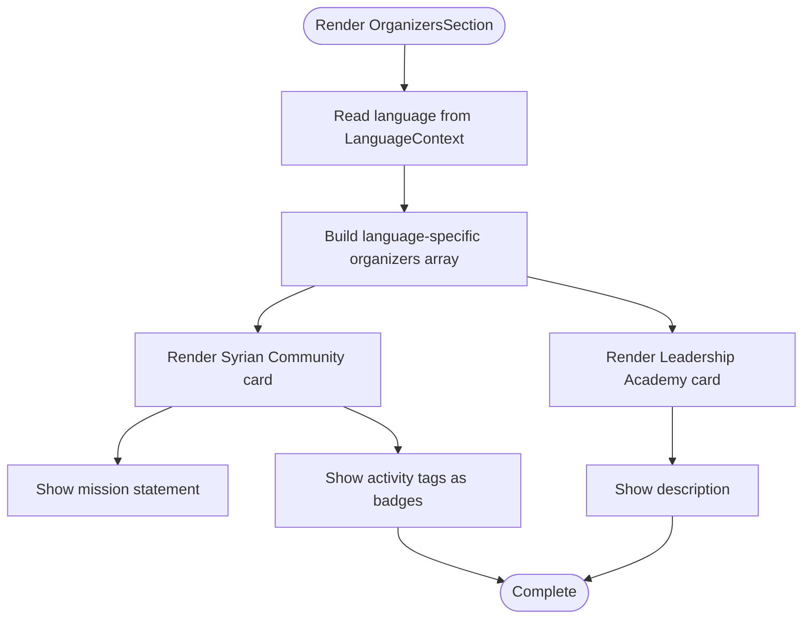
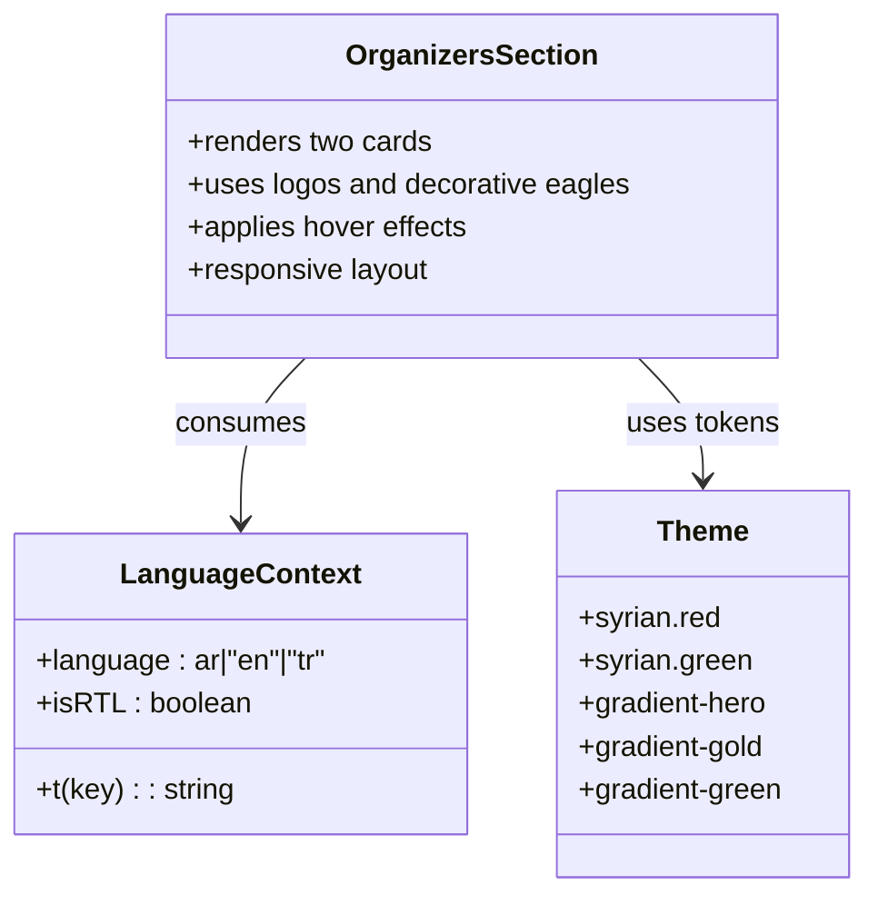
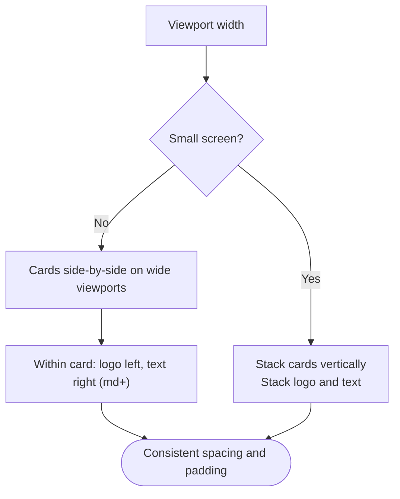
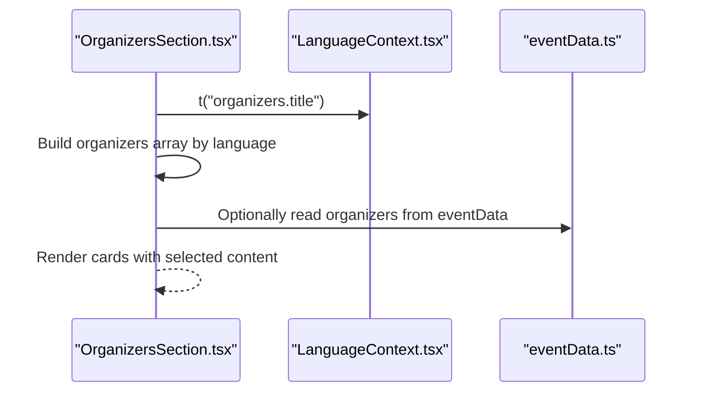
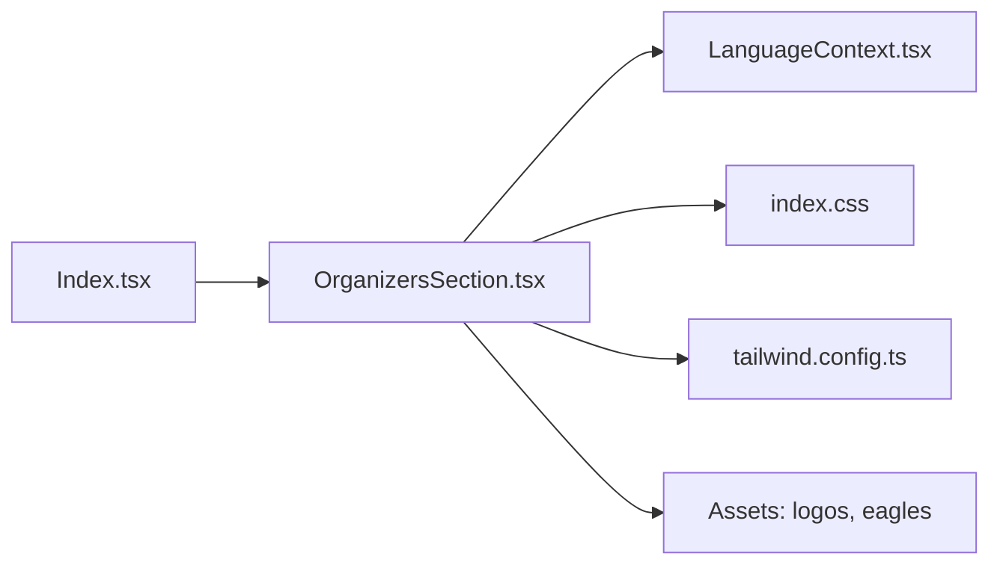

# Organizers Section

> **Referenced Files in This Document**
> - [OrganizersSection.tsx](src/components/OrganizersSection.tsx)
> - [LanguageContext.tsx](src/contexts/LanguageContext.tsx)
> - [Index.tsx](src/pages/Index.tsx)
> - [eventData.ts](src/data/eventData.ts)
> - [index.css](src/index.css)
> - [tailwind.config.ts](src/tailwind.config.ts)
> - [HeroSection.tsx](src/components/HeroSection.tsx)
> - [Footer.tsx](src/components/Footer.tsx)

## Table of Contents
1. [Introduction](#introduction)
2. [Project Structure](#project-structure)
3. [Core Components](#core-components)
4. [Architecture Overview](#architecture-overview)
5. [Detailed Component Analysis](#detailed-component-analysis)
6. [Dependency Analysis](#dependency-analysis)
7. [Performance Considerations](#performance-considerations)
8. [Troubleshooting Guide](#troubleshooting-guide)
9. [Conclusion](#conclusion)
10. [Appendices](#appendices)

## Introduction
This document explains the OrganizersSection component that presents the event’s organizing institutions with detailed information cards. It covers how the component dynamically renders content based on the current language context, the two-tier structure (Syrian Community card with mission and activity tags, and the Leadership Academy card), visual design elements (logos, decorative Syrian eagle motifs, and hover effects), responsive layout behavior, and guidance for updating content and customizing presentation.

## Project Structure
The OrganizersSection is a standalone UI component integrated into the main page layout and driven by the global language context.

**Diagram sources**
- [App.tsx](src/App.tsx#L1-L43)
- [Index.tsx](src/pages/Index.tsx#L1-L32)
- [OrganizersSection.tsx](src/components/OrganizersSection.tsx#L1-L132)
- [LanguageContext.tsx](src/contexts/LanguageContext.tsx#L1-L292)
- [index.css](src/index.css#L55-L163)
- [tailwind.config.ts](src/tailwind.config.ts#L44-L84)
- [eventData.ts](src/data/eventData.ts#L86-L101)

**Section sources**
- [Index.tsx](src/pages/Index.tsx#L1-L32)
- [App.tsx](src/App.tsx#L1-L43)

## Core Components
- OrganizersSection: Renders two organization cards with logos, descriptions, and optional mission statements and activity tags. It selects content based on the current language via the LanguageContext.
- LanguageContext: Provides the translation function and language state, enabling dynamic content selection and RTL direction.
- Theme and Utilities: Custom color tokens (including Syrian green) and Tailwind theme extensions enable consistent styling and hover effects.

Key responsibilities:
- Dynamic content rendering by language
- Two-tier card layout with Syrian Community and Leadership Academy
- Visual design with logos and decorative Syrian eagle motifs
- Responsive layout and hover effects
- Optional integration with centralized event data

**Section sources**
- [OrganizersSection.tsx](src/components/OrganizersSection.tsx#L1-L132)
- [LanguageContext.tsx](src/contexts/LanguageContext.tsx#L1-L292)
- [index.css](src/index.css#L55-L163)
- [tailwind.config.ts](src/tailwind.config.ts#L44-L84)

## Architecture Overview
The component reads the current language and translation function from the LanguageContext, constructs a language-specific data array, and renders two cards. Styling relies on Tailwind utility classes and custom CSS tokens.

**Diagram sources**
- [Index.tsx](src/pages/Index.tsx#L1-L32)
- [OrganizersSection.tsx](src/components/OrganizersSection.tsx#L1-L132)
- [LanguageContext.tsx](src/contexts/LanguageContext.tsx#L1-L292)
- [index.css](src/index.css#L55-L163)
- [tailwind.config.ts](src/tailwind.config.ts#L44-L84)

## Detailed Component Analysis

### Two-Tier Structure
- Syrian Community card
  - Displays organization name, description, and mission statement.
  - Shows “Work Areas” with a list of activity tags rendered as interactive badges.
- Leadership Academy card
  - Displays organization name and description.
  - Uses a distinct logo and layout.

**Diagram sources**
- [OrganizersSection.tsx](src/components/OrganizersSection.tsx#L1-L132)

**Section sources**
- [OrganizersSection.tsx](src/components/OrganizersSection.tsx#L1-L132)

### Visual Design and Styling
- Logos
  - Syrian Community card uses a dedicated logo asset.
  - Leadership Academy card uses its own logo asset.
- Decorative Syrian Eagle Motifs
  - Background decorative eagles are positioned at top-left and bottom-right corners.
- Hover Effects
  - Cards have a subtle elevation and shadow, with a hover effect that changes the border color to a shade of Syrian green.
  - Activity tags also change background and text color on hover.
- Typography and Spacing
  - Titles and descriptions use semantic text colors and spacing utilities.
- Theme Tokens
  - Custom tokens define Syrian green and gradients used across the app.
  - Tailwind theme exposes a “syrian” color palette for consistent usage.

**Diagram sources**
- [OrganizersSection.tsx](src/components/OrganizersSection.tsx#L1-L132)
- [LanguageContext.tsx](src/contexts/LanguageContext.tsx#L1-L292)
- [index.css](src/index.css#L55-L163)
- [tailwind.config.ts](src/tailwind.config.ts#L44-L84)

**Section sources**
- [OrganizersSection.tsx](src/components/OrganizersSection.tsx#L1-L132)
- [index.css](src/index.css#L55-L163)
- [tailwind.config.ts](src/tailwind.config.ts#L44-L84)

### Responsive Layout Behavior
- Desktop-first layout
  - Cards stack vertically with equal spacing.
  - Within each card, the logo and text align horizontally on medium and up screens.
- Mobile layout
  - Cards remain stacked.
  - Within each card, the logo and text stack vertically for readability.

**Diagram sources**
- [OrganizersSection.tsx](src/components/OrganizersSection.tsx#L64-L128)

**Section sources**
- [OrganizersSection.tsx](src/components/OrganizersSection.tsx#L64-L128)

### Data Sources and Language Integration
- Language-specific content
  - The component builds a language-specific array of organizers, selecting appropriate strings for names, descriptions, missions, and activity tags.
- Translation keys
  - The section title is pulled from translation keys managed by the LanguageContext.
- Optional centralized data
  - The project includes a centralized event data file with an organizers array. While the current component defines its own language arrays, the centralized data could serve as a canonical source for organizers’ information.

**Diagram sources**
- [OrganizersSection.tsx](src/components/OrganizersSection.tsx#L1-L132)
- [LanguageContext.tsx](src/contexts/LanguageContext.tsx#L1-L292)
- [eventData.ts](src/data/eventData.ts#L86-L101)

**Section sources**
- [OrganizersSection.tsx](src/components/OrganizersSection.tsx#L1-L132)
- [LanguageContext.tsx](src/contexts/LanguageContext.tsx#L1-L292)
- [eventData.ts](src/data/eventData.ts#L86-L101)

## Dependency Analysis
- Internal dependencies
  - OrganizersSection depends on LanguageContext for translations and language state.
  - OrganizersSection imports local assets for logos and decorative eagles.
  - Tailwind theme and custom CSS tokens are used for colors and utilities.
- External integrations
  - The component is included in the main page layout and thus participates in the global provider chain.

**Diagram sources**
- [Index.tsx](src/pages/Index.tsx#L1-L32)
- [OrganizersSection.tsx](src/components/OrganizersSection.tsx#L1-L132)
- [LanguageContext.tsx](src/contexts/LanguageContext.tsx#L1-L292)
- [index.css](src/index.css#L55-L163)
- [tailwind.config.ts](src/tailwind.config.ts#L44-L84)

**Section sources**
- [Index.tsx](src/pages/Index.tsx#L1-L32)
- [OrganizersSection.tsx](src/components/OrganizersSection.tsx#L1-L132)
- [LanguageContext.tsx](src/contexts/LanguageContext.tsx#L1-L292)
- [index.css](src/index.css#L55-L163)
- [tailwind.config.ts](src/tailwind.config.ts#L44-L84)

## Performance Considerations
- Rendering cost
  - The component renders a small, fixed number of cards and a few tags. No significant performance concerns are expected.
- Asset sizes
  - Ensure logo and decorative asset sizes are optimized to minimize load times.
- Conditional rendering
  - The mission and activity tags are only shown when present in the data, avoiding unnecessary DOM nodes.

[No sources needed since this section provides general guidance]

## Troubleshooting Guide
Common issues and resolutions:
- Content translation consistency
  - Ensure translation keys for the organizers section title are present in the LanguageContext for all supported languages.
  - Verify that language-specific arrays include all required fields (names, descriptions, missions, activity tags).
- Tag rendering for activities
  - Activity tags are conditionally rendered only if the activities array is present. Confirm that the data includes the activities property for the Syrian Community card.
- Hover effects not applying
  - Confirm that the custom color tokens and Tailwind theme are configured and that the component applies the intended hover classes.
- Decorative assets visibility
  - Verify that the decorative eagle assets are accessible and sized appropriately for the background overlay.
- Responsive layout expectations
  - On small screens, the logo and text stack vertically within each card. If layout appears off, review Tailwind breakpoint classes and container widths.

**Section sources**
- [LanguageContext.tsx](src/contexts/LanguageContext.tsx#L1-L292)
- [OrganizersSection.tsx](src/components/OrganizersSection.tsx#L1-L132)
- [index.css](src/index.css#L55-L163)
- [tailwind.config.ts](src/tailwind.config.ts#L44-L84)

## Conclusion
The OrganizersSection component provides a clean, multilingual presentation of organizing institutions with a two-tier card layout. It leverages the LanguageContext for dynamic content, integrates logos and decorative motifs, and applies responsive design with hover effects. The component is easy to customize and extend, and can be aligned with centralized event data for maintainability.

[No sources needed since this section summarizes without analyzing specific files]

## Appendices

### Updating Organizer Information
- Add or modify organizations
  - Extend the language-specific arrays inside the component to include new organizations or update existing entries.
  - Ensure each organization includes required fields (name, description) and optional fields (mission, activities).
- Add new languages
  - Expand the language-specific arrays to include new language variants alongside Arabic, English, and Turkish.
- Centralized data alignment
  - If using the centralized event data file, mirror changes to the organizers array there to keep content synchronized.

**Section sources**
- [OrganizersSection.tsx](src/components/OrganizersSection.tsx#L1-L132)
- [eventData.ts](src/data/eventData.ts#L86-L101)

### Customizing Visual Presentation
- Colors and gradients
  - Adjust custom tokens and Tailwind theme to change the Syrian green or other accent colors.
- Hover effects
  - Modify hover classes on cards and tags to adjust border colors or transitions.
- Layout adjustments
  - Change spacing utilities and breakpoints to fine-tune the card and text alignment on different screen sizes.
- Decorative assets
  - Replace or resize logo and eagle assets to match branding preferences.

**Section sources**
- [index.css](src/index.css#L55-L163)
- [tailwind.config.ts](src/tailwind.config.ts#L44-L84)
- [OrganizersSection.tsx](src/components/OrganizersSection.tsx#L1-L132)

### Related Visual Elements in the Application
- Hero section and footer also incorporate Syrian eagle and flag imagery, reinforcing thematic consistency.
- These components demonstrate how decorative assets and color themes are consistently applied across the site.

**Section sources**
- [HeroSection.tsx](src/components/HeroSection.tsx#L1-L99)
- [Footer.tsx](src/components/Footer.tsx#L1-L103)