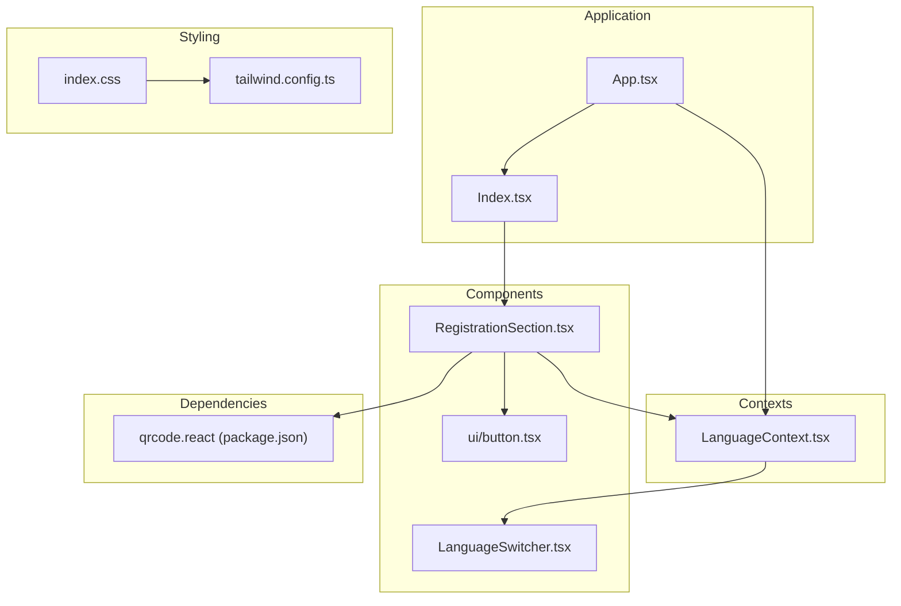
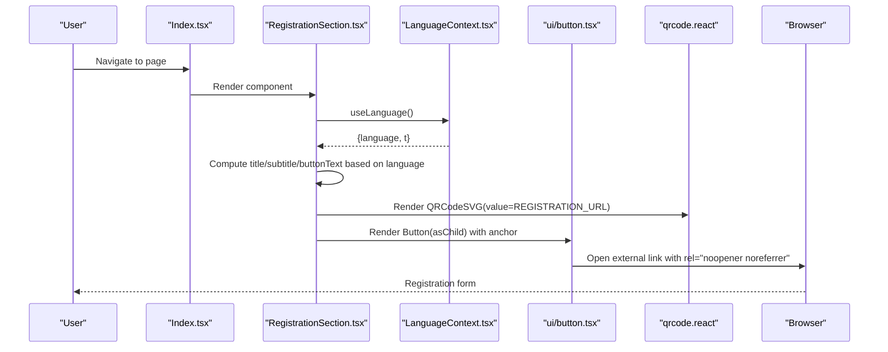
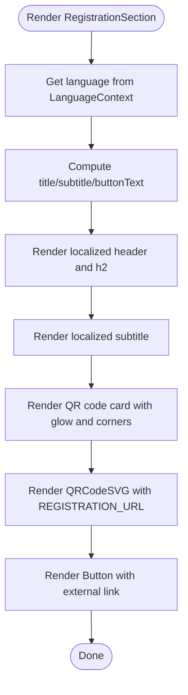
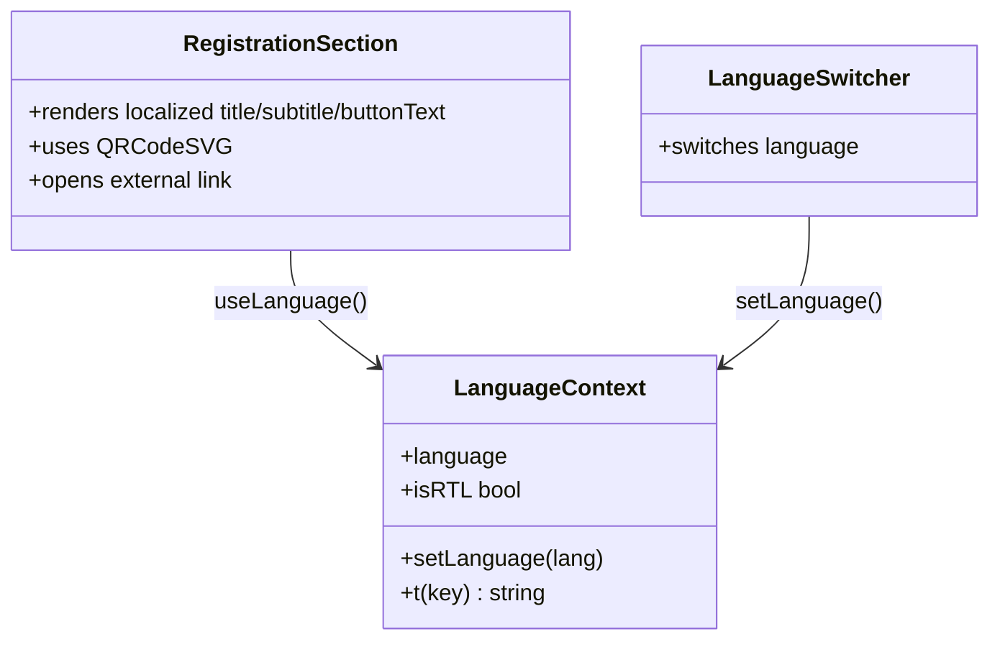
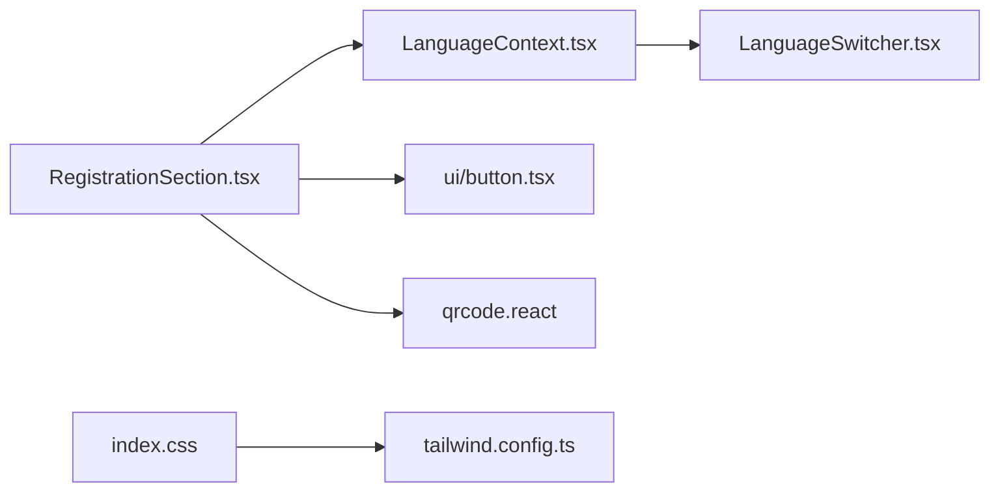

# Registration Section

> **Referenced Files in This Document**
> - [RegistrationSection.tsx](src/components/RegistrationSection.tsx)
> - [LanguageContext.tsx](src/contexts/LanguageContext.tsx)
> - [LanguageSwitcher.tsx](src/components/LanguageSwitcher.tsx)
> - [button.tsx](src/components/ui/button.tsx)
> - [index.css](src/index.css)
> - [tailwind.config.ts](src/tailwind.config.ts)
> - [App.tsx](src/App.tsx)
> - [Index.tsx](src/pages/Index.tsx)
> - [package.json](package.json)

## Table of Contents
1. [Introduction](#introduction)
2. [Project Structure](#project-structure)
3. [Core Components](#core-components)
4. [Architecture Overview](#architecture-overview)
5. [Detailed Component Analysis](#detailed-component-analysis)
6. [Dependency Analysis](#dependency-analysis)
7. [Performance Considerations](#performance-considerations)
8. [Troubleshooting Guide](#troubleshooting-guide)
9. [Conclusion](#conclusion)
10. [Appendices](#appendices)

## Introduction
This document explains the RegistrationSection component that enables event sign-ups via a QR code and a direct link. It covers the centered layout, decorative background blurs, prominent QR code rendering, multilingual text handling, and the custom-styled button with hover effects and shadow elevation. It also addresses external link security, responsive behavior, QR scanning reliability, and guidance for updating the registration URL and customizing colors and styles.

## Project Structure
The RegistrationSection is part of the components library and integrates into the main page layout. It relies on the LanguageContext for multilingual rendering and Tailwind CSS for styling. The QR code is rendered using the qrcode.react library.

**Diagram sources**
- [App.tsx](src/App.tsx#L1-L43)
- [Index.tsx](src/pages/Index.tsx#L1-L32)
- [RegistrationSection.tsx](src/components/RegistrationSection.tsx#L1-L105)
- [LanguageContext.tsx](src/contexts/LanguageContext.tsx#L1-L292)
- [LanguageSwitcher.tsx](src/components/LanguageSwitcher.tsx#L1-L44)
- [button.tsx](src/components/ui/button.tsx#L1-L48)
- [index.css](src/index.css#L55-L104)
- [tailwind.config.ts](src/tailwind.config.ts#L44-L84)
- [package.json](package.json#L1-L200)

**Section sources**
- [RegistrationSection.tsx](src/components/RegistrationSection.tsx#L1-L105)
- [Index.tsx](src/pages/Index.tsx#L1-L32)
- [App.tsx](src/App.tsx#L1-L43)

## Core Components
- RegistrationSection: Renders multilingual header, subtitle, QR code, and a prominent button linking to the registration URL. It uses decorative background blurs and a QR code card with corner decorations and a glow effect.
- LanguageContext: Provides language state and translation keys, enabling conditional rendering of localized text.
- LanguageSwitcher: Allows users to change language, which updates the RegistrationSection’s text.
- Button (ui): A reusable button component used for the external registration link.
- Styling: Uses Tailwind CSS with custom syrian-green palette and gradients.

Key implementation highlights:
- Multilingual rendering via conditional logic based on the current language.
- QR code rendering with qrcode.react and custom styling.
- External link with proper security attributes.
- Responsive layout using container and max-width utilities.

**Section sources**
- [RegistrationSection.tsx](src/components/RegistrationSection.tsx#L1-L105)
- [LanguageContext.tsx](src/contexts/LanguageContext.tsx#L1-L292)
- [LanguageSwitcher.tsx](src/components/LanguageSwitcher.tsx#L1-L44)
- [button.tsx](src/components/ui/button.tsx#L1-L48)
- [index.css](src/index.css#L55-L104)
- [tailwind.config.ts](src/tailwind.config.ts#L44-L84)

## Architecture Overview
The RegistrationSection depends on the LanguageContext for language-aware text and on the Button component for the external link. The QR code is rendered via qrcode.react. Styling is driven by Tailwind CSS with custom color tokens.

**Diagram sources**
- [Index.tsx](src/pages/Index.tsx#L1-L32)
- [RegistrationSection.tsx](src/components/RegistrationSection.tsx#L1-L105)
- [LanguageContext.tsx](src/contexts/LanguageContext.tsx#L1-L292)
- [button.tsx](src/components/ui/button.tsx#L1-L48)
- [package.json](package.json#L1-L200)

## Detailed Component Analysis

### RegistrationSection Implementation
- Layout and Background:
  - Centered content with a max width container and text centering.
  - Decorative blurred circles positioned absolutely to create a soft background glow.
  - Gradient background blending subtle green hues with the base theme.
- Header and Text:
  - Inline header with an icon and localized title.
  - H2 title and paragraph subtitle, both localized based on the current language.
- QR Code Card:
  - A floating glow effect behind the card using a blurred div.
  - A bordered card with rounded corners and inner shadow.
  - Corner decorations implemented with border overlays.
  - QR code inside a white padded container with a dark green foreground and white background.
- Button:
  - Large custom-styled button using the ui/Button component.
  - Hover effects: reduced opacity, increased shadow, and slight scale-up.
  - External link with target="_blank" and rel="noopener noreferrer".
- Multilingual Rendering:
  - Conditional logic selects the appropriate text for title, subtitle, and button text based on the current language.
- QR Code Generation:
  - Uses QRCodeSVG from qrcode.react with a fixed size and high error correction level.
- External Link Security:
  - Proper use of target="_blank" and rel="noopener noreferrer" for safe external navigation.

**Diagram sources**
- [RegistrationSection.tsx](src/components/RegistrationSection.tsx#L1-L105)
- [LanguageContext.tsx](src/contexts/LanguageContext.tsx#L1-L292)

**Section sources**
- [RegistrationSection.tsx](src/components/RegistrationSection.tsx#L1-L105)

### Multilingual Display and Language Context
- LanguageContext provides:
  - language state and setLanguage function.
  - t function for translation keys.
  - isRTL flag for directionality.
- RegistrationSection uses the language state to compute localized strings for title, subtitle, and button text.
- LanguageSwitcher toggles language among Arabic, English, and Turkish, reflecting the supported languages.

**Diagram sources**
- [LanguageContext.tsx](src/contexts/LanguageContext.tsx#L1-L292)
- [RegistrationSection.tsx](src/components/RegistrationSection.tsx#L1-L105)
- [LanguageSwitcher.tsx](src/components/LanguageSwitcher.tsx#L1-L44)

**Section sources**
- [LanguageContext.tsx](src/contexts/LanguageContext.tsx#L1-L292)
- [RegistrationSection.tsx](src/components/RegistrationSection.tsx#L1-L105)
- [LanguageSwitcher.tsx](src/components/LanguageSwitcher.tsx#L1-L44)

### Visual Design Elements
- Colors and Palette:
  - Custom syrian-green palette defined in CSS variables and exposed via Tailwind.
  - Used for text, borders, glows, and button backgrounds.
- Typography:
  - Font selection switches between Arabic and Latin scripts based on language.
- Button Styling:
  - Large rounded button with hover-scale and enhanced shadow.
  - Uses the ui/Button component with asChild to render an anchor element.
- QR Code Card:
  - Glowing background blur behind the card.
  - Decorative borders at each corner.
  - Inner white padding and shadow for contrast.

**Section sources**
- [index.css](src/index.css#L55-L104)
- [tailwind.config.ts](src/tailwind.config.ts#L44-L84)
- [button.tsx](src/components/ui/button.tsx#L1-L48)
- [RegistrationSection.tsx](src/components/RegistrationSection.tsx#L1-L105)

### External Link Integration and Security
- The button opens the registration URL in a new tab with rel="noopener noreferrer" for security.
- The link is implemented using the ui/Button component with asChild to render an anchor element.

**Section sources**
- [RegistrationSection.tsx](src/components/RegistrationSection.tsx#L80-L97)
- [button.tsx](src/components/ui/button.tsx#L1-L48)

## Dependency Analysis
- Internal Dependencies:
  - RegistrationSection depends on LanguageContext for localization.
  - Uses ui/Button for the external link.
  - Renders QR code via qrcode.react.
- External Dependencies:
  - qrcode.react is declared in package.json.
- Styling Dependencies:
  - Tailwind CSS with custom syrian-green color tokens.

**Diagram sources**
- [RegistrationSection.tsx](src/components/RegistrationSection.tsx#L1-L105)
- [LanguageContext.tsx](src/contexts/LanguageContext.tsx#L1-L292)
- [LanguageSwitcher.tsx](src/components/LanguageSwitcher.tsx#L1-L44)
- [button.tsx](src/components/ui/button.tsx#L1-L48)
- [index.css](src/index.css#L55-L104)
- [tailwind.config.ts](src/tailwind.config.ts#L44-L84)
- [package.json](package.json#L1-L200)

**Section sources**
- [RegistrationSection.tsx](src/components/RegistrationSection.tsx#L1-L105)
- [LanguageContext.tsx](src/contexts/LanguageContext.tsx#L1-L292)
- [LanguageSwitcher.tsx](src/components/LanguageSwitcher.tsx#L1-L44)
- [button.tsx](src/components/ui/button.tsx#L1-L48)
- [index.css](src/index.css#L55-L104)
- [tailwind.config.ts](src/tailwind.config.ts#L44-L84)
- [package.json](package.json#L1-L200)

## Performance Considerations
- QR Code Rendering:
  - QRCodeSVG renders a static image; performance impact is minimal.
  - Consider caching the QR code image server-side if frequently reused across sessions.
- External Link Navigation:
  - Opening in a new tab avoids blocking the current page.
- Styling:
  - CSS variables and Tailwind utilities are efficient; avoid unnecessary re-renders by keeping language state centralized.

[No sources needed since this section provides general guidance]

## Troubleshooting Guide
- QR Code Scanning Reliability:
  - Ensure the QR code is displayed at a sufficient size and contrast.
  - Verify the QR code is not pixelated; adjust size and error correction level if needed.
  - Test scanning on multiple devices and camera apps.
- Responsive Layout:
  - The component uses container utilities and max widths; verify spacing on small screens.
  - Confirm that the card remains centered and readable on mobile devices.
- External Link Issues:
  - Confirm that the external link opens in a new tab and that rel="noopener noreferrer" is present.
  - Check for ad blockers or browser policies that may prevent new tab opening.
- Localization Problems:
  - Ensure the language state updates correctly via LanguageSwitcher.
  - Verify that the computed texts reflect the selected language.

**Section sources**
- [RegistrationSection.tsx](src/components/RegistrationSection.tsx#L1-L105)
- [LanguageSwitcher.tsx](src/components/LanguageSwitcher.tsx#L1-L44)

## Conclusion
The RegistrationSection provides a clean, multilingual sign-up experience with a prominent QR code and a secure external link. Its design emphasizes visual appeal through decorative blurs, rounded cards, and a cohesive color scheme. By centralizing language handling and leveraging Tailwind CSS, the component remains maintainable and customizable.

[No sources needed since this section summarizes without analyzing specific files]

## Appendices

### Updating the Registration URL
- Locate the constant holding the registration URL.
- Replace the URL with the new destination.
- Verify that the QR code reflects the updated URL and that the external link opens correctly.

**Section sources**
- [RegistrationSection.tsx](src/components/RegistrationSection.tsx#L1-L105)

### Customizing Colors and Styling
- Modify the syrian-green palette in the CSS variables.
- Update Tailwind color definitions to align with new tokens.
- Adjust button styles, card borders, and glow effects to match brand guidelines.

**Section sources**
- [index.css](src/index.css#L55-L104)
- [tailwind.config.ts](src/tailwind.config.ts#L44-L84)
- [RegistrationSection.tsx](src/components/RegistrationSection.tsx#L1-L105)