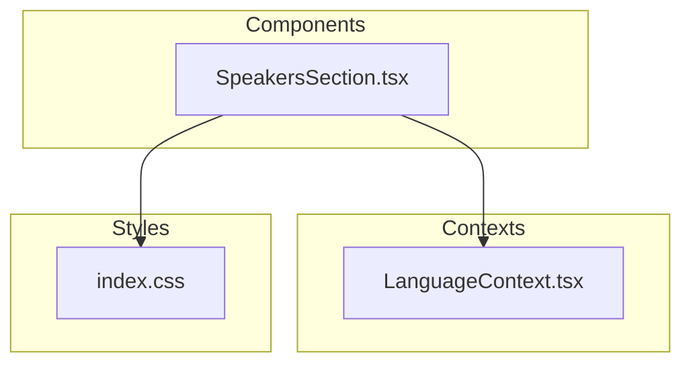
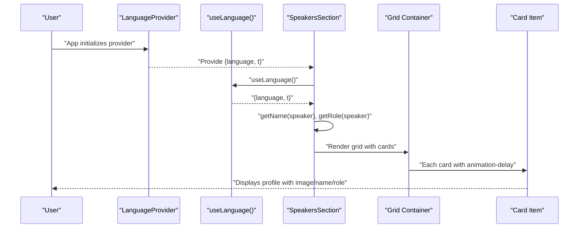
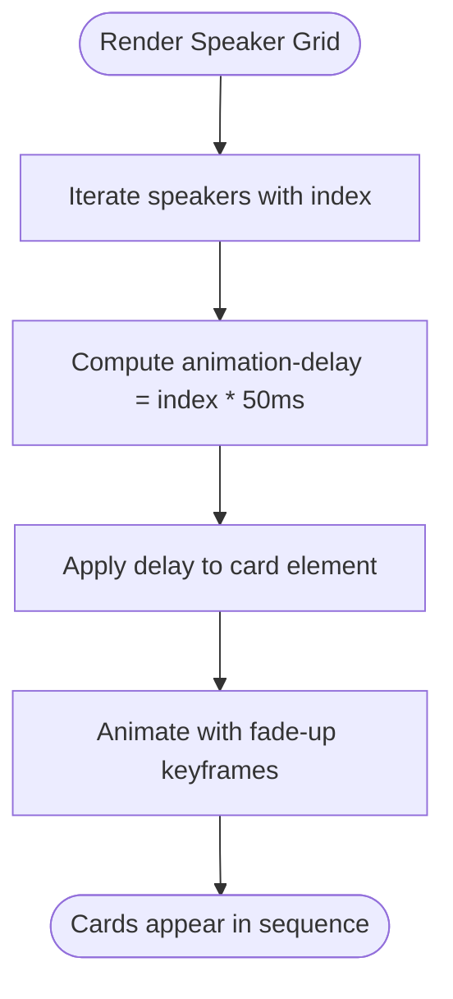
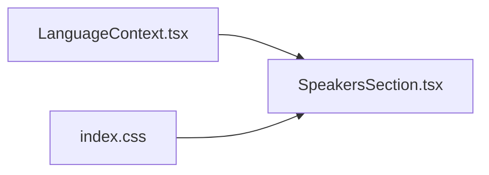

# Speakers Section

<cite>
**Referenced Files in This Document**
- [SpeakersSection.tsx](file://src/components/SpeakersSection.tsx)
- [LanguageContext.tsx](file://src/contexts/LanguageContext.tsx)
- [index.css](file://src/index.css)
- [eventData.ts](file://src/data/eventData.ts)
</cite>

## Table of Contents
1. [Introduction](#introduction)
2. [Project Structure](#project-structure)
3. [Core Components](#core-components)
4. [Architecture Overview](#architecture-overview)
5. [Detailed Component Analysis](#detailed-component-analysis)
6. [Dependency Analysis](#dependency-analysis)
7. [Performance Considerations](#performance-considerations)
8. [Troubleshooting Guide](#troubleshooting-guide)
9. [Conclusion](#conclusion)
10. [Appendices](#appendices)

## Introduction
This document explains the SpeakersSection component that displays event participants as a responsive grid of profile cards. It covers the typed Speaker interface, multilingual name and role handling, conditional image rendering, responsive grid layout, and the animated entrance sequence. It also describes the card design, hover effects, ring decorations, and guidance for adding new speakers, managing assets, and customizing layout and animations.

## Project Structure
SpeakersSection is located under the components directory and integrates with the global language context for translations and RTL support. The component imports localized strings for the section title and subtitle and uses Tailwind classes for layout and animations.

**Diagram sources**
- [SpeakersSection.tsx](file://src/components/SpeakersSection.tsx#L1-L238)
- [LanguageContext.tsx](file://src/contexts/LanguageContext.tsx#L1-L292)
- [index.css](file://src/index.css#L160-L249)

**Section sources**
- [SpeakersSection.tsx](file://src/components/SpeakersSection.tsx#L1-L238)
- [LanguageContext.tsx](file://src/contexts/LanguageContext.tsx#L1-L292)
- [index.css](file://src/index.css#L160-L249)

## Core Components
- Typed Speaker interface: Defines fields for identifiers, multilingual names, multilingual roles, and an optional image URL.
- Multilingual selection helpers: getName and getRole pick the appropriate field based on the current language context.
- Responsive grid: Uses Tailwind’s grid utilities to adapt from 1 to 4 columns across breakpoints.
- Animation sequence: Cards fade in with a staggered delay to create a pleasing entrance.
- Card design: Circular image container with ring decoration, hover effects, and typography hierarchy.

**Section sources**
- [SpeakersSection.tsx](file://src/components/SpeakersSection.tsx#L18-L27)
- [SpeakersSection.tsx](file://src/components/SpeakersSection.tsx#L171-L185)
- [SpeakersSection.tsx](file://src/components/SpeakersSection.tsx#L199-L231)
- [index.css](file://src/index.css#L190-L241)

## Architecture Overview
The component reads the current language and translation function from the LanguageContext, selects the appropriate name and role fields, and renders a grid of cards. Each card applies a fade-up animation with a staggered delay. The animation keyframes and utilities are defined in the global stylesheet.

**Diagram sources**
- [LanguageContext.tsx](file://src/contexts/LanguageContext.tsx#L269-L292)
- [SpeakersSection.tsx](file://src/components/SpeakersSection.tsx#L171-L185)
- [SpeakersSection.tsx](file://src/components/SpeakersSection.tsx#L199-L231)
- [index.css](file://src/index.css#L190-L241)

## Detailed Component Analysis

### Typed Speaker Interface
The Speaker interface defines:
- Identifier and multilingual name fields
- Multilingual role fields
- Optional image URL

This structure enables consistent data handling and ensures type safety when selecting localized content.

**Section sources**
- [SpeakersSection.tsx](file://src/components/SpeakersSection.tsx#L18-L27)

### Multilingual Name and Role Handling
The component uses two helper functions:
- getName: Selects name based on the current language (Arabic by default, with English and Turkish options).
- getRole: Selects role based on the current language.

These functions rely on the language context provided by the LanguageContext.

**Section sources**
- [SpeakersSection.tsx](file://src/components/SpeakersSection.tsx#L171-L185)
- [LanguageContext.tsx](file://src/contexts/LanguageContext.tsx#L269-L292)

### Conditional Image Rendering
Each card conditionally renders either:
- A speaker image if available
- A fallback avatar with a placeholder icon if no image is provided

Alt text is generated from the selected name to ensure accessibility.

**Section sources**
- [SpeakersSection.tsx](file://src/components/SpeakersSection.tsx#L208-L219)

### Responsive Grid Layout (1–2–3–4 Columns)
The grid adapts across breakpoints:
- 1 column on small screens
- 2 columns on medium screens
- 3 columns on large screens
- 4 columns on extra-large screens

Spacing is controlled via a consistent gap between cards.

**Section sources**
- [SpeakersSection.tsx](file://src/components/SpeakersSection.tsx#L199-L200)

### Animation Sequence and Staggered Delays
Cards apply a fade-up animation with a staggered delay. The delay increases incrementally per card index, creating a cascading effect.

**Diagram sources**
- [SpeakersSection.tsx](file://src/components/SpeakersSection.tsx#L202-L206)
- [index.css](file://src/index.css#L190-L241)

### Card Design, Hover Effects, and Ring Decorations
- Card container: Rounded corners, border, subtle background, and hover enhancements (border and shadow).
- Circular image container: Fixed size with rounded-full and overflow-hidden to crop images into a circle.
- Ring decoration: A primary-colored ring around the image container with hover expansion.
- Typography: Bold name and muted role text with relaxed line height for readability.

**Section sources**
- [SpeakersSection.tsx](file://src/components/SpeakersSection.tsx#L202-L227)
- [index.css](file://src/index.css#L190-L241)

### Accessibility and Internationalization Notes
- Alt text for images is derived from the selected name, ensuring meaningful alternatives.
- The component uses the translation function to localize the section title and subtitle.
- The language context determines directionality and language selection for names and roles.

**Section sources**
- [SpeakersSection.tsx](file://src/components/SpeakersSection.tsx#L190-L197)
- [SpeakersSection.tsx](file://src/components/SpeakersSection.tsx#L211-L214)
- [LanguageContext.tsx](file://src/contexts/LanguageContext.tsx#L269-L292)

## Dependency Analysis
SpeakersSection depends on:
- LanguageContext for language and translation
- Global animation keyframes and utilities for the fade-up effect

**Diagram sources**
- [SpeakersSection.tsx](file://src/components/SpeakersSection.tsx#L1-L238)
- [LanguageContext.tsx](file://src/contexts/LanguageContext.tsx#L1-L292)
- [index.css](file://src/index.css#L160-L249)

**Section sources**
- [SpeakersSection.tsx](file://src/components/SpeakersSection.tsx#L1-L238)
- [LanguageContext.tsx](file://src/contexts/LanguageContext.tsx#L1-L292)
- [index.css](file://src/index.css#L160-L249)

## Performance Considerations
- Image optimization: Ensure speaker images are appropriately sized and compressed to minimize load times.
- Lazy loading: Consider deferring offscreen images to improve initial render performance.
- Animation performance: Keep animation durations and easing lightweight; avoid heavy transforms on many elements simultaneously.
- Asset bundling: Place images under the assets directory and import them as static assets to leverage build-time optimization.

[No sources needed since this section provides general guidance]

## Troubleshooting Guide
Common issues and resolutions:
- Missing speaker images
  - Symptom: Placeholder avatar appears instead of a photo.
  - Resolution: Add an image URL for the speaker or ensure the asset path is correct and the image is present.
  - Reference: Conditional rendering for image vs fallback.
  - Section sources
    - [SpeakersSection.tsx](file://src/components/SpeakersSection.tsx#L208-L219)

- Text overflow in role descriptions
  - Symptom: Long role text wraps awkwardly or clips unexpectedly.
  - Resolution: Adjust line height or consider truncating long roles. Ensure adequate spacing around the text.
  - Section sources
    - [SpeakersSection.tsx](file://src/components/SpeakersSection.tsx#L224-L226)

- Incorrect language selection
  - Symptom: Names or roles display in the wrong language.
  - Resolution: Verify the current language in the LanguageContext and ensure translation keys exist for the selected language.
  - Section sources
    - [SpeakersSection.tsx](file://src/components/SpeakersSection.tsx#L171-L185)
    - [LanguageContext.tsx](file://src/contexts/LanguageContext.tsx#L269-L292)

- Animation not triggering
  - Symptom: Cards appear instantly without fade-up effect.
  - Resolution: Confirm the animation keyframes and utility classes are included and that the delay is applied to each card.
  - Section sources
    - [SpeakersSection.tsx](file://src/components/SpeakersSection.tsx#L202-L206)
    - [index.css](file://src/index.css#L190-L241)

## Conclusion
SpeakersSection delivers a clean, responsive, and accessible showcase of event participants. Its typed data model, robust multilingual handling, and polished animations contribute to a professional presentation. Following the guidance here will help maintain and extend the component effectively.

[No sources needed since this section summarizes without analyzing specific files]

## Appendices

### Adding a New Speaker
Steps:
- Extend the speakers array with a new speaker object that includes identifiers, multilingual names, multilingual roles, and an optional image URL.
- Ensure translation keys for the section title and subtitle exist in the LanguageContext.
- Verify the image asset is placed under the assets directory and imported at the top of the component.

References:
- Speaker interface and array
- Translation keys for speakers.title and speakers.subtitle
- Image imports and conditional rendering

**Section sources**
- [SpeakersSection.tsx](file://src/components/SpeakersSection.tsx#L18-L27)
- [SpeakersSection.tsx](file://src/components/SpeakersSection.tsx#L29-L169)
- [SpeakersSection.tsx](file://src/components/SpeakersSection.tsx#L1-L17)
- [LanguageContext.tsx](file://src/contexts/LanguageContext.tsx#L81-L84)
- [LanguageContext.tsx](file://src/contexts/LanguageContext.tsx#L165-L168)
- [LanguageContext.tsx](file://src/contexts/LanguageContext.tsx#L249-L252)

### Managing Image Assets
- Place speaker photos under the assets directory and import them at the top of the component.
- Keep filenames consistent and descriptive.
- Ensure images are optimized for web delivery.

Reference:
- Image imports and conditional rendering

**Section sources**
- [SpeakersSection.tsx](file://src/components/SpeakersSection.tsx#L1-L17)
- [SpeakersSection.tsx](file://src/components/SpeakersSection.tsx#L208-L219)

### Customizing Layout and Animations
- Grid columns: Adjust Tailwind grid classes to change breakpoint thresholds.
- Spacing: Modify the gap utility to adjust spacing between cards.
- Animations: Update the animation delay calculation or replace the fade-up animation with another utility if desired.
- Hover effects: Adjust ring colors, shadows, and transitions to match brand guidelines.

References:
- Grid and animation classes
- Animation keyframes and utilities

**Section sources**
- [SpeakersSection.tsx](file://src/components/SpeakersSection.tsx#L199-L206)
- [index.css](file://src/index.css#L190-L241)