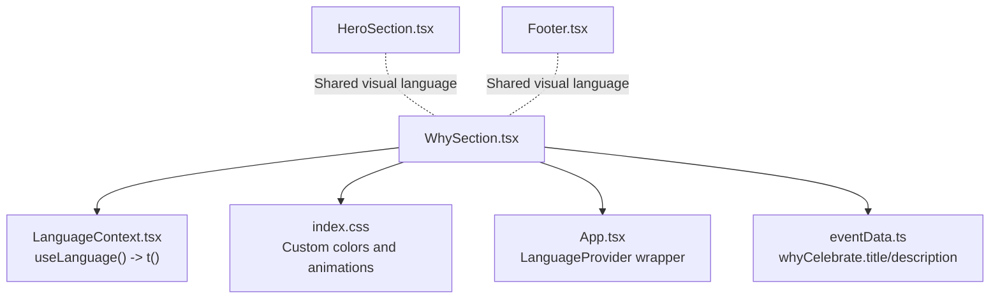
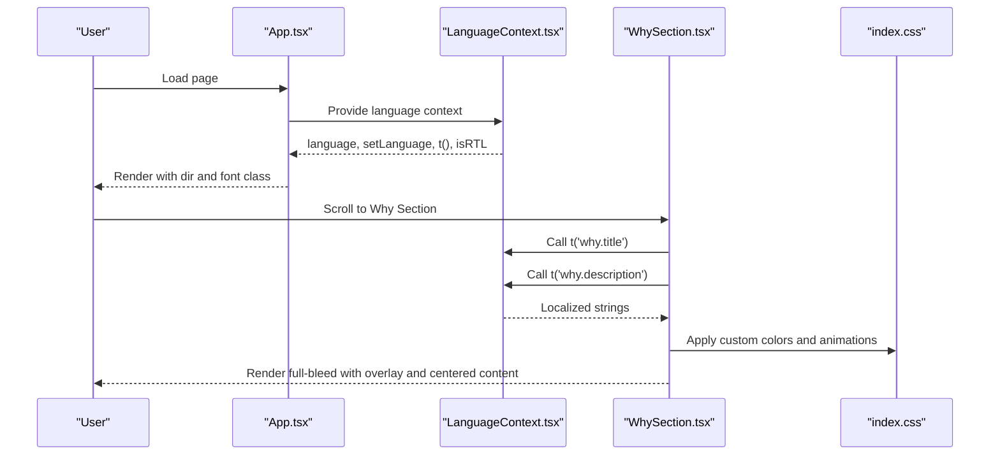
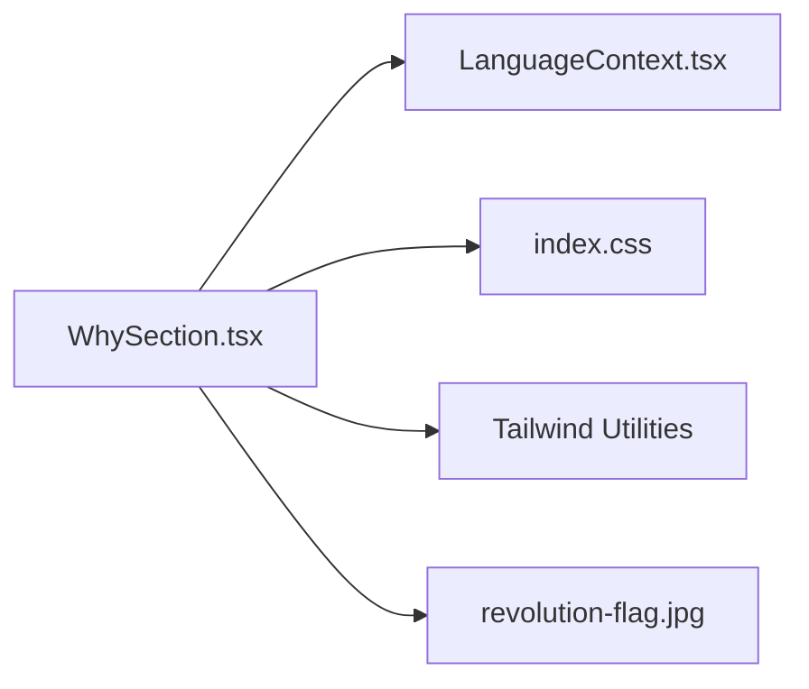

# Why Section

> **Referenced Files in This Document**
> - [WhySection.tsx](src/components/WhySection.tsx)
> - [LanguageContext.tsx](src/contexts/LanguageContext.tsx)
> - [index.css](src/index.css)
> - [App.tsx](src/App.tsx)
> - [HeroSection.tsx](src/components/HeroSection.tsx)
> - [Footer.tsx](src/components/Footer.tsx)
> - [eventData.ts](src/data/eventData.ts)

## Table of Contents
1. [Introduction](#introduction)
2. [Project Structure](#project-structure)
3. [Core Components](#core-components)
4. [Architecture Overview](#architecture-overview)
5. [Detailed Component Analysis](#detailed-component-analysis)
6. [Dependency Analysis](#dependency-analysis)
7. [Performance Considerations](#performance-considerations)
8. [Troubleshooting Guide](#troubleshooting-guide)
9. [Conclusion](#conclusion)
10. [Appendices](#appendices)

## Introduction
The Why Section communicates the event’s purpose and motivation with a full-bleed background image of the revolution flag, a dark overlay for improved text readability, and a centered content layout. It uses the translation function t() to present multilingual content for the title and description. Visual elements include a peace dove emoji with a subtle glow animation and a divider composed of the Syrian flag colors to reinforce national identity. The section is responsive across screen sizes and designed with accessibility considerations for color contrast. Guidance is included for modifying messages and visuals for different event themes.

## Project Structure
The Why Section is implemented as a standalone component that integrates with the internationalization system and global styles. It relies on:
- Translation keys under the why namespace
- Global CSS variables and animations
- A language provider that supplies the t() function and RTL direction
- Tailwind utility classes for responsive behavior and layout

**Diagram sources**
- [WhySection.tsx](src/components/WhySection.tsx#L1-L41)
- [LanguageContext.tsx](src/contexts/LanguageContext.tsx#L1-L292)
- [index.css](src/index.css#L55-L104)
- [App.tsx](src/App.tsx#L1-L43)
- [eventData.ts](src/data/eventData.ts#L23-L26)
- [HeroSection.tsx](src/components/HeroSection.tsx#L1-L64)
- [Footer.tsx](src/components/Footer.tsx#L1-L103)

**Section sources**
- [WhySection.tsx](src/components/WhySection.tsx#L1-L41)
- [LanguageContext.tsx](src/contexts/LanguageContext.tsx#L1-L292)
- [index.css](src/index.css#L55-L104)
- [App.tsx](src/App.tsx#L1-L43)
- [eventData.ts](src/data/eventData.ts#L23-L26)

## Core Components
- WhySection: Renders the full-bleed background image, dark overlay, centered content, and the Syrian flag colors divider. It consumes t() for multilingual title and description.
- LanguageContext: Provides the t() translation function and manages language state and RTL direction.
- Global Styles: Define custom colors (including Syrian flag colors) and animations used by the component.
- App Wrapper: Wraps the app with the LanguageProvider and applies font and direction based on the current language.

Key responsibilities:
- Full-bleed background image with center/cover/no-repeat positioning
- Dark overlay for readability
- Centered content container with max width and padding
- Responsive typography scaling
- Peace dove emoji with a pulse-glow animation
- Syrian flag colors divider
- Multilingual rendering via t()

**Section sources**
- [WhySection.tsx](src/components/WhySection.tsx#L1-L41)
- [LanguageContext.tsx](src/contexts/LanguageContext.tsx#L1-L292)
- [index.css](src/index.css#L55-L104)
- [index.css](src/index.css#L161-L248)
- [App.tsx](src/App.tsx#L1-L43)

## Architecture Overview
The Why Section participates in a layered architecture:
- Presentation Layer: WhySection renders UI and applies Tailwind classes.
- Internationalization Layer: LanguageContext exposes t() and isRTL.
- Styling Layer: index.css defines custom colors and animations.
- Application Layer: App.tsx wraps the app with LanguageProvider and sets document direction and font family.

**Diagram sources**
- [App.tsx](src/App.tsx#L1-L43)
- [LanguageContext.tsx](src/contexts/LanguageContext.tsx#L1-L292)
- [WhySection.tsx](src/components/WhySection.tsx#L1-L41)
- [index.css](src/index.css#L55-L104)
- [index.css](src/index.css#L161-L248)

## Detailed Component Analysis

### WhySection Implementation
- Full-bleed background image: Uses absolute positioning with background cover, center, and no-repeat to stretch the revolution flag across the viewport.
- Dark overlay: A semi-transparent black overlay improves text legibility against the background.
- Centered content: A container with max width and auto margins centers the content; typography scales responsively using Tailwind modifiers.
- Peace dove emoji: A large emoji with a pulse-glow animation draws attention and adds a symbolic touch.
- Title and description: Rendered using t('why.title') and t('why.description'), enabling multilingual display.
- Syrian flag colors divider: A horizontal strip composed of three color blocks representing green, white, and black.

Responsive behavior:
- Vertical height: min-h-[60vh] ensures a minimum height on small screens; py-16 on small screens and py-24 on medium screens increases vertical spacing.
- Typography: Text scales from text-3xl to text-5xl for headings and from text-xl to text-2xl for paragraphs.
- Container and divider: Max width and auto margins keep content readable; divider constrained to a max width and horizontally centered.

Accessibility considerations:
- Color contrast: The dark overlay (black/70) combined with white text enhances contrast for readability.
- Shadow utilities: drop-shadow utilities improve text legibility against the background.
- Focusable elements: There are no interactive elements in this section; focus order remains unaffected.

Common issues and mitigations:
- Background image loading: Ensure the asset is bundled and accessible at runtime. If the image fails to load, fallback styles should still render readable text.
- Text legibility: Verify that the overlay opacity and text color combination meet contrast guidelines; adjust overlay intensity if needed.
- Animation performance: The pulse-glow animation uses CSS transforms and shadows; test on low-power devices and disable if necessary.

Modifying for different event themes:
- Change the background image to reflect the theme while keeping the overlay and layout consistent.
- Update translation keys under the why namespace to reflect the new message.
- Adjust the divider colors to align with the event’s brand colors.
- Modify the emoji to a theme-appropriate symbol if desired.

**Section sources**
- [WhySection.tsx](src/components/WhySection.tsx#L1-L41)
- [LanguageContext.tsx](src/contexts/LanguageContext.tsx#L1-L292)
- [index.css](src/index.css#L55-L104)
- [index.css](src/index.css#L161-L248)
- [eventData.ts](src/data/eventData.ts#L23-L26)

### Internationalization Integration
- Translation keys: The component uses t('why.title') and t('why.description').
- Language provider: App.tsx wraps the app with LanguageProvider, which supplies t() and isRTL.
- Font and direction: The document direction is set to rtl for Arabic and ltr for English/Turkish, and fonts switch accordingly.

Practical usage:
- Add or modify translation keys in LanguageContext.tsx under the why namespace.
- Ensure all supported languages include entries for why.title and why.description.
- Test switching languages to verify content updates seamlessly.

**Section sources**
- [LanguageContext.tsx](src/contexts/LanguageContext.tsx#L1-L292)
- [App.tsx](src/App.tsx#L1-L43)

### Visual Elements and Styling
- Custom colors: The CSS defines --syrian-green, --syrian-red, and --syrian-black used by the divider and throughout the site.
- Animations: The pulse-glow animation is defined in index.css and applied to the peace dove emoji.
- Typography and shadows: Tailwind utilities provide responsive sizing and drop shadows for improved readability.

Consistency with other sections:
- HeroSection and Footer share visual motifs (Syrian flag imagery and colors), reinforcing a cohesive design language.

**Section sources**
- [index.css](src/index.css#L55-L104)
- [index.css](src/index.css#L161-L248)
- [HeroSection.tsx](src/components/HeroSection.tsx#L1-L64)
- [Footer.tsx](src/components/Footer.tsx#L1-L103)

### Responsive Behavior Across Screen Sizes
- Mobile-first approach: Base padding and spacing use small-screen defaults; medium and larger screens receive increased spacing and font sizes.
- Flexible containers: The content container and divider are constrained to a max width and centered, preventing text from becoming too wide on large screens.
- Overlay and background: The overlay and background image remain full-bleed across breakpoints, ensuring consistent visual impact.

Testing tips:
- Verify content readability on 320px, 768px, and 1200px widths.
- Confirm that the divider remains centered and proportionally sized.

**Section sources**
- [WhySection.tsx](src/components/WhySection.tsx#L1-L41)
- [index.css](src/index.css#L55-L104)

### Accessibility Considerations
- Color contrast: The dark overlay with white text meets contrast guidelines for readability.
- Shadow utilities: Drop shadows enhance text visibility against varied backgrounds.
- Directionality: The document direction switches based on the selected language, ensuring proper layout for Arabic.
- Focus order: No interactive elements in this section; focus order remains unchanged.

Recommendations:
- Monitor contrast ratios with varying overlay opacities.
- Ensure animations can be disabled by users who prefer reduced motion.

**Section sources**
- [index.css](src/index.css#L55-L104)
- [index.css](src/index.css#L161-L248)
- [App.tsx](src/App.tsx#L1-L43)

## Dependency Analysis
The Why Section depends on:
- LanguageContext for t() and isRTL
- Global CSS for custom colors and animations
- Tailwind utilities for responsive layout and typography
- Asset imports for the background image

**Diagram sources**
- [WhySection.tsx](src/components/WhySection.tsx#L1-L41)
- [LanguageContext.tsx](src/contexts/LanguageContext.tsx#L1-L292)
- [index.css](src/index.css#L55-L104)

**Section sources**
- [WhySection.tsx](src/components/WhySection.tsx#L1-L41)
- [LanguageContext.tsx](src/contexts/LanguageContext.tsx#L1-L292)
- [index.css](src/index.css#L55-L104)

## Performance Considerations
- Background image optimization: Ensure the revolution flag image is appropriately sized and compressed to minimize load time.
- CSS animations: The pulse-glow animation uses lightweight transforms and shadows; keep it enabled for visual appeal.
- Layout stability: Avoid layout shifts by setting explicit dimensions for the background container and using responsive utilities consistently.
- Font loading: The font switching occurs at the application level; ensure fonts are preloaded or cached for optimal performance.

[No sources needed since this section provides general guidance]

## Troubleshooting Guide
- Background image not loading:
  - Verify the asset path and bundling. If the image fails, the overlay and text should still be visible.
  - Consider adding a fallback background color or placeholder.
- Text legibility issues:
  - Adjust the overlay opacity or text color if contrast is insufficient.
  - Test with different screen brightness and lighting conditions.
- Animation performance:
  - Disable or reduce animation intensity on low-power devices if needed.
- Translation not updating:
  - Confirm the LanguageProvider is wrapping the app and that keys exist for all languages under the why namespace.
- Responsive layout problems:
  - Check Tailwind breakpoints and ensure max-width constraints are appropriate for the content.

**Section sources**
- [WhySection.tsx](src/components/WhySection.tsx#L1-L41)
- [LanguageContext.tsx](src/contexts/LanguageContext.tsx#L1-L292)
- [index.css](src/index.css#L161-L248)

## Conclusion
The Why Section effectively communicates the event’s purpose through a visually striking full-bleed background, a readable dark overlay, and centered content. Its reliance on the t() function ensures multilingual accessibility, while the peace dove emoji and Syrian flag colors divider reinforce national identity. With responsive design and thoughtful accessibility considerations, the component is robust and adaptable for various event themes.

[No sources needed since this section summarizes without analyzing specific files]

## Appendices

### A. Translation Keys for Why Section
- why.title
- why.description

These keys are consumed by the Why Section and provided by the LanguageContext.

**Section sources**
- [LanguageContext.tsx](src/contexts/LanguageContext.tsx#L1-L292)
- [WhySection.tsx](src/components/WhySection.tsx#L1-L41)

### B. Custom Colors and Animations Reference
- Custom colors: --syrian-green, --syrian-red, --syrian-black
- Animations: pulse-glow

These are defined in the global stylesheet and used by the component.

**Section sources**
- [index.css](src/index.css#L55-L104)
- [index.css](src/index.css#L161-L248)

### C. Example Message Modification Workflow
- Update translation keys in LanguageContext.tsx for why.title and why.description.
- Optionally adjust the divider colors to align with the new theme.
- Keep the layout and overlay consistent for brand continuity.

**Section sources**
- [LanguageContext.tsx](src/contexts/LanguageContext.tsx#L1-L292)
- [WhySection.tsx](src/components/WhySection.tsx#L1-L41)
- [index.css](src/index.css#L55-L104)