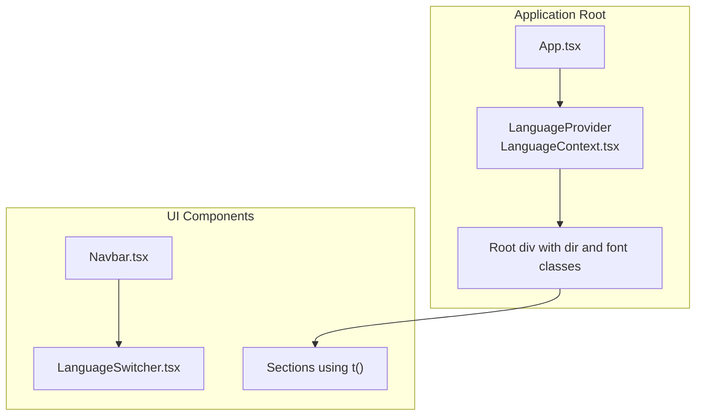
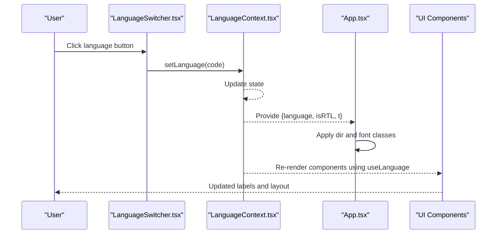
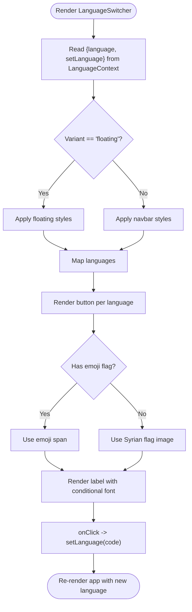
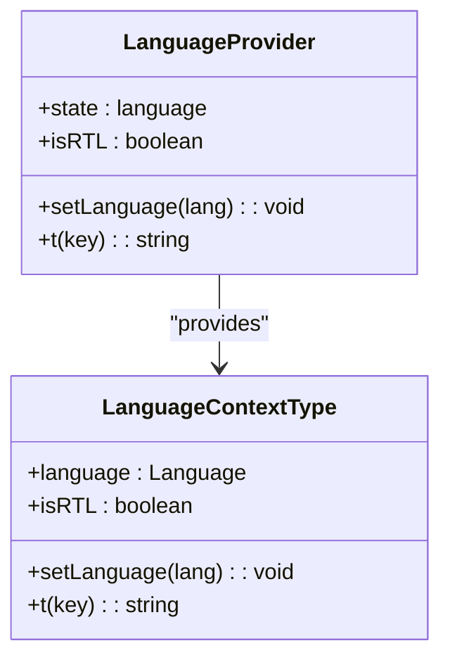
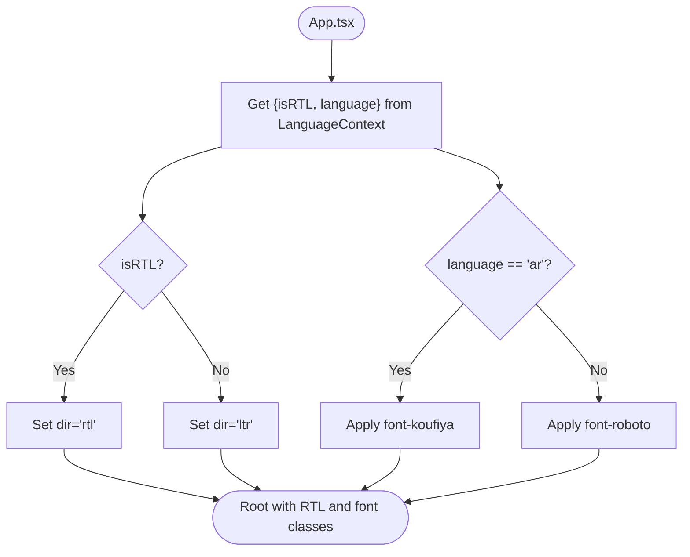
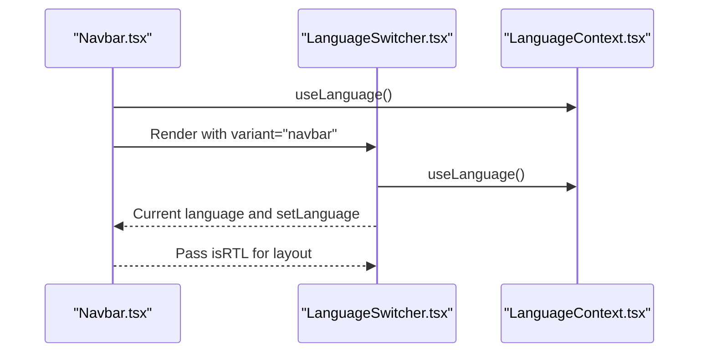
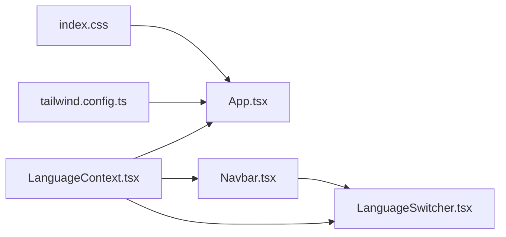

# Language Switcher

<cite>
**Referenced Files in This Document**
- [LanguageSwitcher.tsx](file://src/components/LanguageSwitcher.tsx)
- [LanguageContext.tsx](file://src/contexts/LanguageContext.tsx)
- [App.tsx](file://src/App.tsx)
- [Navbar.tsx](file://src/components/Navbar.tsx)
- [tailwind.config.ts](file://tailwind.config.ts)
- [index.css](file://src/index.css)
- [public/manifest.json](file://public/manifest.json)
</cite>

## Table of Contents
1. [Introduction](#introduction)
2. [Project Structure](#project-structure)
3. [Core Components](#core-components)
4. [Architecture Overview](#architecture-overview)
5. [Detailed Component Analysis](#detailed-component-analysis)
6. [Dependency Analysis](#dependency-analysis)
7. [Performance Considerations](#performance-considerations)
8. [Troubleshooting Guide](#troubleshooting-guide)
9. [Conclusion](#conclusion)
10. [Appendices](#appendices)

## Introduction
This document explains the LanguageSwitcher component that powers multilingual functionality across the application. It details how the component consumes the LanguageContext to read the current language and update it via setLanguage, triggering re-renders across all translated components. It also covers the dual presentation modes (floating and navbar), flag rendering (emoji flags for English and Turkish, and a custom Syrian flag image for Arabic), and how selecting Arabic automatically applies RTL layout. Guidance is included for integrating the switcher in different UI regions, styling for accessibility and touch targets, and addressing common issues such as image loading failures, context update delays, and layout shifts during language change. Optimization tips for memoizing language options and lazy-loading flag assets are provided.

## Project Structure
The LanguageSwitcher lives under src/components and integrates with the LanguageContext provider in the application root. The Navbar embeds the switcher in both desktop and mobile views. Global RTL and font selection logic are applied at the root level.

**Diagram sources**
- [App.tsx](file://src/App.tsx#L12-L31)
- [LanguageContext.tsx](file://src/contexts/LanguageContext.tsx#L269-L292)
- [Navbar.tsx](file://src/components/Navbar.tsx#L1-L122)
- [LanguageSwitcher.tsx](file://src/components/LanguageSwitcher.tsx#L1-L43)

**Section sources**
- [App.tsx](file://src/App.tsx#L12-L31)
- [LanguageContext.tsx](file://src/contexts/LanguageContext.tsx#L269-L292)
- [Navbar.tsx](file://src/components/Navbar.tsx#L1-L122)
- [LanguageSwitcher.tsx](file://src/components/LanguageSwitcher.tsx#L1-L43)

## Core Components
- LanguageSwitcher: Renders language options with flags and labels, updates the current language on click, and adapts styling based on variant.
- LanguageContext: Provides language state, setLanguage, translation function t, and isRTL flag to consumers.
- App: Applies RTL direction and font family based on the current language.
- Navbar: Integrates the LanguageSwitcher in both desktop and mobile layouts.

**Section sources**
- [LanguageSwitcher.tsx](file://src/components/LanguageSwitcher.tsx#L1-L43)
- [LanguageContext.tsx](file://src/contexts/LanguageContext.tsx#L1-L292)
- [App.tsx](file://src/App.tsx#L12-L31)
- [Navbar.tsx](file://src/components/Navbar.tsx#L1-L122)

## Architecture Overview
The LanguageSwitcher reads the current language and setLanguage from the LanguageContext. Clicking a language button invokes setLanguage, which updates the state in LanguageProvider. This causes all components consuming useLanguage to re-render, reflecting the new language and RTL settings. The root App component sets dir and font classes based on isRTL and language, ensuring consistent layout and typography.

**Diagram sources**
- [LanguageSwitcher.tsx](file://src/components/LanguageSwitcher.tsx#L14-L39)
- [LanguageContext.tsx](file://src/contexts/LanguageContext.tsx#L269-L292)
- [App.tsx](file://src/App.tsx#L12-L31)

## Detailed Component Analysis

### LanguageSwitcher Component
- Consumes useLanguage to access language and setLanguage.
- Supports two variants:
  - floating: Fixed positioning with a translucent, blurred background and shadow.
  - navbar: Transparent background suitable for embedding in navigation bars.
- Renders language options with:
  - Emoji flags for English and Turkish.
  - A custom Syrian flag image for Arabic.
- Conditional label font:
  - Non-Arabic languages use Roboto; Arabic uses the configured font stack.
- Active state styling highlights the current language.
- Accessibility:
  - Buttons are interactive; consider adding explicit aria-labels if needed.
  - Touch targets are padded via internal spacing classes.

**Diagram sources**
- [LanguageSwitcher.tsx](file://src/components/LanguageSwitcher.tsx#L14-L39)

**Section sources**
- [LanguageSwitcher.tsx](file://src/components/LanguageSwitcher.tsx#L1-L43)

### LanguageContext and Translation System
- LanguageContext defines the shape of the context: language, setLanguage, t, isRTL.
- Initial language is Arabic.
- t(key) returns localized text for the current language, falling back to the key if missing.
- isRTL is true when language is Arabic.
- Provider exposes the context to the app tree.

**Diagram sources**
- [LanguageContext.tsx](file://src/contexts/LanguageContext.tsx#L1-L292)

**Section sources**
- [LanguageContext.tsx](file://src/contexts/LanguageContext.tsx#L1-L292)

### RTL and Typography Integration
- App applies dir="rtl" or dir="ltr" based on isRTL.
- App selects font-koufiya for Arabic and font-roboto for non-Arabic languages.
- Tailwind config defines font families for koufiya and roboto.
- index.css registers the Bahij Koufiya font faces and sets base font.

**Diagram sources**
- [App.tsx](file://src/App.tsx#L12-L31)
- [tailwind.config.ts](file://tailwind.config.ts#L15-L20)
- [index.css](file://src/index.css#L1-L22)

**Section sources**
- [App.tsx](file://src/App.tsx#L12-L31)
- [tailwind.config.ts](file://tailwind.config.ts#L15-L20)
- [index.css](file://src/index.css#L1-L22)

### Navbar Integration
- Navbar embeds the LanguageSwitcher in desktop and mobile views.
- Desktop: switcher is placed alongside navigation links.
- Mobile: switcher appears inside the collapsible menu.
- Uses isRTL to align content appropriately.

**Diagram sources**
- [Navbar.tsx](file://src/components/Navbar.tsx#L1-L122)
- [LanguageSwitcher.tsx](file://src/components/LanguageSwitcher.tsx#L14-L39)
- [LanguageContext.tsx](file://src/contexts/LanguageContext.tsx#L269-L292)

**Section sources**
- [Navbar.tsx](file://src/components/Navbar.tsx#L1-L122)
- [LanguageSwitcher.tsx](file://src/components/LanguageSwitcher.tsx#L14-L39)

## Dependency Analysis
- LanguageSwitcher depends on LanguageContext for language state and setLanguage.
- App depends on LanguageContext for isRTL and language to set dir and font classes.
- Navbar depends on LanguageContext for t and isRTL, and embeds LanguageSwitcher.
- Tailwind config and index.css define fonts and base styles used by the app.

**Diagram sources**
- [LanguageSwitcher.tsx](file://src/components/LanguageSwitcher.tsx#L1-L43)
- [LanguageContext.tsx](file://src/contexts/LanguageContext.tsx#L269-L292)
- [App.tsx](file://src/App.tsx#L12-L31)
- [Navbar.tsx](file://src/components/Navbar.tsx#L1-L122)
- [tailwind.config.ts](file://tailwind.config.ts#L15-L20)
- [index.css](file://src/index.css#L1-L22)

**Section sources**
- [LanguageSwitcher.tsx](file://src/components/LanguageSwitcher.tsx#L1-L43)
- [LanguageContext.tsx](file://src/contexts/LanguageContext.tsx#L269-L292)
- [App.tsx](file://src/App.tsx#L12-L31)
- [Navbar.tsx](file://src/components/Navbar.tsx#L1-L122)
- [tailwind.config.ts](file://tailwind.config.ts#L15-L20)
- [index.css](file://src/index.css#L1-L22)

## Performance Considerations
- Memoize language options array to avoid recreating the list on each render. Wrap the languages array in useMemo if it becomes dynamic.
- Lazy-load flag images if the number of languages grows to reduce initial payload.
- Keep the LanguageSwitcher lightweight; avoid heavy computations in render.
- Ensure the provider is high up in the tree to minimize re-renders of unrelated components.

[No sources needed since this section provides general guidance]

## Troubleshooting Guide
- Image loading failures for the Syrian flag:
  - Verify the asset path and ensure the image is bundled. Confirm the alt text is descriptive.
  - Consider adding an onError handler to display a fallback icon or placeholder.
- Context update delays:
  - The LanguageContext uses React state; updates are synchronous within the same render. If you observe perceived delays, ensure no heavy work is blocking the render thread.
- Layout shifts during language change:
  - Arabic text may wrap differently than English/Turkish. Use consistent spacing and avoid percentage-based widths for critical elements near the switcher.
  - Consider setting a min-height on containers that may expand/shrink on language change.
- RTL layout issues:
  - Confirm dir is applied at the root and that CSS does not override directionality.
  - Ensure icons and arrows are mirrored appropriately in RTL mode.
- Accessibility:
  - Add aria-labels to buttons if labels are not self-explanatory.
  - Ensure sufficient touch target size (minimum 44px) and spacing between buttons.
- PWA metadata:
  - The manifest sets dir to rtl and lang to ar. If you add new languages, review the manifest’s lang and dir to reflect the default language.

**Section sources**
- [LanguageSwitcher.tsx](file://src/components/LanguageSwitcher.tsx#L14-L39)
- [LanguageContext.tsx](file://src/contexts/LanguageContext.tsx#L269-L292)
- [App.tsx](file://src/App.tsx#L12-L31)
- [public/manifest.json](file://public/manifest.json#L1-L19)

## Conclusion
The LanguageSwitcher is a compact, efficient component that integrates tightly with LanguageContext to provide seamless multilingual support. Its dual variants accommodate different UI layouts, while its flag rendering and conditional typography ensure cultural and linguistic fidelity. Combined with the root-level RTL and font logic, it delivers a cohesive internationalization experience across the application.

[No sources needed since this section summarizes without analyzing specific files]

## Appendices

### Integration Examples
- Floating variant:
  - Place the switcher at the top-left corner of the viewport for quick access.
  - Use the floating variant when the header is minimal or when the switcher should remain visible during scroll.
- Navbar variant:
  - Embed the switcher within the Navbar for desktop and mobile views.
  - The Navbar already integrates the switcher in both contexts.

**Section sources**
- [LanguageSwitcher.tsx](file://src/components/LanguageSwitcher.tsx#L14-L39)
- [Navbar.tsx](file://src/components/Navbar.tsx#L78-L116)

### Styling and Accessibility Checklist
- Ensure each language button has adequate touch target size and spacing.
- Provide aria-labels for buttons if labels are not descriptive enough.
- Maintain consistent spacing and alignment across languages.
- Test RTL layout thoroughly, especially for icons and adjacent components.

[No sources needed since this section provides general guidance]