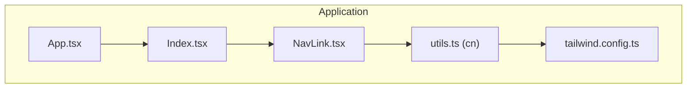
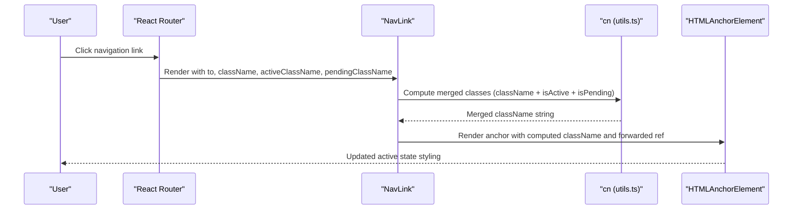
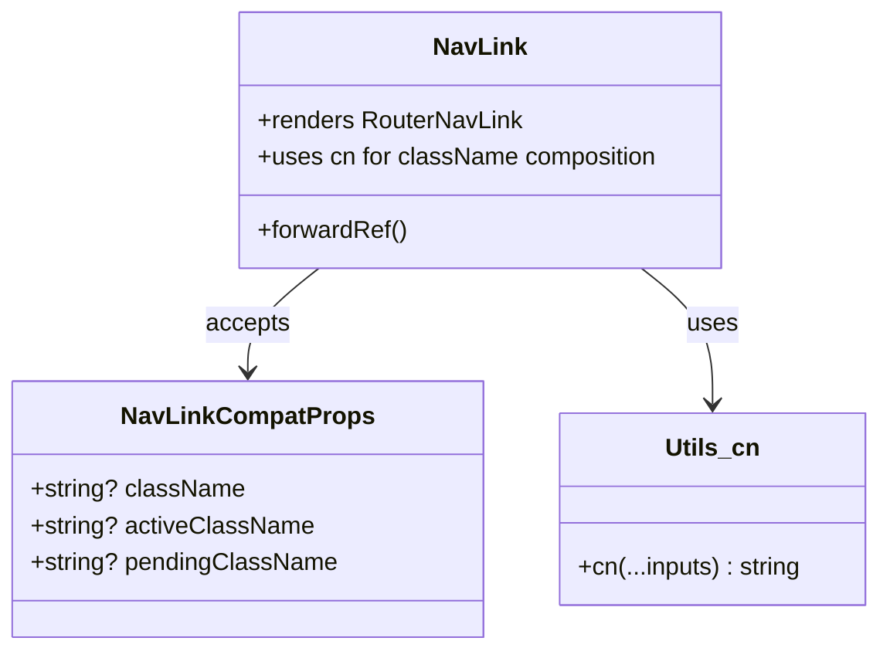
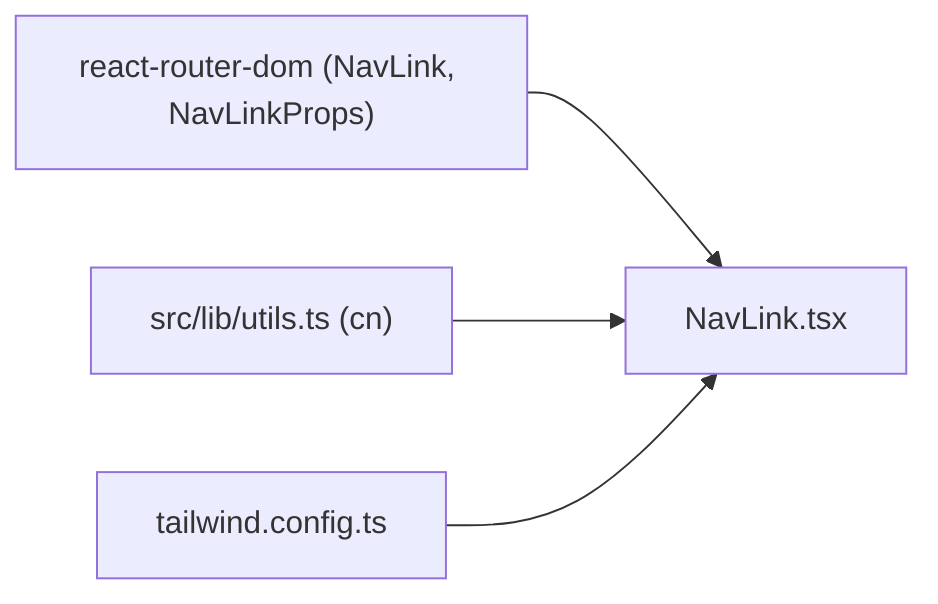

# NavLink Component

> **Referenced Files in This Document**
> - [NavLink.tsx](src/components/NavLink.tsx)
> - [utils.ts](src/lib/utils.ts)
> - [tailwind.config.ts](tailwind.config.ts)
> - [App.tsx](src/App.tsx)
> - [Index.tsx](src/pages/Index.tsx)

## Table of Contents
1. [Introduction](#introduction)
2. [Project Structure](#project-structure)
3. [Core Components](#core-components)
4. [Architecture Overview](#architecture-overview)
5. [Detailed Component Analysis](#detailed-component-analysis)
6. [Dependency Analysis](#dependency-analysis)
7. [Performance Considerations](#performance-considerations)
8. [Troubleshooting Guide](#troubleshooting-guide)
9. [Conclusion](#conclusion)

## Introduction
This document provides comprehensive guidance for the NavLink component, which enhances React Router’s NavLink with improved active-state styling and accessibility. It demonstrates how the component composes Tailwind classes using the cn utility, preserves React Router’s original props, and supports additional props for active and pending states. The document also covers ref forwarding, common pitfalls, and best practices for styling and integration.

## Project Structure
The NavLink component resides in the components folder alongside other UI and page-level components. It integrates with the application’s routing setup and Tailwind configuration to deliver consistent, accessible navigation with dynamic active-state styling.

**Diagram sources**
- [App.tsx](src/App.tsx#L1-L43)
- [Index.tsx](src/pages/Index.tsx#L1-L32)
- [NavLink.tsx](src/components/NavLink.tsx#L1-L28)
- [utils.ts](src/lib/utils.ts#L1-L7)
- [tailwind.config.ts](tailwind.config.ts#L1-L98)

**Section sources**
- [App.tsx](src/App.tsx#L1-L43)
- [Index.tsx](src/pages/Index.tsx#L1-L32)
- [NavLink.tsx](src/components/NavLink.tsx#L1-L28)
- [utils.ts](src/lib/utils.ts#L1-L7)
- [tailwind.config.ts](tailwind.config.ts#L1-L98)

## Core Components
- NavLink: A thin wrapper around React Router’s NavLink that adds className composition via cn and supports activeClassName and pendingClassName for dynamic styling based on isActive and isPending states.
- cn utility: A Tailwind-merge-enabled function that merges class names safely, resolving conflicts and ensuring predictable styles.
- Tailwind configuration: Extends the design system with custom colors, fonts, and animations, enabling consistent styling across the app.

Key implementation highlights:
- Props extension: NavLinkCompatProps extends NavLinkProps while allowing className, activeClassName, and pendingClassName.
- Active state composition: Uses the function-as-children pattern to compute className dynamically.
- Ref forwarding: forwardRef ensures DOM refs are passed through to the underlying anchor element.
- Accessibility: Inherits native anchor semantics and supports aria attributes via props.

**Section sources**
- [NavLink.tsx](src/components/NavLink.tsx#L1-L28)
- [utils.ts](src/lib/utils.ts#L1-L7)
- [tailwind.config.ts](tailwind.config.ts#L1-L98)

## Architecture Overview
The NavLink component sits between the application’s routing layer and the UI styling layer. It receives routing props from React Router, computes active/pending classes via cn, and renders a native anchor element with proper ref forwarding.

**Diagram sources**
- [NavLink.tsx](src/components/NavLink.tsx#L1-L28)
- [utils.ts](src/lib/utils.ts#L1-L7)

**Section sources**
- [NavLink.tsx](src/components/NavLink.tsx#L1-L28)
- [utils.ts](src/lib/utils.ts#L1-L7)

## Detailed Component Analysis

### NavLink Component
Purpose:
- Enhance React Router’s NavLink with className composition and explicit active/pending styling hooks.
- Preserve all original NavLinkProps while adding activeClassName and pendingClassName.
- Ensure DOM ref forwarding for imperative access and accessibility.

Implementation patterns:
- Interface extension: NavLinkCompatProps omits the original className from NavLinkProps and adds optional activeClassName and pendingClassName.
- Function-as-children: The className prop accepts a function receiving isActive and isPending booleans to compute the final class string.
- Ref forwarding: forwardRef passes the ref to the underlying RouterNavLink, enabling imperative focus, scroll, or analytics integration.

Accessibility and UX:
- Inherits anchor semantics and supports aria attributes via props.
- Provides visual feedback for current route and pending navigation states.

Extensibility:
- Additional states can be supported by extending the className function to incorporate more conditions.
- Integrating with animation libraries is straightforward by adding transition classes or wrappers.

**Diagram sources**
- [NavLink.tsx](src/components/NavLink.tsx#L1-L28)
- [utils.ts](src/lib/utils.ts#L1-L7)

**Section sources**
- [NavLink.tsx](src/components/NavLink.tsx#L1-L28)
- [utils.ts](src/lib/utils.ts#L1-L7)

### Practical Usage Examples
- Active link styling in navigation menus:
  - Provide activeClassName to highlight the current route.
  - Combine with pendingClassName to indicate navigation in progress.
- Conditional class composition:
  - Use className to apply base styles and merge with active/pending classes via cn.
- Accessibility:
  - Ensure aria-current is set appropriately if needed, or rely on the underlying anchor semantics.

Note: Specific code examples are referenced by file path and line ranges rather than pasted content.

**Section sources**
- [NavLink.tsx](src/components/NavLink.tsx#L1-L28)

### Common Issues and Solutions
- Broken ref forwarding:
  - Symptom: Cannot programmatically focus or manipulate the anchor element.
  - Cause: Not using forwardRef or not passing ref to the underlying element.
  - Fix: Ensure forwardRef is used and ref is passed to RouterNavLink.
- Incorrect active state propagation:
  - Symptom: Active class not applied or flickers during navigation.
  - Causes: Conflicting styles, incorrect className composition, or route mismatch.
  - Fixes: Verify activeClassName/pendingClassName precedence, ensure to prop matches route, and confirm cn merges classes correctly.
- Style conflicts with Tailwind’s JIT engine:
  - Symptom: Active classes not generated or purged.
  - Causes: Dynamic class names not statically analyzable by Tailwind.
  - Fixes: Use static class names for active/pending states or configure content globs to include dynamic usage.

**Section sources**
- [NavLink.tsx](src/components/NavLink.tsx#L1-L28)
- [tailwind.config.ts](tailwind.config.ts#L1-L98)

## Dependency Analysis
NavLink depends on:
- React Router’s NavLink and NavLinkProps for routing behavior.
- cn utility for safe class name merging.
- Tailwind CSS for styling and JIT processing.

**Diagram sources**
- [NavLink.tsx](src/components/NavLink.tsx#L1-L28)
- [utils.ts](src/lib/utils.ts#L1-L7)
- [tailwind.config.ts](tailwind.config.ts#L1-L98)

**Section sources**
- [NavLink.tsx](src/components/NavLink.tsx#L1-L28)
- [utils.ts](src/lib/utils.ts#L1-L7)
- [tailwind.config.ts](tailwind.config.ts#L1-L98)

## Performance Considerations
- Minimize re-renders by avoiding inline function creation for className when props are static.
- Prefer static class names for active/pending states to improve Tailwind’s static analysis and reduce bundle size.
- Use forwardRef judiciously; only when imperative DOM access is required.

## Troubleshooting Guide
- Active class not applying:
  - Verify activeClassName and pendingClassName are provided and not empty.
  - Confirm the to prop matches the current route.
- Styles not taking effect:
  - Check cn precedence and ensure className is not overriding active/pending classes unintentionally.
  - Inspect Tailwind’s content globs to ensure dynamic class names are included.
- Accessibility issues:
  - Ensure the component remains an anchor element and retains focus management if needed.

**Section sources**
- [NavLink.tsx](src/components/NavLink.tsx#L1-L28)
- [tailwind.config.ts](tailwind.config.ts#L1-L98)

## Conclusion
The NavLink component provides a clean, extensible way to style active and pending navigation states while preserving React Router’s routing behavior and accessibility. By leveraging cn for class composition and forwardRef for DOM access, it integrates seamlessly with Tailwind CSS and the broader application architecture. Following the best practices and troubleshooting guidance outlined here will help ensure reliable, accessible navigation across all user contexts.