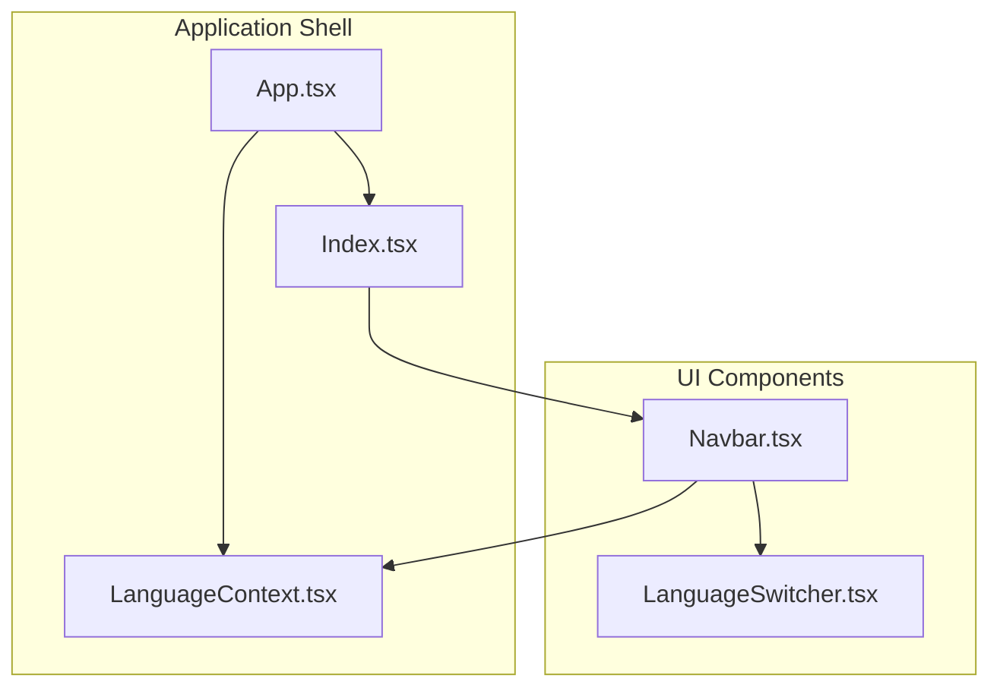
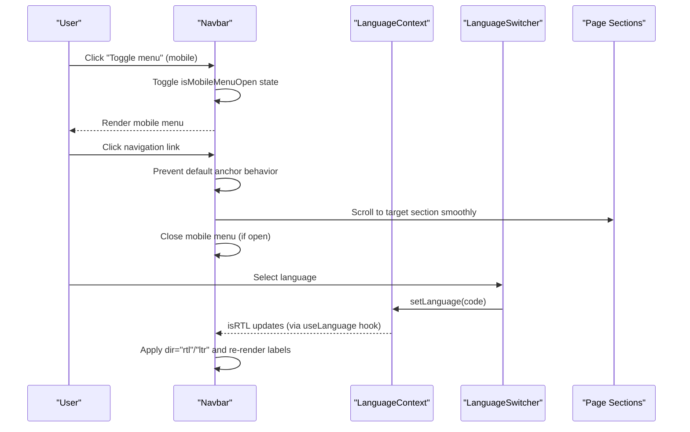
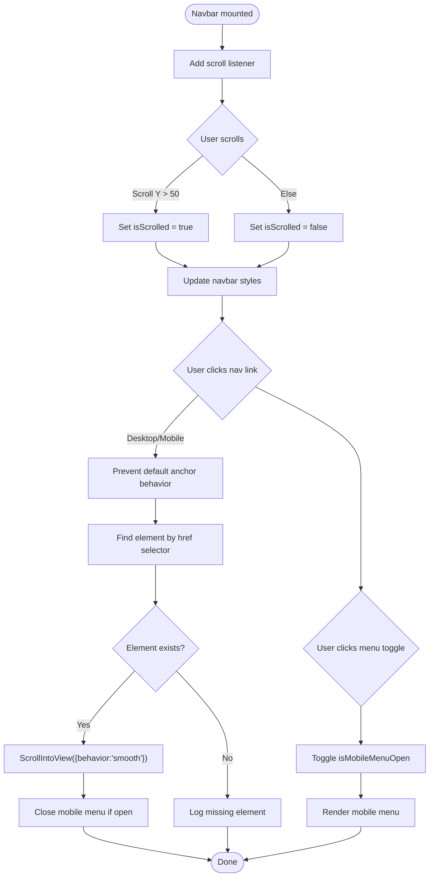
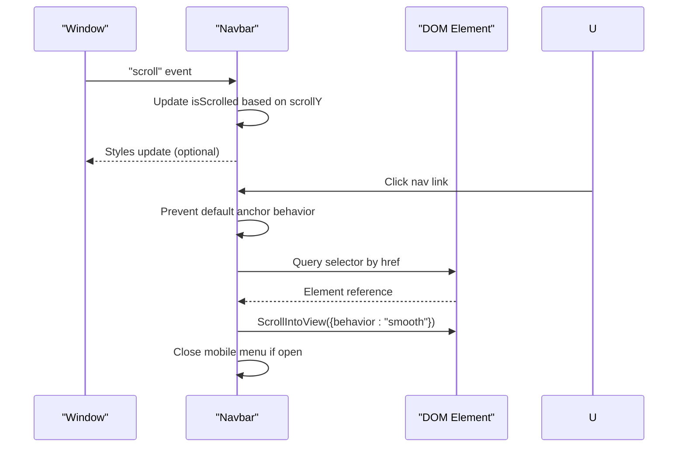
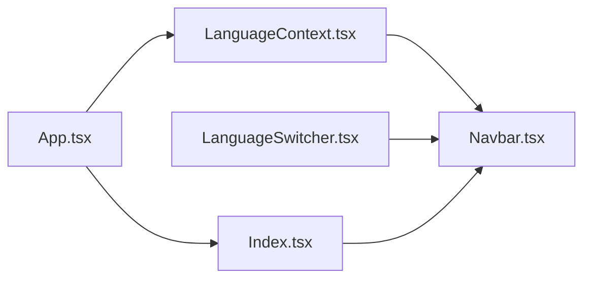

# Navbar Component

<cite>
**Referenced Files in This Document**
- [Navbar.tsx](file://src/components/Navbar.tsx)
- [LanguageSwitcher.tsx](file://src/components/LanguageSwitcher.tsx)
- [LanguageContext.tsx](file://src/contexts/LanguageContext.tsx)
- [Index.tsx](file://src/pages/Index.tsx)
- [App.tsx](file://src/App.tsx)
- [use-mobile.tsx](file://src/hooks/use-mobile.tsx)
</cite>

## Table of Contents
1. [Introduction](#introduction)
2. [Project Structure](#project-structure)
3. [Core Components](#core-components)
4. [Architecture Overview](#architecture-overview)
5. [Detailed Component Analysis](#detailed-component-analysis)
6. [Dependency Analysis](#dependency-analysis)
7. [Performance Considerations](#performance-considerations)
8. [Troubleshooting Guide](#troubleshooting-guide)
9. [Conclusion](#conclusion)

## Introduction
This document provides a comprehensive guide to the Navbar component, which acts as the primary navigation hub for the event platform. It explains how the Navbar implements a mobile-first responsive design, manages mobile menu visibility via state, detects scroll events to dynamically alter its appearance, and integrates with the LanguageSwitcher component. It also covers RTL layout handling through the isRTL flag from LanguageContext, demonstrates event handling for mobile menu toggling and navigation link clicks, and addresses common issues such as scroll event memory leaks, incorrect mobile menu state management, and accessibility concerns. Finally, it offers performance optimization tips to reduce re-renders and minimize DOM listeners.

## Project Structure
The Navbar component resides under src/components and integrates with the LanguageContext for internationalization and with LanguageSwitcher for language selection. The Index page composes the Navbar alongside other sections, while App.tsx wraps the app with providers including LanguageProvider.

**Diagram sources**
- [App.tsx](file://src/App.tsx#L1-L43)
- [LanguageContext.tsx](file://src/contexts/LanguageContext.tsx#L267-L292)
- [Index.tsx](file://src/pages/Index.tsx#L1-L32)
- [Navbar.tsx](file://src/components/Navbar.tsx#L1-L123)
- [LanguageSwitcher.tsx](file://src/components/LanguageSwitcher.tsx#L1-L44)

**Section sources**
- [App.tsx](file://src/App.tsx#L1-L43)
- [Index.tsx](file://src/pages/Index.tsx#L1-L32)
- [Navbar.tsx](file://src/components/Navbar.tsx#L1-L123)
- [LanguageSwitcher.tsx](file://src/components/LanguageSwitcher.tsx#L1-L44)
- [LanguageContext.tsx](file://src/contexts/LanguageContext.tsx#L267-L292)

## Core Components
- Navbar: Implements responsive navigation with scroll detection, mobile menu toggle, and smooth scrolling to section anchors. Integrates with LanguageSwitcher and reacts to RTL layout changes via isRTL.
- LanguageSwitcher: Provides language selection with variants for floating and navbar contexts.
- LanguageContext: Supplies language state, translation function t, and isRTL flag to consumers.

Key responsibilities:
- Responsive design: Uses hidden and md:flex to show desktop links and reveal a mobile menu on smaller screens.
- Scroll detection: Adds a scroll listener on mount and removes it on unmount to prevent memory leaks.
- Smooth scrolling: Prevents default anchor behavior and scrolls to target sections smoothly.
- RTL support: Applies dir="rtl" or "ltr" based on isRTL and translates navigation labels via t.
- Accessibility: Uses aria-label on the mobile menu toggle button.

**Section sources**
- [Navbar.tsx](file://src/components/Navbar.tsx#L1-L123)
- [LanguageSwitcher.tsx](file://src/components/LanguageSwitcher.tsx#L1-L44)
- [LanguageContext.tsx](file://src/contexts/LanguageContext.tsx#L267-L292)

## Architecture Overview
The Navbar orchestrates navigation and language switching, while LanguageContext centralizes internationalization. The Index page composes the Navbar and other sections, and App.tsx wraps the app with providers.

**Diagram sources**
- [Navbar.tsx](file://src/components/Navbar.tsx#L1-L123)
- [LanguageSwitcher.tsx](file://src/components/LanguageSwitcher.tsx#L1-L44)
- [LanguageContext.tsx](file://src/contexts/LanguageContext.tsx#L267-L292)
- [Index.tsx](file://src/pages/Index.tsx#L1-L32)

## Detailed Component Analysis

### Navbar Component
Responsibilities:
- State management: Tracks scroll position and mobile menu visibility.
- Scroll detection: Adds a scroll listener on mount and removes it on unmount.
- Smooth scrolling: Prevents default anchor behavior and scrolls to targets with smooth behavior.
- Mobile-first design: Hides desktop navigation and shows a mobile menu on small screens.
- RTL integration: Applies directionality based on isRTL and renders translated labels.

Implementation highlights:
- Scroll listener lifecycle: Adds and removes the listener inside a useEffect with an empty dependency array.
- Navigation links: Built from an array of href and translated labels.
- Mobile menu: Conditionally rendered when isMobileMenuOpen is true; includes LanguageSwitcher.
- Accessibility: Mobile menu toggle button has aria-label.

Event handling examples (paths):
- Mobile menu toggle click handler: [Navbar.tsx](file://src/components/Navbar.tsx#L84-L90)
- Navigation link click handler (desktop/mobile): [Navbar.tsx](file://src/components/Navbar.tsx#L66-L71), [Navbar.tsx](file://src/components/Navbar.tsx#L100-L107)
- Scroll-to-section function: [Navbar.tsx](file://src/components/Navbar.tsx#L30-L36)

Accessibility and RTL:
- ARIA label on mobile menu toggle: [Navbar.tsx](file://src/components/Navbar.tsx#L87-L90)
- Direction attribute applied to nav element: [Navbar.tsx](file://src/components/Navbar.tsx#L45-L46)
- Translated labels via t: [Navbar.tsx](file://src/components/Navbar.tsx#L19-L28), [LanguageContext.tsx](file://src/contexts/LanguageContext.tsx#L12-L266)

Responsive behavior:
- Desktop links hidden on small screens: [Navbar.tsx](file://src/components/Navbar.tsx#L62-L76)
- Mobile menu visibility controlled by state: [Navbar.tsx](file://src/components/Navbar.tsx#L95-L116)

Integration with LanguageSwitcher:
- Desktop variant: [Navbar.tsx](file://src/components/Navbar.tsx#L80-L82), [LanguageSwitcher.tsx](file://src/components/LanguageSwitcher.tsx#L1-L44)
- Mobile variant included inside mobile menu: [Navbar.tsx](file://src/components/Navbar.tsx#L111-L114)

**Diagram sources**
- [Navbar.tsx](file://src/components/Navbar.tsx#L1-L123)

**Section sources**
- [Navbar.tsx](file://src/components/Navbar.tsx#L1-L123)

### LanguageSwitcher Component
Responsibilities:
- Presents language options with flags and labels.
- Updates language via LanguageContext.setLanguage.
- Supports two variants: floating and navbar.

Integration with Navbar:
- Used inside Navbar’s desktop and mobile layouts.
- Reflects current language and applies styling accordingly.

Event handling examples (paths):
- Language selection handler: [LanguageSwitcher.tsx](file://src/components/LanguageSwitcher.tsx#L22-L25)
- Variant rendering logic: [LanguageSwitcher.tsx](file://src/components/LanguageSwitcher.tsx#L17-L21), [Navbar.tsx](file://src/components/Navbar.tsx#L80-L82), [Navbar.tsx](file://src/components/Navbar.tsx#L111-L114)

**Section sources**
- [LanguageSwitcher.tsx](file://src/components/LanguageSwitcher.tsx#L1-L44)
- [Navbar.tsx](file://src/components/Navbar.tsx#L80-L82)
- [Navbar.tsx](file://src/components/Navbar.tsx#L111-L114)

### LanguageContext and RTL Handling
Responsibilities:
- Manages language state and provides t(key) for translations.
- Exposes isRTL based on current language.
- Wraps the app in App.tsx to make context available.

RTL behavior:
- Navbar applies dir={isRTL ? 'rtl' : 'ltr'} to the nav element.
- App sets global dir and font class based on language.

Paths:
- Provider and hooks: [LanguageContext.tsx](file://src/contexts/LanguageContext.tsx#L267-L292)
- Navbar RTL application: [Navbar.tsx](file://src/components/Navbar.tsx#L45-L46)
- App global RTL and font: [App.tsx](file://src/App.tsx#L12-L20)

**Section sources**
- [LanguageContext.tsx](file://src/contexts/LanguageContext.tsx#L267-L292)
- [Navbar.tsx](file://src/components/Navbar.tsx#L45-L46)
- [App.tsx](file://src/App.tsx#L12-L20)

### Scroll Detection and Smooth Scrolling
- Scroll detection: Navbar adds a scroll listener on mount and removes it on unmount to avoid memory leaks.
- Smooth scrolling: Prevents default anchor behavior and uses scrollIntoView with smooth behavior to navigate to section anchors.

Paths:
- Scroll listener lifecycle: [Navbar.tsx](file://src/components/Navbar.tsx#L11-L17)
- Scroll-to-section function: [Navbar.tsx](file://src/components/Navbar.tsx#L30-L36)
- Navigation link handlers: [Navbar.tsx](file://src/components/Navbar.tsx#L66-L71), [Navbar.tsx](file://src/components/Navbar.tsx#L100-L107)

**Diagram sources**
- [Navbar.tsx](file://src/components/Navbar.tsx#L11-L17)
- [Navbar.tsx](file://src/components/Navbar.tsx#L30-L36)
- [Navbar.tsx](file://src/components/Navbar.tsx#L66-L71)
- [Navbar.tsx](file://src/components/Navbar.tsx#L100-L107)

**Section sources**
- [Navbar.tsx](file://src/components/Navbar.tsx#L11-L17)
- [Navbar.tsx](file://src/components/Navbar.tsx#L30-L36)
- [Navbar.tsx](file://src/components/Navbar.tsx#L66-L71)
- [Navbar.tsx](file://src/components/Navbar.tsx#L100-L107)

### Mobile-First Design and State Management
- Mobile-first: Desktop navigation is hidden on small screens; mobile menu is shown via a hamburger icon.
- State management: isMobileMenuOpen controls visibility of the mobile menu.
- Conditional rendering: Mobile menu appears only when isMobileMenuOpen is true.

Paths:
- Mobile menu toggle: [Navbar.tsx](file://src/components/Navbar.tsx#L84-L90)
- Mobile menu visibility: [Navbar.tsx](file://src/components/Navbar.tsx#L95-L116)
- Desktop navigation: [Navbar.tsx](file://src/components/Navbar.tsx#L62-L76)

**Section sources**
- [Navbar.tsx](file://src/components/Navbar.tsx#L84-L90)
- [Navbar.tsx](file://src/components/Navbar.tsx#L95-L116)
- [Navbar.tsx](file://src/components/Navbar.tsx#L62-L76)

## Dependency Analysis
The Navbar depends on:
- LanguageContext for translations and RTL flag.
- LanguageSwitcher for language selection UI.
- Index page for composition within the app.
- App.tsx for provider setup.

**Diagram sources**
- [Navbar.tsx](file://src/components/Navbar.tsx#L1-L123)
- [LanguageSwitcher.tsx](file://src/components/LanguageSwitcher.tsx#L1-L44)
- [LanguageContext.tsx](file://src/contexts/LanguageContext.tsx#L267-L292)
- [Index.tsx](file://src/pages/Index.tsx#L1-L32)
- [App.tsx](file://src/App.tsx#L1-L43)

**Section sources**
- [Navbar.tsx](file://src/components/Navbar.tsx#L1-L123)
- [LanguageSwitcher.tsx](file://src/components/LanguageSwitcher.tsx#L1-L44)
- [LanguageContext.tsx](file://src/contexts/LanguageContext.tsx#L267-L292)
- [Index.tsx](file://src/pages/Index.tsx#L1-L32)
- [App.tsx](file://src/App.tsx#L1-L43)

## Performance Considerations
- Avoid scroll event memory leaks: Ensure the scroll listener is removed on unmount. The Navbar already implements this correctly.
- Reduce re-renders:
  - Memoize handlers using useCallback for scrollToSection and toggle handlers if they are passed down to child components.
  - Wrap LanguageSwitcher with memoization if props do not change frequently.
  - Consider extracting navigation items to a constant outside the component to avoid recreating arrays on each render.
- Minimize DOM listeners:
  - Keep a single scroll listener as implemented.
  - Debounce scroll handlers if adding heavy computations (not required for simple style updates).
- Accessibility:
  - Ensure the mobile menu toggle has a clear aria-label (already present).
  - Consider adding aria-expanded to the toggle button reflecting isMobileMenuOpen state.
  - Ensure keyboard navigation support for mobile menu items.

[No sources needed since this section provides general guidance]

## Troubleshooting Guide
Common issues and resolutions:
- Scroll event memory leaks:
  - Symptom: Unexpected behavior after navigating away from the page.
  - Resolution: Verify that the scroll listener is removed on unmount. The Navbar already does this.
  - Reference: [Navbar.tsx](file://src/components/Navbar.tsx#L11-L17)
- Incorrect mobile menu state management:
  - Symptom: Mobile menu remains open after navigation or does not close on link click.
  - Resolution: Ensure the mobile menu closes after clicking a link. The Navbar sets isMobileMenuOpen to false after scrolling.
  - Reference: [Navbar.tsx](file://src/components/Navbar.tsx#L30-L36)
- Accessibility concerns:
  - Symptom: Screen reader issues with mobile menu toggle.
  - Resolution: Confirm aria-label is present and consider adding aria-expanded bound to isMobileMenuOpen.
  - References: [Navbar.tsx](file://src/components/Navbar.tsx#L87-L90)
- Smooth scrolling not working:
  - Symptom: Links do not scroll to sections.
  - Resolution: Ensure href selectors match actual section IDs and that scrollIntoView is supported. The Navbar prevents default behavior and scrolls to the element.
  - References: [Navbar.tsx](file://src/components/Navbar.tsx#L30-L36), [Navbar.tsx](file://src/components/Navbar.tsx#L66-L71), [Navbar.tsx](file://src/components/Navbar.tsx#L100-L107)
- RTL layout not applied:
  - Symptom: Text direction not changing to RTL.
  - Resolution: Confirm isRTL is true for Arabic and that dir is applied to the nav element.
  - References: [Navbar.tsx](file://src/components/Navbar.tsx#L45-L46), [LanguageContext.tsx](file://src/contexts/LanguageContext.tsx#L276-L276)

**Section sources**
- [Navbar.tsx](file://src/components/Navbar.tsx#L11-L17)
- [Navbar.tsx](file://src/components/Navbar.tsx#L30-L36)
- [Navbar.tsx](file://src/components/Navbar.tsx#L66-L71)
- [Navbar.tsx](file://src/components/Navbar.tsx#L87-L90)
- [Navbar.tsx](file://src/components/Navbar.tsx#L100-L107)
- [Navbar.tsx](file://src/components/Navbar.tsx#L45-L46)
- [LanguageContext.tsx](file://src/contexts/LanguageContext.tsx#L276-L276)

## Conclusion
The Navbar component delivers a robust, mobile-first navigation experience with scroll-aware styling, smooth scrolling to sections, and seamless integration with the LanguageSwitcher and LanguageContext. It adheres to accessibility best practices and avoids common pitfalls such as scroll event memory leaks. By applying the suggested performance optimizations and following the troubleshooting steps, developers can maintain a reliable and efficient navigation system across locales and screen sizes.