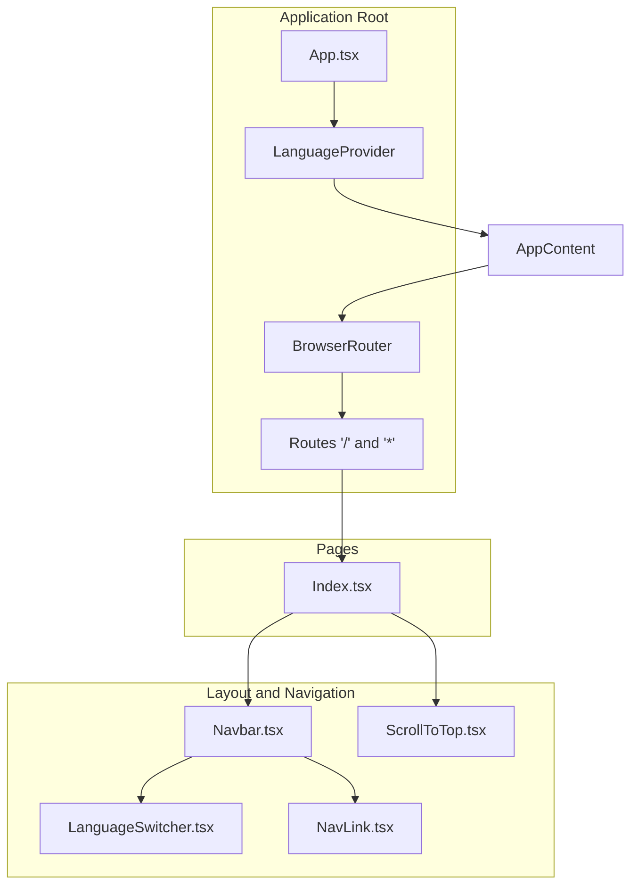
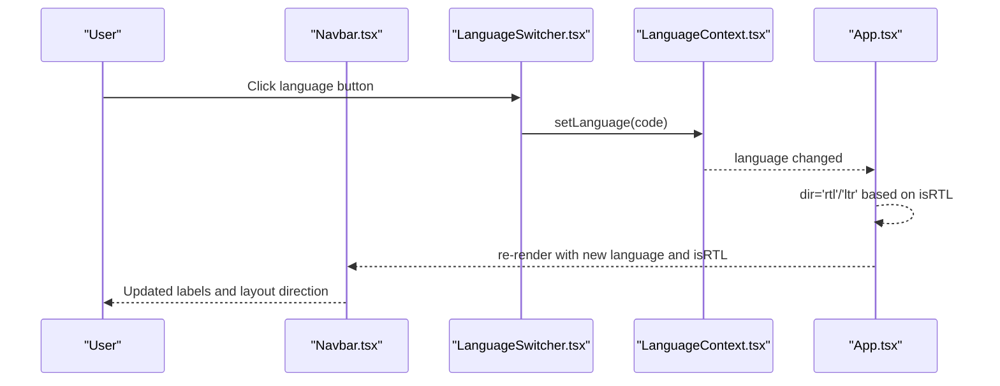
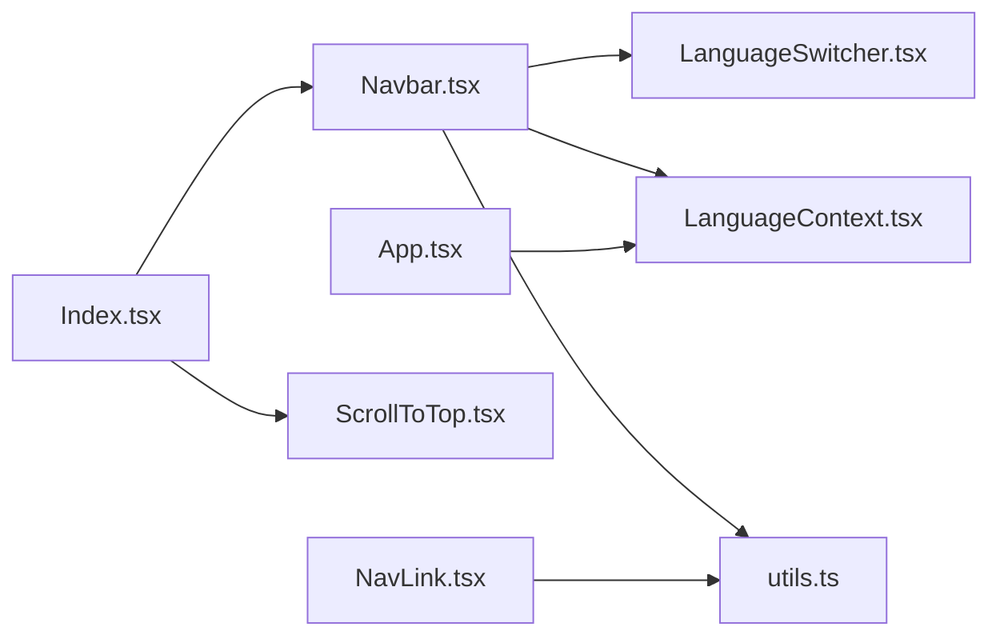
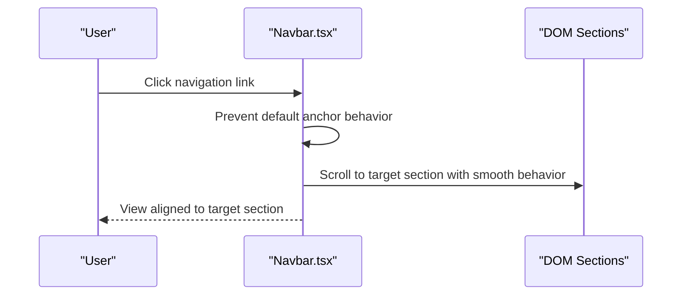
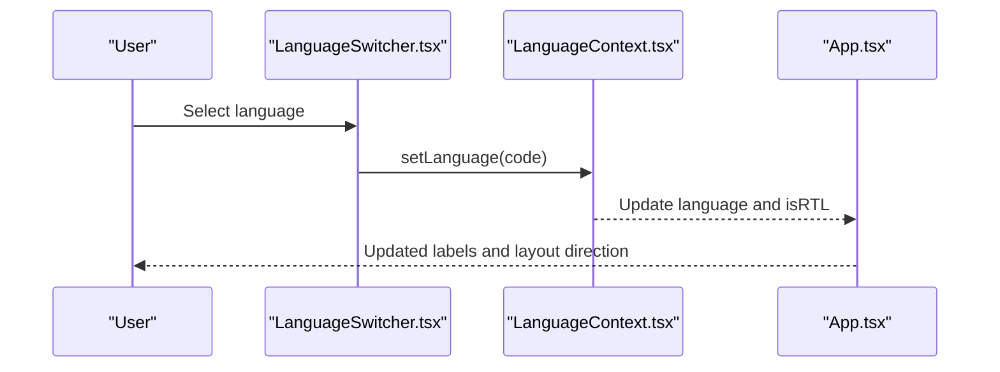

# Navigation and Layout Components

> **Referenced Files in This Document**
> - [App.tsx](src/App.tsx)
> - [LanguageContext.tsx](src/contexts/LanguageContext.tsx)
> - [Navbar.tsx](src/components/Navbar.tsx)
> - [NavLink.tsx](src/components/NavLink.tsx)
> - [LanguageSwitcher.tsx](src/components/LanguageSwitcher.tsx)
> - [ScrollToTop.tsx](src/components/ScrollToTop.tsx)
> - [Index.tsx](src/pages/Index.tsx)
> - [HeroSection.tsx](src/components/HeroSection.tsx)
> - [utils.ts](src/lib/utils.ts)
> - [use-mobile.tsx](src/hooks/use-mobile.tsx)

## Table of Contents
1. [Introduction](#introduction)
2. [Project Structure](#project-structure)
3. [Core Components](#core-components)
4. [Architecture Overview](#architecture-overview)
5. [Detailed Component Analysis](#detailed-component-analysis)
6. [Dependency Analysis](#dependency-analysis)
7. [Performance Considerations](#performance-considerations)
8. [Troubleshooting Guide](#troubleshooting-guide)
9. [Conclusion](#conclusion)
10. [Appendices](#appendices)

## Introduction
This document explains the navigation and layout utility components that enhance user experience for the event site. It covers:
- Navbar: top-level navigation with responsive behavior, mobile menu toggle, and scroll-aware styling.
- NavLink: active-state handling compatible with React Router’s NavLink.
- LanguageSwitcher: multilingual support and RTL layout updates via LanguageContext.
- ScrollToTop: smooth scrolling to the top of the page for long-form content.
It also provides examples of event-driven navigation patterns, scroll position management, common issues, and optimization tips for performance and accessibility.

## Project Structure
The navigation and layout utilities are organized under src/components and integrated into the application via the root App wrapper and the Index page.

**Diagram sources**
- [App.tsx](src/App.tsx#L12-L31)
- [Index.tsx](src/pages/Index.tsx#L13-L29)
- [Navbar.tsx](src/components/Navbar.tsx#L38-L119)
- [LanguageSwitcher.tsx](src/components/LanguageSwitcher.tsx#L14-L41)
- [NavLink.tsx](src/components/NavLink.tsx#L11-L27)
- [ScrollToTop.tsx](src/components/ScrollToTop.tsx#L1-L41)

**Section sources**
- [App.tsx](src/App.tsx#L12-L31)
- [Index.tsx](src/pages/Index.tsx#L13-L29)

## Core Components
- Navbar: Provides a sticky, scroll-aware navigation bar with desktop and mobile views, a logo link, internal anchor links, and a LanguageSwitcher. It toggles a mobile menu and applies RTL direction when appropriate.
- NavLink: A wrapper around React Router’s NavLink that supports custom active/pending class names and forwards refs.
- LanguageSwitcher: Allows switching languages and reflects the current selection with distinct styling. It triggers RTL layout changes via LanguageContext.
- ScrollToTop: Shows a floating button when scrolled down far enough and smoothly scrolls to the top on click.

**Section sources**
- [Navbar.tsx](src/components/Navbar.tsx#L38-L119)
- [NavLink.tsx](src/components/NavLink.tsx#L11-L27)
- [LanguageSwitcher.tsx](src/components/LanguageSwitcher.tsx#L14-L41)
- [ScrollToTop.tsx](src/components/ScrollToTop.tsx#L1-L41)

## Architecture Overview
The application initializes language and routing providers at the root. The Index page composes Navbar and ScrollToTop alongside content sections. Navbar integrates LanguageSwitcher and uses internal anchor links to navigate to sections. LanguageSwitcher updates the language in LanguageContext, which controls translation keys and RTL direction at the app root.

**Diagram sources**
- [LanguageSwitcher.tsx](src/components/LanguageSwitcher.tsx#L14-L41)
- [LanguageContext.tsx](src/contexts/LanguageContext.tsx#L269-L291)
- [App.tsx](src/App.tsx#L12-L31)
- [Navbar.tsx](src/components/Navbar.tsx#L38-L119)

## Detailed Component Analysis

### Navbar
Responsibilities:
- Renders desktop and mobile navigation lists.
- Smooth-scrolls to sections using anchor links.
- Toggles mobile menu visibility.
- Applies scroll-aware styling and RTL direction.
- Integrates LanguageSwitcher in both desktop and mobile layouts.

Key behaviors:
- Uses internal anchor links to jump to sections with smooth scrolling.
- Maintains a local state for mobile menu open/close.
- Listens to scroll events to adjust navbar appearance.
- Passes RTL direction to the nav container.

Accessibility and UX:
- Uses aria-label for the mobile menu toggle.
- Uses anchor links for navigation, which are keyboard accessible.

Responsive behavior:
- Desktop: horizontal list of links.
- Mobile: stacked list with LanguageSwitcher inside.

Integration points:
- Links are generated from translation keys via useLanguage.
- Uses LanguageContext for isRTL to set dir on the nav element.

**Section sources**
- [Navbar.tsx](src/components/Navbar.tsx#L38-L119)
- [LanguageContext.tsx](src/contexts/LanguageContext.tsx#L269-L291)

### NavLink
Purpose:
- Provide a compatible wrapper around React Router’s NavLink with support for custom active and pending class names.
- Forward refs for imperative access if needed.

Implementation highlights:
- Accepts className, activeClassName, pendingClassName, and forwards props to Router NavLink.
- Uses cn from utils to merge Tailwind classes safely.

Common use cases:
- Replace standard anchor tags with router-aware links while preserving custom active/pending styles.

**Section sources**
- [NavLink.tsx](src/components/NavLink.tsx#L11-L27)
- [utils.ts](src/lib/utils.ts#L1-L7)

### LanguageSwitcher
Capabilities:
- Presents a set of language options with distinct styling for the selected language.
- Updates the current language via LanguageContext.setLanguage.
- Supports two variants: floating and navbar.

Behavior:
- Uses flags or a localized image for non-Arabic languages.
- Adjusts font family at the app root based on language selection.

RTL implications:
- LanguageContext.isRTL determines whether the app is rendered right-to-left.
- Navbar sets dir on the nav element based on isRTL.

**Section sources**
- [LanguageSwitcher.tsx](src/components/LanguageSwitcher.tsx#L14-L41)
- [LanguageContext.tsx](src/contexts/LanguageContext.tsx#L269-L291)
- [App.tsx](src/App.tsx#L12-L31)

### ScrollToTop
Functionality:
- Shows a floating button when the user scrolls down past a threshold.
- Smoothly scrolls to the top of the page on click.
- Hides the button when not needed.

Accessibility:
- Provides an aria-label for screen readers.

**Section sources**
- [ScrollToTop.tsx](src/components/ScrollToTop.tsx#L1-L41)

### Event-Driven Navigation Patterns and Scroll Position Management
Patterns:
- Internal anchor navigation: Navbar uses anchor links to sections (e.g., #hero, #why, #agenda). These rely on section ids present in the page.
- Smooth scrolling: Navbar’s scrollToSection uses scrollIntoView with smooth behavior.
- Scroll awareness: Navbar adjusts styling based on scroll position.

Scroll position management:
- On language change, the app does not automatically restore scroll position. If needed, consider adding a scroll restoration strategy (e.g., persisting scroll positions or restoring after language updates).

Example references:
- Anchor targets are defined by section ids in the Index page composition.
- Navbar anchors target these ids for navigation.

**Section sources**
- [Navbar.tsx](src/components/Navbar.tsx#L29-L36)
- [Index.tsx](src/pages/Index.tsx#L13-L29)
- [HeroSection.tsx](src/components/HeroSection.tsx#L10-L12)

## Dependency Analysis
The components depend on shared utilities and contexts:

**Diagram sources**
- [Navbar.tsx](src/components/Navbar.tsx#L38-L119)
- [LanguageSwitcher.tsx](src/components/LanguageSwitcher.tsx#L14-L41)
- [LanguageContext.tsx](src/contexts/LanguageContext.tsx#L269-L291)
- [utils.ts](src/lib/utils.ts#L1-L7)
- [App.tsx](src/App.tsx#L12-L31)
- [Index.tsx](src/pages/Index.tsx#L13-L29)
- [ScrollToTop.tsx](src/components/ScrollToTop.tsx#L1-L41)
- [NavLink.tsx](src/components/NavLink.tsx#L11-L27)

**Section sources**
- [Navbar.tsx](src/components/Navbar.tsx#L38-L119)
- [LanguageSwitcher.tsx](src/components/LanguageSwitcher.tsx#L14-L41)
- [LanguageContext.tsx](src/contexts/LanguageContext.tsx#L269-L291)
- [utils.ts](src/lib/utils.ts#L1-L7)
- [App.tsx](src/App.tsx#L12-L31)
- [Index.tsx](src/pages/Index.tsx#L13-L29)
- [ScrollToTop.tsx](src/components/ScrollToTop.tsx#L1-L41)
- [NavLink.tsx](src/components/NavLink.tsx#L11-L27)

## Performance Considerations
- Avoid unnecessary re-renders:
  - Keep Navbar state minimal and scoped to UI-only concerns (e.g., mobile menu and scroll awareness).
  - Memoize navigation link arrays if they become dynamic or expensive to compute.
- Event listeners:
  - Both Navbar and ScrollToTop attach scroll listeners. Ensure cleanup occurs on unmount (already handled).
- Rendering cost:
  - LanguageSwitcher renders a small fixed list; keep it lightweight.
  - NavLink is a thin wrapper; ensure className merging via cn is efficient.
- Accessibility:
  - Use aria-labels and roles where applicable (already present).
  - Prefer anchor links for navigation to improve keyboard and assistive technology support.

[No sources needed since this section provides general guidance]

## Troubleshooting Guide
Common issues and resolutions:

- Mobile menu toggle bugs
  - Symptom: Menu does not open or close reliably.
  - Checks:
    - Verify the toggle state is controlled by the button’s onClick handler.
    - Confirm the mobile menu block is conditionally rendered based on the state.
  - Related code paths:
    - Toggle button and state: [Navbar.tsx](src/components/Navbar.tsx#L84-L91)
    - Conditional render of mobile menu: [Navbar.tsx](src/components/Navbar.tsx#L95-L116)

- Incorrect active link states
  - Symptom: Active class not applied to current route.
  - Checks:
    - Ensure the component using NavLink is mounted within a Router.
    - Verify activeClassName and pendingClassName are passed correctly.
  - Related code paths:
    - NavLink wrapper: [NavLink.tsx](src/components/NavLink.tsx#L11-L27)

- Scroll restoration after language changes
  - Symptom: Page jumps or loses scroll position after language switch.
  - Checks:
    - The app does not implement explicit scroll restoration on language change.
    - Consider persisting scroll positions or triggering a scroll restoration after language updates.
  - Related code paths:
    - LanguageContext provider and consumers: [LanguageContext.tsx](src/contexts/LanguageContext.tsx#L269-L291)
    - App root applying direction and font class: [App.tsx](src/App.tsx#L12-L31)

- RTL layout not updating
  - Symptom: Text direction remains LTR after switching to Arabic.
  - Checks:
    - Ensure the app root receives isRTL from LanguageContext and applies dir accordingly.
    - Confirm Navbar also respects isRTL for its container.
  - Related code paths:
    - App root dir binding: [App.tsx](src/App.tsx#L12-L31)
    - Navbar dir binding: [Navbar.tsx](src/components/Navbar.tsx#L40-L46)

**Section sources**
- [Navbar.tsx](src/components/Navbar.tsx#L84-L116)
- [NavLink.tsx](src/components/NavLink.tsx#L11-L27)
- [LanguageContext.tsx](src/contexts/LanguageContext.tsx#L269-L291)
- [App.tsx](src/App.tsx#L12-L31)

## Conclusion
The navigation and layout utilities provide a cohesive, accessible, and responsive experience:
- Navbar offers smooth, scroll-aware navigation with mobile responsiveness and RTL support.
- NavLink integrates cleanly with React Router for active-state styling.
- LanguageSwitcher updates language and triggers RTL layout changes via LanguageContext.
- ScrollToTop improves usability on long pages.

By following the troubleshooting steps and performance tips, you can maintain reliability and performance across languages and devices.

[No sources needed since this section summarizes without analyzing specific files]

## Appendices

### Example: Event-Driven Navigation Flow

**Diagram sources**
- [Navbar.tsx](src/components/Navbar.tsx#L29-L36)

### Example: Language Change Flow

**Diagram sources**
- [LanguageSwitcher.tsx](src/components/LanguageSwitcher.tsx#L14-L41)
- [LanguageContext.tsx](src/contexts/LanguageContext.tsx#L269-L291)
- [App.tsx](src/App.tsx#L12-L31)