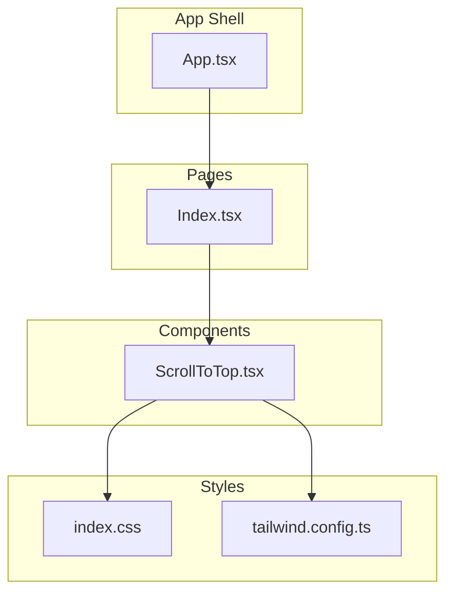
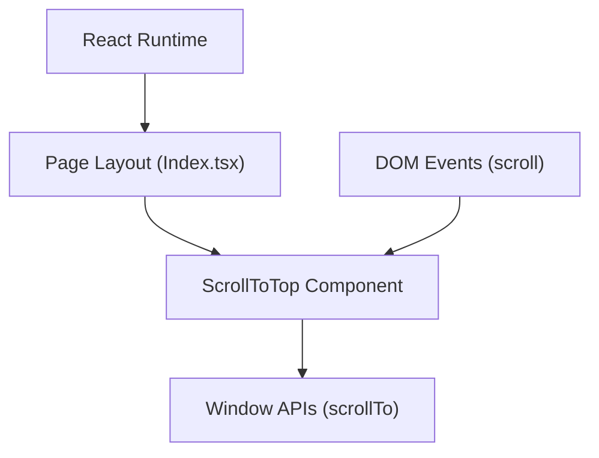
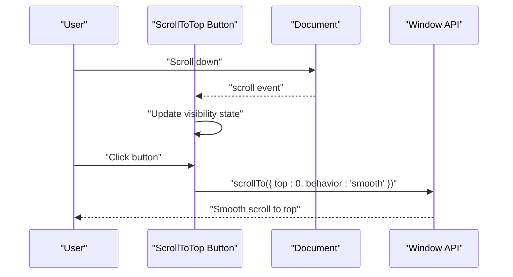
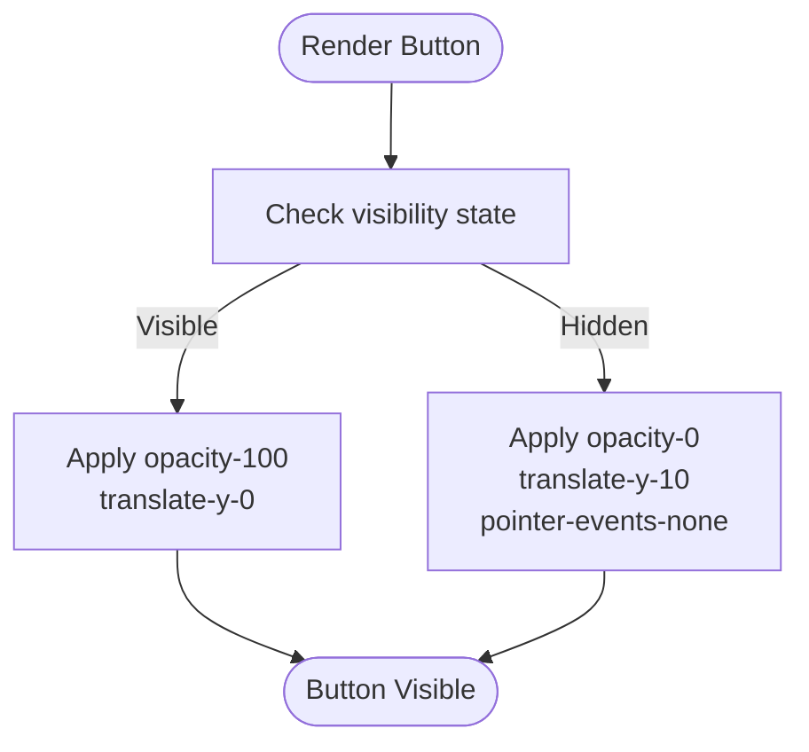
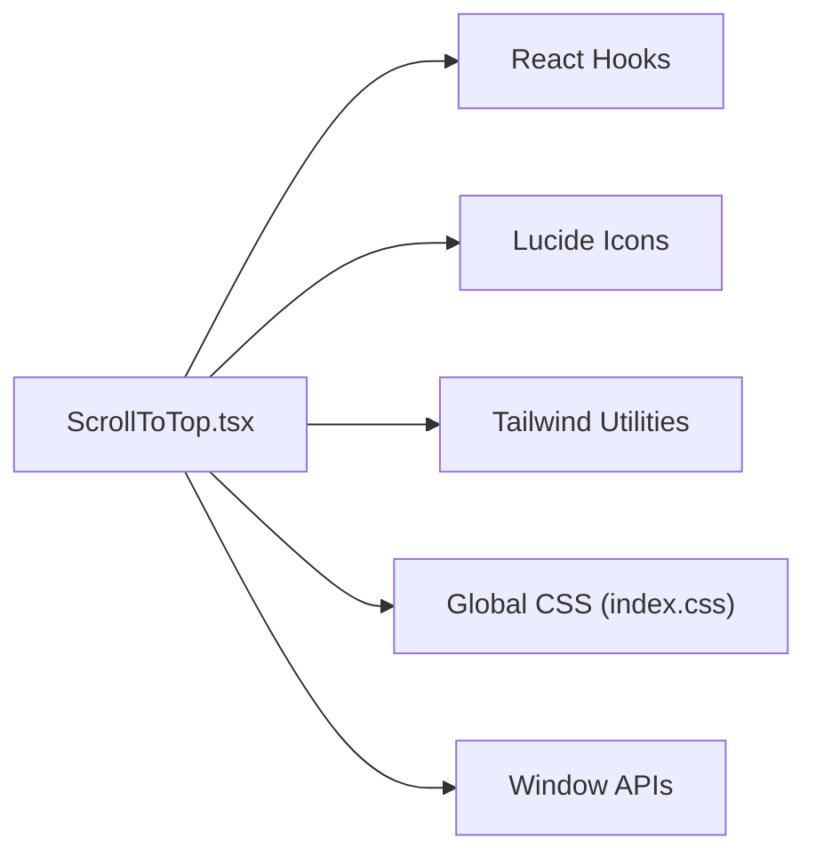

# Scroll To Top Utility

<cite>
**Referenced Files in This Document**
- [ScrollToTop.tsx](file://src/components/ScrollToTop.tsx)
- [Index.tsx](file://src/pages/Index.tsx)
- [index.css](file://src/index.css)
- [tailwind.config.ts](file://tailwind.config.ts)
- [App.tsx](file://src/App.tsx)
</cite>

## Table of Contents
1. [Introduction](#introduction)
2. [Project Structure](#project-structure)
3. [Core Components](#core-components)
4. [Architecture Overview](#architecture-overview)
5. [Detailed Component Analysis](#detailed-component-analysis)
6. [Dependency Analysis](#dependency-analysis)
7. [Performance Considerations](#performance-considerations)
8. [Troubleshooting Guide](#troubleshooting-guide)
9. [Conclusion](#conclusion)
10. [Appendices](#appendices)

## Introduction
This document explains the ScrollToTop utility component that enhances navigation on long-scrolling pages. It detects the user’s scroll position, conditionally displays a floating action button when the user scrolls beyond a threshold, and smoothly scrolls the viewport back to the top when clicked. The component uses React state and effects to manage visibility, a scroll event listener for detection, and Tailwind classes to animate the button’s entrance and exit. Cleanup removes the listener on unmount to prevent memory leaks. The document also covers customization options, performance optimizations, and common issues.

## Project Structure
The ScrollToTop component is a standalone UI utility placed under the components directory and rendered within the main page layout.

**Diagram sources**
- [Index.tsx](file://src/pages/Index.tsx#L1-L32)
- [ScrollToTop.tsx](file://src/components/ScrollToTop.tsx#L1-L41)
- [index.css](file://src/index.css#L1-L249)
- [tailwind.config.ts](file://tailwind.config.ts#L1-L98)
- [App.tsx](file://src/App.tsx#L1-L43)

**Section sources**
- [Index.tsx](file://src/pages/Index.tsx#L1-L32)
- [ScrollToTop.tsx](file://src/components/ScrollToTop.tsx#L1-L41)
- [index.css](file://src/index.css#L1-L249)
- [tailwind.config.ts](file://tailwind.config.ts#L1-L98)
- [App.tsx](file://src/App.tsx#L1-L43)

## Core Components
- ScrollToTop: A floating button that appears when the user scrolls down and disappears when scrolled to the top. It uses:
  - useState to track visibility
  - useEffect to attach and detach a scroll event listener
  - window.scrollTo with smooth behavior to return to the top
  - Tailwind classes to animate opacity, transform, and pointer-events

Integration:
- The component is included in the main page layout so it appears on all routes.

**Section sources**
- [ScrollToTop.tsx](file://src/components/ScrollToTop.tsx#L1-L41)
- [Index.tsx](file://src/pages/Index.tsx#L1-L32)

## Architecture Overview
The ScrollToTop component participates in a typical React render tree. It does not rely on external services; it manages its own visibility and scroll behavior.

**Diagram sources**
- [Index.tsx](file://src/pages/Index.tsx#L1-L32)
- [ScrollToTop.tsx](file://src/components/ScrollToTop.tsx#L1-L41)

## Detailed Component Analysis

### ScrollToTop Implementation
- Visibility logic:
  - Uses a scroll handler to compare window.scrollY against a threshold to set visibility state.
- Event listener lifecycle:
  - Adds a scroll listener on mount and removes it on unmount to prevent memory leaks.
- Smooth scroll behavior:
  - Calls window.scrollTo with smooth behavior to return to the top.
- Animation and state:
  - Uses Tailwind classes to control opacity and vertical translation for entrance/exit.
  - Applies pointer-events-none when hidden to prevent interactions while off-screen.

**Diagram sources**
- [ScrollToTop.tsx](file://src/components/ScrollToTop.tsx#L1-L41)

**Section sources**
- [ScrollToTop.tsx](file://src/components/ScrollToTop.tsx#L1-L41)

### CSS Transition System
- Opacity and transform:
  - Conditional Tailwind classes adjust opacity and translate vertically to animate the button’s appearance and disappearance.
- Pointer-events management:
  - pointer-events-none hides the button from interactions when it is not visible.
- Global smooth scrolling:
  - The base CSS sets scroll-behavior to smooth globally, complementing the component’s smooth scroll behavior.

**Diagram sources**
- [ScrollToTop.tsx](file://src/components/ScrollToTop.tsx#L27-L37)
- [index.css](file://src/index.css#L130-L142)

**Section sources**
- [ScrollToTop.tsx](file://src/components/ScrollToTop.tsx#L27-L37)
- [index.css](file://src/index.css#L130-L142)

### Customization Examples
- Position:
  - Adjust fixed positioning and spacing by editing the Tailwind classes controlling bottom/right and padding.
- Appearance:
  - Modify background color, text color, shadow, and hover behavior via Tailwind utility classes.
- Threshold:
  - Change the scroll threshold by adjusting the comparison value in the scroll handler.

These customizations are applied directly to the button element’s className and inline styles.

**Section sources**
- [ScrollToTop.tsx](file://src/components/ScrollToTop.tsx#L27-L37)

### Integration Point
- The component is included in the main page layout so it appears on all routes.

**Section sources**
- [Index.tsx](file://src/pages/Index.tsx#L1-L32)

## Dependency Analysis
- Internal dependencies:
  - React (useState, useEffect)
  - Lucide icon library for the up arrow
  - Tailwind CSS for styling and transitions
- External integrations:
  - Window scroll APIs for position detection and smooth scrolling
  - Global CSS for scroll-behavior and utility animations

**Diagram sources**
- [ScrollToTop.tsx](file://src/components/ScrollToTop.tsx#L1-L41)
- [index.css](file://src/index.css#L130-L142)
- [tailwind.config.ts](file://tailwind.config.ts#L1-L98)

**Section sources**
- [ScrollToTop.tsx](file://src/components/ScrollToTop.tsx#L1-L41)
- [index.css](file://src/index.css#L130-L142)
- [tailwind.config.ts](file://tailwind.config.ts#L1-L98)

## Performance Considerations
- Event listener frequency:
  - The scroll handler runs on every scroll event. On low-end devices, frequent re-renders can cause jank.
- Recommended optimizations:
  - Debounce or throttle the scroll handler to reduce update frequency.
  - Use passive listeners where appropriate to improve scroll performance.
  - Avoid heavy computations inside the scroll handler; keep it minimal.
- Accessibility:
  - Ensure the button remains keyboard accessible even when hidden.
- Global smooth scrolling:
  - The base CSS enables smooth scrolling globally, which complements the component’s behavior.

[No sources needed since this section provides general guidance]

## Troubleshooting Guide
- Janky animations on low-end devices:
  - Apply debouncing/throttling to the scroll handler to limit re-renders.
- Incorrect visibility after page reload:
  - The component checks scroll position on scroll events. If the initial position is already below the threshold, the button may appear immediately. Consider initializing state based on the current scroll position on mount.
- Conflicts with other fixed-position elements:
  - Ensure the button’s z-index is sufficient and its fixed positioning does not overlap with other overlays. Adjust z-index and margins as needed.
- Pointer-events and interactions:
  - The component applies pointer-events-none when hidden. Verify that the button does not receive focus when hidden and that focus management is handled by the page layout.

**Section sources**
- [ScrollToTop.tsx](file://src/components/ScrollToTop.tsx#L1-L41)

## Conclusion
The ScrollToTop utility is a lightweight, focused component that improves long-page navigation. It uses React state and effects to manage visibility, attaches and detaches a scroll listener safely, and employs smooth scrolling and Tailwind animations for a polished UX. By applying the recommended performance optimizations and considering the troubleshooting tips, the component can deliver a reliable and accessible experience across devices and screen sizes.

## Appendices

### How to Customize the Button
- Position:
  - Edit the fixed positioning and spacing classes on the button element.
- Appearance:
  - Adjust background, text color, shadow, and hover classes.
- Threshold:
  - Modify the scroll threshold value in the scroll handler.

**Section sources**
- [ScrollToTop.tsx](file://src/components/ScrollToTop.tsx#L1-L41)

### Where It Is Rendered
- The component is included in the main page layout so it appears on all routes.

**Section sources**
- [Index.tsx](file://src/pages/Index.tsx#L1-L32)