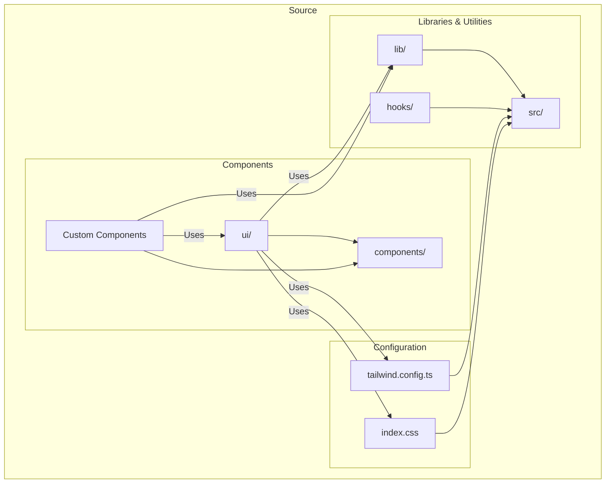
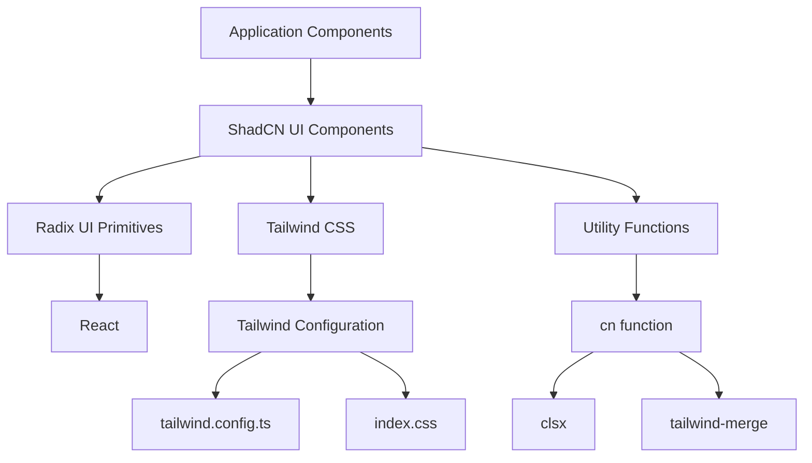
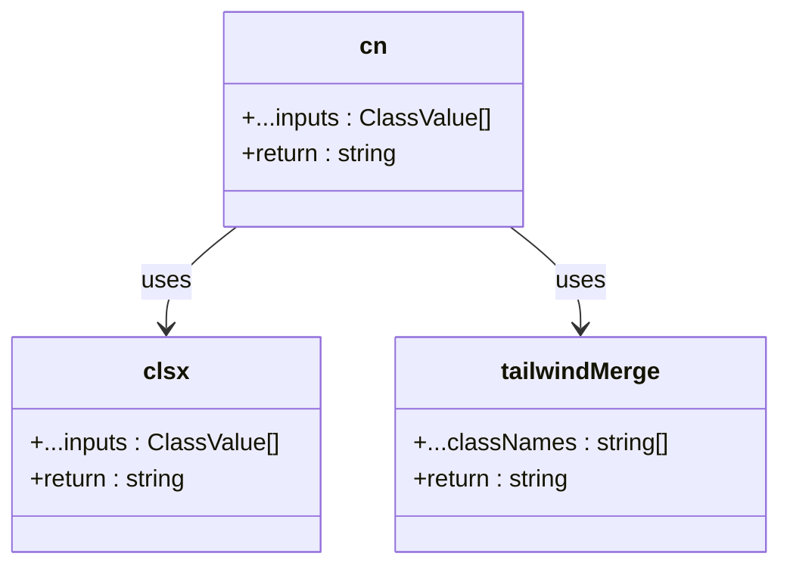
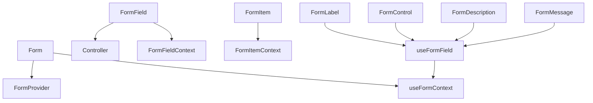
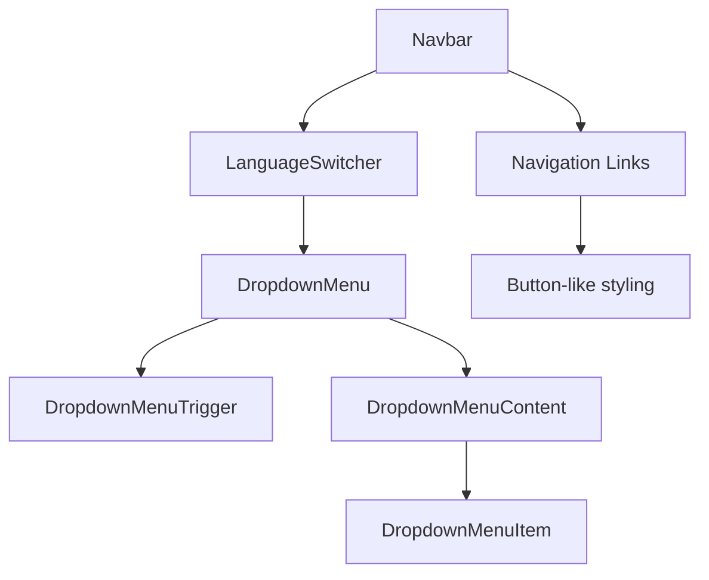
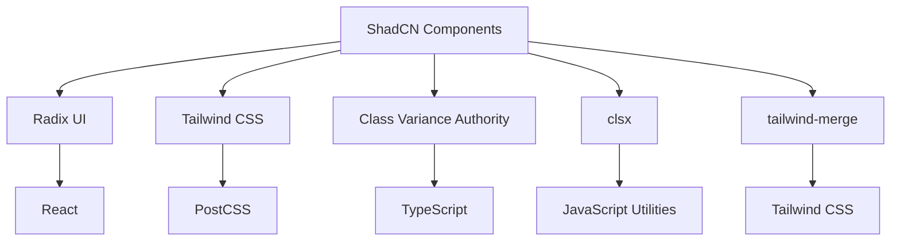

# UI Component Library Integration

> **Referenced Files in This Document**   
> - [utils.ts](src/lib/utils.ts)
> - [button.tsx](src/components/ui/button.tsx)
> - [card.tsx](src/components/ui/card.tsx)
> - [dialog.tsx](src/components/ui/dialog.tsx)
> - [dropdown-menu.tsx](src/components/ui/dropdown-menu.tsx)
> - [form.tsx](src/components/ui/form.tsx)
> - [input.tsx](src/components/ui/input.tsx)
> - [label.tsx](src/components/ui/label.tsx)
> - [checkbox.tsx](src/components/ui/checkbox.tsx)
> - [radio-group.tsx](src/components/ui/radio-group.tsx)
> - [select.tsx](src/components/ui/select.tsx)
> - [Navbar.tsx](src/components/Navbar.tsx)
> - [LanguageSwitcher.tsx](src/components/LanguageSwitcher.tsx)
> - [components.json](components.json)
> - [tailwind.config.ts](tailwind.config.ts)
> - [index.css](src/index.css)
> - [package.json](package.json)

## Table of Contents
1. [Introduction](#introduction)
2. [Project Structure](#project-structure)
3. [Core Components](#core-components)
4. [Architecture Overview](#architecture-overview)
5. [Detailed Component Analysis](#detailed-component-analysis)
6. [Dependency Analysis](#dependency-analysis)
7. [Performance Considerations](#performance-considerations)
8. [Troubleshooting Guide](#troubleshooting-guide)
9. [Conclusion](#conclusion)

## Introduction
This document provides comprehensive documentation for the ShadCN UI component library integration in the Syrian Community Day of Freedom (SC-DOF) project. The UI system is built on Radix UI primitives and styled with Tailwind CSS, following modern component architecture principles. The implementation leverages pre-built, accessible components to ensure design consistency, reduce development time, and maintain high accessibility standards. This documentation covers the core utility functions, component composition patterns, usage examples, and integration guidelines for maintaining a cohesive design system.

## Project Structure

The project follows a modular structure with clear separation of concerns. UI components are organized in a dedicated directory with atomic design principles, while utility functions and configuration files support the overall styling and behavior system.



**Diagram sources**
- [src/components/ui](src/components/ui)
- [src/lib/utils.ts](src/lib/utils.ts)
- [tailwind.config.ts](tailwind.config.ts)
- [index.css](src/index.css)

**Section sources**
- [project_structure](project_structure)
- [src/components](src/components)

## Core Components

The ShadCN UI component library provides a collection of pre-built, accessible components that serve as the foundation for the application's user interface. These components are built on Radix UI primitives, ensuring proper accessibility semantics, keyboard navigation, and screen reader compatibility. The core components include Button, Card, Dialog, DropdownMenu, Form, Input, Label, Checkbox, and others, all styled consistently with Tailwind CSS. These components are designed to be composable and extensible through props rather than inheritance, enabling flexible customization while maintaining design system consistency.

**Section sources**
- [src/components/ui/button.tsx](src/components/ui/button.tsx)
- [src/components/ui/card.tsx](src/components/ui/card.tsx)
- [src/components/ui/dialog.tsx](src/components/ui/dialog.tsx)
- [src/components/ui/dropdown-menu.tsx](src/components/ui/dropdown-menu.tsx)
- [src/components/ui/form.tsx](src/components/ui/form.tsx)

## Architecture Overview

The UI architecture follows a layered approach with ShadCN components at the foundation, built on Radix UI accessibility primitives and styled with Tailwind CSS. The system uses a utility-first CSS approach with component-specific styling and global theme configuration. The architecture enables consistent design patterns across the application while allowing for targeted customization through props and conditional logic.



**Diagram sources**
- [src/components/ui/*.tsx](src/components/ui)
- [src/lib/utils.ts](src/lib/utils.ts)
- [tailwind.config.ts](tailwind.config.ts)
- [index.css](src/index.css)

## Detailed Component Analysis

### Component Composition and Utility Functions

The component library relies heavily on composition rather than inheritance, allowing developers to customize appearance and behavior through props. This approach promotes reusability and maintainability across the codebase.

#### Utility Function: cn
The `cn` function from `utils.ts` is a critical utility that combines Tailwind classes with conditional logic, enabling dynamic class composition. It uses `clsx` for conditional class evaluation and `tailwind-merge` to safely merge Tailwind classes without conflicts.



**Diagram sources**
- [src/lib/utils.ts](src/lib/utils.ts#L1-L7)

**Section sources**
- [src/lib/utils.ts](src/lib/utils.ts#L1-L7)

### UI Component Implementation Patterns

#### Button Component Analysis
The Button component demonstrates the use of `cva` (Class Variant Authority) for defining variant and size styles, allowing for consistent styling across different button types. It supports composition through the `asChild` prop, enabling it to render as different HTML elements while maintaining styling.

```mermaid
classDiagram
class Button {
+className : string
+variant : 'default' | 'destructive' | 'outline' | 'secondary' | 'ghost' | 'link'
+size : 'default' | 'sm' | 'lg' | 'icon'
+asChild : boolean
}
class buttonVariants {
+variants : { variant, size }
+defaultVariants : { variant : 'default', size : 'default' }
}
Button --> buttonVariants : uses
Button --> cn : uses
```

**Diagram sources**
- [src/components/ui/button.tsx](src/components/ui/button.tsx#L1-L48)

**Section sources**
- [src/components/ui/button.tsx](src/components/ui/button.tsx#L1-L48)

#### Form Component Architecture
The Form component system uses React Hook Form for state management and validation, providing a robust foundation for form handling. It implements a context-based architecture with FormField, FormItem, FormLabel, FormControl, FormDescription, and FormMessage components that work together to create accessible forms.



**Diagram sources**
- [src/components/ui/form.tsx](src/components/ui/form.tsx#L1-L130)

**Section sources**
- [src/components/ui/form.tsx](src/components/ui/form.tsx#L1-L130)

### Real-World Usage Examples

#### Navbar and Language Switcher Integration
The Navbar component demonstrates practical usage of ShadCN components in a real-world scenario, combining Button patterns with DropdownMenu for language switching functionality.



**Diagram sources**
- [src/components/Navbar.tsx](src/components/Navbar.tsx#L1-L123)
- [src/components/LanguageSwitcher.tsx](src/components/LanguageSwitcher.tsx#L1-L44)

**Section sources**
- [src/components/Navbar.tsx](src/components/Navbar.tsx#L1-L123)
- [src/components/LanguageSwitcher.tsx](src/components/LanguageSwitcher.tsx#L1-L44)

## Dependency Analysis

The component library has well-defined dependencies that support its functionality and styling. These dependencies are managed through npm and configured in the project's package.json and components.json files.



**Diagram sources**
- [package.json](package.json#L1-L85)
- [components.json](components.json#L1-L21)

**Section sources**
- [package.json](package.json#L1-L85)
- [components.json](components.json#L1-L21)

## Performance Considerations

The component library implementation follows performance best practices including tree-shaking through selective imports, efficient class merging with tailwind-merge, and minimal re-renders through proper React component patterns. The use of Radix UI primitives ensures optimal accessibility performance with minimal overhead. The configuration in components.json enables proper bundling and optimization of UI components.

## Troubleshooting Guide

Common issues in the ShadCN UI integration include styling conflicts, version mismatches, and accessibility compliance problems. To address styling conflicts, ensure proper use of the `cn` utility function and avoid direct Tailwind class conflicts. For version mismatches, maintain consistent versions of Radix UI, Tailwind CSS, and related dependencies as specified in package.json. Accessibility issues can be mitigated by following the built-in accessibility patterns of Radix UI components and testing with screen readers and keyboard navigation. When adding new components, use the ShadCN CLI to ensure proper integration with the existing design system.

**Section sources**
- [package.json](package.json#L1-L85)
- [components.json](components.json#L1-L21)
- [tailwind.config.ts](tailwind.config.ts#L1-L98)

## Conclusion

The ShadCN UI component library integration provides a robust foundation for the application's user interface, leveraging Radix UI primitives for accessibility and Tailwind CSS for styling. The architecture promotes consistency, reduces development time, and ensures high accessibility standards. By following the composition-based approach and utilizing the provided utility functions, developers can create cohesive user interfaces while maintaining flexibility for customization. The documented patterns and examples serve as a guide for maintaining design system consistency and addressing common implementation challenges.