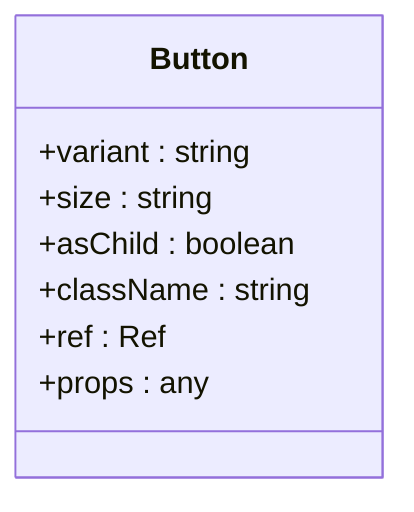
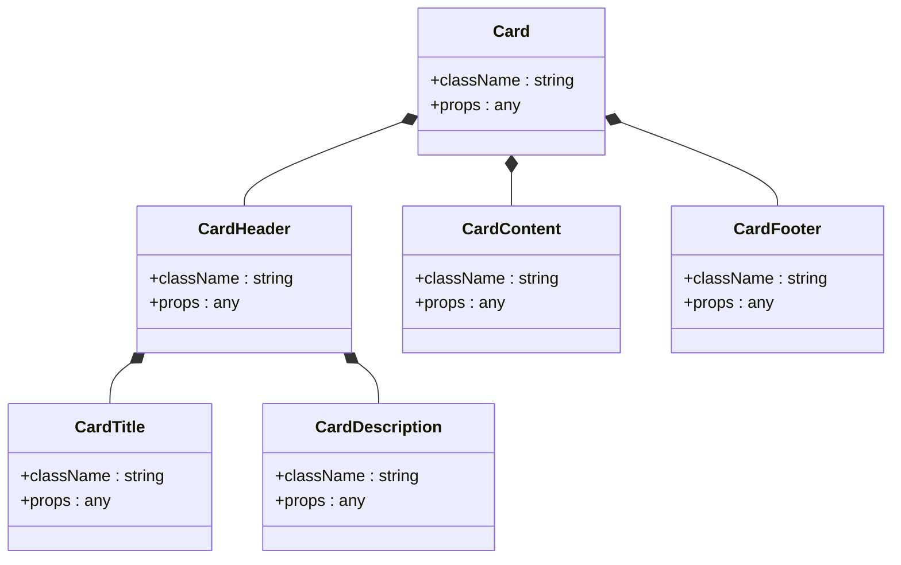
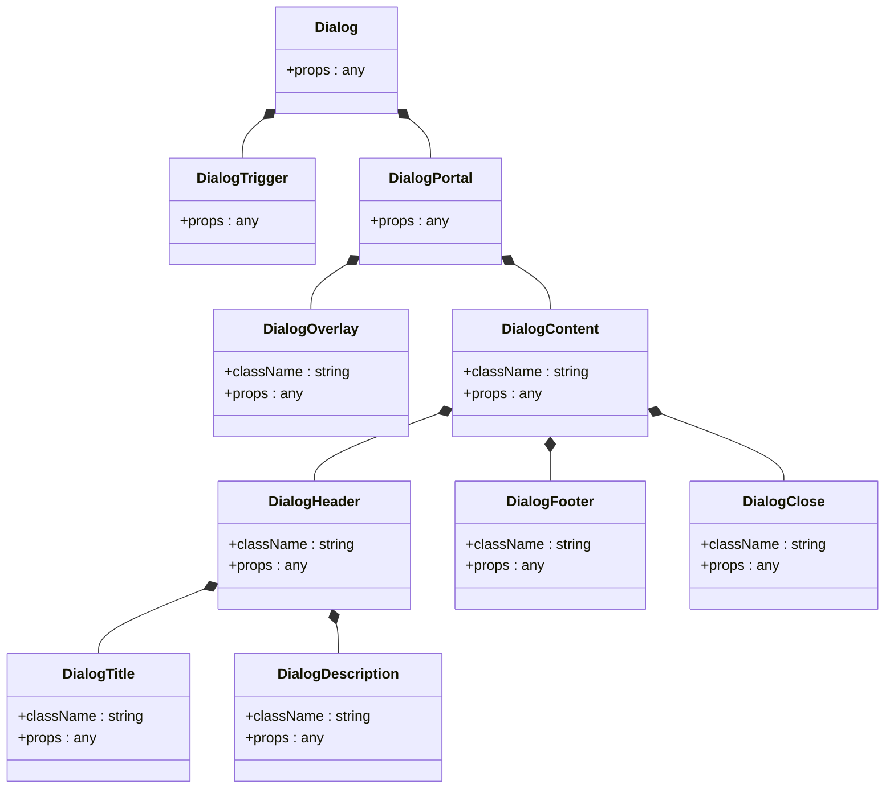
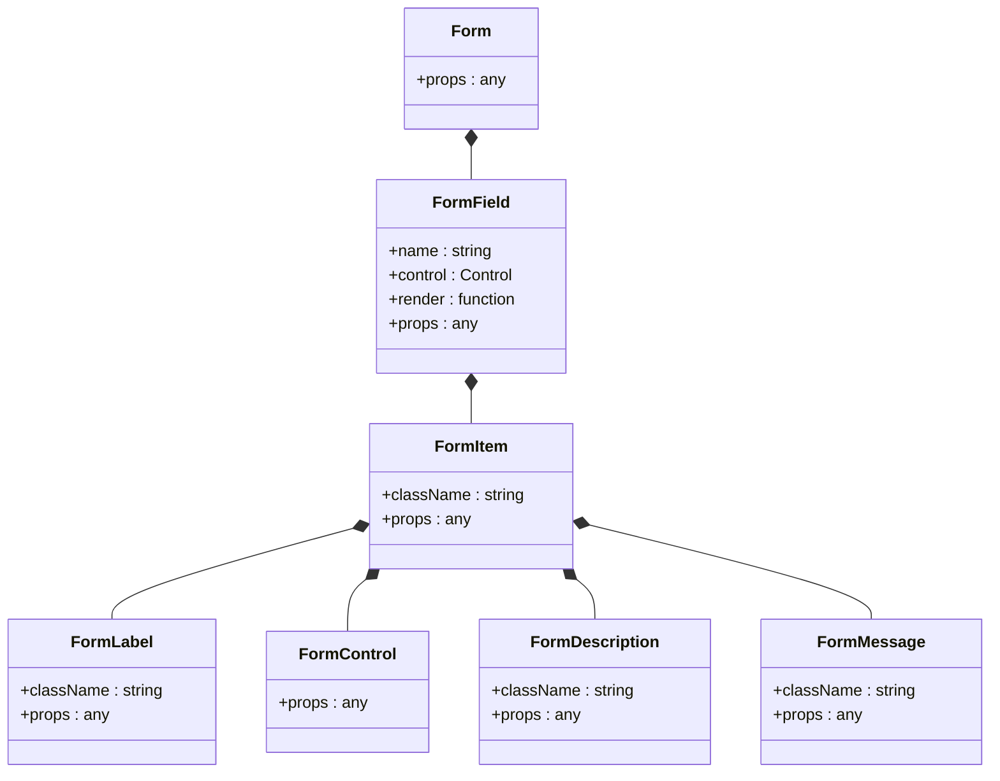
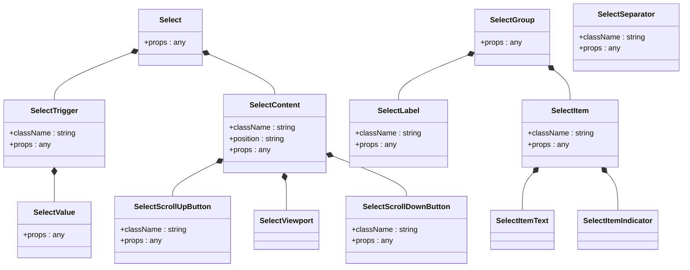
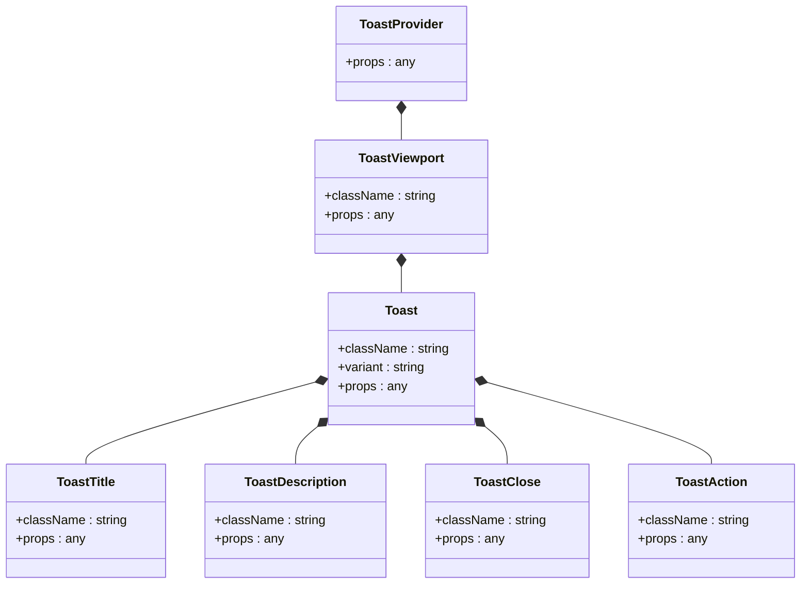
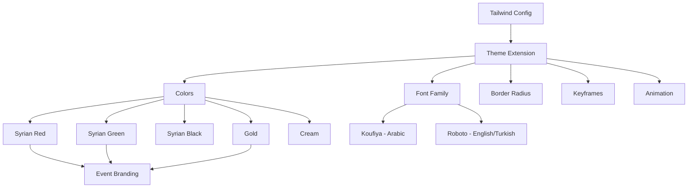

# Component Reference

> **Referenced Files in This Document**   
> - [HeroSection.tsx](src/components/HeroSection.tsx)
> - [CountdownTimer.tsx](src/components/CountdownTimer.tsx)
> - [RegistrationSection.tsx](src/components/RegistrationSection.tsx)
> - [button.tsx](src/components/ui/button.tsx)
> - [dialog.tsx](src/components/ui/dialog.tsx)
> - [card.tsx](src/components/ui/card.tsx)
> - [form.tsx](src/components/ui/form.tsx)
> - [input.tsx](src/components/ui/input.tsx)
> - [select.tsx](src/components/ui/select.tsx)
> - [toast.tsx](src/components/ui/toast.tsx)
> - [use-toast.ts](src/components/ui/use-toast.ts)
> - [avatar.tsx](src/components/ui/avatar.tsx)
> - [badge.tsx](src/components/ui/badge.tsx)
> - [table.tsx](src/components/ui/table.tsx)
> - [tabs.tsx](src/components/ui/tabs.tsx)
> - [tailwind.config.ts](tailwind.config.ts)
> - [utils.ts](src/lib/utils.ts)
> - [App.tsx](src/App.tsx)

## Table of Contents
1. [Introduction](#introduction)
2. [Custom Application Components](#custom-application-components)
   - [HeroSection](#herosection)
   - [CountdownTimer](#countdowntimer)
   - [RegistrationSection](#registrationsection)
3. [ShadCN UI Components](#shadcn-ui-components)
   - [Button](#button)
   - [Card](#card)
   - [Dialog](#dialog)
   - [Form](#form)
   - [Input](#input)
   - [Select](#select)
   - [Toast](#toast)
   - [Avatar](#avatar)
   - [Badge](#badge)
   - [Table](#table)
   - [Tabs](#tabs)
4. [Theming and Styling System](#theming-and-styling-system)
5. [Accessibility Features](#accessibility-features)
6. [Responsive Design Guidelines](#responsive-design-guidelines)
7. [Performance Optimization Tips](#performance-optimization-tips)
8. [Common Implementation Issues](#common-implementation-issues)

## Introduction
This document provides comprehensive reference documentation for all reusable UI components in the Syrian Community Day of Freedom application. The component library consists of two main categories: custom application components designed specifically for this event website, and ShadCN UI components built on Radix UI primitives that provide accessible, styled building blocks. All components follow a consistent design system with support for multiple languages (Arabic, English, Turkish) and responsive layouts across device sizes.

## Custom Application Components

### HeroSection
The HeroSection component serves as the main landing page header, featuring a full-screen background with event branding, countdown timer, and call-to-action. It displays the Syrian eagle emblem, national flag, and multilingual event information with animated elements.

**Visual Appearance**: The component features a hero image background with gradient overlay, decorative confetti animation, centered content with event title, subtitle, tagline, and date information. The Syrian eagle and flag are prominently displayed with subtle animations.

**Behavior**: The component is static but includes CSS animations for fade-in effects on page load. It automatically adapts to the current language context for all text content.

**Accessibility Features**: All images include appropriate alt text in Arabic, and the component follows semantic HTML structure with proper heading hierarchy.

**Responsive Design**: The component adjusts font sizes and spacing across breakpoints, with optimized layout for mobile, tablet, and desktop views.

**Section sources**
- [HeroSection.tsx](src/components/HeroSection.tsx#L1-L99)

### CountdownTimer
The CountdownTimer component displays a real-time countdown to the event date with days, hours, minutes, and seconds. It updates every second and supports multilingual labels for time units.

**Props**: This component has no configurable props. It uses the `useLanguage` hook to determine the current language and display appropriate time unit labels.

**Events**: The component automatically updates the displayed time every second through an interval timer managed with useEffect.

**Usage Patterns**: The component is designed to be used as a standalone element within other sections. It automatically calculates time remaining until December 20, 2025, at 18:00.

**Visual Appearance**: Time units are displayed in individual glass-morphism cards with subtle hover effects and background glow. Each unit shows a two-digit value with leading zero if necessary.

**Accessibility Features**: The component uses semantic HTML and ensures sufficient color contrast. Screen readers will announce the updated time values as they change.

**Performance Considerations**: The component efficiently manages the interval timer, cleaning it up on unmount to prevent memory leaks.

**Section sources**
- [CountdownTimer.tsx](src/components/CountdownTimer.tsx#L1-L78)

### RegistrationSection
The RegistrationSection component provides event registration functionality through a QR code and button link. It features a prominent design with visual emphasis on the registration action.

**Props**: This component has no configurable props. It uses the `useLanguage` hook to determine the current language and display appropriate text content.

**Events**: The component includes a button that opens the registration form in a new tab when clicked. The QR code can be scanned to access the same form.

**Usage Patterns**: The component should be placed in a prominent location on the page, typically after the main event information sections.

**Visual Appearance**: The component features a card with corner decorations, containing a QR code with glow effect and a call-to-action button with hover animation. Decorative elements in Syrian green create visual interest.

**Accessibility Features**: The button includes proper focus states and keyboard navigation support. The QR code is contained within a descriptive card with appropriate text alternatives.

**Responsive Design**: The component adjusts the size of the QR code and button across breakpoints, ensuring usability on all device sizes.

**Section sources**
- [RegistrationSection.tsx](src/components/RegistrationSection.tsx#L1-L105)

## ShadCN UI Components

### Button
The Button component is a versatile interactive element with multiple variants and sizes, built on Radix UI primitives with Tailwind CSS styling.

**Props**:
- `variant`: "default" | "destructive" | "outline" | "secondary" | "ghost" | "link" (default: "default")
- `size`: "default" | "sm" | "lg" | "icon" (default: "default")
- `asChild`: boolean (default: false)
- Inherits all standard HTML button attributes

**Events**: Standard button events (onClick, onMouseEnter, etc.) are supported through spread props.

**Usage Patterns**: Use the Button component for all interactive actions. The `asChild` prop allows rendering the button styles on other elements like anchors.

**Diagram sources**
- [button.tsx](src/components/ui/button.tsx#L1-L48)

**Section sources**
- [button.tsx](src/components/ui/button.tsx#L1-L48)

### Card
The Card component provides a container for grouping related content with a consistent visual style, including header, title, description, content, and footer sections.

**Composition**: The Card component is composed of several sub-components:
- Card: The main container
- CardHeader: Top section containing title and description
- CardTitle: Main heading
- CardDescription: Supporting text
- CardContent: Main content area
- CardFooter: Bottom section for actions

**Props**: Each sub-component accepts standard HTML div attributes through the className and ...props spread.

**Usage Patterns**: Use Card to organize content into distinct sections. Combine sub-components as needed for different layouts.

**Diagram sources**
- [card.tsx](src/components/ui/card.tsx#L1-L44)

**Section sources**
- [card.tsx](src/components/ui/card.tsx#L1-L44)

### Dialog
The Dialog component provides a modal interface for displaying content that requires user attention, built on Radix UI's dialog primitive with enhanced styling.

**Composition**: The Dialog system includes:
- Dialog: Root component
- DialogTrigger: Opens the dialog
- DialogPortal: Renders content in a portal
- DialogOverlay: Background overlay
- DialogContent: Main dialog container
- DialogHeader: Header section
- DialogFooter: Footer section
- DialogTitle: Title element
- DialogDescription: Description text
- DialogClose: Close button

**Props**: Each component accepts standard HTML attributes appropriate to its element type.

**Events**: The component handles open/close state management and provides a close button with proper accessibility semantics.

**Diagram sources**
- [dialog.tsx](src/components/ui/dialog.tsx#L1-L96)

**Section sources**
- [dialog.tsx](src/components/ui/dialog.tsx#L1-L96)

### Form
The Form component provides a comprehensive form handling system built on react-hook-form with accessible styling and validation support.

**Composition**: The Form system includes:
- Form: FormProvider wrapper
- FormField: Controller wrapper for form fields
- FormItem: Container for form elements
- FormLabel: Accessible label
- FormControl: Controlled input element
- FormDescription: Helper text
- FormMessage: Validation error message

**Props**: The system uses React context to manage form state, with each component receiving appropriate props for its role.

**Usage Patterns**: Wrap forms with the Form component and use FormField for each input. The system automatically handles accessibility attributes and error states.

**Diagram sources**
- [form.tsx](src/components/ui/form.tsx#L1-L130)

**Section sources**
- [form.tsx](src/components/ui/form.tsx#L1-L130)

### Input
The Input component provides a styled text input element with consistent styling and accessibility features.

**Props**: Inherits all standard HTML input attributes with type="text" default. Accepts className for additional styling.

**Events**: Supports all standard input events (onChange, onFocus, etc.) through spread props.

**Usage Patterns**: Use for all text input fields. Can be composed with other form components like FormField and FormItem for complete form controls.

**Accessibility Features**: Includes proper focus states, placeholder text with appropriate contrast, and support for screen readers.

**Section sources**
- [input.tsx](src/components/ui/input.tsx#L1-L23)

### Select
The Select component provides a styled dropdown menu built on Radix UI's select primitive with enhanced visual design.

**Composition**: The Select system includes:
- Select: Root component
- SelectGroup: Group of options
- SelectValue: Displayed value
- SelectTrigger: Control that opens the dropdown
- SelectContent: Container for options
- SelectLabel: Group label
- SelectItem: Individual option
- SelectSeparator: Visual separator
- SelectScrollUpButton: Scroll control
- SelectScrollDownButton: Scroll control

**Props**: Each component accepts appropriate props for its role, with SelectItem supporting value and children.

**Accessibility Features**: Fully keyboard navigable with arrow keys, proper focus management, and screen reader support.

**Diagram sources**
- [select.tsx](src/components/ui/select.tsx#L1-L144)

**Section sources**
- [select.tsx](src/components/ui/select.tsx#L1-L144)

### Toast
The Toast component provides a notification system for displaying temporary messages to users, built on Radix UI's toast primitive.

**Composition**: The Toast system includes:
- ToastProvider: Context provider
- ToastViewport: Container for toasts
- Toast: Individual toast element
- ToastTitle: Title of the toast
- ToastDescription: Content of the toast
- ToastClose: Close button
- ToastAction: Action button

**Props**: Toast supports variant ("default" | "destructive") and standard HTML attributes.

**Usage Patterns**: Use the useToast hook to programmatically show toasts. The system automatically handles positioning and dismissal.

**Diagram sources**
- [toast.tsx](src/components/ui/toast.tsx#L1-L112)

**Section sources**
- [toast.tsx](src/components/ui/toast.tsx#L1-L112)

### Avatar
The Avatar component displays user profile images with fallback text when images are unavailable.

**Composition**: The Avatar system includes:
- Avatar: Main container
- AvatarImage: Image element
- AvatarFallback: Fallback text/content

**Props**: Accepts standard HTML attributes for each component with appropriate styling.

**Usage Patterns**: Use for displaying user profile pictures throughout the application. The fallback displays when the image fails to load.

**Accessibility Features**: Includes appropriate alt text handling and focus states.

**Section sources**
- [avatar.tsx](src/components/ui/avatar.tsx#L1-L39)

### Badge
The Badge component displays small status indicators or labels with different visual styles.

**Props**:
- `variant`: "default" | "secondary" | "destructive" | "outline" (default: "default")
- Inherits standard HTML div attributes

**Usage Patterns**: Use for categorizing content, showing status, or highlighting information.

**Section sources**
- [badge.tsx](src/components/ui/badge.tsx#L1-L30)

### Table
The Table component provides a styled data table with consistent formatting and responsive behavior.

**Composition**: The Table system includes:
- Table: Main container
- TableHeader: Header section
- TableBody: Body section
- TableFooter: Footer section
- TableRow: Individual row
- TableHead: Header cell
- TableCell: Data cell
- TableCaption: Table caption

**Props**: Each component accepts appropriate HTML table element attributes.

**Responsive Design**: The table scrolls horizontally on small screens to maintain readability.

**Section sources**
- [table.tsx](src/components/ui/table.tsx#L1-L73)

### Tabs
The Tabs component provides a tabbed interface for organizing content into multiple sections.

**Composition**: The Tabs system includes:
- Tabs: Root component
- TabsList: Container for tab triggers
- TabsTrigger: Individual tab button
- TabsContent: Content panel for each tab

**Props**: Supports standard HTML attributes with data-state for active/inactive states.

**Accessibility Features**: Fully keyboard navigable with arrow keys, proper focus management, and ARIA attributes.

**Section sources**
- [tabs.tsx](src/components/ui/tabs.tsx#L1-L54)

## Theming and Styling System
The application uses a comprehensive theming system based on CSS variables and Tailwind CSS, with support for the Syrian national colors and event-specific design elements.

**Color Palette**: The theme defines several custom color variables:
- Syrian national colors: red, green, black
- Gold accent color
- Cream neutral color
- Sidebar-specific colors

**Typography**: The application uses different fonts based on language:
- Bahij Koufiya and Cairo fonts for Arabic (RTL)
- Roboto font for English and Turkish (LTR)

**CSS Variables**: The theme uses CSS custom properties (defined in CSS files, not shown in tailwind.config.ts) for colors, spacing, and radii, allowing for easy theme customization.

**Styling Utilities**: The cn utility function combines class names using clsx and tailwind-merge to handle conditional classes and prevent Tailwind CSS class conflicts.

**Diagram sources**
- [tailwind.config.ts](tailwind.config.ts#L1-L98)
- [utils.ts](src/lib/utils.ts#L1-L7)

**Section sources**
- [tailwind.config.ts](tailwind.config.ts#L1-L98)
- [utils.ts](src/lib/utils.ts#L1-L7)
- [App.tsx](src/App.tsx#L1-L43)

## Accessibility Features
The component library prioritizes accessibility across all components with comprehensive support for assistive technologies.

**Keyboard Navigation**: All interactive components support keyboard navigation with proper focus management. Tab order is logical and consistent.

**Screen Reader Support**: Components use appropriate ARIA attributes, semantic HTML elements, and accessible labels. Dynamic content updates are announced to screen readers.

**Color Contrast**: The theme ensures sufficient color contrast between text and background colors, meeting WCAG 2.1 AA standards.

**Focus Indicators**: All interactive elements have visible focus states that meet accessibility requirements.

**Language Support**: The application supports multiple languages with proper dir attribute handling for RTL (Arabic) and LTR (English, Turkish) layouts.

**Section sources**
- [App.tsx](src/App.tsx#L1-L43)
- [button.tsx](src/components/ui/button.tsx#L1-L48)
- [dialog.tsx](src/components/ui/dialog.tsx#L1-L96)
- [form.tsx](src/components/ui/form.tsx#L1-L130)

## Responsive Design Guidelines
The component library is designed to be fully responsive across all device sizes with consistent behavior and appearance.

**Breakpoints**: The application uses standard Tailwind CSS breakpoints:
- Mobile: up to 640px
- Tablet: 640px to 1024px
- Desktop: 1024px and above

**Layout Adaptation**: Components adjust their layout, spacing, and typography based on screen size. The HeroSection, for example, reduces font sizes and adjusts spacing on smaller screens.

**Mobile Optimization**: Interactive elements have appropriate touch targets (minimum 44px), and navigation is simplified for mobile users.

**Image Handling**: Background images and other media are optimized for different screen sizes with appropriate sizing and positioning.

**Section sources**
- [HeroSection.tsx](src/components/HeroSection.tsx#L1-L99)
- [tailwind.config.ts](tailwind.config.ts#L1-L98)

## Performance Optimization Tips
To ensure optimal performance when using these components, follow these best practices:

**Component Composition**: Use the asChild prop when possible to avoid unnecessary wrapper divs and reduce DOM complexity.

**Conditional Rendering**: Only render components when needed, especially heavy ones like Dialog or complex forms.

**Event Handling**: The components properly clean up event listeners and intervals (like the CountdownTimer) to prevent memory leaks.

**Image Optimization**: Use appropriately sized images and leverage browser caching. The application already uses optimized image formats (webp, png).

**Code Splitting**: Consider lazy loading less frequently used components to reduce initial bundle size.

**Avoid Unnecessary Re-renders**: The components use React.memo and proper dependency arrays in hooks to prevent unnecessary re-renders.

**Section sources**
- [CountdownTimer.tsx](src/components/CountdownTimer.tsx#L1-L78)
- [button.tsx](src/components/ui/button.tsx#L1-L48)
- [dialog.tsx](src/components/ui/dialog.tsx#L1-L96)

## Common Implementation Issues
When working with these components, developers may encounter the following common issues:

**Language Context Missing**: Ensure that components using useLanguage are rendered within the LanguageProvider context. Otherwise, they will throw errors or display undefined text.

**Form Validation Errors**: When using the Form components, ensure that react-hook-form is properly configured with a form context. Missing FormProvider will cause FormField components to fail.

**Dialog Portal Issues**: The Dialog component uses a portal, which may cause z-index conflicts with other absolutely positioned elements. Adjust z-index values as needed.

**Responsive Layout Breaks**: When customizing components, ensure that responsive classes are preserved to maintain mobile compatibility.

**Theming Inconsistencies**: When overriding styles, use the cn utility function to properly merge classes and avoid conflicts with existing Tailwind classes.

**Section sources**
- [HeroSection.tsx](src/components/HeroSection.tsx#L1-L99)
- [App.tsx](src/App.tsx#L1-L43)
- [form.tsx](src/components/ui/form.tsx#L1-L130)
- [dialog.tsx](src/components/ui/dialog.tsx#L1-L96)