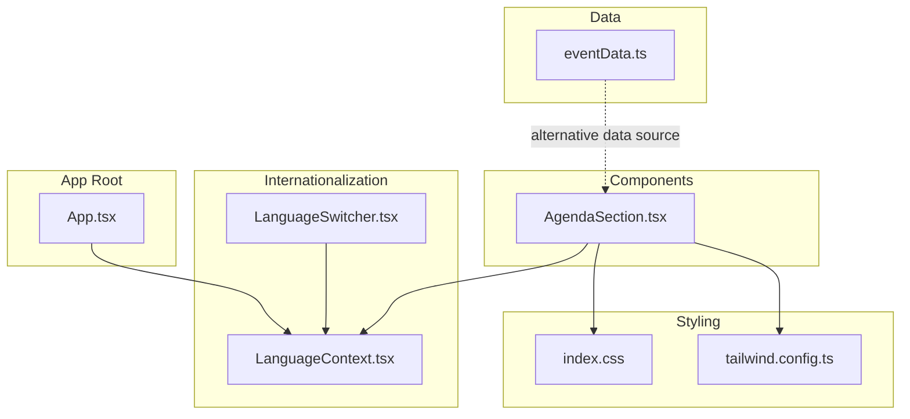
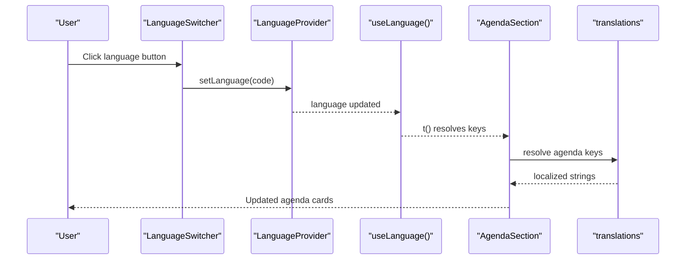
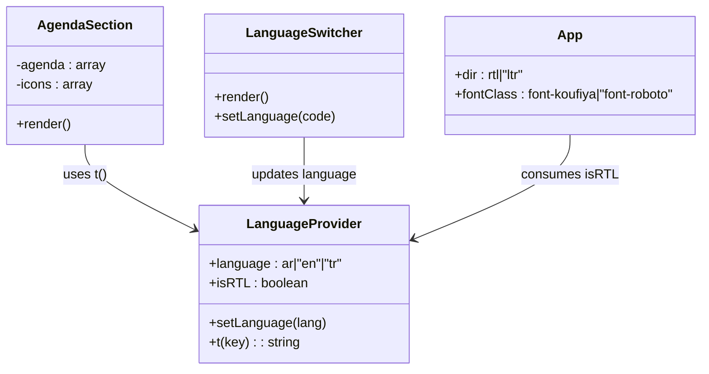
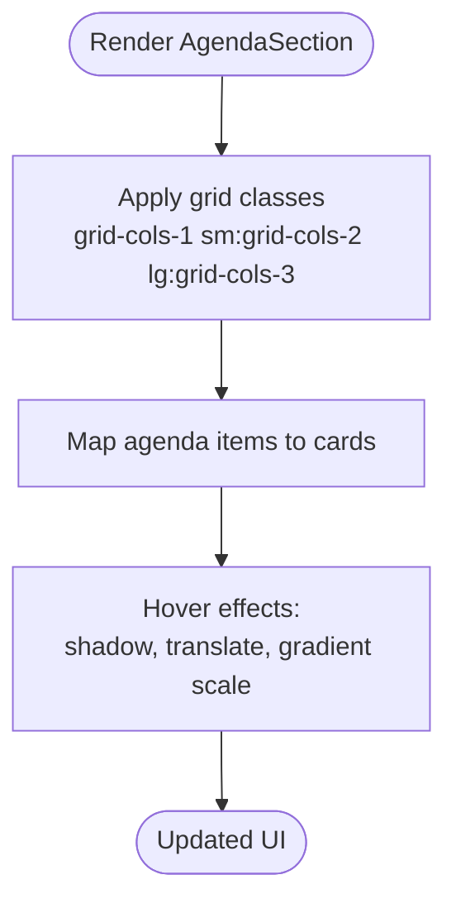
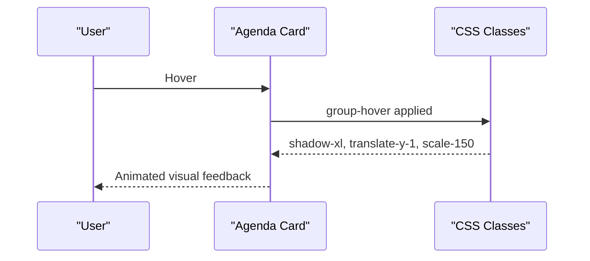
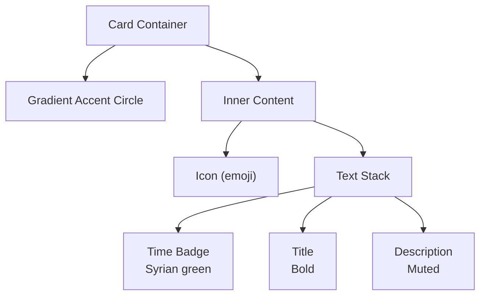
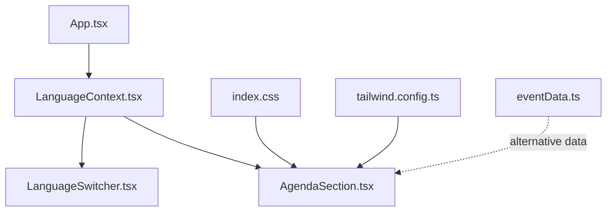

# Agenda Section

> **Referenced Files in This Document**
> - [AgendaSection.tsx](src/components/AgendaSection.tsx)
> - [LanguageContext.tsx](src/contexts/LanguageContext.tsx)
> - [LanguageSwitcher.tsx](src/components/LanguageSwitcher.tsx)
> - [App.tsx](src/App.tsx)
> - [index.css](src/index.css)
> - [tailwind.config.ts](tailwind.config.ts)
> - [eventData.ts](src/data/eventData.ts)

## Table of Contents
1. [Introduction](#introduction)
2. [Project Structure](#project-structure)
3. [Core Components](#core-components)
4. [Architecture Overview](#architecture-overview)
5. [Detailed Component Analysis](#detailed-component-analysis)
6. [Dependency Analysis](#dependency-analysis)
7. [Performance Considerations](#performance-considerations)
8. [Troubleshooting Guide](#troubleshooting-guide)
9. [Conclusion](#conclusion)
10. [Appendices](#appendices)

## Introduction
This document explains the AgendaSection component that renders the event schedule as a responsive card grid. It covers how agenda items are sourced from translation files using the t() function, how icons are mapped, the responsive grid layout, interactive hover effects, card structure (including time badges, typography, and icons), accessibility considerations, and how the component adapts to RTL layouts when Arabic is selected. It also provides guidance on adding new agenda items and maintaining consistent translation key naming.

## Project Structure
The AgendaSection component is located under src/components and integrates with the internationalization system in src/contexts. The translation keys for agenda items are defined in LanguageContext.tsx. The app’s root container applies directionality and fonts based on the selected language.

**Diagram sources**
- [AgendaSection.tsx](src/components/AgendaSection.tsx#L1-L64)
- [LanguageContext.tsx](src/contexts/LanguageContext.tsx#L1-L292)
- [LanguageSwitcher.tsx](src/components/LanguageSwitcher.tsx#L1-L44)
- [App.tsx](src/App.tsx#L1-L43)
- [index.css](src/index.css#L55-L104)
- [tailwind.config.ts](tailwind.config.ts#L44-L84)
- [eventData.ts](src/data/eventData.ts#L47-L84)

**Section sources**
- [AgendaSection.tsx](src/components/AgendaSection.tsx#L1-L64)
- [LanguageContext.tsx](src/contexts/LanguageContext.tsx#L1-L292)
- [LanguageSwitcher.tsx](src/components/LanguageSwitcher.tsx#L1-L44)
- [App.tsx](src/App.tsx#L1-L43)
- [index.css](src/index.css#L55-L104)
- [tailwind.config.ts](tailwind.config.ts#L44-L84)
- [eventData.ts](src/data/eventData.ts#L47-L84)

## Core Components
- AgendaSection: Renders a responsive grid of agenda cards, sourcing content via t(), mapping icons from a predefined list, and applying interactive hover effects.
- LanguageContext: Provides the t() function, language state, and isRTL flag used by AgendaSection and other components.
- LanguageSwitcher: Allows changing the language, which updates all translated content including agenda items.
- App: Applies directionality (dir) and font family based on the current language.

Key responsibilities:
- AgendaSection: Translation integration, responsive grid, hover animations, card structure.
- LanguageContext: Translation dictionary, fallback behavior, RTL detection.
- LanguageSwitcher: Language selection UI and persistence.
- App: Global direction and font application.

**Section sources**
- [AgendaSection.tsx](src/components/AgendaSection.tsx#L1-L64)
- [LanguageContext.tsx](src/contexts/LanguageContext.tsx#L1-L292)
- [LanguageSwitcher.tsx](src/components/LanguageSwitcher.tsx#L1-L44)
- [App.tsx](src/App.tsx#L1-L43)

## Architecture Overview
The AgendaSection component depends on the LanguageContext for translations and on global styles for colors and responsive breakpoints. The LanguageSwitcher updates the language, which triggers re-renders across the app, including the AgendaSection.

**Diagram sources**
- [LanguageSwitcher.tsx](src/components/LanguageSwitcher.tsx#L1-L44)
- [LanguageContext.tsx](src/contexts/LanguageContext.tsx#L269-L292)
- [AgendaSection.tsx](src/components/AgendaSection.tsx#L1-L64)

## Detailed Component Analysis

### AgendaSection Component
Responsibilities:
- Source agenda items from translation keys using t().
- Map a static list of emoji icons to agenda entries.
- Render a responsive grid of cards with hover effects.
- Display time badges styled with Syrian green.
- Apply hierarchical typography and integrate icons.

Responsive grid:
- Mobile: 1 column (grid-cols-1)
- Tablet: 2 columns (sm:grid-cols-2)
- Desktop: 3 columns (lg:grid-cols-3)
- Gap and max width controlled for readability.

Hover effects:
- Shadow elevation increase (hover:shadow-xl)
- Subtle upward lift (hover:-translate-y-1)
- Smooth transitions (transition-all duration-300)
- Gradient accent circle scales on hover (group-hover:scale-150)

Card structure:
- Relative container with rounded corners and border.
- Absolute gradient accent circle positioned at top-right, scaled on hover.
- Inner content with icon and text stack.
- Time badge styled with Syrian green.
- Title and description with appropriate typography and muted colors.

Accessibility considerations:
- Heading levels: The section title is an h2; individual agenda items are rendered as headings inside cards. Ensure semantic headings match content hierarchy. Consider wrapping each agenda item in a heading element if needed for screen readers.
- Focus states: Hover effects are present; ensure keyboard focus visibility is maintained by default browser focus rings or custom focus styles.
- Language direction: When Arabic is selected, the app sets dir="rtl" at the root, which affects layout direction and alignment.

RTL adaptation:
- The root App component sets dir={isRTL ? 'rtl' : 'ltr'} based on the current language.
- Arabic triggers isRTL, which flips horizontal layout and alignment for the entire app.

Translation integration:
- Uses t() to resolve agenda keys such as agenda.title, agenda.subtitle, and agenda.N.time/title/description.
- Icons are mapped from a static array of emojis.

**Section sources**
- [AgendaSection.tsx](src/components/AgendaSection.tsx#L1-L64)
- [LanguageContext.tsx](src/contexts/LanguageContext.tsx#L56-L80)
- [App.tsx](src/App.tsx#L12-L20)

### Translation System (LanguageContext)
- Provides t(key) that returns the localized string for the current language or falls back to the key itself.
- Maintains translations for Arabic, English, and Turkish.
- Exposes isRTL based on the current language.
- Used by AgendaSection and other components to render localized content.

Key translation keys for agenda:
- agenda.title, agenda.subtitle
- agenda.1.time, agenda.1.title, agenda.1.description
- agenda.2.time, agenda.2.title, agenda.2.description
- And so on up to agenda.7.

Fallback behavior:
- If a translation key is missing, t() returns the key string unchanged.

**Section sources**
- [LanguageContext.tsx](src/contexts/LanguageContext.tsx#L1-L292)

### LanguageSwitcher Integration
- Offers buttons for Arabic, English, and Turkish.
- Updates the language via setLanguage, which changes isRTL and triggers re-renders.
- Font switching: The App component applies font-koufiya for Arabic and font-roboto for English/Turkish.

**Section sources**
- [LanguageSwitcher.tsx](src/components/LanguageSwitcher.tsx#L1-L44)
- [App.tsx](src/App.tsx#L12-L20)

### Styling and Theme
- Custom color tokens include syrian-green and others defined in CSS variables.
- Tailwind theme exposes syrian colors for direct usage in components.
- Gradient accents and shadows are configured globally and used in AgendaSection.

**Section sources**
- [index.css](src/index.css#L55-L104)
- [tailwind.config.ts](tailwind.config.ts#L44-L84)

### Alternative Data Source (eventData.ts)
- The eventData.ts file contains an agenda array with time, title, description, and icon fields.
- While AgendaSection currently sources agenda items from translations, the eventData.ts file demonstrates an alternate data model that could be used to populate the component programmatically.

**Section sources**
- [eventData.ts](src/data/eventData.ts#L47-L84)

## Architecture Overview

**Diagram sources**
- [LanguageContext.tsx](src/contexts/LanguageContext.tsx#L269-L292)
- [AgendaSection.tsx](src/components/AgendaSection.tsx#L1-L64)
- [LanguageSwitcher.tsx](src/components/LanguageSwitcher.tsx#L1-L44)
- [App.tsx](src/App.tsx#L12-L20)

## Detailed Component Analysis

### Responsive Design and Grid Behavior
- Mobile-first grid: 1 column on small screens.
- Tablet breakpoint: 2 columns.
- Desktop breakpoint: 3 columns.
- Container constraints and spacing ensure readability across devices.

**Diagram sources**
- [AgendaSection.tsx](src/components/AgendaSection.tsx#L31-L58)

**Section sources**
- [AgendaSection.tsx](src/components/AgendaSection.tsx#L31-L58)

### Interactive Hover Effects
- Shadow elevation increases on hover.
- Card lifts slightly upward.
- Gradient accent circle scales up and rotates position on hover.
- Smooth transitions for all animations.

**Diagram sources**
- [AgendaSection.tsx](src/components/AgendaSection.tsx#L33-L58)

**Section sources**
- [AgendaSection.tsx](src/components/AgendaSection.tsx#L33-L58)

### Card Structure and Typography
- Relative container with rounded corners and border.
- Absolute gradient accent circle for visual emphasis.
- Inner content:
  - Icon (emoji) aligned with text.
  - Time badge with Syrian green styling.
  - Title with bold typography and hover color change.
  - Description with muted color and smaller size.

**Diagram sources**
- [AgendaSection.tsx](src/components/AgendaSection.tsx#L33-L58)

**Section sources**
- [AgendaSection.tsx](src/components/AgendaSection.tsx#L33-L58)

### Accessibility Considerations
- Heading levels: Ensure each agenda item has a proper heading element to convey hierarchy to assistive technologies.
- Focus states: Maintain visible focus indicators for keyboard navigation.
- Language direction: When Arabic is selected, the root dir is set to rtl, affecting layout and alignment.
- Font choice: Arabic uses a specific font class; ensure readable line heights and contrast.

**Section sources**
- [App.tsx](src/App.tsx#L12-L20)

### RTL Layout Adaptation
- The LanguageContext determines isRTL based on the current language.
- The App component sets dir={isRTL ? 'rtl' : 'ltr'} at the root.
- This affects text alignment, icon positions, and layout mirroring across the app.

**Section sources**
- [LanguageContext.tsx](src/contexts/LanguageContext.tsx#L272-L278)
- [App.tsx](src/App.tsx#L12-L20)

## Dependency Analysis

**Diagram sources**
- [LanguageContext.tsx](src/contexts/LanguageContext.tsx#L1-L292)
- [AgendaSection.tsx](src/components/AgendaSection.tsx#L1-L64)
- [LanguageSwitcher.tsx](src/components/LanguageSwitcher.tsx#L1-L44)
- [App.tsx](src/App.tsx#L1-L43)
- [index.css](src/index.css#L55-L104)
- [tailwind.config.ts](tailwind.config.ts#L44-L84)
- [eventData.ts](src/data/eventData.ts#L47-L84)

**Section sources**
- [LanguageContext.tsx](src/contexts/LanguageContext.tsx#L1-L292)
- [AgendaSection.tsx](src/components/AgendaSection.tsx#L1-L64)
- [LanguageSwitcher.tsx](src/components/LanguageSwitcher.tsx#L1-L44)
- [App.tsx](src/App.tsx#L1-L43)
- [index.css](src/index.css#L55-L104)
- [tailwind.config.ts](tailwind.config.ts#L44-L84)
- [eventData.ts](src/data/eventData.ts#L47-L84)

## Performance Considerations
- Translation resolution is O(1) per key via a lookup map.
- Hover animations use CSS transitions; keep durations reasonable to avoid jank.
- Grid layout relies on Tailwind utilities; ensure minimal reflows by avoiding excessive dynamic class toggles.
- Consider memoizing agenda arrays if data becomes dynamic and expensive to compute.

## Troubleshooting Guide
- Missing translations:
  - Symptoms: Keys appear as plain strings instead of localized content.
  - Cause: Missing key in the current language’s translation dictionary.
  - Fix: Add the key to the appropriate language section in the translation dictionary.

- Incorrect agenda count or ordering:
  - Cause: Mismatch between the number of entries and the number of translation keys.
  - Fix: Ensure each agenda item has corresponding translation keys and that the mapping aligns with the intended order.

- Hover effects not visible:
  - Cause: Overriding CSS or disabled transitions.
  - Fix: Verify Tailwind utilities and ensure no conflicting styles override hover classes.

- RTL layout issues:
  - Symptoms: Misaligned icons or text direction.
  - Cause: Language not set to Arabic or missing dir attribute.
  - Fix: Confirm LanguageSwitcher updates language and that App applies dir="rtl".

- Adding new agenda items:
  - Steps:
    - Add translation keys for the new item in all supported languages.
    - Increment the numbering in the agenda mapping and ensure the icon mapping remains consistent.
    - Verify responsive grid renders correctly across breakpoints.

**Section sources**
- [LanguageContext.tsx](src/contexts/LanguageContext.tsx#L269-L292)
- [AgendaSection.tsx](src/components/AgendaSection.tsx#L8-L16)
- [LanguageSwitcher.tsx](src/components/LanguageSwitcher.tsx#L1-L44)
- [App.tsx](src/App.tsx#L12-L20)

## Conclusion
The AgendaSection component provides a clean, responsive display of event agenda items using the translation system. It leverages Tailwind utilities for responsive grids and interactive hover effects, integrates icons, and adapts to RTL layouts when Arabic is selected. By following the translation key naming convention and ensuring consistent icon mapping, new agenda items can be added reliably across languages.

## Appendices

### Translation Key Naming Guidance
- Use the pattern: agenda.N.field where N is the agenda segment number and field is time, title, or description.
- Maintain consistent numbering and language parity across all supported languages.
- Keep icon mapping synchronized with agenda entries.

**Section sources**
- [LanguageContext.tsx](src/contexts/LanguageContext.tsx#L56-L80)
- [AgendaSection.tsx](src/components/AgendaSection.tsx#L8-L16)