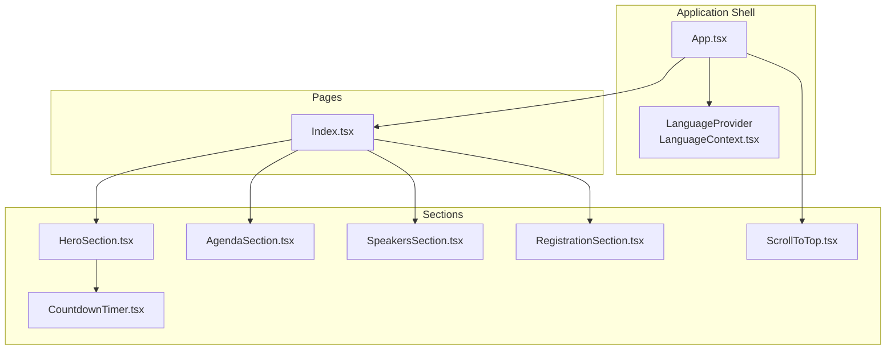
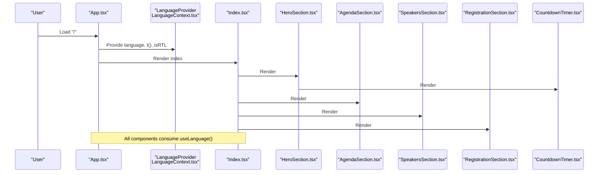
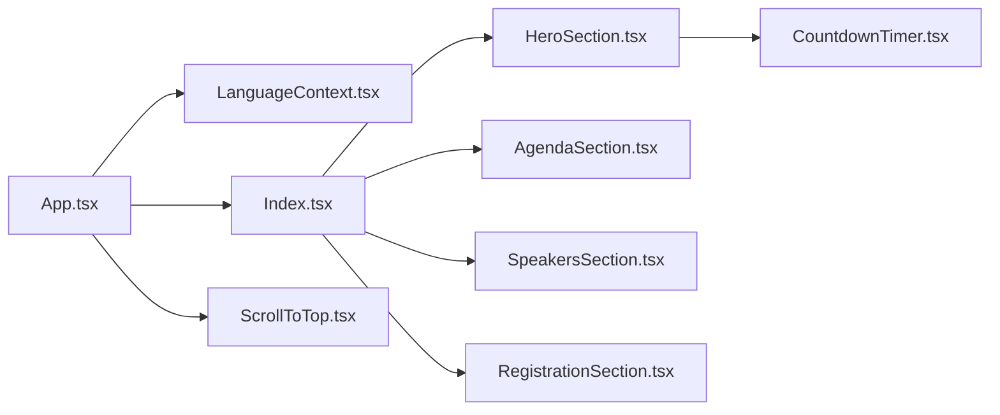

# Custom Components

> **Referenced Files in This Document**
> - [HeroSection.tsx](src/components/HeroSection.tsx)
> - [AgendaSection.tsx](src/components/AgendaSection.tsx)
> - [SpeakersSection.tsx](src/components/SpeakersSection.tsx)
> - [RegistrationSection.tsx](src/components/RegistrationSection.tsx)
> - [CountdownTimer.tsx](src/components/CountdownTimer.tsx)
> - [Index.tsx](src/pages/Index.tsx)
> - [App.tsx](src/App.tsx)
> - [LanguageContext.tsx](src/contexts/LanguageContext.tsx)
> - [eventData.ts](src/data/eventData.ts)
> - [ScrollToTop.tsx](src/components/ScrollToTop.tsx)
> - [tailwind.config.ts](tailwind.config.ts)
> - [utils.ts](src/lib/utils.ts)

## Table of Contents
1. [Introduction](#introduction)
2. [Project Structure](#project-structure)
3. [Core Components](#core-components)
4. [Architecture Overview](#architecture-overview)
5. [Detailed Component Analysis](#detailed-component-analysis)
6. [Dependency Analysis](#dependency-analysis)
7. [Performance Considerations](#performance-considerations)
8. [Troubleshooting Guide](#troubleshooting-guide)
9. [Conclusion](#conclusion)

## Introduction
This document provides comprehensive documentation for the custom components used in the event platform, focusing on HeroSection, AgendaSection, SpeakersSection, and RegistrationSection. It explains each component’s purpose, props interface, integration with the global language context, real-world usage from the Index page, data flow from eventData.ts, responsive behavior, accessibility considerations, animation patterns, internationalization support (including RTL for Arabic), and performance optimization techniques. It also addresses common implementation issues such as language context propagation, scroll-to-top integration, and mobile responsiveness.

## Project Structure
The event platform is organized around a page-driven layout where the Index page composes multiple sections. Global state is managed via a LanguageProvider that supplies translation keys and directionality. Components consume the language context to render localized content and adapt layouts accordingly.

**Diagram sources**
- [App.tsx](src/App.tsx#L1-L43)
- [LanguageContext.tsx](src/contexts/LanguageContext.tsx#L1-L292)
- [Index.tsx](src/pages/Index.tsx#L1-L32)
- [HeroSection.tsx](src/components/HeroSection.tsx#L1-L99)
- [AgendaSection.tsx](src/components/AgendaSection.tsx#L1-L64)
- [SpeakersSection.tsx](src/components/SpeakersSection.tsx#L1-L238)
- [RegistrationSection.tsx](src/components/RegistrationSection.tsx#L1-L105)
- [CountdownTimer.tsx](src/components/CountdownTimer.tsx#L1-L78)
- [ScrollToTop.tsx](src/components/ScrollToTop.tsx#L1-L41)

**Section sources**
- [App.tsx](src/App.tsx#L1-L43)
- [Index.tsx](src/pages/Index.tsx#L1-L32)

## Core Components
This section introduces the four custom components and their roles within the event platform.

- HeroSection: The hero section showcases the event identity with decorative elements, a countdown timer, and a call-to-action anchor to the “Why” section. It relies on the language context for all text content and uses Tailwind utilities for responsive design and animations.
- AgendaSection: Presents the event program as a grid of cards, each containing a time slot, title, description, and icon. It translates content via the language context and adapts layout across breakpoints.
- SpeakersSection: Displays featured speakers with multilingual names and roles. It selects the appropriate language for display and falls back gracefully if images are missing.
- RegistrationSection: Provides a QR code and registration link with localized copy and a prominent call-to-action button. It dynamically chooses localized text based on the current language.

**Section sources**
- [HeroSection.tsx](src/components/HeroSection.tsx#L1-L99)
- [AgendaSection.tsx](src/components/AgendaSection.tsx#L1-L64)
- [SpeakersSection.tsx](src/components/SpeakersSection.tsx#L1-L238)
- [RegistrationSection.tsx](src/components/RegistrationSection.tsx#L1-L105)

## Architecture Overview
The components integrate with the global language context and are composed by the Index page. The App shell wraps the application with providers that supply language, directionality, routing, and UI utilities.

**Diagram sources**
- [App.tsx](src/App.tsx#L1-L43)
- [LanguageContext.tsx](src/contexts/LanguageContext.tsx#L1-L292)
- [Index.tsx](src/pages/Index.tsx#L1-L32)
- [HeroSection.tsx](src/components/HeroSection.tsx#L1-L99)
- [AgendaSection.tsx](src/components/AgendaSection.tsx#L1-L64)
- [SpeakersSection.tsx](src/components/SpeakersSection.tsx#L1-L238)
- [RegistrationSection.tsx](src/components/RegistrationSection.tsx#L1-L105)
- [CountdownTimer.tsx](src/components/CountdownTimer.tsx#L1-L78)

## Detailed Component Analysis

### HeroSection
Purpose:
- Establishes the hero identity with decorative imagery, animated confetti, and a countdown timer.
- Provides a smooth scroll anchor to the “Why” section.

Props interface:
- None. Uses the language context for all text and renders static assets.

Integration with global state:
- Consumes useLanguage() to translate title, subtitle, tagline, date, day, and discover-more text.
- Uses Tailwind classes for responsive typography and spacing.

Responsive behavior:
- Responsive typography scales from base to extra-large across breakpoints.
- Grid and spacing utilities adapt to small, medium, and large screens.

Accessibility considerations:
- Alt texts for decorative images reflect cultural symbols.
- Anchor link targets a section id for smooth navigation.

Animation patterns:
- Uses CSS animations for confetti and fade-in effects.
- Hover and transition utilities enhance interactivity.

Internationalization support:
- Text content is driven by translation keys from the language context.
- Directionality is controlled globally by the app shell.

Common implementation issues:
- Ensure translation keys exist for all hero strings.
- Verify asset paths resolve correctly in production builds.

Performance considerations:
- Static images are pre-imported; consider lazy-loading offscreen images if the hero grows larger.
- Animation performance depends on CSS; keep keyframe complexity minimal.

**Section sources**
- [HeroSection.tsx](src/components/HeroSection.tsx#L1-L99)
- [LanguageContext.tsx](src/contexts/LanguageContext.tsx#L1-L292)
- [CountdownTimer.tsx](src/components/CountdownTimer.tsx#L1-L78)

### AgendaSection
Purpose:
- Presents the event program as a responsive grid of activity cards.

Props interface:
- None. Uses the language context for agenda entries.

Integration with global state:
- Translates each agenda item’s time, title, and description via translation keys.
- Maintains a local icon set for visual cues.

Responsive behavior:
- Single column on small screens, two columns on small and three columns on large screens.

Accessibility considerations:
- Semantic headings and paragraphs for screen readers.
- Hover and focus states improve keyboard navigation.

Animation patterns:
- Cards lift slightly on hover with subtle shadows and transitions.
- Gradient accents scale on hover for visual feedback.

Internationalization support:
- Content is fully localized through the language context.

Common implementation issues:
- Ensure translation keys for agenda segments exist and are consistent.
- Icons should remain accessible even if emoji rendering varies.

Performance considerations:
- Rendering a fixed list; no heavy computations.
- Consider virtualizing if the agenda grows significantly.

**Section sources**
- [AgendaSection.tsx](src/components/AgendaSection.tsx#L1-L64)
- [LanguageContext.tsx](src/contexts/LanguageContext.tsx#L1-L292)

### SpeakersSection
Purpose:
- Displays a grid of speakers with multilingual names and roles.

Props interface:
- None. Uses the language context for display.

Integration with global state:
- Uses language context to select the appropriate name and role based on current language.
- Falls back to a placeholder when an image is missing.

Responsive behavior:
- One column on small screens, two on medium, three on large, and four on extra-large screens.

Accessibility considerations:
- Alt text uses the selected name for the current language.
- Headings and paragraphs provide context for assistive technologies.

Animation patterns:
- Staggered fade-in animations for each speaker card.

Internationalization support:
- Names and roles are provided in Arabic, English, and Turkish.

Common implementation issues:
- Ensure all speakers have localized names and roles.
- Verify image imports resolve correctly.

Performance considerations:
- Speaker list is static; consider memoization if the list becomes dynamic and expensive to compute.
- Lazy-load images if the grid expands significantly.

**Section sources**
- [SpeakersSection.tsx](src/components/SpeakersSection.tsx#L1-L238)
- [LanguageContext.tsx](src/contexts/LanguageContext.tsx#L1-L292)

### RegistrationSection
Purpose:
- Encourages attendance with a QR code and registration link.

Props interface:
- None. Uses the language context for localized copy.

Integration with global state:
- Chooses localized title, subtitle, and button text based on the current language.
- Renders a QR code pointing to a predefined registration URL.

Responsive behavior:
- Centered layout with padding adjustments across breakpoints.

Accessibility considerations:
- Link opens in a new tab with safe attributes.
- Button text is descriptive and actionable.

Animation patterns:
- Decorative glow and corner accents enhance visual appeal.

Internationalization support:
- Localized strings are derived from the language context.

Common implementation issues:
- Ensure the registration URL remains valid.
- Verify QR code rendering across devices.

Performance considerations:
- QR code generation is lightweight; no significant overhead.

**Section sources**
- [RegistrationSection.tsx](src/components/RegistrationSection.tsx#L1-L105)
- [LanguageContext.tsx](src/contexts/LanguageContext.tsx#L1-L292)

### CountdownTimer (used by HeroSection)
Purpose:
- Displays the time remaining until the event date with localized units.

Props interface:
- None. Uses the language context for labels.

Integration with global state:
- Calculates time remaining and updates every second.
- Selects labels based on the current language.

Responsive behavior:
- Flex layout with wrapping and sizing adjustments across breakpoints.

Accessibility considerations:
- Numeric values are presented with monospaced digits for readability.

Animation patterns:
- Hover scaling and glow effects on time units.

Internationalization support:
- Units are localized for days, hours, minutes, and seconds.

Common implementation issues:
- Ensure the event date is correct and timezone-aware.
- Verify label availability for all supported languages.

Performance considerations:
- Minimal re-renders; interval cleanup prevents leaks.

**Section sources**
- [CountdownTimer.tsx](src/components/CountdownTimer.tsx#L1-L78)
- [LanguageContext.tsx](src/contexts/LanguageContext.tsx#L1-L292)

### Scroll-to-Top Integration
Purpose:
- Provides a floating button that appears when scrolling down and smoothly scrolls to the top.

Props interface:
- None. Uses browser APIs internally.

Integration with global state:
- No direct dependency on language context; part of the app shell composition.

Responsive behavior:
- Fixed positioning with visibility toggled based on scroll position.

Accessibility considerations:
- Clear aria-label for assistive technologies.
- Smooth scrolling behavior improves UX.

Common implementation issues:
- Ensure the button does not interfere with page content on small screens.
- Test scroll behavior across devices.

**Section sources**
- [ScrollToTop.tsx](src/components/ScrollToTop.tsx#L1-L41)
- [Index.tsx](src/pages/Index.tsx#L1-L32)

## Dependency Analysis
This section maps how components depend on each other and on global state.

**Diagram sources**
- [LanguageContext.tsx](src/contexts/LanguageContext.tsx#L1-L292)
- [App.tsx](src/App.tsx#L1-L43)
- [Index.tsx](src/pages/Index.tsx#L1-L32)
- [HeroSection.tsx](src/components/HeroSection.tsx#L1-L99)
- [AgendaSection.tsx](src/components/AgendaSection.tsx#L1-L64)
- [SpeakersSection.tsx](src/components/SpeakersSection.tsx#L1-L238)
- [RegistrationSection.tsx](src/components/RegistrationSection.tsx#L1-L105)
- [CountdownTimer.tsx](src/components/CountdownTimer.tsx#L1-L78)
- [ScrollToTop.tsx](src/components/ScrollToTop.tsx#L1-L41)

**Section sources**
- [LanguageContext.tsx](src/contexts/LanguageContext.tsx#L1-L292)
- [App.tsx](src/App.tsx#L1-L43)
- [Index.tsx](src/pages/Index.tsx#L1-L32)

## Performance Considerations
- Memoization: Consider memoizing speaker lists or agenda arrays if they become dynamic and expensive to compute.
- Lazy Loading: Lazy-load speaker images if the grid grows significantly to reduce initial payload.
- Animations: Keep CSS animations simple and avoid excessive transforms on large lists.
- Event Date Handling: The countdown timer updates every second; ensure intervals are cleaned up on unmount.
- Asset Management: Preload critical hero images and defer others to improve perceived performance.
- Tailwind Utilities: Use responsive variants judiciously to minimize CSS bloat.

[No sources needed since this section provides general guidance]

## Troubleshooting Guide
- Language context propagation:
  - Ensure components are rendered within the LanguageProvider.
  - Verify that useLanguage() is used inside the provider boundary.
  - Confirm translation keys exist for all strings used by components.

- Scroll-to-top integration:
  - Confirm the ScrollToTop component is included in the page layout.
  - Check that the button appears only when scrolling exceeds the threshold.

- Mobile responsiveness:
  - Validate responsive breakpoints for typography and spacing.
  - Ensure interactive elements are appropriately sized for touch targets.

- Internationalization (RTL):
  - The app sets dir="rtl" for Arabic; confirm fonts support Arabic script.
  - Verify that all text-align and layout utilities adapt correctly in RTL mode.

- Accessibility:
  - Provide meaningful alt texts for images.
  - Ensure links open in new tabs with safe attributes.
  - Add aria-labels for interactive elements without text.

**Section sources**
- [LanguageContext.tsx](src/contexts/LanguageContext.tsx#L1-L292)
- [App.tsx](src/App.tsx#L1-L43)
- [ScrollToTop.tsx](src/components/ScrollToTop.tsx#L1-L41)

## Conclusion
The custom components—HeroSection, AgendaSection, SpeakersSection, and RegistrationSection—are integral to the event platform’s presentation and localization. They rely on the LanguageProvider for translation and directionality, integrate seamlessly with the Index page, and leverage Tailwind utilities for responsive design and animations. By following the guidance in this document, developers can maintain consistency, improve accessibility, and optimize performance while extending the platform’s internationalization and user experience.