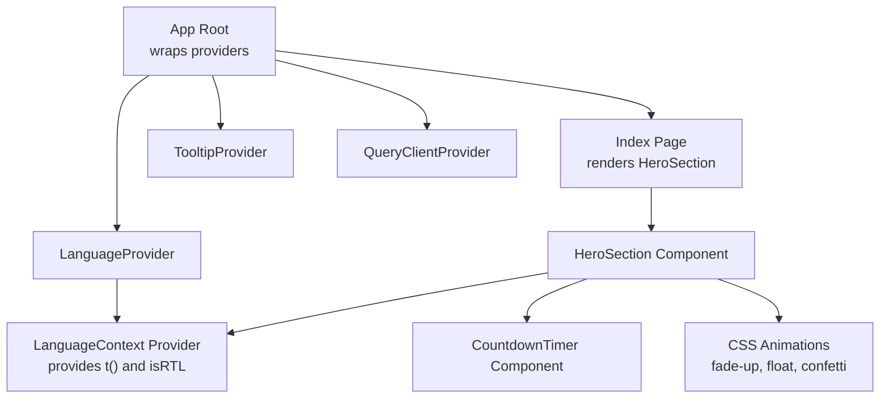
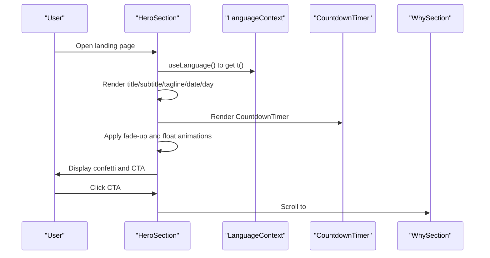
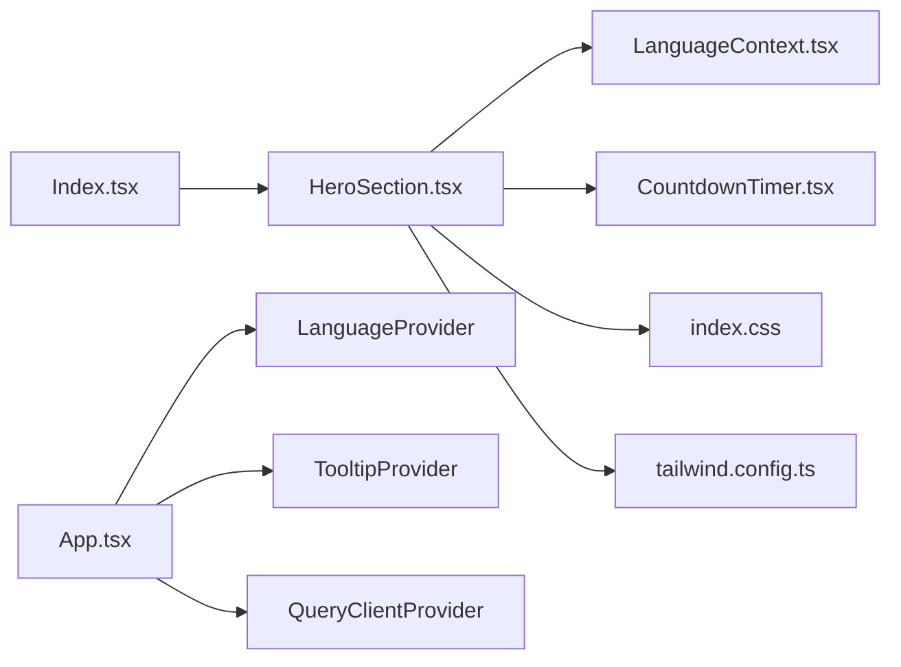

# Hero Section

<cite>
**Referenced Files in This Document**
- [HeroSection.tsx](file://src/components/HeroSection.tsx)
- [CountdownTimer.tsx](file://src/components/CountdownTimer.tsx)
- [LanguageContext.tsx](file://src/contexts/LanguageContext.tsx)
- [LanguageSwitcher.tsx](file://src/components/LanguageSwitcher.tsx)
- [App.tsx](file://src/App.tsx)
- [index.css](file://src/index.css)
- [tailwind.config.ts](file://tailwind.config.ts)
- [Index.tsx](file://src/pages/Index.tsx)
- [eventData.ts](file://src/data/eventData.ts)
</cite>

## Table of Contents
1. [Introduction](#introduction)
2. [Project Structure](#project-structure)
3. [Core Components](#core-components)
4. [Architecture Overview](#architecture-overview)
5. [Detailed Component Analysis](#detailed-component-analysis)
6. [Dependency Analysis](#dependency-analysis)
7. [Performance Considerations](#performance-considerations)
8. [Troubleshooting Guide](#troubleshooting-guide)
9. [Conclusion](#conclusion)

## Introduction
The HeroSection component is the primary landing view of the event platform. It showcases the event’s main branding elements—Syrian eagle emblem, flag, title, and tagline—while delivering a visually engaging experience through animated entrance effects and a decorative confetti system. It integrates the CountdownTimer component to display the time remaining until the event and provides a call-to-action (CTA) button that scrolls the user to the “Why” section. Multilingual support is powered by the LanguageContext, enabling translations for keys such as hero.title, hero.subtitle, hero.tagline, hero.date, hero.day, and hero.discoverMore. The component also manages RTL layout via the language context and applies responsive design using Tailwind utilities. Background image handling uses overlay gradients for readability, and the CTA button navigates smoothly to the WhySection anchor.

## Project Structure
The HeroSection is part of the components layer and is rendered by the Index page. It relies on shared design tokens and animations defined in the global stylesheet and Tailwind configuration.

**Diagram sources**
- [Index.tsx](file://src/pages/Index.tsx#L1-L32)
- [HeroSection.tsx](file://src/components/HeroSection.tsx#L1-L99)
- [LanguageContext.tsx](file://src/contexts/LanguageContext.tsx#L267-L292)
- [App.tsx](file://src/App.tsx#L1-L43)
- [index.css](file://src/index.css#L174-L249)

**Section sources**
- [Index.tsx](file://src/pages/Index.tsx#L1-L32)
- [HeroSection.tsx](file://src/components/HeroSection.tsx#L1-L99)
- [LanguageContext.tsx](file://src/contexts/LanguageContext.tsx#L267-L292)
- [App.tsx](file://src/App.tsx#L1-L43)

## Core Components
- HeroSection: Renders the hero view with branding, countdown, and CTA.
- CountdownTimer: Displays days/hours/minutes/seconds until the event date.
- LanguageContext: Provides translation function t(), current language, and RTL flag.
- LanguageSwitcher: Allows users to switch languages and toggles RTL and fonts.
- Global Styles: Define animations, gradients, and color tokens used by HeroSection.

Key responsibilities:
- Branding: Emblems and flags are displayed with responsive sizing and shadows.
- Multilingual: Uses t() to resolve translation keys for hero.title, hero.subtitle, hero.tagline, hero.date, hero.day, and hero.discoverMore.
- Animation: Implements fade-up entrance and floating motion for key elements.
- Layout: Responsive grid-like composition using Tailwind spacing and max-width utilities.
- Navigation: CTA scrolls to the “Why” section via anchor link.

**Section sources**
- [HeroSection.tsx](file://src/components/HeroSection.tsx#L1-L99)
- [CountdownTimer.tsx](file://src/components/CountdownTimer.tsx#L1-L78)
- [LanguageContext.tsx](file://src/contexts/LanguageContext.tsx#L1-L292)
- [LanguageSwitcher.tsx](file://src/components/LanguageSwitcher.tsx#L1-L44)
- [index.css](file://src/index.css#L174-L249)

## Architecture Overview
The HeroSection composes several pieces:
- Providers: LanguageProvider supplies translations and RTL state.
- Components: HeroSection renders CountdownTimer and uses t() for text.
- Styles: Tailwind utilities and custom animations define layout and motion.
- Routing: The CTA links to an anchor in the WhySection.

**Diagram sources**
- [HeroSection.tsx](file://src/components/HeroSection.tsx#L1-L99)
- [CountdownTimer.tsx](file://src/components/CountdownTimer.tsx#L1-L78)
- [LanguageContext.tsx](file://src/contexts/LanguageContext.tsx#L267-L292)
- [Index.tsx](file://src/pages/Index.tsx#L1-L32)

## Detailed Component Analysis

### HeroSection Component
Responsibilities:
- Background image with gradient overlay for readability.
- Decorative confetti animation system with randomized positions, colors, delays, and durations.
- Branding elements: Syrian eagle emblem and flag with responsive sizing and shadows.
- Text content: Title, subtitle, tagline, and date/day badges using t().
- CountdownTimer integration for time remaining.
- CTA button linking to the “Why” section anchor.

Layout and responsiveness:
- Uses relative positioning and z-index to layer content over the background.
- Applies Tailwind spacing utilities (padding, margin, max-width) to center content and maintain readability on small screens.
- Responsive typography scales from small to extra-large screen sizes.

Animations:
- Fade-up entrance for content blocks with staggered delays.
- Floating motion for the eagle emblem.
- Confetti falling animation across the viewport.

RTL and fonts:
- The app root applies dir based on isRTL from LanguageContext.
- Font selection switches between Koufiya (Arabic) and Roboto (English/Turkish) depending on language.

Accessibility:
- Alt texts are provided for branding images.
- Smooth scrolling is enabled globally for anchor navigation.

**Section sources**
- [HeroSection.tsx](file://src/components/HeroSection.tsx#L1-L99)
- [index.css](file://src/index.css#L174-L249)
- [tailwind.config.ts](file://tailwind.config.ts#L1-L98)
- [App.tsx](file://src/App.tsx#L1-L43)

### CountdownTimer Component
Responsibilities:
- Computes time remaining until a fixed event date.
- Provides localized labels for time units based on current language.
- Renders a grid of time units with hover effects and numeric formatting.

Behavior:
- Calculates days, hours, minutes, seconds and updates every second.
- Uses language-aware labels for unit names.
- Applies hover scaling and subtle background glow for interactivity.

**Section sources**
- [CountdownTimer.tsx](file://src/components/CountdownTimer.tsx#L1-L78)
- [LanguageContext.tsx](file://src/contexts/LanguageContext.tsx#L1-L292)

### Internationalization and RTL
Translation resolution:
- The t() function resolves keys such as hero.title, hero.subtitle, hero.tagline, hero.date, hero.day, and hero.discoverMore from the LanguageContext translations object.
- Fallback behavior returns the key itself if a translation is missing.

RTL support:
- The isRTL flag is true when language is Arabic.
- The App root sets dir="rtl" for Arabic and dir="ltr" otherwise.
- Font switching: Arabic uses Koufiya; English and Turkish use Roboto.

LanguageSwitcher:
- Provides buttons to switch languages and reflects the active language with visual emphasis.
- Uses emoji flags for English and Turkish and a custom Syrian flag image for Arabic.

**Section sources**
- [LanguageContext.tsx](file://src/contexts/LanguageContext.tsx#L1-L292)
- [LanguageSwitcher.tsx](file://src/components/LanguageSwitcher.tsx#L1-L44)
- [App.tsx](file://src/App.tsx#L1-L43)

### Visual Design Tokens and Animations
Color palette and gradients:
- Custom tokens define Syrian red/green/black, gold, and cream.
- Gradient utilities are used for hero backgrounds and glows.

Typography:
- Tailwind fontFamily includes Koufiya and Roboto.
- HeroSection uses responsive text sizes and shadows for legibility.

Animations:
- fade-up: Smooth entrance with opacity and vertical movement.
- float: Continuous vertical bounce for the eagle emblem.
- confetti-fall: Randomized falling animation across the screen.

Staggered delays:
- delay-100, delay-200, delay-300, delay-400, delay-500 classes apply progressive delays for entrance sequences.

**Section sources**
- [index.css](file://src/index.css#L1-L249)
- [tailwind.config.ts](file://tailwind.config.ts#L1-L98)

### Scroll Navigation Behavior
- The CTA button in HeroSection uses an anchor link to navigate to the “Why” section.
- Smooth scrolling is enabled globally via the HTML scroll-behavior setting.
- The WhySection defines the anchor target with an id.

**Section sources**
- [HeroSection.tsx](file://src/components/HeroSection.tsx#L83-L93)
- [index.css](file://src/index.css#L135-L142)
- [Index.tsx](file://src/pages/Index.tsx#L1-L32)

## Dependency Analysis
HeroSection depends on:
- LanguageContext for translations and RTL state.
- CountdownTimer for dynamic time display.
- Global styles for animations and design tokens.

**Diagram sources**
- [HeroSection.tsx](file://src/components/HeroSection.tsx#L1-L99)
- [LanguageContext.tsx](file://src/contexts/LanguageContext.tsx#L267-L292)
- [CountdownTimer.tsx](file://src/components/CountdownTimer.tsx#L1-L78)
- [index.css](file://src/index.css#L174-L249)
- [tailwind.config.ts](file://tailwind.config.ts#L1-L98)
- [App.tsx](file://src/App.tsx#L1-L43)
- [Index.tsx](file://src/pages/Index.tsx#L1-L32)

**Section sources**
- [HeroSection.tsx](file://src/components/HeroSection.tsx#L1-L99)
- [LanguageContext.tsx](file://src/contexts/LanguageContext.tsx#L267-L292)
- [CountdownTimer.tsx](file://src/components/CountdownTimer.tsx#L1-L78)
- [index.css](file://src/index.css#L174-L249)
- [tailwind.config.ts](file://tailwind.config.ts#L1-L98)
- [App.tsx](file://src/App.tsx#L1-L43)
- [Index.tsx](file://src/pages/Index.tsx#L1-L32)

## Performance Considerations
- Background image handling:
  - The hero background uses a large image with a gradient overlay. Consider lazy-loading strategies for large images and optimizing image formats for faster delivery.
  - Overlay gradients reduce contrast issues but can increase render cost; ensure the gradient is lightweight and not overly complex.

- Animated confetti:
  - Rendering 15 confetti elements with random properties can be heavy on low-end devices. Consider reducing the count or disabling animations on smaller viewports.
  - Use transform-based animations (already used) for GPU acceleration.

- CountdownTimer:
  - Updates every second; keep the component lightweight. Avoid unnecessary re-renders by memoizing calculations if needed.

- Fonts:
  - Koufiya and Roboto fonts are loaded via @font-face and Tailwind font families. Ensure fonts are preloaded or cached to prevent layout shifts.

- Accessibility:
  - Alt texts are present for branding images.
  - Ensure sufficient color contrast against overlays and maintain readable font sizes across languages.

[No sources needed since this section provides general guidance]

## Troubleshooting Guide
- Translation keys not appearing:
  - Verify that the keys hero.title, hero.subtitle, hero.tagline, hero.date, hero.day, and hero.discoverMore exist in the LanguageContext translations for the active language.
  - Confirm that the LanguageProvider is wrapping the application and that useLanguage is used inside HeroSection.

- RTL layout issues:
  - Ensure the App root receives isRTL from LanguageContext and sets dir accordingly.
  - Confirm font switching logic applies Koufiya for Arabic and Roboto for English/Turkish.

- Confetti animation anomalies:
  - Check that the confetti container is positioned absolutely and covers the viewport.
  - Reduce the number of confetti elements or disable animations on mobile if performance is poor.

- CTA not scrolling:
  - Ensure the WhySection has the correct anchor id and that the CTA link points to the same id.
  - Confirm smooth scrolling is enabled globally.

- CountdownTimer not updating:
  - Verify the event date is correctly defined and that the interval cleanup occurs on unmount.

**Section sources**
- [LanguageContext.tsx](file://src/contexts/LanguageContext.tsx#L267-L292)
- [App.tsx](file://src/App.tsx#L1-L43)
- [HeroSection.tsx](file://src/components/HeroSection.tsx#L1-L99)
- [CountdownTimer.tsx](file://src/components/CountdownTimer.tsx#L1-L78)
- [index.css](file://src/index.css#L135-L142)

## Conclusion
The HeroSection delivers a rich, multilingual, and animated landing experience for the event platform. It integrates branding, countdown timing, and navigation while leveraging Tailwind utilities and global animations for visual polish. Through LanguageContext, it supports Arabic, English, and Turkish with proper RTL handling and font switching. The component’s responsive design and decorative confetti enhance engagement, while careful performance considerations help maintain smooth interactions across devices.