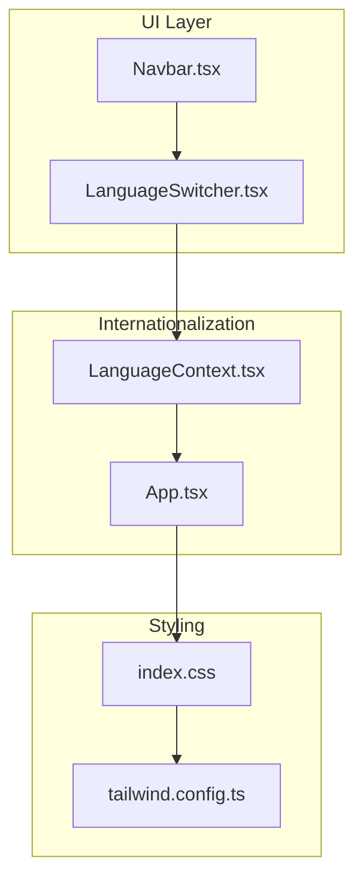
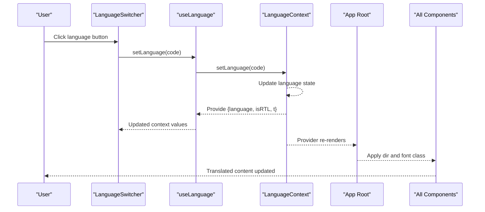
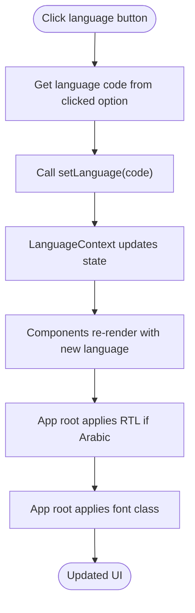
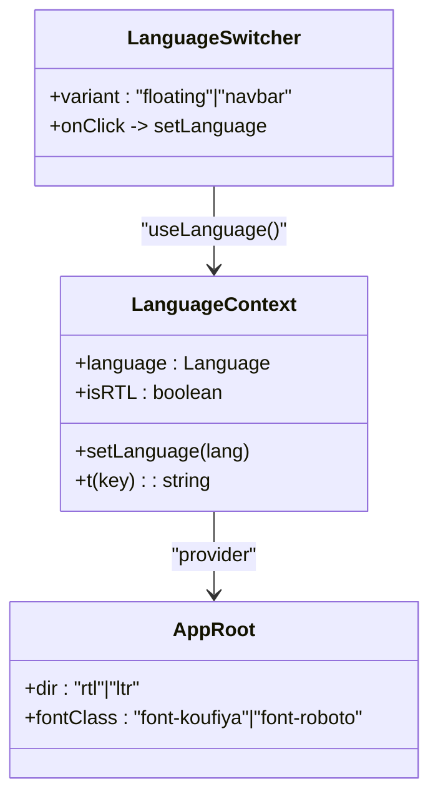
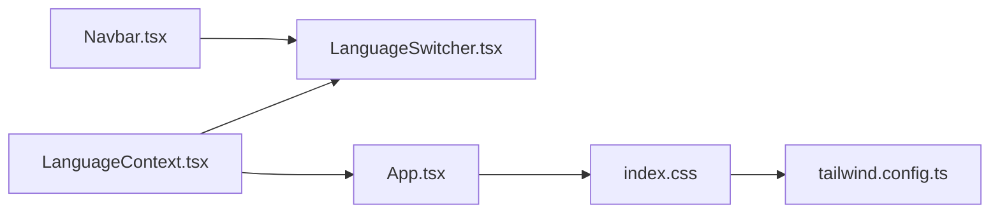

# Language Switcher

<cite>
**Referenced Files in This Document**
- [LanguageSwitcher.tsx](file://src/components/LanguageSwitcher.tsx)
- [LanguageContext.tsx](file://src/contexts/LanguageContext.tsx)
- [App.tsx](file://src/App.tsx)
- [Navbar.tsx](file://src/components/Navbar.tsx)
- [index.css](file://src/index.css)
- [tailwind.config.ts](file://tailwind.config.ts)
</cite>

## Table of Contents
1. [Introduction](#introduction)
2. [Project Structure](#project-structure)
3. [Core Components](#core-components)
4. [Architecture Overview](#architecture-overview)
5. [Detailed Component Analysis](#detailed-component-analysis)
6. [Dependency Analysis](#dependency-analysis)
7. [Performance Considerations](#performance-considerations)
8. [Troubleshooting Guide](#troubleshooting-guide)
9. [Conclusion](#conclusion)
10. [Appendices](#appendices)

## Introduction
This document explains the LanguageSwitcher component that lets users change the interface language among Arabic, English, and Turkish. It covers:
- Two display variants: floating (fixed overlay) and navbar (embedded in navigation)
- How it reads and updates the current language via the useLanguage hook
- Visual design: flag indicators, active state highlighting, hover effects, and responsive text
- Typography behavior: Roboto for non-Arabic languages and font switching at the app root
- RTL implications when Arabic is selected
- Practical usage patterns for both floating and navbar placements

## Project Structure
The LanguageSwitcher lives under components and integrates with the internationalization system provided by LanguageContext. The App root applies directionality and font selection based on the current language.

**Diagram sources**
- [LanguageSwitcher.tsx](file://src/components/LanguageSwitcher.tsx#L1-L44)
- [LanguageContext.tsx](file://src/contexts/LanguageContext.tsx#L1-L292)
- [App.tsx](file://src/App.tsx#L1-L43)
- [Navbar.tsx](file://src/components/Navbar.tsx#L1-L123)
- [index.css](file://src/index.css#L1-L249)
- [tailwind.config.ts](file://tailwind.config.ts#L1-L84)

**Section sources**
- [LanguageSwitcher.tsx](file://src/components/LanguageSwitcher.tsx#L1-L44)
- [LanguageContext.tsx](file://src/contexts/LanguageContext.tsx#L1-L292)
- [App.tsx](file://src/App.tsx#L1-L43)
- [Navbar.tsx](file://src/components/Navbar.tsx#L1-L123)
- [index.css](file://src/index.css#L1-L249)
- [tailwind.config.ts](file://tailwind.config.ts#L1-L84)

## Core Components
- LanguageSwitcher: Renders language options with flags and labels, handles clicks to update language, and adapts styling based on variant and active language.
- LanguageContext: Provides language state, setLanguage, translation function t, and isRTL flag; consumed by LanguageSwitcher and the App root.
- App: Applies directionality (dir) and font family based on current language.
- Navbar: Embeds LanguageSwitcher in the navigation bar and passes variant="navbar".

Key behaviors:
- Variant prop controls layout and background: floating (fixed overlay) vs navbar (embedded).
- Active language is highlighted with a green background and contrasting text.
- Hover effects use a semi-opaque green background.
- Text labels are hidden on small screens and shown on medium screens and above.
- Non-Arabic languages use Roboto; Arabic uses a custom font configured at the app root.

**Section sources**
- [LanguageSwitcher.tsx](file://src/components/LanguageSwitcher.tsx#L1-L44)
- [LanguageContext.tsx](file://src/contexts/LanguageContext.tsx#L1-L292)
- [App.tsx](file://src/App.tsx#L1-L43)
- [Navbar.tsx](file://src/components/Navbar.tsx#L1-L123)

## Architecture Overview
The LanguageSwitcher participates in a unidirectional data flow:
- User clicks a language button
- onClick invokes setLanguage(lang.code) from useLanguage
- LanguageContext updates language state
- All components consuming useLanguage re-render with new language values
- App root applies RTL direction and font selection based on the new language

**Diagram sources**
- [LanguageSwitcher.tsx](file://src/components/LanguageSwitcher.tsx#L1-L44)
- [LanguageContext.tsx](file://src/contexts/LanguageContext.tsx#L267-L292)
- [App.tsx](file://src/App.tsx#L12-L31)

## Detailed Component Analysis

### LanguageSwitcher Component
Responsibilities:
- Render language options for Arabic, English, and Turkish
- Use variant to switch between floating and navbar styles
- Highlight active language and apply hover effects
- Conditionally show labels and apply font classes
- Trigger setLanguage on click

Visual design highlights:
- Flag indicators:
  - English and Turkish use country flags
  - Arabic uses a custom Syrian flag image
- Active state:
  - Green background and contrasting text for the selected language
- Hover state:
  - Semi-opaque green background for non-selected languages
- Responsive text:
  - Labels hidden on small screens; visible on medium screens and above
- Typography:
  - Non-Arabic languages use Roboto via font classes
  - Arabic uses a custom font configured at the app root

Behavioral flow for language selection:

**Diagram sources**
- [LanguageSwitcher.tsx](file://src/components/LanguageSwitcher.tsx#L14-L41)
- [LanguageContext.tsx](file://src/contexts/LanguageContext.tsx#L267-L292)
- [App.tsx](file://src/App.tsx#L12-L31)

Implementation notes:
- Variant prop:
  - floating: fixed overlay with background blur and border
  - navbar: transparent background suitable for embedding in navigation
- Active and hover classes:
  - Active uses a green background and foreground contrast
  - Hover uses a semi-opaque green background
- Conditional label visibility:
  - Hidden on small screens; shown on medium screens and above
- Font application:
  - Non-Arabic languages receive Roboto via font classes
  - Arabic uses a custom font configured at the app root

Usage patterns:
- Floating variant:
  - Place LanguageSwitcher at the top-left corner of the page for a fixed overlay
  - Example path: [Floating usage](file://src/components/LanguageSwitcher.tsx#L19-L41)
- Embedded (navbar) variant:
  - Place LanguageSwitcher inside Navbar for seamless integration
  - Example path: [Navbar integration](file://src/components/Navbar.tsx#L78-L82)

**Section sources**
- [LanguageSwitcher.tsx](file://src/components/LanguageSwitcher.tsx#L1-L44)
- [Navbar.tsx](file://src/components/Navbar.tsx#L78-L82)

### LanguageContext and App Integration
- LanguageContext provides:
  - language: current language code
  - setLanguage: updates language state
  - t: translation function keyed by language
  - isRTL: derived from language (true for Arabic)
- App root applies:
  - dir attribute based on isRTL
  - font class based on language (Arabic uses a custom font; others use Roboto)

**Diagram sources**
- [LanguageContext.tsx](file://src/contexts/LanguageContext.tsx#L1-L292)
- [App.tsx](file://src/App.tsx#L12-L31)
- [LanguageSwitcher.tsx](file://src/components/LanguageSwitcher.tsx#L1-L44)

**Section sources**
- [LanguageContext.tsx](file://src/contexts/LanguageContext.tsx#L1-L292)
- [App.tsx](file://src/App.tsx#L12-L31)

### Typography and Fonts
- Tailwind configuration defines:
  - font families: koufiya and roboto
- App root applies:
  - font-koufiya for Arabic
  - font-roboto for English and Turkish
- LanguageSwitcher also conditionally applies font classes for non-Arabic languages to ensure consistent typography across buttons and labels

References:
- [Tailwind font families](file://tailwind.config.ts#L16-L18)
- [App font selection](file://src/App.tsx#L12-L17)
- [LanguageSwitcher font classes](file://src/components/LanguageSwitcher.tsx#L36-L36)

**Section sources**
- [tailwind.config.ts](file://tailwind.config.ts#L16-L18)
- [App.tsx](file://src/App.tsx#L12-L17)
- [LanguageSwitcher.tsx](file://src/components/LanguageSwitcher.tsx#L36-L36)

### RTL Implications
- isRTL is true when language is Arabic
- App root sets dir="rtl" for Arabic and dir="ltr" otherwise
- Navbar also respects isRTL for layout direction
- LanguageSwitcher text labels are hidden on small screens to reduce layout shift during RTL transitions

References:
- [isRTL derivation](file://src/contexts/LanguageContext.tsx#L276-L276)
- [App dir attribute](file://src/App.tsx#L18-L18)
- [Navbar dir attribute](file://src/components/Navbar.tsx#L45-L45)
- [LanguageSwitcher responsive labels](file://src/components/LanguageSwitcher.tsx#L36-L36)

**Section sources**
- [LanguageContext.tsx](file://src/contexts/LanguageContext.tsx#L276-L276)
- [App.tsx](file://src/App.tsx#L18-L18)
- [Navbar.tsx](file://src/components/Navbar.tsx#L45-L45)
- [LanguageSwitcher.tsx](file://src/components/LanguageSwitcher.tsx#L36-L36)

## Dependency Analysis
- LanguageSwitcher depends on:
  - useLanguage hook from LanguageContext
  - Local language list with codes, labels, and flags
  - Tailwind classes for styling and responsive behavior
- LanguageContext depends on:
  - React’s createContext/useContext
  - Internal translations object keyed by language
- App depends on:
  - LanguageContext for isRTL and language
  - Tailwind classes for fonts and directionality

**Diagram sources**
- [LanguageSwitcher.tsx](file://src/components/LanguageSwitcher.tsx#L1-L44)
- [LanguageContext.tsx](file://src/contexts/LanguageContext.tsx#L1-L292)
- [App.tsx](file://src/App.tsx#L1-L43)
- [Navbar.tsx](file://src/components/Navbar.tsx#L1-L123)
- [index.css](file://src/index.css#L1-L249)
- [tailwind.config.ts](file://tailwind.config.ts#L1-L84)

**Section sources**
- [LanguageSwitcher.tsx](file://src/components/LanguageSwitcher.tsx#L1-L44)
- [LanguageContext.tsx](file://src/contexts/LanguageContext.tsx#L1-L292)
- [App.tsx](file://src/App.tsx#L1-L43)
- [Navbar.tsx](file://src/components/Navbar.tsx#L1-L123)
- [index.css](file://src/index.css#L1-L249)
- [tailwind.config.ts](file://tailwind.config.ts#L1-L84)

## Performance Considerations
- Keep language options static and memoized to avoid unnecessary renders
- Lazy-load flag images if needed, though the Syrian flag is a small asset
- Avoid heavy computations in onClick handlers; setLanguage is O(1)
- Ensure responsive breakpoints align with Tailwind defaults to minimize layout thrashing

[No sources needed since this section provides general guidance]

## Troubleshooting Guide
Common issues and resolutions:
- Context not available:
  - Ensure LanguageProvider wraps the application
  - Verify useLanguage is used within the provider
- Missing translation keys:
  - The translation function falls back to the key itself if missing
  - Add missing keys to the translations object
- Image loading failures:
  - Confirm the Syrian flag asset path is correct
- Layout shifts during language change:
  - Labels are hidden on small screens to reduce layout shifts
  - Consider preloading fonts and assets
- RTL layout inconsistencies:
  - Confirm dir attribute is applied at the root and in navigation
  - Ensure components respect isRTL for layout direction

**Section sources**
- [LanguageContext.tsx](file://src/contexts/LanguageContext.tsx#L285-L292)
- [App.tsx](file://src/App.tsx#L18-L18)
- [Navbar.tsx](file://src/components/Navbar.tsx#L45-L45)
- [LanguageSwitcher.tsx](file://src/components/LanguageSwitcher.tsx#L36-L36)

## Conclusion
The LanguageSwitcher provides a clean, accessible way to switch languages with clear visual feedback. Its dual variants accommodate both overlay and embedded layouts, while the underlying LanguageContext ensures consistent updates across the app. Combined with App-level directionality and font selection, it delivers a robust internationalization experience.

[No sources needed since this section summarizes without analyzing specific files]

## Appendices

### Implementation Examples
- Floating variant (fixed overlay):
  - Place LanguageSwitcher at the top-left corner with variant="floating"
  - Reference: [Floating variant usage](file://src/components/LanguageSwitcher.tsx#L19-L41)
- Embedded variant (navbar):
  - Place LanguageSwitcher inside Navbar with variant="navbar"
  - Reference: [Navbar integration](file://src/components/Navbar.tsx#L78-L82)

**Section sources**
- [LanguageSwitcher.tsx](file://src/components/LanguageSwitcher.tsx#L19-L41)
- [Navbar.tsx](file://src/components/Navbar.tsx#L78-L82)