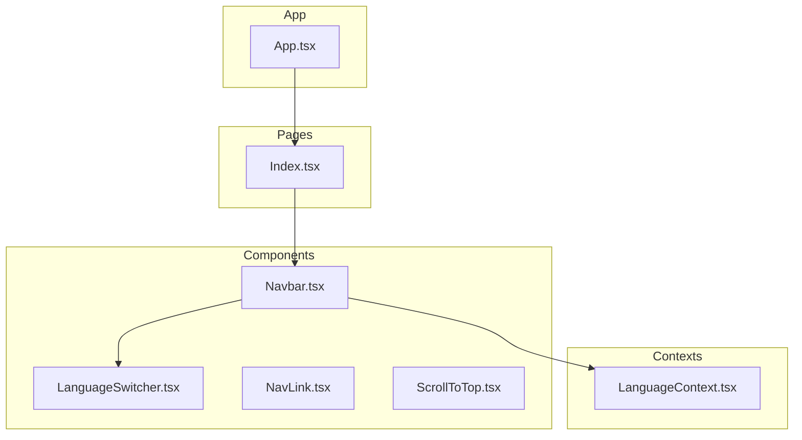
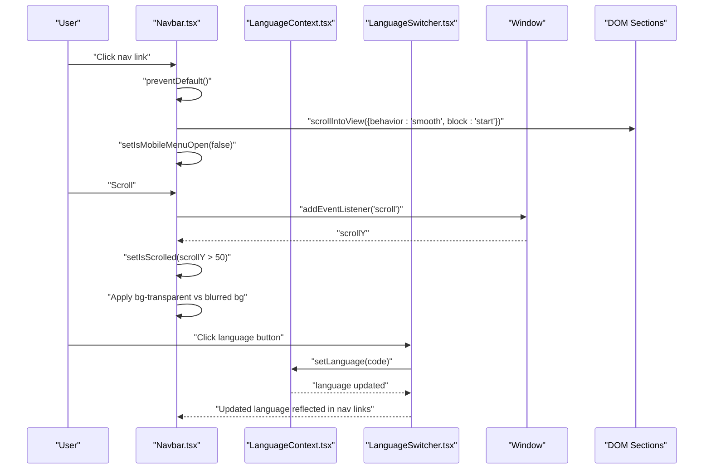
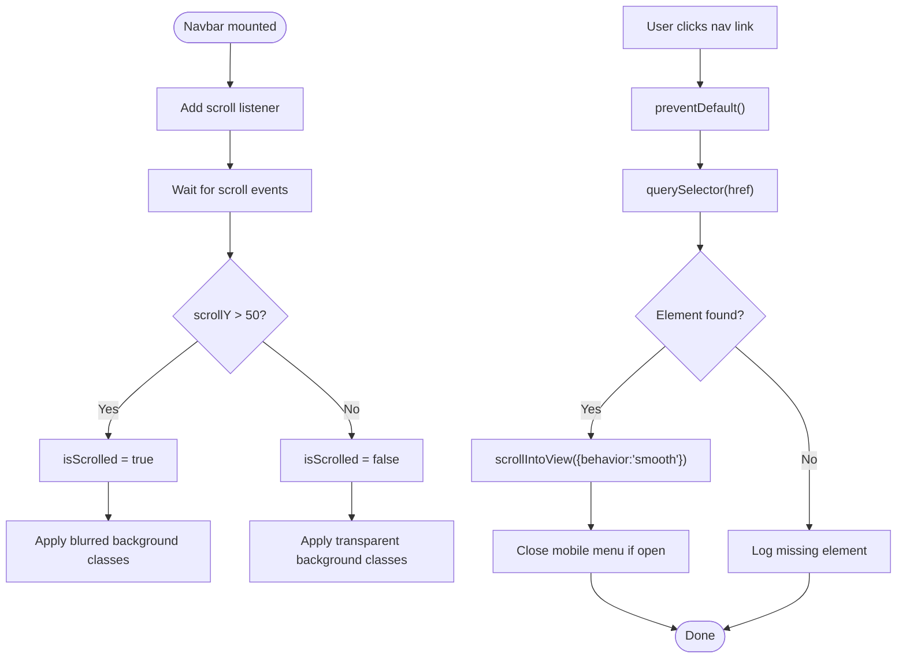
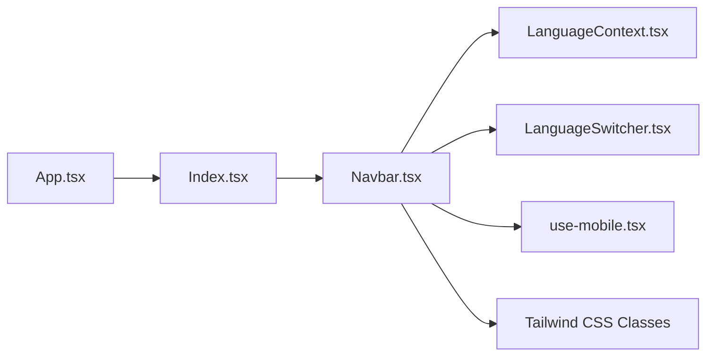

# Navigation Bar

<cite>
**Referenced Files in This Document**
- [Navbar.tsx](file://src/components/Navbar.tsx)
- [LanguageSwitcher.tsx](file://src/components/LanguageSwitcher.tsx)
- [LanguageContext.tsx](file://src/contexts/LanguageContext.tsx)
- [Index.tsx](file://src/pages/Index.tsx)
- [App.tsx](file://src/App.tsx)
- [use-mobile.tsx](file://src/hooks/use-mobile.tsx)
- [ScrollToTop.tsx](file://src/components/ScrollToTop.tsx)
</cite>

## Table of Contents
1. [Introduction](#introduction)
2. [Project Structure](#project-structure)
3. [Core Components](#core-components)
4. [Architecture Overview](#architecture-overview)
5. [Detailed Component Analysis](#detailed-component-analysis)
6. [Dependency Analysis](#dependency-analysis)
7. [Performance Considerations](#performance-considerations)
8. [Accessibility Features](#accessibility-features)
9. [Troubleshooting Guide](#troubleshooting-guide)
10. [Conclusion](#conclusion)

## Introduction
This document provides comprehensive documentation for the Navbar component responsible for primary site navigation and language switching. It explains the fixed positioning behavior, scroll-sensitive styling that transitions from transparent to blurred background when scrolling past 50px, responsive design with desktop and mobile views, the construction of navLinks using translated labels from the i18n system, and smooth in-page navigation via element scrolling. It also covers the integration of LanguageSwitcher in both desktop and mobile views, RTL layout application through the dir attribute, and accessibility features including ARIA labels, keyboard navigation support, and focus management. Finally, it details state management for mobile menu toggling and cleanup of scroll event listeners in useEffect.

## Project Structure
The Navbar is part of the components layer and integrates with the LanguageContext for internationalization and with the Index page as the main application entry point. The LanguageSwitcher component is used within the Navbar for language selection.

**Diagram sources**
- [Navbar.tsx](file://src/components/Navbar.tsx#L1-L123)
- [LanguageSwitcher.tsx](file://src/components/LanguageSwitcher.tsx#L1-L44)
- [LanguageContext.tsx](file://src/contexts/LanguageContext.tsx#L1-L292)
- [Index.tsx](file://src/pages/Index.tsx#L1-L32)
- [App.tsx](file://src/App.tsx#L1-L43)

**Section sources**
- [Navbar.tsx](file://src/components/Navbar.tsx#L1-L123)
- [LanguageSwitcher.tsx](file://src/components/LanguageSwitcher.tsx#L1-L44)
- [LanguageContext.tsx](file://src/contexts/LanguageContext.tsx#L1-L292)
- [Index.tsx](file://src/pages/Index.tsx#L1-L32)
- [App.tsx](file://src/App.tsx#L1-L43)

## Core Components
- Navbar: Fixed-position navigation bar with scroll-aware background change, desktop and mobile layouts, language switcher integration, and smooth in-page navigation.
- LanguageSwitcher: Provides language selection with visual feedback and variant-specific styling for navbar or floating modes.
- LanguageContext: Supplies translation keys, language state, and RTL detection used by Navbar and other components.
- Index page: Renders the Navbar alongside other sections.
- App: Wraps the app with providers and applies global directionality.

Key responsibilities:
- Navbar manages scroll listener, mobile menu state, and constructs navLinks from translated labels.
- LanguageSwitcher updates language and reflects current selection.
- LanguageContext centralizes translations and RTL logic.
- Index integrates Navbar into the page layout.
- App sets global direction and fonts.

**Section sources**
- [Navbar.tsx](file://src/components/Navbar.tsx#L1-L123)
- [LanguageSwitcher.tsx](file://src/components/LanguageSwitcher.tsx#L1-L44)
- [LanguageContext.tsx](file://src/contexts/LanguageContext.tsx#L1-L292)
- [Index.tsx](file://src/pages/Index.tsx#L1-L32)
- [App.tsx](file://src/App.tsx#L1-L43)

## Architecture Overview
The Navbar orchestrates navigation and localization. It listens to scroll events to adjust its appearance, renders desktop and mobile menus conditionally, and delegates language switching to LanguageSwitcher. Translations are resolved via LanguageContext, and the application-wide directionality is controlled by App.

**Diagram sources**
- [Navbar.tsx](file://src/components/Navbar.tsx#L1-L123)
- [LanguageSwitcher.tsx](file://src/components/LanguageSwitcher.tsx#L1-L44)
- [LanguageContext.tsx](file://src/contexts/LanguageContext.tsx#L1-L292)

## Detailed Component Analysis

### Navbar Component
Responsibilities:
- Fixed positioning with scroll-aware background transition.
- Desktop menu with hover states and smooth scrolling to sections.
- Mobile hamburger menu with conditional rendering and X icon.
- LanguageSwitcher integration in both desktop and mobile views.
- RTL layout via dir attribute based on isRTL from context.
- Accessibility: aria-label on the mobile menu button.
- State management for mobile menu toggling.
- Cleanup of scroll event listeners in useEffect.

Implementation highlights:
- Scroll listener sets a state flag when scrollY exceeds 50px, enabling a transition from transparent to blurred background.
- navLinks array is constructed using translated labels keyed under nav.* entries from LanguageContext.
- scrollToSection uses querySelector to target anchor IDs and scrollIntoView with smooth behavior.
- Desktop menu uses hidden on medium breakpoint; mobile menu appears below 768px width.
- dir attribute is set to "rtl" when isRTL is true, otherwise "ltr".
- Mobile menu button toggles visibility of the mobile navigation panel and uses aria-label for assistive technologies.

**Diagram sources**
- [Navbar.tsx](file://src/components/Navbar.tsx#L1-L123)

**Section sources**
- [Navbar.tsx](file://src/components/Navbar.tsx#L1-L123)

### LanguageSwitcher Component
Responsibilities:
- Presents language options with flags and labels.
- Updates the current language via LanguageContext.
- Supports two variants: navbar and floating, affecting styling and placement.
- Reflects current language selection with visual emphasis.

Integration with Navbar:
- Used inside Navbar for desktop and mobile views.
- When clicked, triggers language change which updates navLinks labels.

**Section sources**
- [LanguageSwitcher.tsx](file://src/components/LanguageSwitcher.tsx#L1-L44)
- [Navbar.tsx](file://src/components/Navbar.tsx#L1-L123)
- [LanguageContext.tsx](file://src/contexts/LanguageContext.tsx#L1-L292)

### LanguageContext and Internationalization
Responsibilities:
- Centralizes language state and translation resolution.
- Provides isRTL flag derived from current language.
- Exposes t(key) for resolving localized strings.

Navbar integration:
- Uses useLanguage hook to obtain t and isRTL.
- navLinks labels are built from t('nav.*') keys.

**Section sources**
- [LanguageContext.tsx](file://src/contexts/LanguageContext.tsx#L1-L292)
- [Navbar.tsx](file://src/components/Navbar.tsx#L1-L123)

### Responsive Design and Mobile Menu
Responsive behavior:
- Desktop menu is hidden on medium breakpoint and shown on larger screens.
- Mobile menu appears below 768px width using a media query hook.
- Mobile menu button toggles visibility of the mobile navigation panel.
- Mobile panel includes LanguageSwitcher and navLinks.

Accessibility:
- Mobile menu button has aria-label for screen readers.

**Section sources**
- [Navbar.tsx](file://src/components/Navbar.tsx#L1-L123)
- [use-mobile.tsx](file://src/hooks/use-mobile.tsx#L1-L20)

### Smooth In-Page Navigation
Mechanism:
- navLinks map to anchor IDs in the page.
- scrollToSection prevents default link behavior and smoothly scrolls to the target element.
- Mobile menu closes after navigation.

**Section sources**
- [Navbar.tsx](file://src/components/Navbar.tsx#L1-L123)

### RTL Layout Application
Behavior:
- Navbar receives isRTL from LanguageContext.
- The dir attribute is set to "rtl" when isRTL is true, otherwise "ltr".
- App also applies directionality globally and selects fonts based on language.

**Section sources**
- [Navbar.tsx](file://src/components/Navbar.tsx#L1-L123)
- [LanguageContext.tsx](file://src/contexts/LanguageContext.tsx#L1-L292)
- [App.tsx](file://src/App.tsx#L1-L43)

## Dependency Analysis
The Navbar depends on:
- LanguageContext for translations and RTL state.
- LanguageSwitcher for language selection UI.
- use-mobile hook for responsive breakpoint detection.
- Tailwind classes for styling and responsive breakpoints.

**Diagram sources**
- [Navbar.tsx](file://src/components/Navbar.tsx#L1-L123)
- [LanguageContext.tsx](file://src/contexts/LanguageContext.tsx#L1-L292)
- [LanguageSwitcher.tsx](file://src/components/LanguageSwitcher.tsx#L1-L44)
- [use-mobile.tsx](file://src/hooks/use-mobile.tsx#L1-L20)
- [Index.tsx](file://src/pages/Index.tsx#L1-L32)
- [App.tsx](file://src/App.tsx#L1-L43)

**Section sources**
- [Navbar.tsx](file://src/components/Navbar.tsx#L1-L123)
- [LanguageContext.tsx](file://src/contexts/LanguageContext.tsx#L1-L292)
- [LanguageSwitcher.tsx](file://src/components/LanguageSwitcher.tsx#L1-L44)
- [use-mobile.tsx](file://src/hooks/use-mobile.tsx#L1-L20)
- [Index.tsx](file://src/pages/Index.tsx#L1-L32)
- [App.tsx](file://src/App.tsx#L1-L43)

## Performance Considerations
- Scroll listener is attached only once during mount and removed on unmount to prevent memory leaks.
- Smooth scrolling uses native browser APIs; ensure anchors exist to avoid unnecessary checks.
- Desktop/mobile rendering is conditional; keep navLinks minimal to reduce re-renders.
- LanguageSwitcher buttons are lightweight; avoid heavy computations in click handlers.

[No sources needed since this section provides general guidance]

## Accessibility Features
- ARIA label: The mobile menu button includes aria-label for assistive technologies.
- Keyboard navigation: Links are anchor elements; ensure focus styles are visible via Tailwind defaults.
- Focus management: Closing the mobile menu after navigation helps reset focus context.
- Directionality: dir attribute set to "rtl" or "ltr" aligns text and layout with the selected language.

**Section sources**
- [Navbar.tsx](file://src/components/Navbar.tsx#L1-L123)

## Troubleshooting Guide
Common issues and resolutions:
- Mobile menu does not close after clicking a link:
  - Ensure scrollToSection is invoked and mobile menu state is toggled off.
  - Verify that preventDefault is called on desktop and mobile links.
- Scroll listener not cleaning up:
  - Confirm useEffect returns a cleanup function that removes the scroll event listener.
- Translated labels not appearing:
  - Verify translation keys exist in LanguageContext for the current language.
  - Ensure LanguageProvider wraps the application.
- LanguageSwitcher not updating labels:
  - Confirm setLanguage is called and LanguageContext is correctly configured.
- RTL layout not applied:
  - Check that isRTL is true for the selected language and dir attribute is present on the Navbar.

**Section sources**
- [Navbar.tsx](file://src/components/Navbar.tsx#L1-L123)
- [LanguageContext.tsx](file://src/contexts/LanguageContext.tsx#L1-L292)
- [LanguageSwitcher.tsx](file://src/components/LanguageSwitcher.tsx#L1-L44)
- [App.tsx](file://src/App.tsx#L1-L43)

## Conclusion
The Navbar component delivers a robust, accessible, and responsive navigation experience. It integrates seamlessly with the i18n system to provide localized labels, supports smooth in-page navigation, adapts its appearance on scroll, and respects RTL layouts. Its design ensures clean state management, efficient event handling, and clear separation of concerns through LanguageContext and LanguageSwitcher.

[No sources needed since this section summarizes without analyzing specific files]