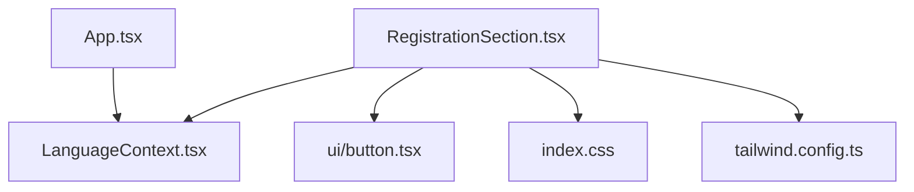
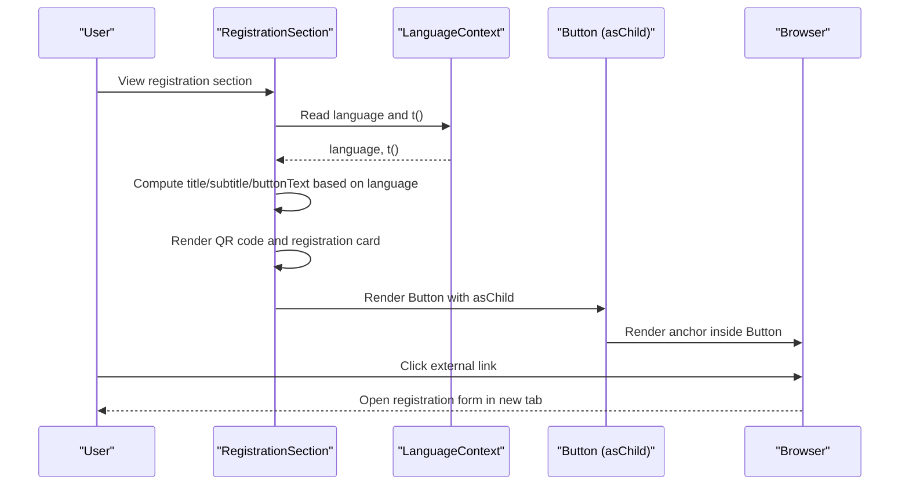
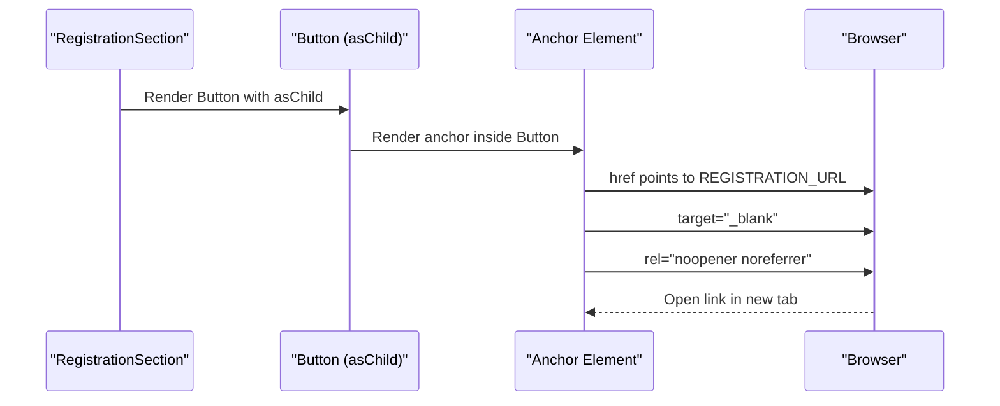
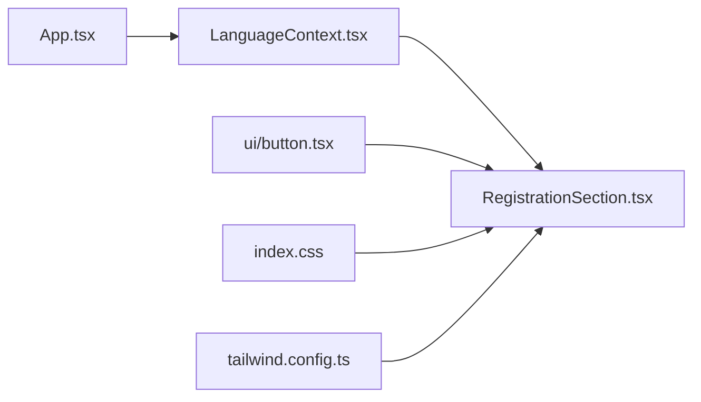

# Registration Section

<cite>
**Referenced Files in This Document**
- [RegistrationSection.tsx](file://src/components/RegistrationSection.tsx)
- [LanguageContext.tsx](file://src/contexts/LanguageContext.tsx)
- [button.tsx](file://src/components/ui/button.tsx)
- [index.css](file://src/index.css)
- [tailwind.config.ts](file://src/tailwind.config.ts)
- [App.tsx](file://src/App.tsx)
</cite>

## Table of Contents
1. [Introduction](#introduction)
2. [Project Structure](#project-structure)
3. [Core Components](#core-components)
4. [Architecture Overview](#architecture-overview)
5. [Detailed Component Analysis](#detailed-component-analysis)
6. [Dependency Analysis](#dependency-analysis)
7. [Performance Considerations](#performance-considerations)
8. [Troubleshooting Guide](#troubleshooting-guide)
9. [Conclusion](#conclusion)

## Introduction
This document explains the RegistrationSection component that enables users to register for an event via a QR code or a direct link. It covers:
- Multilingual text rendering for title, subtitle, and button text using the current language state from the LanguageContext.
- Visual design: gradient background, decorative blur effects, QR code card with glow and corner accents, and a prominent registration button.
- Integration of the Button component with an external link using asChild and proper accessibility attributes.
- The REGISTRATION_URL constant usage and security considerations for external navigation.
- Guidance on updating the registration URL and ensuring QR code readability across devices.

## Project Structure
RegistrationSection is a self-contained UI component located under src/components. It relies on:
- LanguageContext for language-aware text rendering.
- shadcn/ui Button component for the external link button.
- Tailwind CSS and custom theme tokens for styling and gradients.

**Diagram sources**
- [RegistrationSection.tsx](file://src/components/RegistrationSection.tsx#L1-L105)
- [LanguageContext.tsx](file://src/contexts/LanguageContext.tsx#L1-L292)
- [button.tsx](file://src/components/ui/button.tsx#L1-L48)
- [index.css](file://src/index.css#L55-L104)
- [tailwind.config.ts](file://src/tailwind.config.ts#L44-L84)
- [App.tsx](file://src/App.tsx#L1-L43)

**Section sources**
- [RegistrationSection.tsx](file://src/components/RegistrationSection.tsx#L1-L105)
- [LanguageContext.tsx](file://src/contexts/LanguageContext.tsx#L1-L292)
- [button.tsx](file://src/components/ui/button.tsx#L1-L48)
- [index.css](file://src/index.css#L55-L104)
- [tailwind.config.ts](file://src/tailwind.config.ts#L44-L84)
- [App.tsx](file://src/App.tsx#L1-L43)

## Core Components
- RegistrationSection: Renders the registration section with QR code and a link to the registration form. It uses conditional logic to render multilingual text based on the current language state from useLanguage. It also renders decorative background blurs, a QR code card with glow and corner accents, and a styled button linking to the registration URL.
- LanguageContext: Provides the language state and translation function (t) used by the app. RegistrationSection uses the language state to decide which language-specific text to display.
- Button (shadcn/ui): A flexible button component that supports asChild to wrap an anchor tag for external links. RegistrationSection uses asChild to render an anchor inside the Button.
- Tailwind theme: Defines custom colors and gradients, including the Syrian green palette used throughout the component.

Key responsibilities:
- RegistrationSection: orchestrates layout, styling, QR code rendering, and external link integration.
- LanguageContext: supplies language-aware text and RTL state.
- Button: renders accessible, themed links with asChild support.
- Tailwind theme: provides consistent color tokens and gradients.

**Section sources**
- [RegistrationSection.tsx](file://src/components/RegistrationSection.tsx#L1-L105)
- [LanguageContext.tsx](file://src/contexts/LanguageContext.tsx#L1-L292)
- [button.tsx](file://src/components/ui/button.tsx#L1-L48)
- [index.css](file://src/index.css#L55-L104)
- [tailwind.config.ts](file://src/tailwind.config.ts#L44-L84)

## Architecture Overview
The RegistrationSection integrates with the internationalization system and UI primitives to deliver a localized, visually cohesive registration experience.

**Diagram sources**
- [RegistrationSection.tsx](file://src/components/RegistrationSection.tsx#L1-L105)
- [LanguageContext.tsx](file://src/contexts/LanguageContext.tsx#L1-L292)
- [button.tsx](file://src/components/ui/button.tsx#L1-L48)

## Detailed Component Analysis

### Multilingual Text Rendering
RegistrationSection reads the current language from useLanguage and computes:
- Title text for the header and page heading.
- Subtitle text with instructions to scan the QR code or click the link.
- Button text for the external link.

The computed texts are rendered conditionally based on the language value. The component does not rely on the translation function (t) from the context; instead, it uses a language-aware conditional logic to pick the correct string for each language.

Accessibility note: The computed text is used as aria-label or screen-reader-friendly text in the surrounding layout, ensuring assistive technologies announce the correct message.

**Section sources**
- [RegistrationSection.tsx](file://src/components/RegistrationSection.tsx#L8-L28)
- [LanguageContext.tsx](file://src/contexts/LanguageContext.tsx#L1-L292)

### Visual Design and Layout
- Gradient background: A subtle diagonal gradient from a light Syrian green to the background color creates depth without competing with content.
- Decorative blur effects: Two large blurred circles positioned at opposite corners add ambient visual interest.
- Registration card: Centered card with rounded corners, a thin border, and soft shadow. The card contains:
  - Corner accents: Four decorative borders at each corner to emphasize the card’s presence.
  - Inner glow: A diffuse green glow behind the card to enhance depth.
  - Decorative ring: A subtle border ring around the card for framing.
- QR code: Embedded in a white, rounded, shadowed container. It is configured with a fixed size and high error correction level for robust scanning.

Styling tokens:
- The component uses the custom Syrian green palette defined in the Tailwind theme and CSS variables for consistent colors across the app.

**Section sources**
- [RegistrationSection.tsx](file://src/components/RegistrationSection.tsx#L29-L78)
- [index.css](file://src/index.css#L55-L104)
- [tailwind.config.ts](file://src/tailwind.config.ts#L44-L84)

### QR Code Rendering
The QR code is generated using QRCodeSVG with:
- Fixed size for consistent scanning across devices.
- High error correction level to improve robustness.
- Foreground color matching the Syrian green palette.
- White background for contrast.

Optimization tip: Consider caching the QR code SVG or pre-rendering it as a static asset if the URL is static and performance is critical.

**Section sources**
- [RegistrationSection.tsx](file://src/components/RegistrationSection.tsx#L64-L73)

### External Link Button Integration
RegistrationSection renders a Button component with asChild enabled. The Button wraps an anchor tag that:
- Links to the REGISTRATION_URL constant.
- Opens in a new tab with target="_blank".
- Uses rel="noopener noreferrer" for security against reverse tabnabbing and window.opener exposure.

The Button is styled with a prominent green background, rounded pill shape, and hover effects including increased shadow and slight scaling.

**Diagram sources**
- [RegistrationSection.tsx](file://src/components/RegistrationSection.tsx#L80-L97)
- [button.tsx](file://src/components/ui/button.tsx#L1-L48)

**Section sources**
- [RegistrationSection.tsx](file://src/components/RegistrationSection.tsx#L80-L97)
- [button.tsx](file://src/components/ui/button.tsx#L1-L48)

### Security Considerations for External Navigation
- Using rel="noopener noreferrer" prevents the newly opened tab from accessing the original window and avoids potential phishing risks.
- Opening links in a new tab keeps users on the current page while they complete registration.
- Ensure the REGISTRATION_URL remains valid and monitored for changes.

**Section sources**
- [RegistrationSection.tsx](file://src/components/RegistrationSection.tsx#L88-L91)

### Updating the Registration URL
To update the destination registration URL:
- Change the REGISTRATION_URL constant to the new form link.
- Verify QR code readability across devices after the change.
- Test external link behavior in various browsers and devices.

Guidance:
- Keep the URL short and stable to minimize scanning errors.
- Consider using a URL shortener if the original link is long, but ensure it resolves quickly and reliably.

**Section sources**
- [RegistrationSection.tsx](file://src/components/RegistrationSection.tsx#L6-L6)

### Ensuring QR Code Readability Across Devices
- Maintain a fixed QR code size suitable for mobile scanning.
- Use a high error correction level to handle partial damage or low-quality prints.
- Ensure sufficient contrast between foreground and background colors.
- Test scanning on multiple devices and lighting conditions.

**Section sources**
- [RegistrationSection.tsx](file://src/components/RegistrationSection.tsx#L64-L73)

## Dependency Analysis
RegistrationSection depends on:
- LanguageContext for language-aware text rendering.
- shadcn/ui Button for the external link button.
- Tailwind theme for colors and gradients.

**Diagram sources**
- [RegistrationSection.tsx](file://src/components/RegistrationSection.tsx#L1-L105)
- [LanguageContext.tsx](file://src/contexts/LanguageContext.tsx#L1-L292)
- [button.tsx](file://src/components/ui/button.tsx#L1-L48)
- [index.css](file://src/index.css#L55-L104)
- [tailwind.config.ts](file://src/tailwind.config.ts#L44-L84)
- [App.tsx](file://src/App.tsx#L1-L43)

**Section sources**
- [RegistrationSection.tsx](file://src/components/RegistrationSection.tsx#L1-L105)
- [LanguageContext.tsx](file://src/contexts/LanguageContext.tsx#L1-L292)
- [button.tsx](file://src/components/ui/button.tsx#L1-L48)
- [index.css](file://src/index.css#L55-L104)
- [tailwind.config.ts](file://src/tailwind.config.ts#L44-L84)
- [App.tsx](file://src/App.tsx#L1-L43)

## Performance Considerations
- QR code rendering: QRCodeSVG generates a vector-based SVG. For static URLs, consider pre-rendering or caching to reduce runtime computation.
- External link rendering: The Button component with asChild adds minimal overhead; ensure the anchor is lightweight and avoids heavy inline styles.
- Theme tokens: Using CSS variables and Tailwind utilities keeps styles efficient and consistent.

[No sources needed since this section provides general guidance]

## Troubleshooting Guide
Common issues and resolutions:
- Incorrect language text: Verify the language state in LanguageContext and ensure the conditional logic in RegistrationSection matches supported languages.
- QR code not scanning: Increase error correction level, verify foreground/background contrast, and test on multiple devices.
- External link opens in the same tab: Confirm asChild is enabled and the Button wraps an anchor with target="_blank" and rel="noopener noreferrer".
- Styling inconsistencies: Check that the Syrian green palette is defined in the Tailwind theme and CSS variables.

**Section sources**
- [RegistrationSection.tsx](file://src/components/RegistrationSection.tsx#L8-L28)
- [RegistrationSection.tsx](file://src/components/RegistrationSection.tsx#L64-L73)
- [RegistrationSection.tsx](file://src/components/RegistrationSection.tsx#L80-L97)
- [index.css](file://src/index.css#L55-L104)
- [tailwind.config.ts](file://src/tailwind.config.ts#L44-L84)

## Conclusion
RegistrationSection delivers a localized, visually engaging registration experience with a QR code and a secure external link. Its design leverages the Syrian green palette, decorative blur effects, and a prominent QR code card. By centralizing language-aware text rendering and using a robust Button component with proper security attributes, the component ensures accessibility and usability across languages and devices. Updating the registration URL and optimizing QR code readability are straightforward tasks that keep the component reliable and user-friendly.