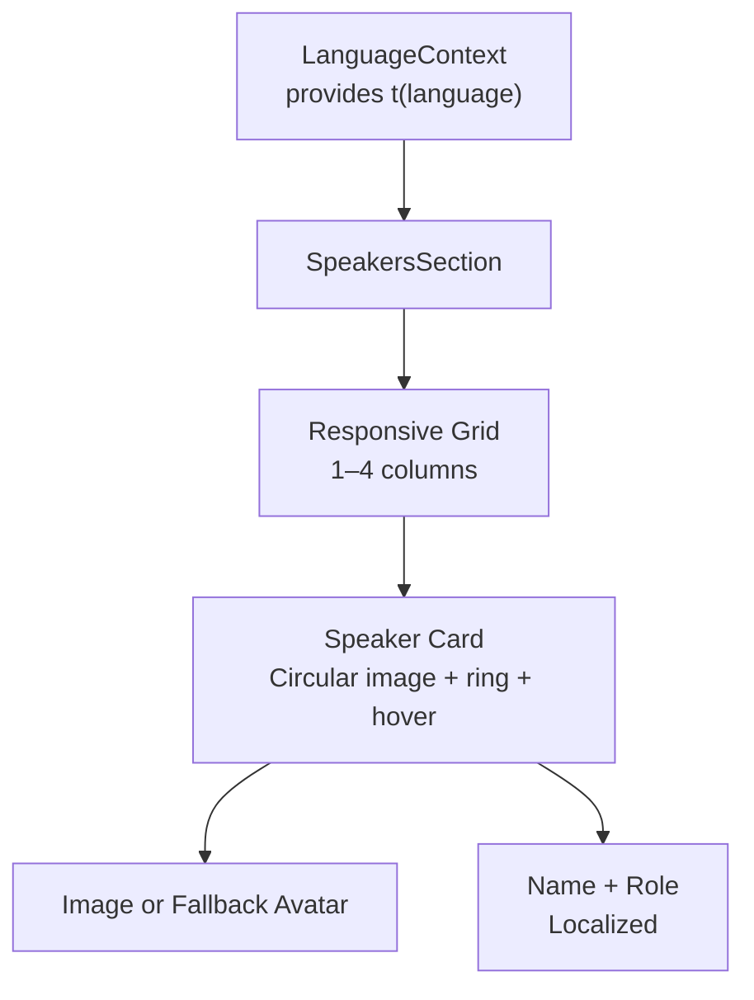
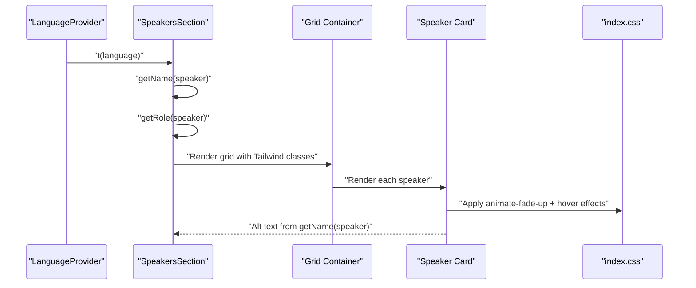
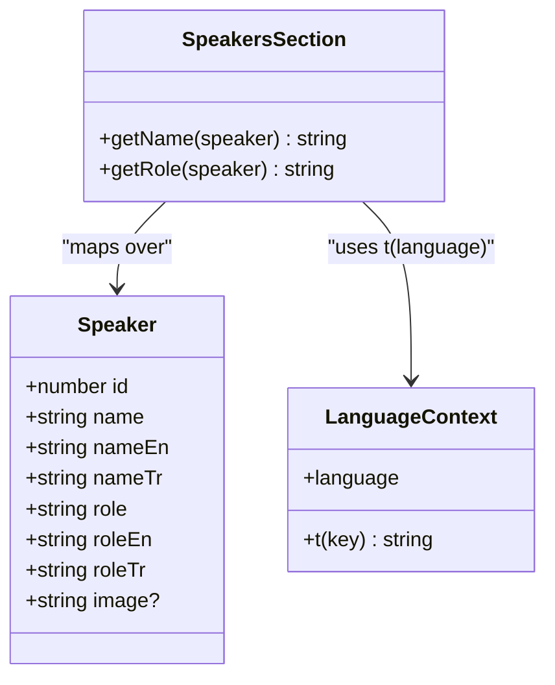
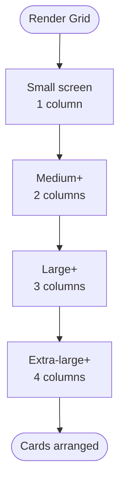
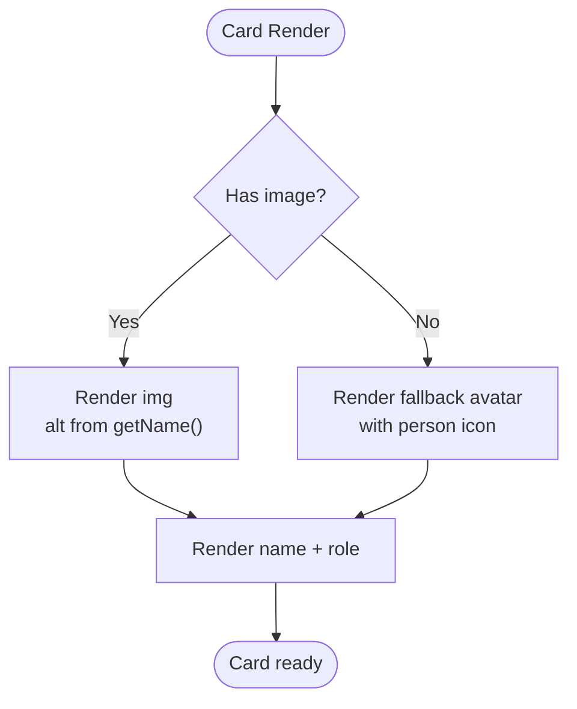
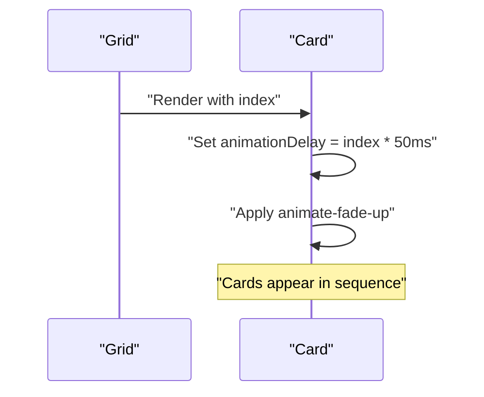
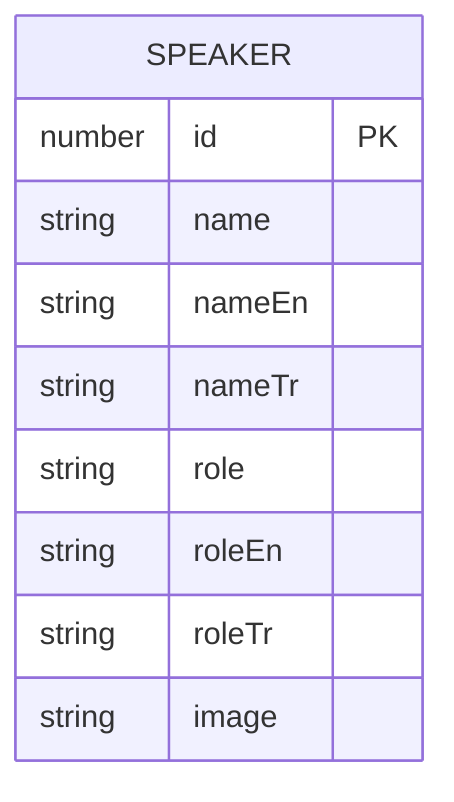
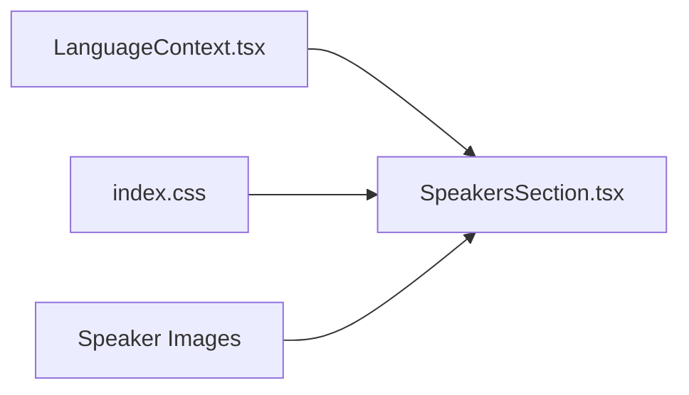

# Speakers Section

<cite>
**Referenced Files in This Document**
- [SpeakersSection.tsx](file://src/components/SpeakersSection.tsx)
- [LanguageContext.tsx](file://src/contexts/LanguageContext.tsx)
- [index.css](file://src/index.css)
- [eventData.ts](file://src/data/eventData.ts)
</cite>

## Table of Contents
1. [Introduction](#introduction)
2. [Project Structure](#project-structure)
3. [Core Components](#core-components)
4. [Architecture Overview](#architecture-overview)
5. [Detailed Component Analysis](#detailed-component-analysis)
6. [Dependency Analysis](#dependency-analysis)
7. [Performance Considerations](#performance-considerations)
8. [Troubleshooting Guide](#troubleshooting-guide)
9. [Conclusion](#conclusion)

## Introduction
This document explains the SpeakersSection component that displays event participants in a responsive, animated grid. It covers how speaker data is organized, how multilingual names and roles are selected, the responsive grid layout, card design and interactions, fallback avatar handling, accessibility features, and internationalization considerations. It also provides guidance on structuring speaker data and optimizing images.

## Project Structure
SpeakersSection is a self-contained component that:
- Imports localized strings from the LanguageContext provider
- Uses a typed speakers array with Arabic, English, and Turkish fields
- Renders a responsive grid of speaker cards with hover and animation effects
- Provides a fallback avatar when an image is missing

**Diagram sources**
- [SpeakersSection.tsx](file://src/components/SpeakersSection.tsx#L171-L235)
- [LanguageContext.tsx](file://src/contexts/LanguageContext.tsx#L269-L292)
- [index.css](file://src/index.css#L231-L249)

**Section sources**
- [SpeakersSection.tsx](file://src/components/SpeakersSection.tsx#L1-L238)
- [LanguageContext.tsx](file://src/contexts/LanguageContext.tsx#L1-L292)

## Core Components
- SpeakersSection: Renders the section header and the grid of speaker cards. It selects localized name and role via helper functions and applies responsive grid and animation classes.
- LanguageContext: Provides the translation function t and language state used by SpeakersSection.
- index.css: Supplies the fade-up animation keyframes and delay utilities used by the component.

Key responsibilities:
- Localized display: getName and getRole pick the correct field based on the current language.
- Responsive layout: Tailwind grid classes adapt from 1 to 4 columns depending on viewport width.
- Visual polish: Hover ring effect, subtle shadow, and staggered fade-up animation.
- Accessibility: Alt text generated from the localized name; fallback avatar when no image is present.

**Section sources**
- [SpeakersSection.tsx](file://src/components/SpeakersSection.tsx#L171-L235)
- [LanguageContext.tsx](file://src/contexts/LanguageContext.tsx#L269-L292)
- [index.css](file://src/index.css#L185-L249)

## Architecture Overview
The component integrates with the global language provider and Tailwind/CSS animations to deliver a polished, multilingual experience.

**Diagram sources**
- [SpeakersSection.tsx](file://src/components/SpeakersSection.tsx#L171-L235)
- [LanguageContext.tsx](file://src/contexts/LanguageContext.tsx#L269-L292)
- [index.css](file://src/index.css#L185-L249)

## Detailed Component Analysis

### Data Model and Internationalization
- Speaker interface defines fields for Arabic, English, and Turkish names and roles, plus an optional image URL.
- getName and getRole select the appropriate field based on the current language.
- Translations for the section title and subtitle are provided under the speakers namespace.

**Diagram sources**
- [SpeakersSection.tsx](file://src/components/SpeakersSection.tsx#L18-L27)
- [SpeakersSection.tsx](file://src/components/SpeakersSection.tsx#L174-L184)
- [LanguageContext.tsx](file://src/contexts/LanguageContext.tsx#L269-L292)

**Section sources**
- [SpeakersSection.tsx](file://src/components/SpeakersSection.tsx#L18-L27)
- [SpeakersSection.tsx](file://src/components/SpeakersSection.tsx#L174-L184)
- [LanguageContext.tsx](file://src/contexts/LanguageContext.tsx#L12-L96)

### Responsive Grid Layout
- The grid uses Tailwind’s responsive column classes to adapt from 1 to 4 columns:
  - 1 column on small screens
  - 2 columns from the small breakpoint
  - 3 columns from the large breakpoint
  - 4 columns from the extra-large breakpoint
- Gap spacing is standardized for visual rhythm.

**Diagram sources**
- [SpeakersSection.tsx](file://src/components/SpeakersSection.tsx#L199-L206)

**Section sources**
- [SpeakersSection.tsx](file://src/components/SpeakersSection.tsx#L199-L206)

### Card Design and Interactions
- Card container:
  - Rounded corners, border, and subtle background
  - Hover effects: border color change and increased shadow
- Circular image container:
  - Fixed size with rounded-full and overflow-hidden
  - Ring effect via ring-2 with primary color
  - Hover ring intensifies on group hover
- Image fallback:
  - When no image is present, a colored background with a person icon is shown
- Typography:
  - Name is bold and centered
  - Role is smaller, muted, and centered with relaxed line height

**Diagram sources**
- [SpeakersSection.tsx](file://src/components/SpeakersSection.tsx#L207-L229)

**Section sources**
- [SpeakersSection.tsx](file://src/components/SpeakersSection.tsx#L207-L229)

### Animations and Staggered Delays
- Fade-up animation:
  - Defined via keyframes and applied with a utility class
  - Cards animate upward with decreasing opacity and translate Y
- Staggered delays:
  - Each card receives a style-based animation delay proportional to its index
  - This creates a cascading entrance effect

**Diagram sources**
- [SpeakersSection.tsx](file://src/components/SpeakersSection.tsx#L204-L206)
- [index.css](file://src/index.css#L190-L200)
- [index.css](file://src/index.css#L231-L233)

**Section sources**
- [SpeakersSection.tsx](file://src/components/SpeakersSection.tsx#L204-L206)
- [index.css](file://src/index.css#L190-L200)
- [index.css](file://src/index.css#L231-L233)

### Accessibility Features
- Alt text:
  - The image element’s alt attribute is set to the localized speaker name via getName(speaker)
- Semantic structure:
  - Headings and paragraphs are used appropriately around the grid
- Color contrast:
  - Hover ring and text colors rely on theme tokens; ensure sufficient contrast against backgrounds

**Section sources**
- [SpeakersSection.tsx](file://src/components/SpeakersSection.tsx#L210-L214)

### Internationalization Challenges and Best Practices
- Name rendering:
  - The component expects name fields in Arabic, English, and Turkish
  - If a translation is missing for a key, the LanguageContext falls back to the key itself
- Role rendering:
  - Roles are similarly localized; keep entries aligned across languages
- Adding new languages:
  - Extend the LanguageContext translation map and update the getName/getRole logic if needed

**Section sources**
- [LanguageContext.tsx](file://src/contexts/LanguageContext.tsx#L272-L274)
- [SpeakersSection.tsx](file://src/components/SpeakersSection.tsx#L174-L184)

### Speaker Data Structure Example
Below is the structure used by the component. Add new speakers by extending the speakers array with the same fields.

**Diagram sources**
- [SpeakersSection.tsx](file://src/components/SpeakersSection.tsx#L18-L27)

**Section sources**
- [SpeakersSection.tsx](file://src/components/SpeakersSection.tsx#L29-L169)

## Dependency Analysis
- Internal dependencies:
  - LanguageContext: Provides t and language state
  - index.css: Provides animations and delay utilities
- External assets:
  - Speaker images are imported locally and assigned to the image property

**Diagram sources**
- [SpeakersSection.tsx](file://src/components/SpeakersSection.tsx#L1-L17)
- [LanguageContext.tsx](file://src/contexts/LanguageContext.tsx#L269-L292)
- [index.css](file://src/index.css#L231-L249)

**Section sources**
- [SpeakersSection.tsx](file://src/components/SpeakersSection.tsx#L1-L17)
- [LanguageContext.tsx](file://src/contexts/LanguageContext.tsx#L269-L292)
- [index.css](file://src/index.css#L231-L249)

## Performance Considerations
- Image optimization:
  - Prefer modern formats (WebP) and appropriate resolutions for the card size
  - Compress images to reduce payload while maintaining quality
- Lazy loading:
  - Consider using native loading="lazy" on img elements for off-screen cards
  - Alternatively, implement intersection observer-based lazy loading for large lists
- Asset bundling:
  - Keep images colocated and named consistently to simplify maintenance
- Animation performance:
  - The fade-up animation uses transform and opacity—these are GPU-friendly
  - Avoid heavy filters or excessive repaints inside the card

[No sources needed since this section provides general guidance]

## Troubleshooting Guide
- Missing alt text:
  - Ensure getName returns a non-empty string; otherwise, the alt attribute will be empty
- No image displayed:
  - Verify the image property is set; otherwise, the fallback avatar will show
- Translation fallback:
  - If a translation key is missing, the component falls back to the key itself; confirm keys exist in the LanguageContext
- Layout issues:
  - Confirm Tailwind breakpoints are applied as intended; adjust grid classes if needed
- Hover ring not visible:
  - Ensure the ring color tokens are available in your theme and that the group hover context is active

**Section sources**
- [SpeakersSection.tsx](file://src/components/SpeakersSection.tsx#L210-L219)
- [LanguageContext.tsx](file://src/contexts/LanguageContext.tsx#L272-L274)

## Conclusion
SpeakersSection delivers a clean, responsive, and accessible showcase of event participants. By leveraging a typed data model, helper functions for localization, and Tailwind-driven animations, it provides a consistent experience across languages and devices. Extending the component involves adding new speakers to the array and ensuring translations and images are available.