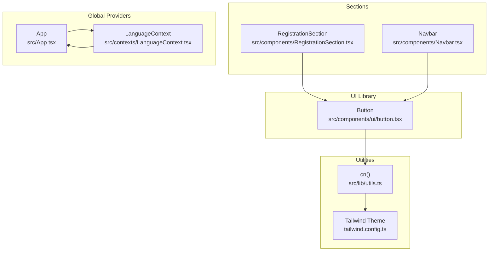
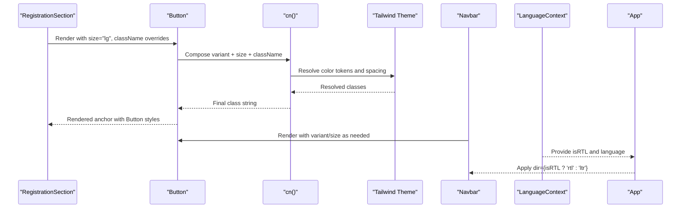
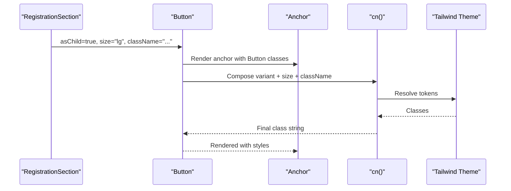
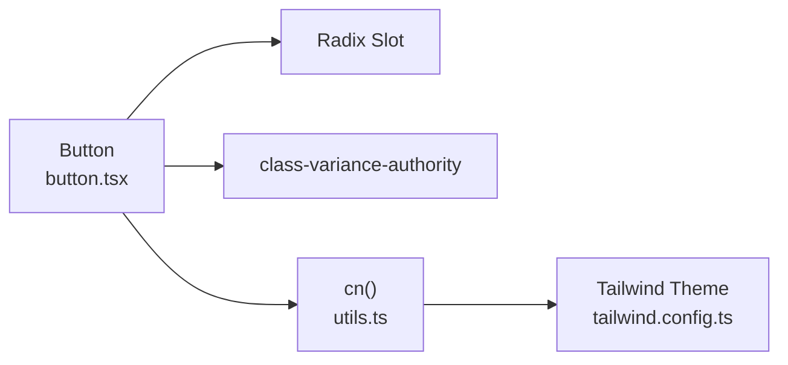

# Button Component

<cite>
**Referenced Files in This Document**
- [button.tsx](file://src/components/ui/button.tsx)
- [utils.ts](file://src/lib/utils.ts)
- [tailwind.config.ts](file://tailwind.config.ts)
- [RegistrationSection.tsx](file://src/components/RegistrationSection.tsx)
- [Navbar.tsx](file://src/components/Navbar.tsx)
- [App.tsx](file://src/App.tsx)
- [LanguageContext.tsx](file://src/contexts/LanguageContext.tsx)
</cite>

## Table of Contents
1. [Introduction](#introduction)
2. [Project Structure](#project-structure)
3. [Core Components](#core-components)
4. [Architecture Overview](#architecture-overview)
5. [Detailed Component Analysis](#detailed-component-analysis)
6. [Dependency Analysis](#dependency-analysis)
7. [Performance Considerations](#performance-considerations)
8. [Troubleshooting Guide](#troubleshooting-guide)
9. [Conclusion](#conclusion)

## Introduction
This document provides comprehensive documentation for the Button UI component used throughout the application. It explains the implementation built on Radix UI primitives and styled with Tailwind CSS, details all props and variants, and demonstrates usage patterns from the codebase. It also covers accessibility features, integration with the global theme and RTL layout, common styling issues, and performance best practices.

## Project Structure
The Button component is part of the ShadCN UI library and is located under the ui directory. It integrates with utility functions for class composition and the Tailwind theme for consistent styling. Usage examples appear in RegistrationSection and Navbar.

**Diagram sources**
- [button.tsx](file://src/components/ui/button.tsx#L1-L47)
- [utils.ts](file://src/lib/utils.ts#L1-L7)
- [tailwind.config.ts](file://tailwind.config.ts#L1-L98)
- [RegistrationSection.tsx](file://src/components/RegistrationSection.tsx#L80-L99)
- [Navbar.tsx](file://src/components/Navbar.tsx#L1-L123)
- [App.tsx](file://src/App.tsx#L11-L30)
- [LanguageContext.tsx](file://src/contexts/LanguageContext.tsx#L267-L292)

**Section sources**
- [button.tsx](file://src/components/ui/button.tsx#L1-L47)
- [utils.ts](file://src/lib/utils.ts#L1-L7)
- [tailwind.config.ts](file://tailwind.config.ts#L1-L98)
- [RegistrationSection.tsx](file://src/components/RegistrationSection.tsx#L80-L99)
- [Navbar.tsx](file://src/components/Navbar.tsx#L1-L123)
- [App.tsx](file://src/App.tsx#L11-L30)
- [LanguageContext.tsx](file://src/contexts/LanguageContext.tsx#L267-L292)

## Core Components
- Button component: A flexible, accessible button built on Radix Slot and styled with Tailwind CSS. It supports variants (default, destructive, outline, secondary, ghost, link), sizes (default, sm, lg, icon), and an asChild option for composition.
- Utility function cn: Merges and deduplicates Tailwind classes using clsx and tailwind-merge.
- Tailwind theme: Provides color tokens and spacing scales consumed by Button variants and sizes.
- Global providers: App wraps the app with providers that enable RTL layout and language-aware typography.

Key implementation highlights:
- Variants and sizes are defined via class-variance-authority and applied through a variant function.
- Focus-visible ring styles are included for keyboard accessibility.
- Disabled state and pointer-events are handled consistently.
- asChild prop allows rendering a different element (e.g., anchor) while preserving Button styles.

**Section sources**
- [button.tsx](file://src/components/ui/button.tsx#L7-L31)
- [button.tsx](file://src/components/ui/button.tsx#L33-L47)
- [utils.ts](file://src/lib/utils.ts#L1-L7)
- [tailwind.config.ts](file://tailwind.config.ts#L20-L74)

## Architecture Overview
The Button component participates in a layered architecture:
- Component layer: Button defines variants, sizes, and composition via asChild.
- Styling layer: Tailwind theme and cn utility compose final class strings.
- Integration layer: Sections like RegistrationSection and Navbar pass props and wrap Button around anchors or other elements.
- Global layer: App and LanguageContext manage RTL direction and language-dependent fonts.

**Diagram sources**
- [RegistrationSection.tsx](file://src/components/RegistrationSection.tsx#L80-L99)
- [button.tsx](file://src/components/ui/button.tsx#L33-L47)
- [utils.ts](file://src/lib/utils.ts#L1-L7)
- [tailwind.config.ts](file://tailwind.config.ts#L20-L74)
- [Navbar.tsx](file://src/components/Navbar.tsx#L1-L123)
- [LanguageContext.tsx](file://src/contexts/LanguageContext.tsx#L267-L292)
- [App.tsx](file://src/App.tsx#L11-L30)

## Detailed Component Analysis

### Button Props and Variants
- Props:
  - variant: Controls background, text, and hover styles. Supported values: default, destructive, outline, secondary, ghost, link.
  - size: Controls height, padding, and border radius. Supported values: default, sm, lg, icon.
  - asChild: When true, renders the child element passed via slot composition (e.g., wrapping an anchor).
  - Inherits standard button attributes (e.g., disabled, type).
- Behavior:
  - Focus-visible ring and offset are included for keyboard accessibility.
  - Disabled state applies pointer-events-none and reduced opacity.
  - SVG inside Button receives pointer-events-none and constrained sizing.

Usage examples from the codebase:
- RegistrationSection uses Button with asChild to render an anchor link with large size and custom background classes.
- Navbar uses native buttons for mobile menu toggling and anchor links for desktop navigation.

Accessibility features:
- Focus-visible ring ensures keyboard users can perceive focus.
- Disabled state prevents interactive behavior and communicates state to assistive technologies.
- asChild preserves semantics when wrapping interactive elements.

Integration with theme and RTL:
- Tailwind theme defines color tokens (primary, secondary, destructive, accent, etc.) consumed by Button variants.
- App applies dir={isRTL ? 'rtl' : 'ltr'} based on language context, enabling RTL layout for the entire app.

**Section sources**
- [button.tsx](file://src/components/ui/button.tsx#L7-L31)
- [button.tsx](file://src/components/ui/button.tsx#L33-L47)
- [RegistrationSection.tsx](file://src/components/RegistrationSection.tsx#L80-L99)
- [Navbar.tsx](file://src/components/Navbar.tsx#L1-L123)
- [tailwind.config.ts](file://tailwind.config.ts#L20-L74)
- [App.tsx](file://src/App.tsx#L11-L30)
- [LanguageContext.tsx](file://src/contexts/LanguageContext.tsx#L267-L292)

### Class Composition and Styling
- cn utility merges multiple class inputs and resolves conflicts using tailwind-merge.
- Button variants and sizes are defined centrally and composed into a single class string.
- Custom className passed to Button augments the base variant/size classes.

Common styling pitfalls and solutions:
- Conflicting Tailwind classes: Use cn to merge classes safely; avoid overriding variant classes directly.
- Inline styles causing re-renders: Prefer passing className via props instead of creating new objects on each render.
- Browser inconsistencies: Ensure Tailwind JIT compiles all variants; verify theme tokens are defined.

**Section sources**
- [utils.ts](file://src/lib/utils.ts#L1-L7)
- [button.tsx](file://src/components/ui/button.tsx#L7-L31)

### Usage Patterns in the Codebase
- RegistrationSection:
  - Uses Button with asChild to wrap an anchor element.
  - Applies size="lg" and additional custom classes for visual prominence.
  - Demonstrates composition of Button with an external icon and link target.
- Navbar:
  - Uses native buttons for interactive elements (mobile menu toggle).
  - Uses anchor links for navigation with hover and focus states managed by Button’s base styles.

**Diagram sources**
- [RegistrationSection.tsx](file://src/components/RegistrationSection.tsx#L80-L99)
- [button.tsx](file://src/components/ui/button.tsx#L33-L47)
- [utils.ts](file://src/lib/utils.ts#L1-L7)
- [tailwind.config.ts](file://tailwind.config.ts#L20-L74)

**Section sources**
- [RegistrationSection.tsx](file://src/components/RegistrationSection.tsx#L80-L99)
- [Navbar.tsx](file://src/components/Navbar.tsx#L1-L123)

### Accessibility and Keyboard Handling
- Focus management:
  - Focus-visible ring ensures keyboard navigation is clearly indicated.
  - Disabled state prevents focus and interaction.
- Semantic composition:
  - asChild preserves semantics when wrapping interactive elements (e.g., anchors).
- ARIA considerations:
  - Provide aria-labels for icon-only buttons.
  - Ensure sufficient color contrast for all variants against backgrounds.

**Section sources**
- [button.tsx](file://src/components/ui/button.tsx#L7-L31)

### Integration with Global Theme and RTL
- Tailwind theme:
  - Color tokens (primary, secondary, destructive, accent) are defined and consumed by Button variants.
  - Spacing and radius scales are standardized for consistent sizing across sizes.
- RTL layout:
  - App applies dir={isRTL ? 'rtl' : 'ltr'} based on language context.
  - LanguageContext determines isRTL and language, enabling layout and font adjustments.

**Section sources**
- [tailwind.config.ts](file://tailwind.config.ts#L20-L74)
- [App.tsx](file://src/App.tsx#L11-L30)
- [LanguageContext.tsx](file://src/contexts/LanguageContext.tsx#L267-L292)

## Dependency Analysis
The Button component depends on:
- Radix Slot for composition (asChild).
- class-variance-authority for variant and size definitions.
- cn utility for safe class merging.
- Tailwind theme for color tokens and spacing.

**Diagram sources**
- [button.tsx](file://src/components/ui/button.tsx#L1-L47)
- [utils.ts](file://src/lib/utils.ts#L1-L7)
- [tailwind.config.ts](file://tailwind.config.ts#L1-L98)

**Section sources**
- [button.tsx](file://src/components/ui/button.tsx#L1-L47)
- [utils.ts](file://src/lib/utils.ts#L1-L7)
- [tailwind.config.ts](file://tailwind.config.ts#L1-L98)

## Performance Considerations
- Avoid inline onClick handlers:
  - Passing a new function on each render causes unnecessary re-renders. Define handlers outside the render path or memoize them.
- Minimize className churn:
  - Prefer static className strings or memoized values to avoid recalculating class lists.
- Use variants and sizes judiciously:
  - Excessive custom className overrides can bloat the final class string; keep overrides minimal.
- Bundle size:
  - The Button component is small and tree-shaken via the UI library; avoid importing unused variants.

[No sources needed since this section provides general guidance]

## Troubleshooting Guide
- Button not responding to keyboard focus:
  - Ensure focus-visible ring is not overridden by custom styles.
  - Verify disabled state is not unintentionally applied.
- Incorrect RTL behavior:
  - Confirm App applies dir={isRTL ? 'rtl' : 'ltr'} and that language context is initialized.
- Conflicting styles:
  - Use cn to merge classes; avoid duplicating variant classes.
- Hover/focus states not visible:
  - Check that hover variants are defined in the theme and that focus-visible ring is present.

**Section sources**
- [button.tsx](file://src/components/ui/button.tsx#L7-L31)
- [App.tsx](file://src/App.tsx#L11-L30)
- [LanguageContext.tsx](file://src/contexts/LanguageContext.tsx#L267-L292)
- [utils.ts](file://src/lib/utils.ts#L1-L7)

## Conclusion
The Button component provides a robust, accessible foundation for interactive elements across the application. Its integration with Radix Slot, class-variance-authority, and Tailwind CSS enables consistent styling and behavior. By following the usage patterns demonstrated in RegistrationSection and Navbar, and adhering to the accessibility and performance recommendations, developers can reliably extend and customize Button for diverse UI needs.