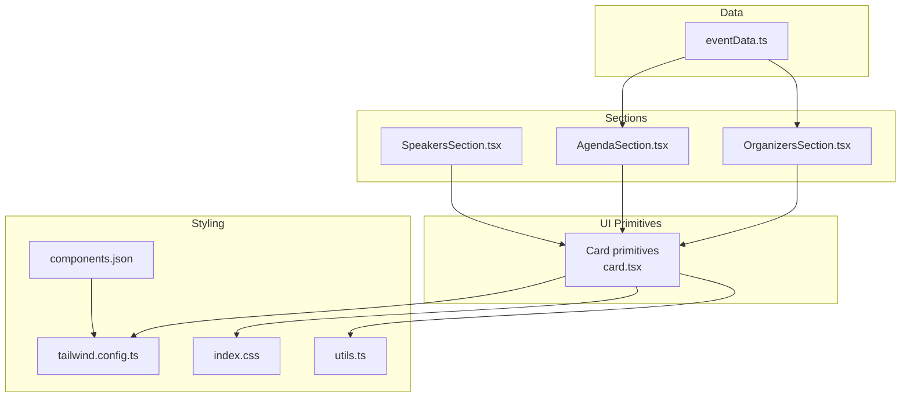
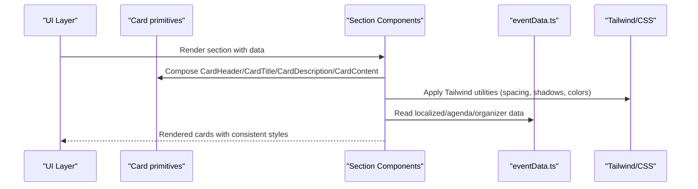
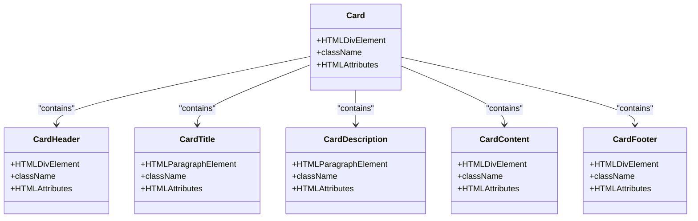
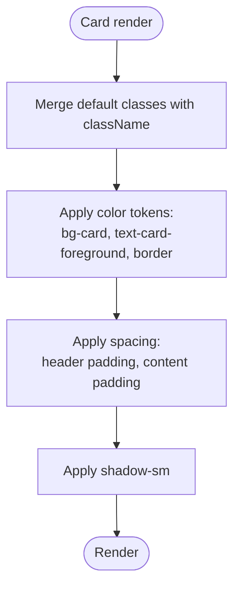
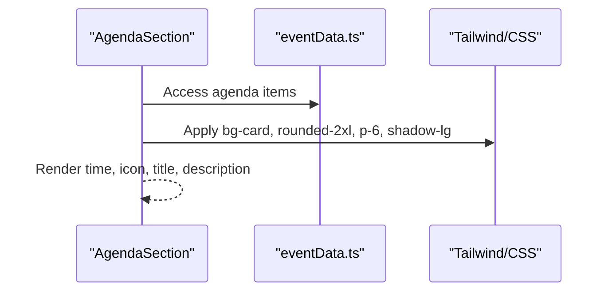
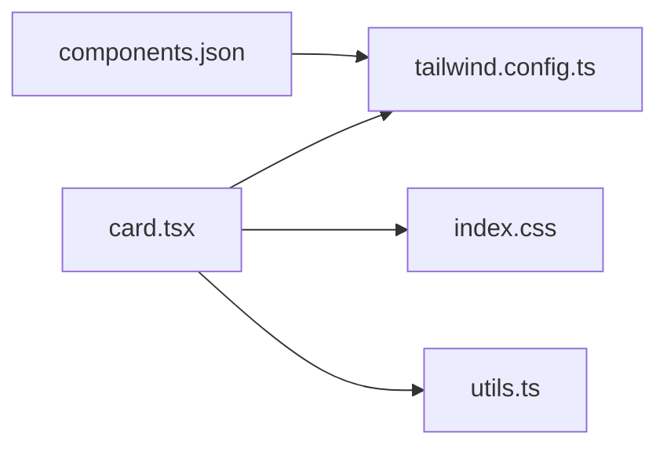
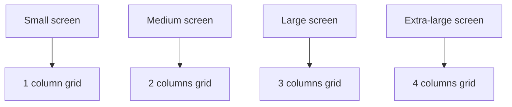

# Card Component

<cite>
**Referenced Files in This Document**
- [card.tsx](file://src/components/ui/card.tsx)
- [SpeakersSection.tsx](file://src/components/SpeakersSection.tsx)
- [AgendaSection.tsx](file://src/components/AgendaSection.tsx)
- [OrganizersSection.tsx](file://src/components/OrganizersSection.tsx)
- [eventData.ts](file://src/data/eventData.ts)
- [tailwind.config.ts](file://tailwind.config.ts)
- [index.css](file://src/index.css)
- [utils.ts](file://src/lib/utils.ts)
- [components.json](file://components.json)
- [LanguageContext.tsx](file://src/contexts/LanguageContext.tsx)
</cite>

## Table of Contents
1. [Introduction](#introduction)
2. [Project Structure](#project-structure)
3. [Core Components](#core-components)
4. [Architecture Overview](#architecture-overview)
5. [Detailed Component Analysis](#detailed-component-analysis)
6. [Dependency Analysis](#dependency-analysis)
7. [Performance Considerations](#performance-considerations)
8. [Accessibility Guidelines](#accessibility-guidelines)
9. [Customization and Theming](#customization-and-theming)
10. [Responsive Behavior](#responsive-behavior)
11. [Troubleshooting Guide](#troubleshooting-guide)
12. [Conclusion](#conclusion)

## Introduction
This document describes the Card component used across SpeakersSection, AgendaSection, and OrganizersSection. It explains the composition pattern with CardHeader, CardTitle, CardDescription, and CardContent, how it integrates with Tailwind utility classes for consistent spacing and shadows, and how event data is rendered inside cards. It also covers responsive behavior, accessibility, customization via className overrides and theme extensions, and troubleshooting layout overflow issues.

## Project Structure
The Card component is a reusable UI primitive located under the UI components folder. Sections that use cards include SpeakersSection, AgendaSection, and OrganizersSection. The theming system is configured via Tailwind CSS and CSS variables, enabling consistent color tokens and shadows across the app.

**Diagram sources**
- [card.tsx](file://src/components/ui/card.tsx#L1-L44)
- [SpeakersSection.tsx](file://src/components/SpeakersSection.tsx#L1-L238)
- [AgendaSection.tsx](file://src/components/AgendaSection.tsx#L1-L64)
- [OrganizersSection.tsx](file://src/components/OrganizersSection.tsx#L1-L132)
- [eventData.ts](file://src/data/eventData.ts#L1-L109)
- [tailwind.config.ts](file://tailwind.config.ts#L1-L98)
- [index.css](file://src/index.css#L1-L249)
- [utils.ts](file://src/lib/utils.ts#L1-L7)
- [components.json](file://components.json#L1-L21)

**Section sources**
- [card.tsx](file://src/components/ui/card.tsx#L1-L44)
- [SpeakersSection.tsx](file://src/components/SpeakersSection.tsx#L1-L238)
- [AgendaSection.tsx](file://src/components/AgendaSection.tsx#L1-L64)
- [OrganizersSection.tsx](file://src/components/OrganizersSection.tsx#L1-L132)
- [tailwind.config.ts](file://tailwind.config.ts#L1-L98)
- [index.css](file://src/index.css#L1-L249)
- [utils.ts](file://src/lib/utils.ts#L1-L7)
- [components.json](file://components.json#L1-L21)

## Core Components
The Card component family consists of:
- Card: Base container with rounded corners, border, background, and shadow.
- CardHeader: Column stack with tight vertical spacing and padding.
- CardTitle: Heading element with size and weight appropriate for card titles.
- CardDescription: Paragraph with muted text and small size.
- CardContent: Main content area with reduced top padding to align with header spacing.
- CardFooter: Footer area with consistent padding and alignment.

These primitives are composed to build structured, accessible cards with consistent spacing and typography.

**Section sources**
- [card.tsx](file://src/components/ui/card.tsx#L1-L44)

## Architecture Overview
The Card primitives are used by three sections:
- SpeakersSection renders speaker profiles in a responsive grid.
- AgendaSection renders timed agenda segments with icons and subtle hover effects.
- OrganizersSection renders organizational information with logos and activity tags.

**Diagram sources**
- [card.tsx](file://src/components/ui/card.tsx#L1-L44)
- [SpeakersSection.tsx](file://src/components/SpeakersSection.tsx#L1-L238)
- [AgendaSection.tsx](file://src/components/AgendaSection.tsx#L1-L64)
- [OrganizersSection.tsx](file://src/components/OrganizersSection.tsx#L1-L132)
- [eventData.ts](file://src/data/eventData.ts#L1-L109)
- [tailwind.config.ts](file://tailwind.config.ts#L1-L98)
- [index.css](file://src/index.css#L1-L249)

## Detailed Component Analysis

### Card Composition Pattern
The Card primitives are forwardRef-based components that accept className and pass-through props. They rely on Tailwind utility classes for consistent spacing, typography, and color tokens.

Key characteristics:
- Card sets base background, border, and shadow tokens.
- CardHeader stacks children vertically with tight spacing and padding.
- CardTitle applies heading sizing and weight.
- CardDescription uses muted text and small size.
- CardContent removes top padding to align with header spacing.
- CardFooter provides consistent footer layout.

**Diagram sources**
- [card.tsx](file://src/components/ui/card.tsx#L1-L44)

**Section sources**
- [card.tsx](file://src/components/ui/card.tsx#L1-L44)

### Integration with Tailwind Utilities
The Card primitives integrate with Tailwind via:
- Color tokens: card, card-foreground, border, background, muted, foreground.
- Spacing: padding and space utilities for header/content/footer.
- Shadows: default shadow-sm on Card.
- Utility merging: cn combines incoming className with defaults.

**Diagram sources**
- [card.tsx](file://src/components/ui/card.tsx#L1-L44)
- [utils.ts](file://src/lib/utils.ts#L1-L7)
- [tailwind.config.ts](file://tailwind.config.ts#L1-L98)
- [index.css](file://src/index.css#L1-L249)

**Section sources**
- [card.tsx](file://src/components/ui/card.tsx#L1-L44)
- [utils.ts](file://src/lib/utils.ts#L1-L7)
- [tailwind.config.ts](file://tailwind.config.ts#L1-L98)
- [index.css](file://src/index.css#L1-L249)

### Real Code Examples: Rendering Event Data in Cards
- AgendaSection demonstrates rendering timed agenda segments with icons and localized titles/descriptions. It composes a card-like structure using Tailwind utilities and local data.
- OrganizersSection renders organizational information with logos and activity tags, using card-like containers with consistent spacing and hover effects.
- SpeakersSection uses a card-like layout with profile images and localized names/roles.

**Diagram sources**
- [AgendaSection.tsx](file://src/components/AgendaSection.tsx#L1-L64)
- [eventData.ts](file://src/data/eventData.ts#L1-L109)
- [tailwind.config.ts](file://tailwind.config.ts#L1-L98)
- [index.css](file://src/index.css#L1-L249)

**Section sources**
- [AgendaSection.tsx](file://src/components/AgendaSection.tsx#L1-L64)
- [OrganizersSection.tsx](file://src/components/OrganizersSection.tsx#L1-L132)
- [SpeakersSection.tsx](file://src/components/SpeakersSection.tsx#L1-L238)
- [eventData.ts](file://src/data/eventData.ts#L1-L109)

### Accessibility Considerations
- Semantic structure: Use CardTitle for headings within cards to preserve heading hierarchy.
- Contrast: Ensure text colors meet contrast ratios against card backgrounds using theme tokens.
- Focus and interactions: Hover states should remain keyboard accessible; avoid relying solely on hover for critical information.
- Images: Provide alt text for profile and logo images; fallback visuals are present when images are missing.

**Section sources**
- [card.tsx](file://src/components/ui/card.tsx#L1-L44)
- [index.css](file://src/index.css#L1-L249)
- [tailwind.config.ts](file://tailwind.config.ts#L1-L98)

## Dependency Analysis
The Card primitives depend on:
- Tailwind configuration for color tokens and radius.
- CSS variables for theme-aware colors and shadows.
- Utility function cn for safe class merging.

**Diagram sources**
- [card.tsx](file://src/components/ui/card.tsx#L1-L44)
- [tailwind.config.ts](file://tailwind.config.ts#L1-L98)
- [index.css](file://src/index.css#L1-L249)
- [utils.ts](file://src/lib/utils.ts#L1-L7)
- [components.json](file://components.json#L1-L21)

**Section sources**
- [card.tsx](file://src/components/ui/card.tsx#L1-L44)
- [tailwind.config.ts](file://tailwind.config.ts#L1-L98)
- [index.css](file://src/index.css#L1-L249)
- [utils.ts](file://src/lib/utils.ts#L1-L7)
- [components.json](file://components.json#L1-L21)

## Performance Considerations
- Prefer className overrides over heavy inline styles to keep DOM lightweight.
- Use minimal re-renders by passing stable data references to sections.
- Avoid excessive nesting within cards to reduce layout thrashing.

[No sources needed since this section provides general guidance]

## Accessibility Guidelines
- Maintain heading order: place CardTitle as an h3 within CardHeader or as a sibling to CardHeader.
- Ensure sufficient contrast: verify text-foreground vs bg-card contrast across light/dark themes.
- Provide meaningful alt attributes for images inside cards.
- Test keyboard navigation and focus visibility.

**Section sources**
- [card.tsx](file://src/components/ui/card.tsx#L1-L44)
- [index.css](file://src/index.css#L1-L249)
- [tailwind.config.ts](file://tailwind.config.ts#L1-L98)

## Customization and Theming
- className overrides: Pass additional classes to Card to adjust padding, margins, or colors without altering the primitive.
- Theme extensions: Extend Tailwind colors and radius in tailwind.config.ts to customize card appearance globally.
- CSS variables: Adjust color tokens and shadows in index.css to change card colors and elevation.

Practical customization examples:
- Override background and border: apply bg-card and border-border via className.
- Change corner radius: use rounded variants via className.
- Modify shadows: apply shadow-lg or custom shadow utilities via className.

**Section sources**
- [card.tsx](file://src/components/ui/card.tsx#L1-L44)
- [tailwind.config.ts](file://tailwind.config.ts#L1-L98)
- [index.css](file://src/index.css#L1-L249)
- [utils.ts](file://src/lib/utils.ts#L1-L7)

## Responsive Behavior
- Grid layouts: Sections use responsive grid classes to adapt from 1 column on small screens to multiple columns on larger screens.
- Typography scaling: Titles and subtitles scale with screen size using responsive utilities.
- Spacing: Padding and margin utilities adapt to small and large viewports.

**Diagram sources**
- [SpeakersSection.tsx](file://src/components/SpeakersSection.tsx#L1-L238)
- [AgendaSection.tsx](file://src/components/AgendaSection.tsx#L1-L64)
- [OrganizersSection.tsx](file://src/components/OrganizersSection.tsx#L1-L132)

**Section sources**
- [SpeakersSection.tsx](file://src/components/SpeakersSection.tsx#L1-L238)
- [AgendaSection.tsx](file://src/components/AgendaSection.tsx#L1-L64)
- [OrganizersSection.tsx](file://src/components/OrganizersSection.tsx#L1-L132)

## Troubleshooting Guide
Common issues and resolutions:
- Layout overflow on mobile:
  - Cause: Excessively wide content or fixed widths inside cards.
  - Resolution: Use responsive utilities (e.g., w-full, max-w-none) and avoid fixed widths; ensure overflow is handled with overflow-hidden or overflow-auto where appropriate.
- Text cutoff or misalignment:
  - Cause: Improper padding or spacing between header/title/content.
  - Resolution: Use CardHeader/CardTitle/CardContent consistently to maintain spacing; adjust p-6 or pt-0 via className overrides if needed.
- Shadow and elevation inconsistencies:
  - Cause: Conflicting shadow utilities or theme mismatches.
  - Resolution: Apply shadow-sm uniformly or shadow-lg selectively; verify theme tokens for card and background.
- Contrast problems in dark mode:
  - Cause: Low-contrast text against card backgrounds.
  - Resolution: Use text-foreground or theme-aware text utilities; verify CSS variables for dark mode.

**Section sources**
- [card.tsx](file://src/components/ui/card.tsx#L1-L44)
- [index.css](file://src/index.css#L1-L249)
- [tailwind.config.ts](file://tailwind.config.ts#L1-L98)

## Conclusion
The Card component provides a consistent, accessible foundation for displaying content across SpeakersSection, AgendaSection, and OrganizersSection. By leveraging Tailwind’s color tokens, spacing utilities, and responsive grids, developers can compose visually coherent cards with minimal effort. Proper use of className overrides and theme extensions enables flexible customization while maintaining accessibility and responsive behavior.