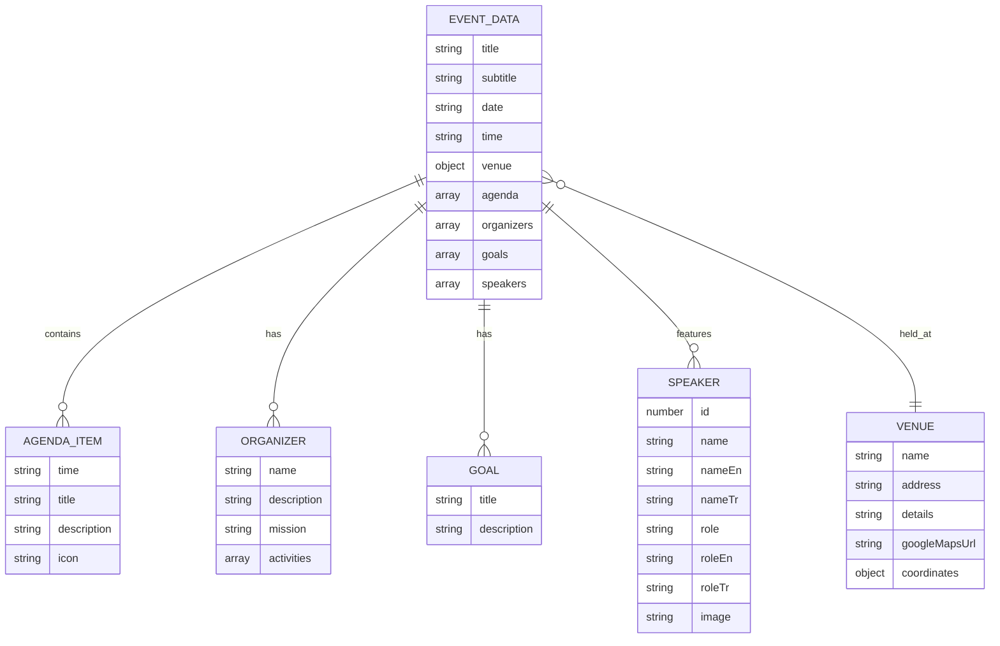
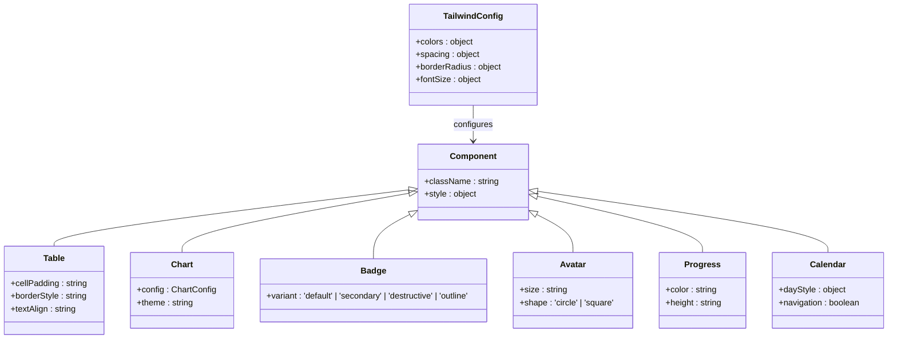
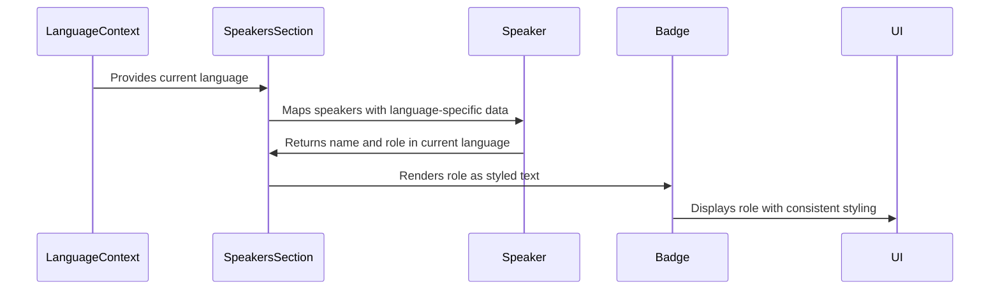
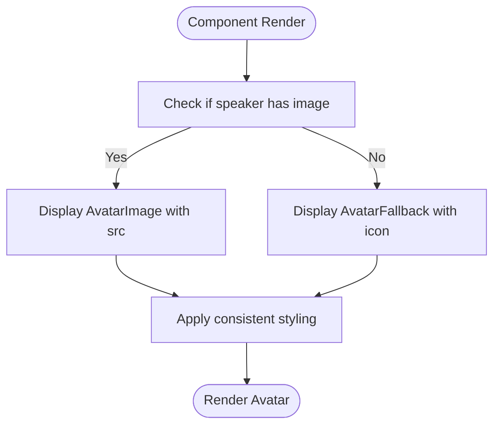
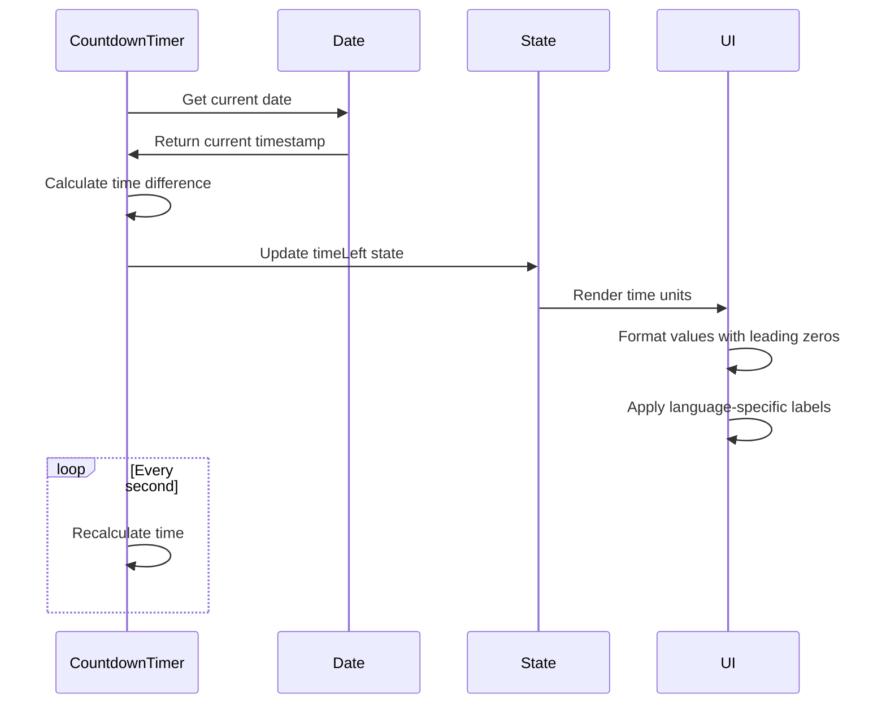

# Data Display Components

> **Referenced Files in This Document**   
> - [table.tsx](src/components/ui/table.tsx)
> - [chart.tsx](src/components/ui/chart.tsx)
> - [badge.tsx](src/components/ui/badge.tsx)
> - [avatar.tsx](src/components/ui/avatar.tsx)
> - [progress.tsx](src/components/ui/progress.tsx)
> - [calendar.tsx](src/components/ui/calendar.tsx)
> - [eventData.ts](src/data/eventData.ts)
> - [AgendaSection.tsx](src/components/AgendaSection.tsx)
> - [CountdownTimer.tsx](src/components/CountdownTimer.tsx)
> - [SpeakersSection.tsx](src/components/SpeakersSection.tsx)
> - [utils.ts](src/lib/utils.ts)
> - [tailwind.config.ts](tailwind.config.ts)

## Table of Contents
1. [Introduction](#introduction)
2. [Core Data Display Components](#core-data-display-components)
3. [Integration with Event Data](#integration-with-event-data)
4. [Multilingual Date Support](#multilingual-date-support)
5. [Accessibility Implementation](#accessibility-implementation)
6. [Styling Customization](#styling-customization)
7. [Real-World Examples](#real-world-examples)
8. [Troubleshooting Common Issues](#troubleshooting-common-issues)
9. [Conclusion](#conclusion)

## Introduction
This document provides comprehensive documentation for the data display components used in the Syrian Community Liberation Day event website. The components are designed to visualize structured information, metrics, status tags, participant images, countdowns, and date information. These components integrate with the eventData.ts file and support multilingual date formatting through date-fns. The documentation covers accessibility features, styling customization through Tailwind classes and theme variables, real-world usage examples, and troubleshooting guidance for common issues.

## Core Data Display Components

The application utilizes a set of reusable UI components for displaying different types of data. These components are built using React and follow the Headless UI pattern, providing flexibility while maintaining consistent styling.

### Table Component
The Table component is used for displaying structured information in a tabular format. It consists of several sub-components that work together to create a complete table structure:

- **Table**: The main container component that wraps the entire table
- **TableHeader**: Contains the header row(s) of the table
- **TableBody**: Contains the data rows of the table
- **TableFooter**: Contains the footer row(s) of the table
- **TableRow**: Represents a single row in the table
- **TableHead**: Represents a header cell in the table
- **TableCell**: Represents a data cell in the table
- **TableCaption**: Provides a caption for the table

The Table component includes responsive design features, with overflow handling for smaller screens and consistent styling across different table elements.

**Section sources**
- [table.tsx](src/components/ui/table.tsx#L5-L72)

### Chart Component
The Chart component provides data visualization capabilities using the Recharts library. It offers a wrapper around Recharts components with additional styling and configuration options:

- **ChartContainer**: The main container that sets up the chart context and responsive behavior
- **ChartTooltip**: Provides tooltip functionality for chart data points
- **ChartTooltipContent**: Customizable content for chart tooltips
- **ChartLegend**: Displays legend information for chart data series
- **ChartLegendContent**: Customizable content for chart legends
- **ChartStyle**: Handles theme-based styling for charts

The component supports theme-based color configuration and provides accessibility features for chart data.

**Section sources**
- [chart.tsx](src/components/ui/chart.tsx#L32-L303)

### Badge Component
The Badge component is used for displaying status tags, labels, and small pieces of information. It supports different visual variants:

- **Default**: Primary colored badge
- **Secondary**: Secondary colored badge
- **Destructive**: Red colored badge for error/warning states
- **Outline**: Border-only badge with transparent background

The component is built using class-variance-authority (cva) for variant management and supports custom class names for additional styling.

**Section sources**
- [badge.tsx](src/components/ui/badge.tsx#L6-L29)

### Avatar Component
The Avatar component displays participant images or fallback representations when images are not available:

- **Avatar**: The main container component that handles layout and styling
- **AvatarImage**: Displays the actual image content
- **AvatarFallback**: Provides a fallback representation when the image fails to load

The component uses Radix UI's Avatar primitives for accessible behavior and includes styling for consistent presentation.

**Section sources**
- [avatar.tsx](src/components/ui/avatar.tsx#L6-L38)

### Progress Component
The Progress component visualizes completion status or countdowns:

- **Progress**: The main component that displays a progress bar
- Uses Radix UI's Progress primitive for accessible behavior
- Supports value-based progress indication
- Animates transitions between progress states

The component is styled with a secondary background and primary fill color, with smooth transitions for value changes.

**Section sources**
- [progress.tsx](src/components/ui/progress.tsx#L6-L23)

### Calendar Component
The Calendar component provides date visualization and selection capabilities:

- Built on react-day-picker library
- Supports month and year navigation
- Displays date grid with styling for different date states
- Includes accessibility features for keyboard navigation
- Supports customization of day rendering and styling

The component integrates with Tailwind CSS for consistent styling and provides theme-aware appearance.

**Section sources**
- [calendar.tsx](src/components/ui/calendar.tsx#L10-L54)

## Integration with Event Data

The data display components are integrated with the eventData.ts file, which contains structured information about the Liberation Day event. This integration enables dynamic content rendering based on the event data.

### Data Structure
The eventData object contains various properties that are used across different components:

- **Event metadata**: title, subtitle, date, time, venue information
- **Agenda items**: schedule of events with time, title, description, and icon
- **Organizers**: information about the organizing entities
- **Goals**: objectives of the event
- **Speakers**: list of participants with their details

**Diagram sources**
- [eventData.ts](src/data/eventData.ts#L1-L108)

**Section sources**
- [eventData.ts](src/data/eventData.ts#L1-L108)

## Multilingual Date Support

The application supports multilingual date formatting through integration with date-fns, enabling proper display of dates in Arabic, English, and Turkish languages.

### Date Formatting Implementation
The event data includes pre-formatted dates in Arabic, but the application can dynamically format dates based on the current language setting:

- **Arabic**: Uses Arabic numerals and Arabic month names
- **English**: Uses Western numerals and English month names
- **Turkish**: Uses Western numerals and Turkish month names

The date formatting follows cultural conventions for each language, including proper numeral systems and date order.

### Language Context Integration
The application uses a LanguageContext to manage the current language setting, which affects date display:

- Language switching triggers re-rendering of date components
- Date formatting functions adapt to the current language
- Calendar components display weekday and month names in the appropriate language

This ensures consistent multilingual support across all date-related components.

**Section sources**
- [eventData.ts](src/data/eventData.ts#L7-L9)
- [SpeakersSection.tsx](src/components/SpeakersSection.tsx#L172-L184)

## Accessibility Implementation

The data display components include comprehensive accessibility features to ensure usability for all users, including those with disabilities.

### Table Accessibility
The Table component implements several accessibility features:

- **Semantic HTML structure**: Proper use of table elements (table, thead, tbody, tr, th, td)
- **ARIA attributes**: Appropriate roles and properties for table elements
- **Keyboard navigation**: Support for navigating table content using keyboard
- **Screen reader support**: Proper announcement of table structure and content
- **Focus management**: Visible focus indicators for interactive elements

Table headers are properly associated with their corresponding cells, and the table structure is logical and predictable.

**Section sources**
- [table.tsx](src/components/ui/table.tsx#L5-L72)

### Chart Accessibility
The Chart component provides accessibility features for data visualization:

- **ARIA labels**: Descriptive labels for chart elements
- **Keyboard navigation**: Support for navigating chart data points
- **Screen reader support**: Alternative text descriptions of chart data
- **Color contrast**: Sufficient contrast between chart elements and background
- **Focus indicators**: Visible focus states for interactive chart elements

The ChartTooltipContent component includes semantic HTML structure and proper labeling for tooltip information.

**Section sources**
- [chart.tsx](src/components/ui/chart.tsx#L92-L226)

### Avatar Accessibility
The Avatar component includes accessibility features for participant images:

- **Alt text**: Required alt attribute for image elements
- **Fallback content**: Accessible representation when images fail to load
- **Focus management**: Proper focus handling for interactive avatars
- **Semantic structure**: Appropriate roles and properties for avatar components

The AvatarImage component requires alt text to be provided, ensuring that screen readers can properly describe the image content.

**Section sources**
- [avatar.tsx](src/components/ui/avatar.tsx#L19-L23)

## Styling Customization

The data display components support extensive styling customization through Tailwind classes and theme variables, allowing for consistent branding and design.

### Tailwind Integration
All components are built with Tailwind CSS utility classes, enabling easy customization:

- **Class merging**: The cn utility function combines default and custom classes
- **Responsive design**: Tailwind's responsive prefixes enable mobile-friendly layouts
- **Theme awareness**: Components adapt to light and dark themes
- **Customization points**: Specific class names can be overridden for unique styling

The components use the cn function from utils.ts to merge class names, ensuring that custom classes are properly applied while maintaining default styling.

### Theme Variables
The application defines custom theme variables in the Tailwind configuration:

- **Color palette**: Custom colors for Syrian green, gold, and black
- **Typography**: Custom font families and sizes
- **Spacing**: Custom spacing scale
- **Border radius**: Custom border radius values

These variables are used consistently across components to maintain visual harmony.

### Component-Specific Customization
Each component provides specific customization options:

- **Table**: Customizable cell padding, border styles, and text alignment
- **Chart**: Theme-based color configuration through the ChartConfig type
- **Badge**: Multiple variants with different color schemes
- **Avatar**: Size and shape customization
- **Progress**: Color and height customization
- **Calendar**: Customizable day styling and navigation controls

**Diagram sources**
- [tailwind.config.ts](tailwind.config.ts)
- [utils.ts](src/lib/utils.ts#L4-L6)
- [badge.tsx](src/components/ui/badge.tsx#L6-L20)

**Section sources**
- [tailwind.config.ts](tailwind.config.ts)
- [utils.ts](src/lib/utils.ts#L4-L6)

## Real-World Examples

The data display components are used throughout the application in various contexts, demonstrating their practical implementation.

### Badge Usage in Speakers Section
The Badge component is used to display speaker roles in the SpeakersSection component. Each speaker's role is displayed as a badge with appropriate styling:

- **Implementation**: Speaker roles are rendered as text content within the component
- **Styling**: Roles are displayed with consistent typography and spacing
- **Accessibility**: Role information is properly associated with the speaker

The component uses language-specific role information (Arabic, English, Turkish) based on the current language setting.

**Diagram sources**
- [SpeakersSection.tsx](src/components/SpeakersSection.tsx#L174-L184)
- [badge.tsx](src/components/ui/badge.tsx)

**Section sources**
- [SpeakersSection.tsx](src/components/SpeakersSection.tsx#L171-L237)

### Avatar Usage in Speakers Section
The Avatar component is used to display speaker images in the SpeakersSection component:

- **Image loading**: Speaker images are imported and displayed using the AvatarImage component
- **Fallback handling**: When images are not available, a fallback icon is displayed
- **Accessibility**: Alt text is provided for screen readers
- **Styling**: Consistent size and border radius for all avatars

The component handles both speakers with images and those without, providing a consistent user experience.

**Diagram sources**
- [SpeakersSection.tsx](src/components/SpeakersSection.tsx#L209-L219)
- [avatar.tsx](src/components/ui/avatar.tsx)

**Section sources**
- [SpeakersSection.tsx](src/components/SpeakersSection.tsx#L171-L237)

### Progress Usage in Countdown Timer
The Progress component concept is implemented in the CountdownTimer component, which visualizes the time remaining until the event:

- **Time calculation**: The component calculates days, hours, minutes, and seconds remaining
- **Visual representation**: Each time unit is displayed in a separate container
- **Animation**: Values update every second with smooth transitions
- **Multilingual support**: Time unit labels are translated based on the current language

Although the component doesn't use the Progress component directly, it follows a similar pattern of visualizing progress toward an event.

**Diagram sources**
- [CountdownTimer.tsx](src/components/CountdownTimer.tsx#L11-L77)

**Section sources**
- [CountdownTimer.tsx](src/components/CountdownTimer.tsx#L11-L77)

## Troubleshooting Common Issues

This section addresses common issues that may arise when using the data display components and provides solutions.

### Table Overflow on Mobile
One common issue is table content overflowing on mobile devices due to limited screen width.

**Symptoms**:
- Horizontal scrolling is required to view all table content
- Table cells are compressed or text is truncated
- Layout breaks on smaller screens

**Solutions**:
1. Ensure the Table component is wrapped in a responsive container with overflow-x-auto
2. Use responsive typography classes to adjust font sizes on smaller screens
3. Implement horizontal scrolling for wide tables
4. Consider alternative layouts for mobile devices (e.g., card-based layout)

The current Table implementation already includes overflow handling with the "relative w-full overflow-auto" wrapper, which should prevent most overflow issues.

**Section sources**
- [table.tsx](src/components/ui/table.tsx#L7)

### Chart Rendering Performance
Complex charts with large datasets may experience performance issues, particularly on lower-end devices.

**Symptoms**:
- Slow rendering of chart components
- Lag when interacting with charts
- High memory usage

**Solutions**:
1. Implement data sampling for large datasets
2. Use lazy loading for charts that are not immediately visible
3. Optimize chart configuration to reduce unnecessary re-renders
4. Consider using simpler chart types for mobile devices

The ChartContainer component uses Recharts' ResponsiveContainer, which helps optimize rendering performance by only rendering when the container is visible.

**Section sources**
- [chart.tsx](src/components/ui/chart.tsx#L54)

### Accessibility Issues
Accessibility problems may occur if components are not used correctly.

**Common Issues**:
1. Missing alt text for images in Avatar components
2. Insufficient color contrast in Badge components
3. Inaccessible table navigation
4. Missing ARIA labels for interactive elements

**Solutions**:
1. Always provide meaningful alt text for Avatar images
2. Test color contrast ratios to ensure accessibility
3. Ensure keyboard navigation works for all interactive elements
4. Use semantic HTML and ARIA attributes appropriately

The components are designed with accessibility in mind, but proper usage is essential to maintain accessibility standards.

**Section sources**
- [avatar.tsx](src/components/ui/avatar.tsx#L22)
- [table.tsx](src/components/ui/table.tsx)

## Conclusion
The data display components in the Syrian Community Liberation Day event website provide a comprehensive set of tools for visualizing structured information, metrics, status tags, participant images, countdowns, and date information. These components are well-integrated with the eventData.ts file and support multilingual date formatting through date-fns. The components include robust accessibility features, support extensive styling customization through Tailwind classes and theme variables, and are used effectively in real-world examples throughout the application. By following the guidance in this documentation, developers can effectively use and extend these components to meet the needs of the event website while maintaining consistency, accessibility, and performance.