# Dialog & Drawer Components

> **Referenced Files in This Document**   
> - [dialog.tsx](src/components/ui/dialog.tsx)
> - [drawer.tsx](src/components/ui/drawer.tsx)
> - [Navbar.tsx](src/components/Navbar.tsx)
> - [RegistrationSection.tsx](src/components/RegistrationSection.tsx)
> - [sidebar.tsx](src/components/ui/sidebar.tsx)
> - [sheet.tsx](src/components/ui/sheet.tsx)
> - [use-mobile.tsx](src/hooks/use-mobile.tsx)

## Table of Contents
1. [Introduction](#introduction)
2. [Core Components](#core-components)
3. [Architecture Overview](#architecture-overview)
4. [Detailed Component Analysis](#detailed-component-analysis)
5. [Integration Examples](#integration-examples)
6. [Accessibility and Interaction Patterns](#accessibility-and-interaction-patterns)
7. [Common Issues and Debugging](#common-issues-and-debugging)
8. [Performance Considerations](#performance-considerations)
9. [Conclusion](#conclusion)

## Introduction
This document provides comprehensive documentation for the Dialog and Drawer components used in the application. These components serve distinct purposes: Dialog for desktop modals and Drawer for swipeable mobile sheets. Both components are built on top of accessible primitives and provide robust functionality for registration forms and mobile navigation. The documentation covers their underlying implementations, accessibility features, integration patterns, and troubleshooting guidance.

## Core Components

The Dialog and Drawer components are fundamental UI elements in the application, designed to handle different interaction patterns based on device type and user context. The Dialog component is implemented using Radix UI's Dialog primitive, while the Drawer component leverages the Vaul library to provide native-like swipeable sheets on mobile devices.

**Section sources**
- [dialog.tsx](src/components/ui/dialog.tsx#L1-L96)
- [drawer.tsx](src/components/ui/drawer.tsx#L1-L88)

## Architecture Overview

The architecture of the Dialog and Drawer components follows a consistent pattern of wrapping accessible primitives with custom styling and behavior enhancements. Both components provide a set of sub-components that follow a similar naming convention and structural pattern.

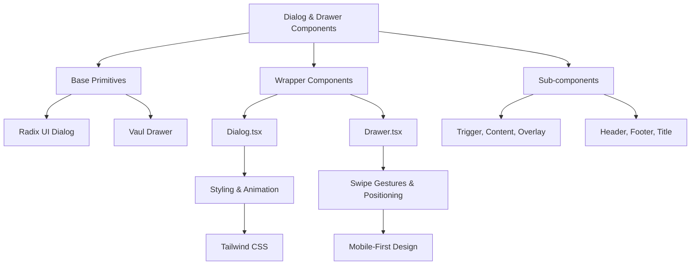

**Diagram sources**
- [dialog.tsx](src/components/ui/dialog.tsx#L1-L96)
- [drawer.tsx](src/components/ui/drawer.tsx#L1-L88)

## Detailed Component Analysis

### Dialog Component Analysis
The Dialog component is built on Radix UI's Dialog primitive, providing a fully accessible modal experience for desktop users. It handles focus trapping, keyboard navigation, and screen reader announcements through the underlying Radix implementation.

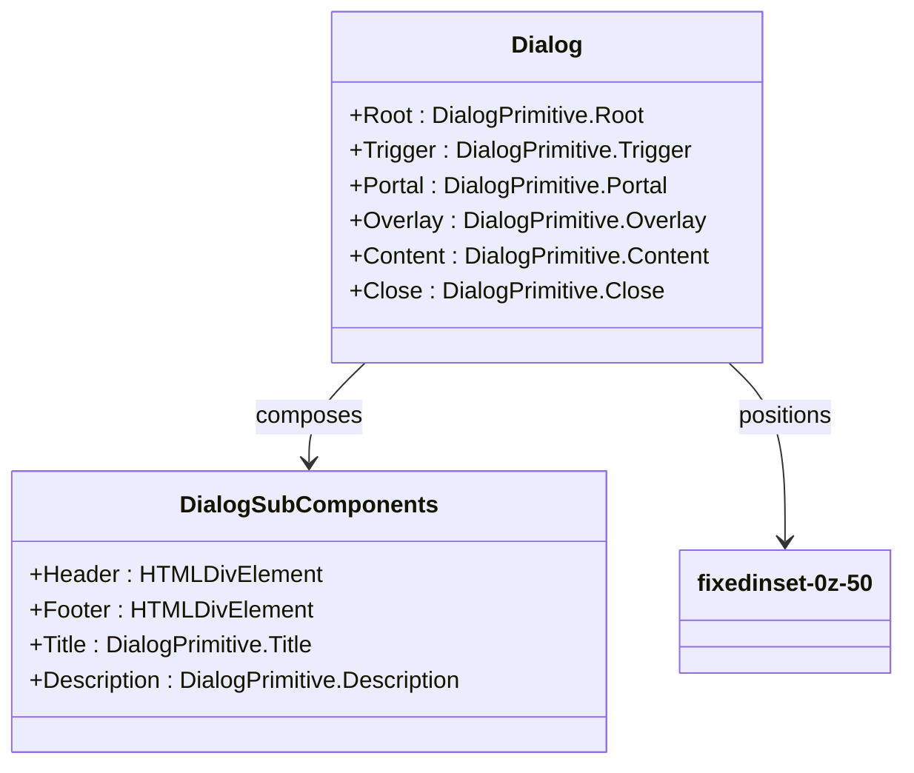

**Diagram sources**
- [dialog.tsx](src/components/ui/dialog.tsx#L7-L95)

**Section sources**
- [dialog.tsx](src/components/ui/dialog.tsx#L1-L96)

### Drawer Component Analysis
The Drawer component is implemented using the Vaul library, which provides swipeable sheet functionality optimized for mobile devices. It's specifically designed for touch interactions and provides a native app-like experience for mobile navigation.

```mermaid
classDiagram
class Drawer {
+Root : DrawerPrimitive.Root
+Trigger : DrawerPrimitive.Trigger
+Portal : DrawerPrimitive.Portal
+Overlay : DrawerPrimitive.Overlay
+Content : DrawerPrimitive.Content
+Close : DrawerPrimitive.Close
}
class DrawerSubComponents {
+Header : HTMLDivElement
+Footer : HTMLDivElement
+Title : DrawerPrimitive.Title
+Description : DrawerPrimitive.Description
}
Drawer --> DrawerSubComponents : composes
Drawer --> fixed inset-x-0 bottom-0 : positions
Drawer --> h-2 w-[100px] : handle
```

**Diagram sources**
- [drawer.tsx](src/components/ui/drawer.tsx#L6-L87)

**Section sources**
- [drawer.tsx](src/components/ui/drawer.tsx#L1-L88)

### Responsive Behavior Analysis
The application implements a responsive design pattern that uses different components based on device type. The sidebar component demonstrates this pattern by using Sheet for mobile devices and a traditional sidebar for desktop.

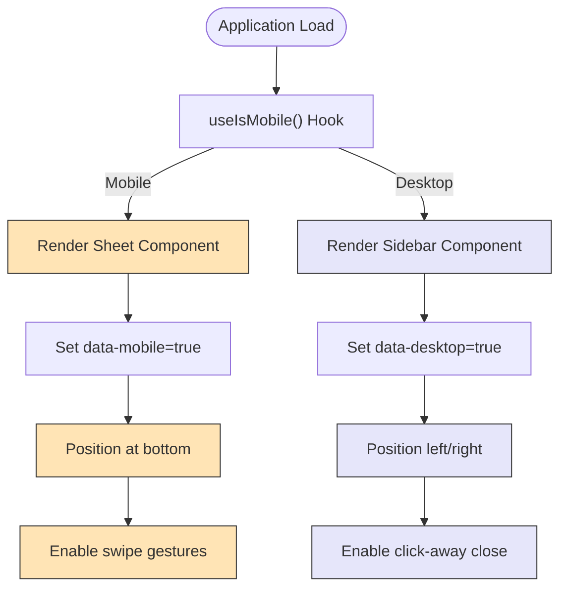

**Diagram sources**
- [sidebar.tsx](src/components/ui/sidebar.tsx#L153-L171)
- [use-mobile.tsx](src/hooks/use-mobile.tsx#L5-L19)

**Section sources**
- [sidebar.tsx](src/components/ui/sidebar.tsx#L150-L175)
- [use-mobile.tsx](src/hooks/use-mobile.tsx#L1-L20)

## Integration Examples

### Registration Form Integration
The Dialog component is used for registration forms, providing a focused experience for users completing the registration process. The component hierarchy follows a standard pattern with header, content, and footer sections.

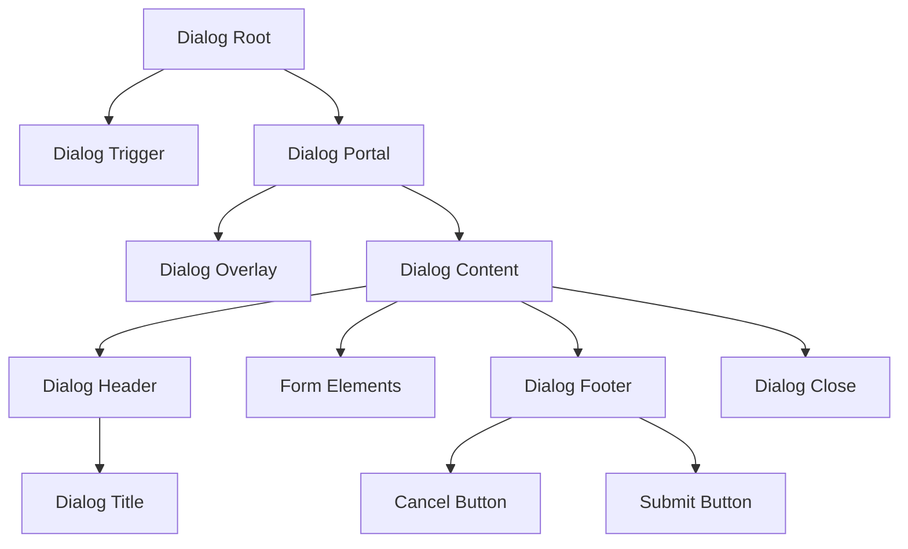

**Diagram sources**
- [dialog.tsx](src/components/ui/dialog.tsx#L7-L95)
- [RegistrationSection.tsx](src/components/RegistrationSection.tsx#L1-L105)

### Mobile Navigation Integration
The mobile navigation system uses a conditional rendering approach based on screen size, switching between a traditional navbar for desktop and a drawer-like pattern for mobile devices.

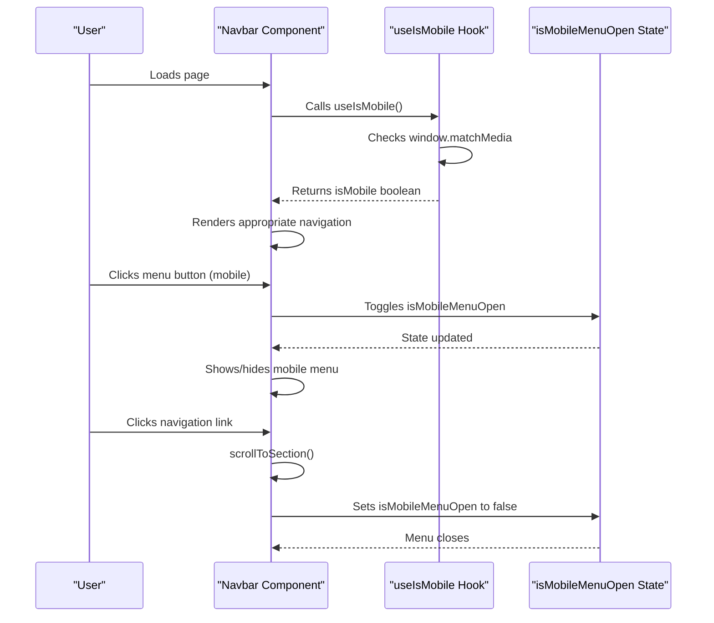

**Diagram sources**
- [Navbar.tsx](src/components/Navbar.tsx#L1-L123)
- [use-mobile.tsx](src/hooks/use-mobile.tsx#L1-L20)

**Section sources**
- [Navbar.tsx](src/components/Navbar.tsx#L1-L123)

## Accessibility and Interaction Patterns

### Focus Management
Both Dialog and Drawer components implement proper focus trapping to ensure accessibility. When opened, focus is moved to the first focusable element within the component and trapped within it until closed.

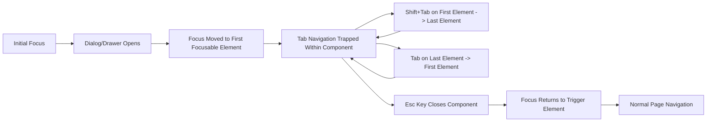

**Diagram sources**
- [dialog.tsx](src/components/ui/dialog.tsx#L30-L52)
- [drawer.tsx](src/components/ui/drawer.tsx#L25-L43)

### Keyboard Navigation
The components support standard keyboard interactions expected by users, including Esc to close and Tab to navigate through focusable elements.

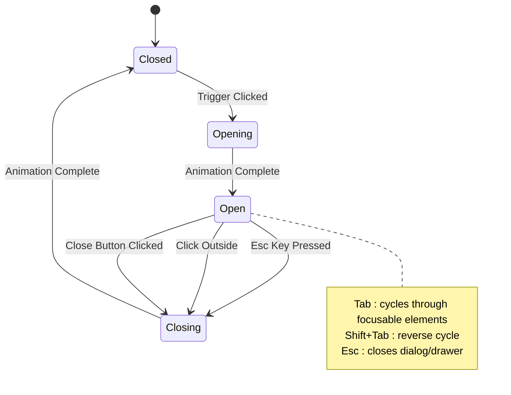

**Diagram sources**
- [dialog.tsx](src/components/ui/dialog.tsx#L15-L28)
- [drawer.tsx](src/components/ui/drawer.tsx#L17-L24)

### Screen Reader Announcements
The components use appropriate ARIA attributes to ensure screen reader users are properly informed about the state and purpose of the dialogs and drawers.

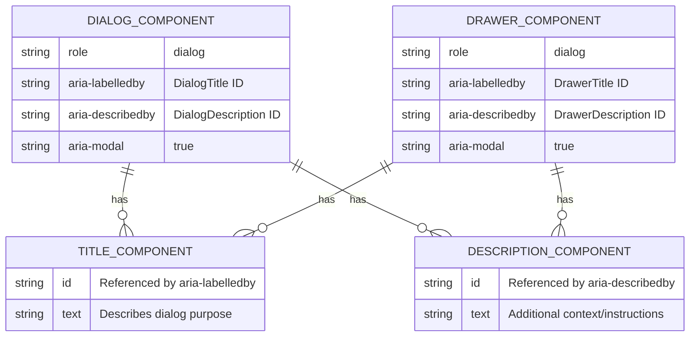

**Diagram sources**
- [dialog.tsx](src/components/ui/dialog.tsx#L64-L82)
- [drawer.tsx](src/components/ui/drawer.tsx#L56-L74)

## Common Issues and Debugging

### Scroll Lock Issues
A common issue with modal components is scroll lock not working properly, allowing the background page to scroll when the dialog or drawer is open.

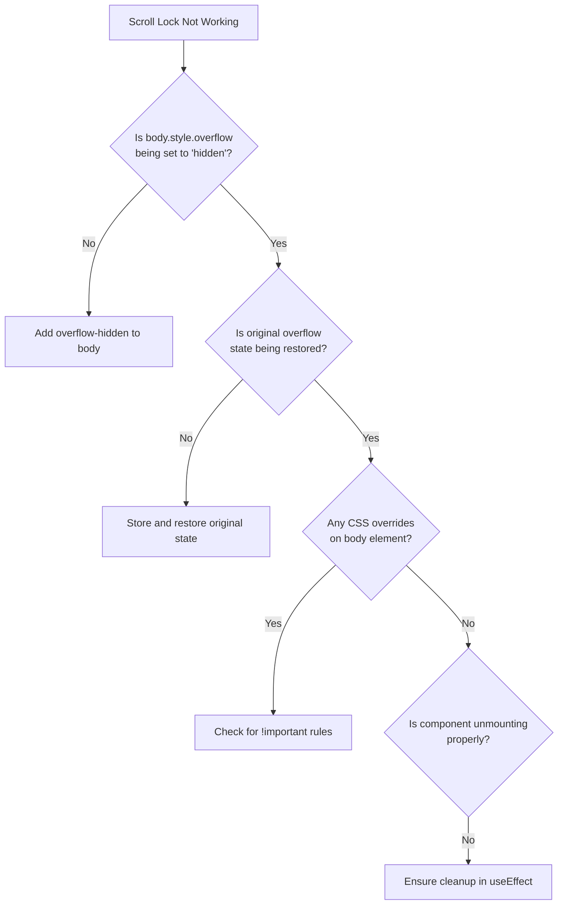

**Section sources**
- [dialog.tsx](src/components/ui/dialog.tsx#L15-L28)
- [drawer.tsx](src/components/ui/drawer.tsx#L17-L24)

### Backdrop Click Issues
Another common issue is the backdrop click not closing the modal as expected, often due to event propagation problems.

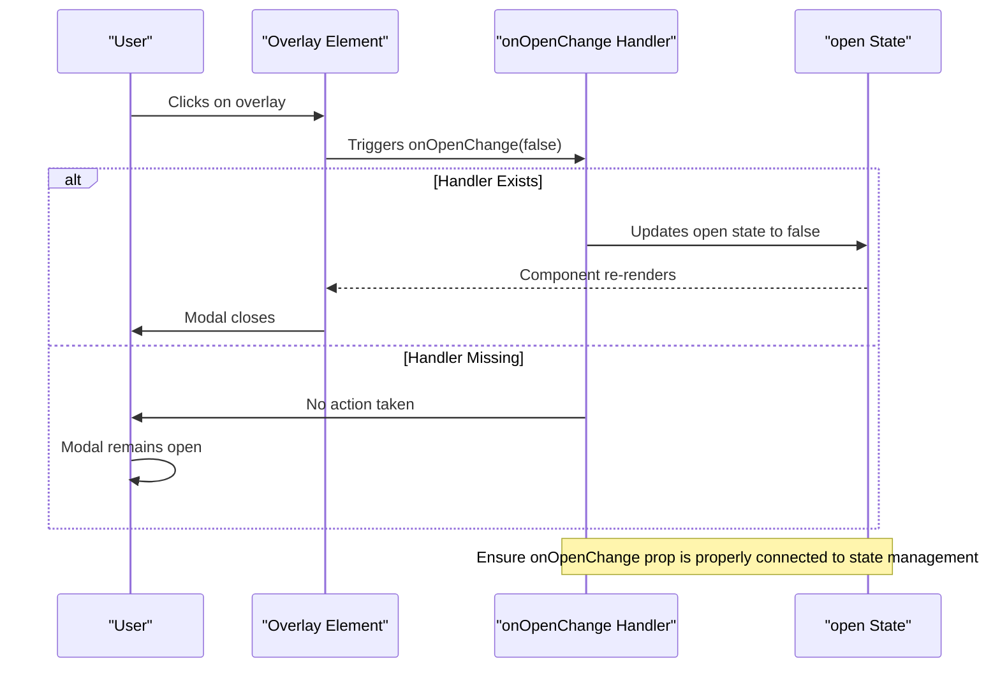

**Section sources**
- [dialog.tsx](src/components/ui/dialog.tsx#L7-L95)
- [drawer.tsx](src/components/ui/drawer.tsx#L6-L87)

## Performance Considerations

### Lazy Mounting
For optimal performance, especially with complex content, consider lazy mounting the dialog content to avoid rendering expensive components when the dialog is closed.

```mermaid
flowchart TD
A[Dialog Closed] --> B{Content Mounted?}
B --> |No| C[Only render trigger and minimal DOM]
B --> |Yes| D[Full component tree rendered]
C --> E[User Opens Dialog]
E --> F[Mount content and render]
F --> G[Dialog Fully Interactive]
G --> H{User Closes Dialog}
H --> |Keep Mounted| I[Hide but keep in DOM]
H --> |Unmount| J[Remove from DOM]
note right of H
Trade-off: Memory vs. Re-mounting cost
Keep mounted for frequent use
Unmount for memory-sensitive scenarios
end note
```

**Section sources**
- [dialog.tsx](src/components/ui/dialog.tsx#L34-L51)
- [drawer.tsx](src/components/ui/drawer.tsx#L29-L42)

### Animation Smoothness
Ensuring smooth animations is critical for user experience, particularly on mobile devices with limited processing power.

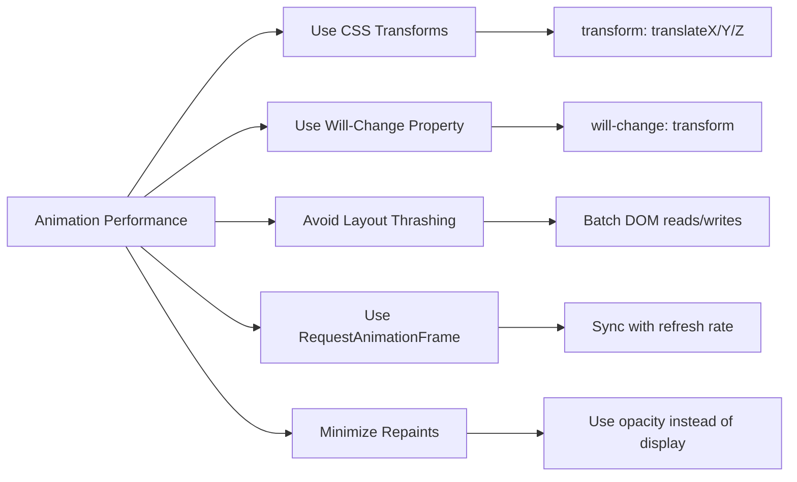

**Section sources**
- [dialog.tsx](src/components/ui/dialog.tsx#L22-L23)
- [drawer.tsx](src/components/ui/drawer.tsx#L21-L22)

## Conclusion
The Dialog and Drawer components provide a robust foundation for modal and mobile sheet experiences in the application. By leveraging Radix UI and Vaul primitives, the implementation ensures accessibility, proper focus management, and intuitive interaction patterns. The responsive design approach allows for optimal user experience across device types, with Dialog used for desktop modals and Drawer (via Sheet) for mobile navigation. Proper implementation of these components requires attention to accessibility, performance, and consistent user experience patterns.