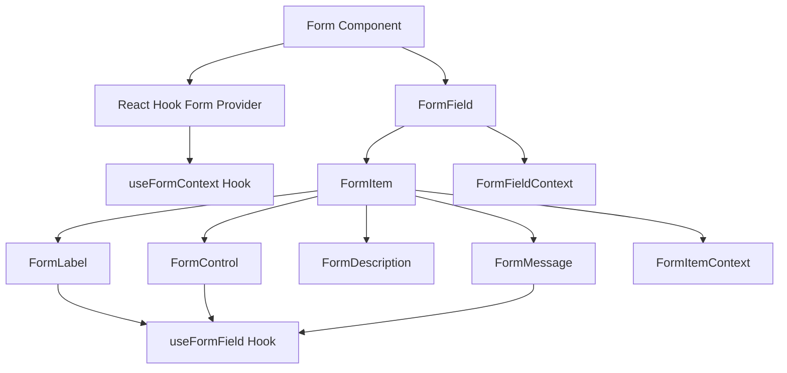
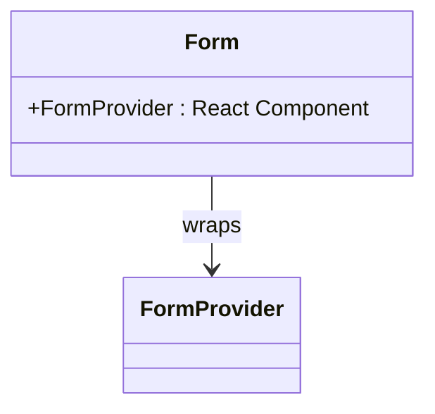
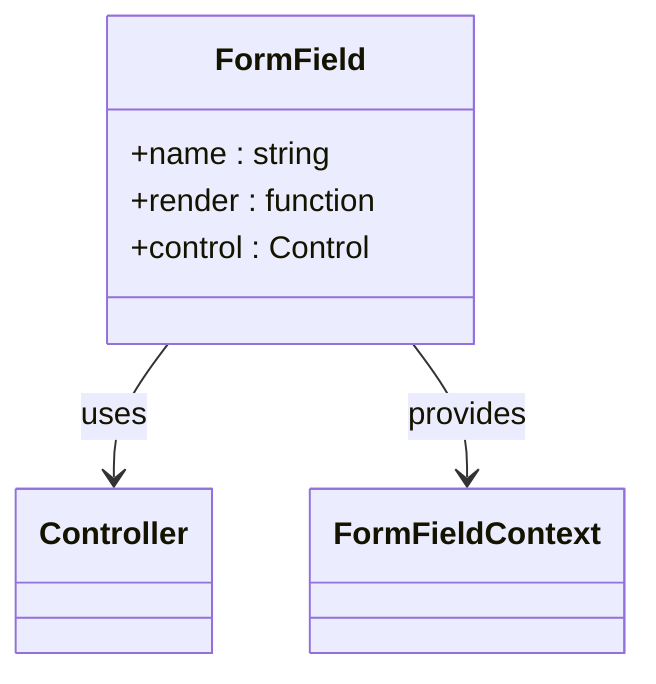
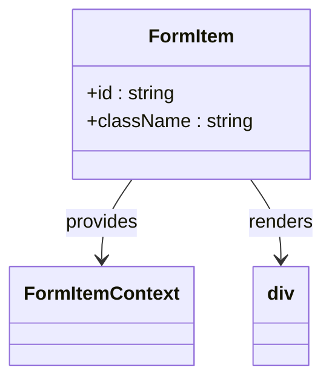
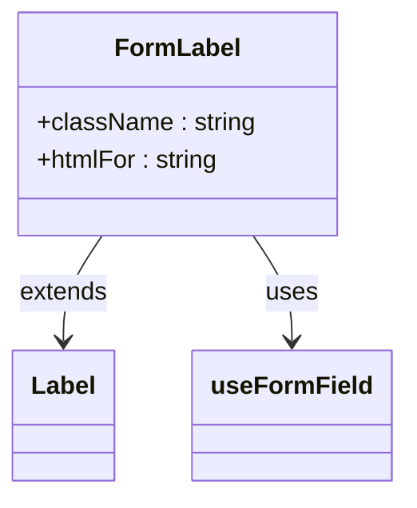
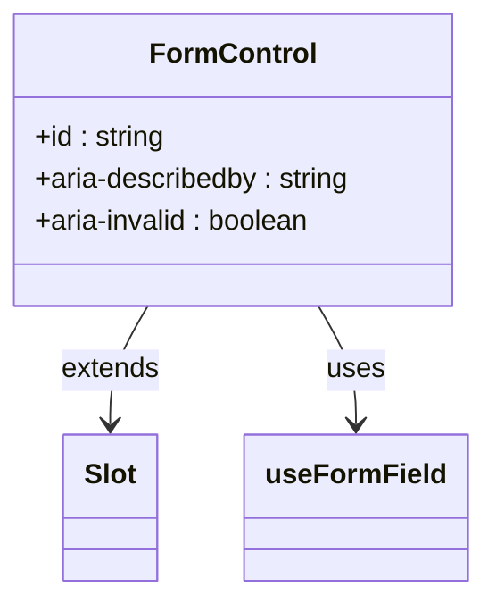
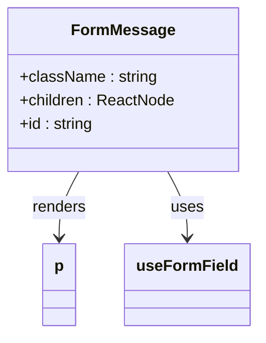

# Form Component

> **Referenced Files in This Document**   
> - [form.tsx](src/components/ui/form.tsx)
> - [label.tsx](src/components/ui/label.tsx)
> - [utils.ts](src/lib/utils.ts)
> - [package.json](package.json)

## Table of Contents
1. [Introduction](#introduction)
2. [Core Components](#core-components)
3. [Architecture Overview](#architecture-overview)
4. [Detailed Component Analysis](#detailed-component-analysis)
5. [Validation Strategy and Error Handling](#validation-strategy-and-error-handling)
6. [Accessibility Features](#accessibility-features)
7. [Configuration Options](#configuration-options)
8. [Usage Examples](#usage-examples)
9. [Common Issues and Solutions](#common-issues-and-solutions)
10. [Performance Characteristics](#performance-characteristics)

## Introduction
The Form component is a comprehensive form handling solution built on React Hook Form and Zod validation. It provides a structured, accessible, and type-safe approach to form management in the application. The component system enables efficient form state management, validation, and error handling while maintaining high performance through uncontrolled components and optimized re-renders.

**Section sources**
- [form.tsx](src/components/ui/form.tsx#L1-L129)

## Core Components
The Form component system consists of several interconnected components that work together to create a cohesive form experience:

- **Form**: A wrapper around React Hook Form's FormProvider that manages form state and validation
- **FormField**: A context provider that connects individual form fields to the form state
- **FormItem**: A container component that groups form elements and provides unique IDs
- **FormLabel**: A label component that automatically associates with form controls
- **FormControl**: A slot component that wraps the actual input element
- **FormDescription**: A helper text component for additional field information
- **FormMessage**: A component that displays validation error messages

These components work together to create a consistent, accessible form experience throughout the application.

**Section sources**
- [form.tsx](src/components/ui/form.tsx#L1-L129)

## Architecture Overview
The Form component architecture is built on React Hook Form's uncontrolled component pattern, which provides performance benefits by minimizing re-renders and avoiding the overhead of controlled components. The component tree uses React Context to pass form state and field information down to individual components.

**Diagram sources**
- [form.tsx](src/components/ui/form.tsx#L1-L129)

**Section sources**
- [form.tsx](src/components/ui/form.tsx#L1-L129)

## Detailed Component Analysis

### Form Component
The Form component is a simple wrapper around React Hook Form's FormProvider, providing a clean API for form state management.

**Diagram sources**
- [form.tsx](src/components/ui/form.tsx#L9)

**Section sources**
- [form.tsx](src/components/ui/form.tsx#L9)

### FormField Component
The FormField component uses React Hook Form's Controller to connect individual form fields to the form state. It provides a context that contains the field name, enabling other components to access field-specific information.

**Diagram sources**
- [form.tsx](src/components/ui/form.tsx#L20-L31)

**Section sources**
- [form.tsx](src/components/ui/form.tsx#L20-L31)

### FormItem Component
The FormItem component serves as a container for form elements, providing a consistent layout and generating unique IDs for accessibility purposes.

**Diagram sources**
- [form.tsx](src/components/ui/form.tsx#L62-L73)

**Section sources**
- [form.tsx](src/components/ui/form.tsx#L62-L73)

### FormLabel Component
The FormLabel component automatically associates with its corresponding form control using the htmlFor attribute. It also applies error styling when the field is invalid.

**Diagram sources**
- [form.tsx](src/components/ui/form.tsx#L75-L83)

**Section sources**
- [form.tsx](src/components/ui/form.tsx#L75-L83)

### FormControl Component
The FormControl component wraps the actual input element and applies accessibility attributes based on the field's validation state.

**Diagram sources**
- [form.tsx](src/components/ui/form.tsx#L85-L100)

**Section sources**
- [form.tsx](src/components/ui/form.tsx#L85-L100)

### FormMessage Component
The FormMessage component displays validation error messages when a field is invalid. It automatically hides when there are no errors.

**Diagram sources**
- [form.tsx](src/components/ui/form.tsx#L111-L127)

**Section sources**
- [form.tsx](src/components/ui/form.tsx#L111-L127)

## Validation Strategy and Error Handling
The Form component integrates with React Hook Form's validation system, which supports both synchronous and asynchronous validation. The application uses Zod for schema validation, as evidenced by its presence in the package.json dependencies.

When a field is invalid, the FormMessage component automatically displays the error message. The error state is propagated through the useFormField hook, which provides access to the field's error object. The FormLabel and FormControl components also respond to error states by applying appropriate styling and accessibility attributes.

The validation strategy follows React Hook Form's default behavior of validating on blur, but this can be configured through the form's configuration options.

**Section sources**
- [form.tsx](src/components/ui/form.tsx#L33-L54)
- [package.json](package.json#L63)

## Accessibility Features
The Form component system includes several accessibility features:

- **Automatic labeling**: The FormLabel component automatically associates with its corresponding form control using the htmlFor attribute
- **Error messaging**: The FormMessage component provides clear error messages when validation fails
- **ARIA attributes**: The FormControl component applies aria-invalid and aria-describedby attributes based on the field's validation state
- **Focus management**: The component system works with React Hook Form's focus management to ensure proper focus behavior
- **Unique IDs**: The FormItem component generates unique IDs for each form element, ensuring proper accessibility

These features ensure that forms are accessible to users of assistive technologies and comply with WCAG guidelines.

**Section sources**
- [form.tsx](src/components/ui/form.tsx#L85-L95)
- [form.tsx](src/components/ui/form.tsx#L75-L82)

## Configuration Options
The Form component supports various configuration options through React Hook Form's useForm hook. These include:

- **Default values**: Initial values for form fields
- **Revalidation modes**: Configuration for when form fields should be revalidated
- **Async validation**: Support for asynchronous validation functions
- **Error handling**: Custom error messages and validation rules

These options can be passed to the useForm hook when creating a form, allowing for flexible configuration based on the specific use case.

**Section sources**
- [form.tsx](src/components/ui/form.tsx#L4)

## Usage Examples
While specific form implementations are not present in the codebase, the Form component can be used to create various types of forms, such as registration forms and contact forms. The component system provides a consistent API for creating accessible, validated forms throughout the application.

For a registration form, the component would be used as follows:
- Form to wrap the entire form
- FormField for each input field (name, email, password, etc.)
- FormItem to group each field's components
- FormLabel for field labels
- FormControl to wrap input elements
- FormMessage to display validation errors

Similarly, for a contact form, the same component structure would be used with appropriate fields (name, email, message, etc.).

**Section sources**
- [form.tsx](src/components/ui/form.tsx#L1-L129)

## Common Issues and Solutions

### Uncontrolled Input State Mismatches
A common issue with uncontrolled components is state mismatches when default values change after the form is initialized. This can be resolved by using the key prop to force a component re-mount when default values change, or by using React Hook Form's reset function to update the form state.

### Controlled vs Uncontrolled Components
The Form component uses uncontrolled components for performance reasons, but this can lead to confusion when developers expect controlled behavior. The solution is to use React Hook Form's register function or Controller component to properly connect inputs to the form state.

### Validation Timing
The default validation behavior (on blur) may not meet all requirements. This can be configured by passing validationMode options to the useForm hook, allowing validation on change, submit, or other events.

**Section sources**
- [form.tsx](src/components/ui/form.tsx#L4)

## Performance Characteristics
The Form component system provides several performance benefits:

- **Uncontrolled components**: By using uncontrolled components, the form avoids the overhead of React state updates for every input change, resulting in better performance for large forms
- **Efficient re-renders**: React Hook Form only re-renders components that need to be updated, minimizing unnecessary re-renders
- **Optimized validation**: Validation is performed efficiently, with options to debounce or throttle validation for better performance
- **Lightweight**: The component system is built on lightweight primitives, avoiding unnecessary wrappers or complexity

These performance characteristics make the Form component suitable for complex forms with many fields, ensuring a smooth user experience.

**Section sources**
- [form.tsx](src/components/ui/form.tsx#L4)
- [package.json](package.json#L55)