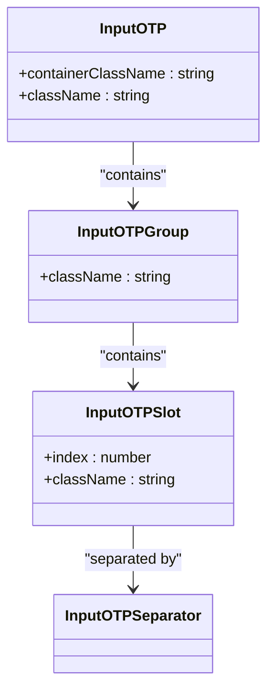
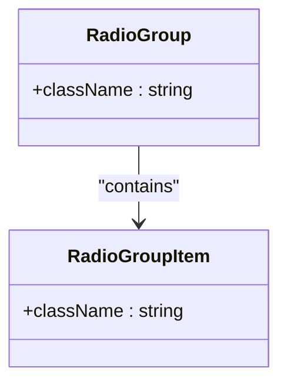
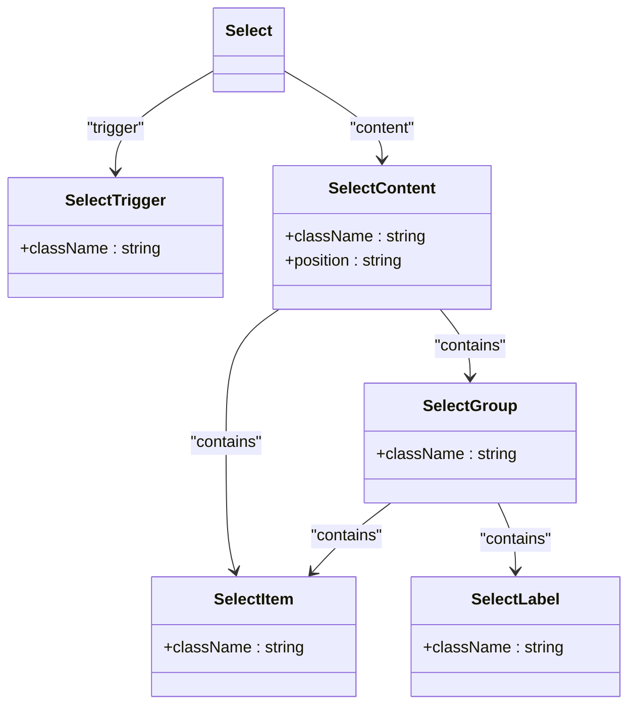
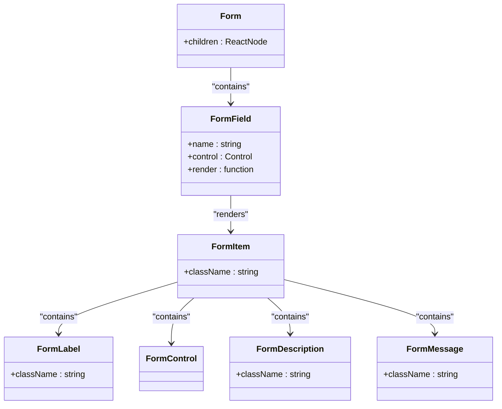
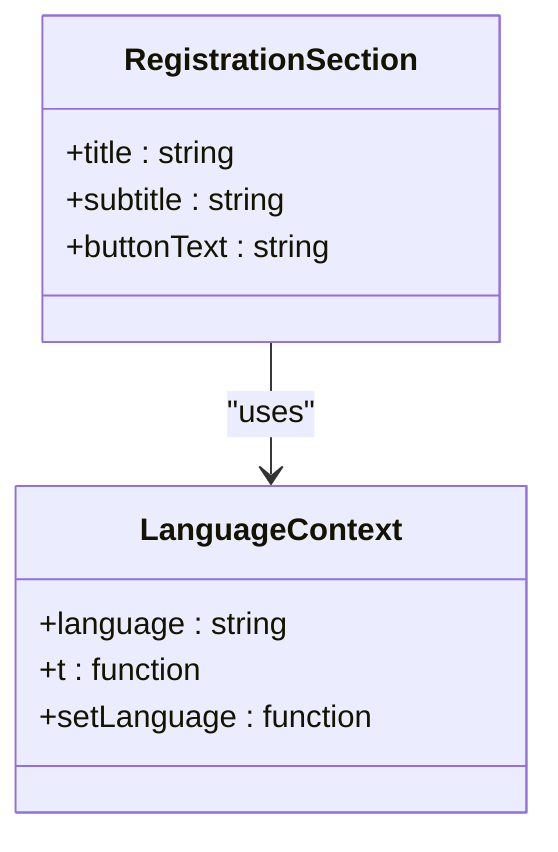

# Input Components

<cite>
**Referenced Files in This Document**   
- [input.tsx](file://src/components/ui/input.tsx)
- [textarea.tsx](file://src/components/ui/textarea.tsx)
- [input-otp.tsx](file://src/components/ui/input-otp.tsx)
- [checkbox.tsx](file://src/components/ui/checkbox.tsx)
- [radio-group.tsx](file://src/components/ui/radio-group.tsx)
- [select.tsx](file://src/components/ui/select.tsx)
- [switch.tsx](file://src/components/ui/switch.tsx)
- [slider.tsx](file://src/components/ui/slider.tsx)
- [form.tsx](file://src/components/ui/form.tsx)
- [label.tsx](file://src/components/ui/label.tsx)
- [utils.ts](file://src/lib/utils.ts)
- [calendar.tsx](file://src/components/ui/calendar.tsx)
- [RegistrationSection.tsx](file://src/components/RegistrationSection.tsx)
- [LanguageContext.tsx](file://src/contexts/LanguageContext.tsx)
</cite>

## Table of Contents
1. [Introduction](#introduction)
2. [Text Input Components](#text-input-components)
3. [Boolean Input Components](#boolean-input-components)
4. [Numeric and Selection Input Components](#numeric-and-selection-input-components)
5. [Form Integration and State Management](#form-integration-and-state-management)
6. [Accessibility Implementation](#accessibility-implementation)
7. [Internationalization Considerations](#internationalization-considerations)
8. [Common Issues and Troubleshooting](#common-issues-and-troubleshooting)
9. [Conclusion](#conclusion)

## Introduction
This document provides comprehensive documentation for input components in the application, focusing on their data models, validation states, interaction patterns, and integration with form systems. The components are designed to capture user data efficiently while supporting accessibility and internationalization requirements. The implementation leverages React with Radix UI primitives and react-hook-form for state management.

**Section sources**
- [input.tsx](file://src/components/ui/input.tsx#L1-L23)
- [form.tsx](file://src/components/ui/form.tsx#L1-L130)

## Text Input Components

### Input Component
The Input component is a controlled text input field that supports various HTML input types. It extends native input props through React.ComponentProps<"input"> and applies consistent styling using Tailwind CSS classes. The component handles RTL language support through standard browser behavior and responsive design.

**Section sources**
- [input.tsx](file://src/components/ui/input.tsx#L5-L22)

### Textarea Component
The Textarea component provides a multi-line text input with a minimum height of 80px. It extends React.TextareaHTMLAttributes<HTMLTextAreaElement> to support all standard textarea properties. The component includes focus states and disabled styling for consistent user experience.

**Section sources**
- [textarea.tsx](file://src/components/ui/textarea.tsx#L7-L21)

### InputOTP Component
The InputOTP component implements a one-time password input with individual digit slots. It uses the input-otp library to manage the OTP input state and provides visual feedback with caret blinking animation. The component supports grouping and separation of digits with customizable separators.

**Diagram sources**
- [input-otp.tsx](file://src/components/ui/input-otp.tsx#L7-L61)

## Boolean Input Components

### Checkbox Component
The Checkbox component implements a binary selection control using Radix UI's CheckboxPrimitive. It displays a check icon when selected and provides visual feedback for hover, focus, and disabled states. The component uses data attributes to manage its visual state.

**Section sources**
- [checkbox.tsx](file://src/components/ui/checkbox.tsx#L7-L26)

### RadioGroup Component
The RadioGroup component provides a set of mutually exclusive options. It uses a grid layout to arrange radio items and implements proper keyboard navigation. Each RadioGroupItem displays a circular indicator that fills when selected.

**Diagram sources**
- [radio-group.tsx](file://src/components/ui/radio-group.tsx#L7-L36)

### Switch Component
The Switch component implements a toggle control with smooth transition animations. It uses a sliding thumb that moves between left (unchecked) and right (checked) positions. The component provides visual feedback through border and background color changes on interaction.

**Section sources**
- [switch.tsx](file://src/components/ui/switch.tsx#L6-L27)

## Numeric and Selection Input Components

### Slider Component
The Slider component allows users to select a value from a continuous range. It displays a track with a draggable thumb and a filled range indicator. The component supports touch interactions and provides visual feedback for focus states.

**Section sources**
- [slider.tsx](file://src/components/ui/slider.tsx#L6-L23)

### Select Component
The Select component implements a dropdown menu for selecting from a list of options. It consists of multiple subcomponents including Trigger, Content, Item, and Scroll buttons. The component supports keyboard navigation and displays a chevron icon to indicate the dropdown functionality.

**Diagram sources**
- [select.tsx](file://src/components/ui/select.tsx#L7-L143)

## Form Integration and State Management

### Form Component Architecture
The form system integrates react-hook-form with custom UI components to provide a seamless form experience. The Form component acts as a provider for form context, while FormField wraps individual form controls with controller functionality.

**Diagram sources**
- [form.tsx](file://src/components/ui/form.tsx#L1-L130)

### State Management Pattern
The form system uses React context to manage field state and validation. The useFormField hook provides access to field state including error status, touched status, and validation messages. This pattern enables components to respond appropriately to form validation states.

**Section sources**
- [form.tsx](file://src/components/ui/form.tsx#L33-L54)

## Accessibility Implementation

### Label Association
All form components implement proper label association using the FormLabel component. The system generates unique IDs for form items and associates them with their corresponding labels and error messages using aria-labelledby and aria-describedby attributes.

**Section sources**
- [label.tsx](file://src/components/ui/label.tsx#L9-L17)
- [form.tsx](file://src/components/ui/form.tsx#L75-L83)

### Error Messaging
The FormMessage component displays validation errors with appropriate styling and ARIA attributes. Error messages are announced by screen readers through aria-invalid and are visually distinguished with destructive color styling.

**Section sources**
- [form.tsx](file://src/components/ui/form.tsx#L111-L127)

### Keyboard Operability
All interactive components support keyboard navigation and focus management. The implementation follows WAI-ARIA practices for each component type, ensuring that users can interact with all controls using only a keyboard.

**Section sources**
- [checkbox.tsx](file://src/components/ui/checkbox.tsx#L7-L26)
- [radio-group.tsx](file://src/components/ui/radio-group.tsx#L7-L36)
- [select.tsx](file://src/components/ui/select.tsx#L13-L31)

## Internationalization Considerations

### RTL Language Support
The input components support RTL languages through standard CSS and HTML attributes. The application uses a LanguageContext to manage the current language setting, which affects text direction and component layout for Arabic and other RTL languages.

**Diagram sources**
- [LanguageContext.tsx](file://src/contexts/LanguageContext.tsx)
- [RegistrationSection.tsx](file://src/components/RegistrationSection.tsx#L1-L105)

### Date and Number Formatting
The Calendar component integrates with react-day-picker to support international date formatting. While specific number formatting implementations are not visible in the provided code, the system is structured to support locale-specific formatting through the internationalization framework.

**Section sources**
- [calendar.tsx](file://src/components/ui/calendar.tsx#L1-L55)

## Common Issues and Troubleshooting

### IME Composition in Arabic
Input components may experience issues with IME (Input Method Editor) composition when entering Arabic text. The standard HTML input elements handle most IME behavior automatically, but custom implementations should ensure they don't interfere with composition events.

**Section sources**
- [input.tsx](file://src/components/ui/input.tsx#L5-L22)
- [textarea.tsx](file://src/components/ui/textarea.tsx#L7-L21)

### Touch Input on Mobile Sliders
The Slider component may have usability issues on mobile devices due to small touch targets. The implementation provides a 5px by 5px thumb which may be difficult to manipulate on touch screens. Consider increasing the touch target size or providing alternative input methods for mobile users.

**Section sources**
- [slider.tsx](file://src/components/ui/slider.tsx#L6-L23)

## Conclusion
The input component system provides a comprehensive set of controls for capturing user data with consistent styling and behavior. The components are well-integrated with the form state management system and support accessibility requirements. Internationalization is implemented through a context-based language system that supports multiple languages including Arabic. While the components provide solid foundations, attention should be paid to mobile usability and IME behavior in RTL languages to ensure the best user experience.