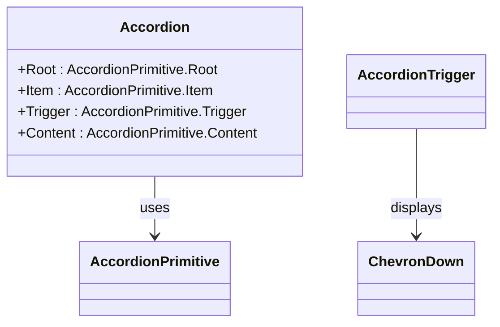
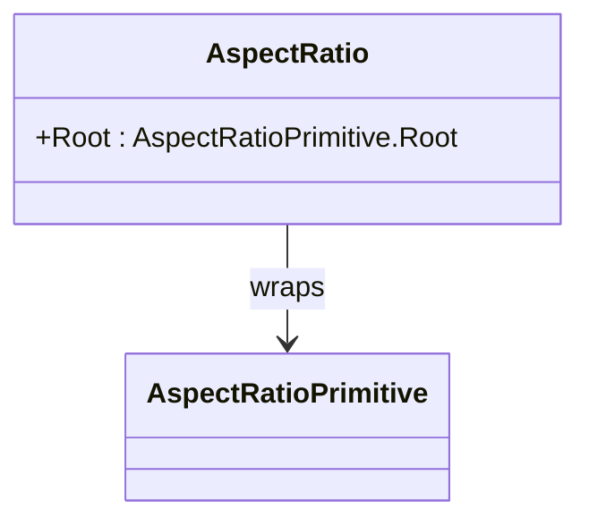
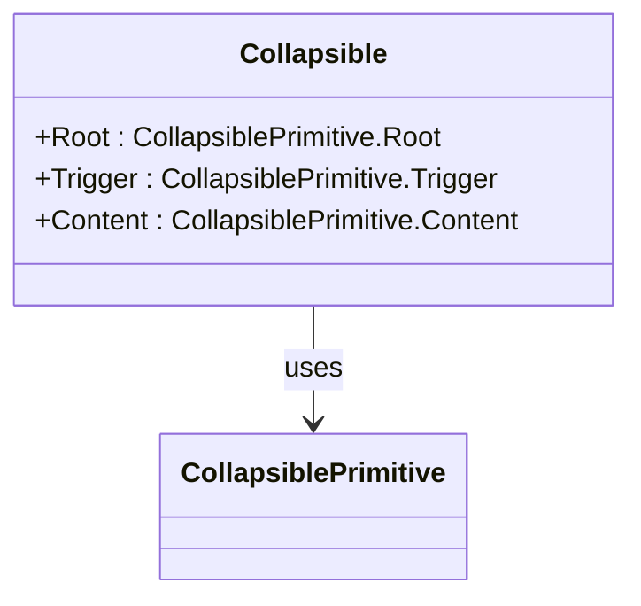
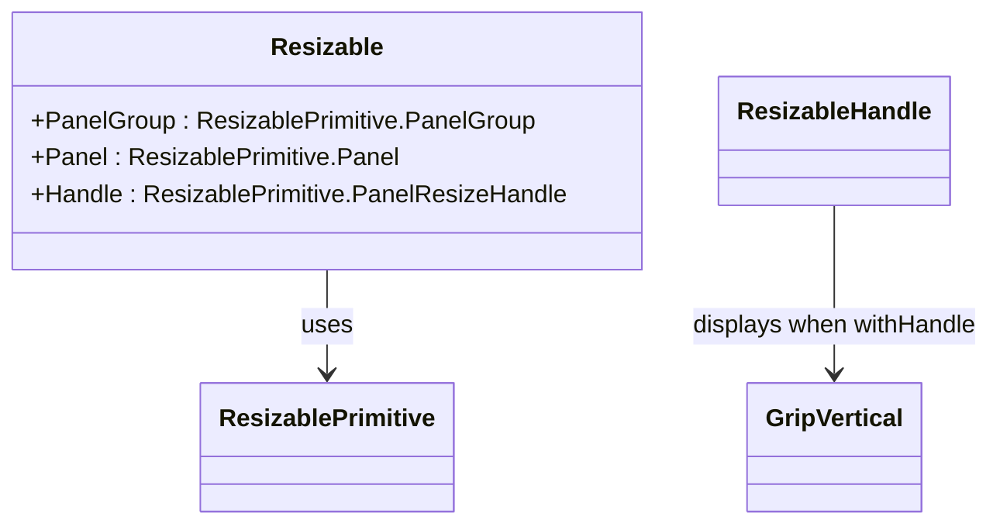
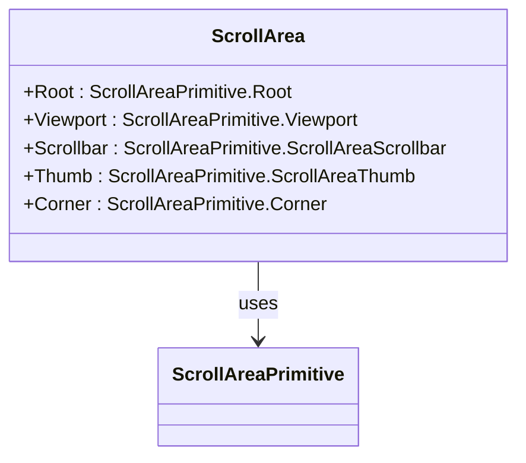
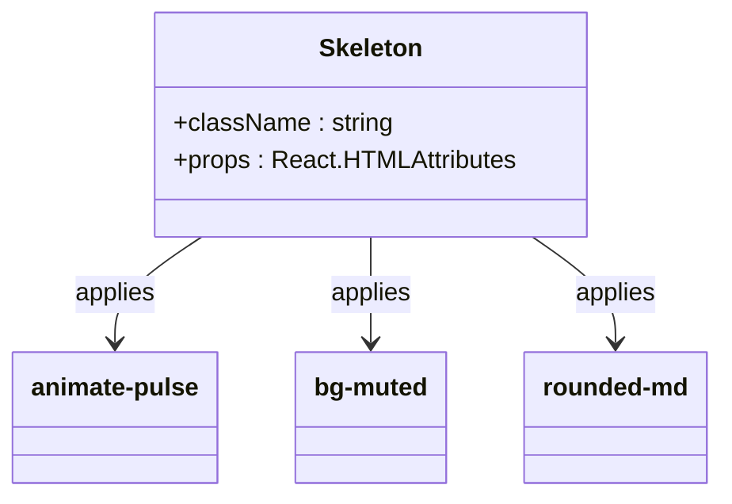

# Layout Components

> **Referenced Files in This Document**   
> - [accordion.tsx](src/components/ui/accordion.tsx)
> - [aspect-ratio.tsx](src/components/ui/aspect-ratio.tsx)
> - [collapsible.tsx](src/components/ui/collapsible.tsx)
> - [resizable.tsx](src/components/ui/resizable.tsx)
> - [scroll-area.tsx](src/components/ui/scroll-area.tsx)
> - [skeleton.tsx](src/components/ui/skeleton.tsx)
> - [SpeakersSection.tsx](src/components/SpeakersSection.tsx)
> - [LanguageSwitcher.tsx](src/components/LanguageSwitcher.tsx)
> - [utils.ts](src/lib/utils.ts)
> - [LanguageContext.tsx](src/contexts/LanguageContext.tsx)

## Table of Contents
1. [Introduction](#introduction)
2. [Core Layout Components](#core-layout-components)
3. [Accordion Component](#accordion-component)
4. [AspectRatio Component](#aspectratio-component)
5. [Collapsible Component](#collapsible-component)
6. [Resizable Component](#resizable-component)
7. [ScrollArea Component](#scrollarea-component)
8. [Skeleton Component](#skeleton-component)
9. [Accessibility and Responsive Design](#accessibility-and-responsive-design)
10. [Performance Optimization](#performance-optimization)

## Introduction
This document provides comprehensive documentation for the layout utility components used in the application to structure content effectively. These components include Accordion, AspectRatio, Collapsible, Resizable, ScrollArea, and Skeleton, all implemented using Radix UI primitives and styled with Tailwind CSS. The components are designed to enhance user experience through accessible, responsive, and performant interfaces. Special attention is given to accessibility features such as `aria-expanded` and `role="region"`, responsive behavior across devices, and RTL compatibility for Arabic language support.

## Core Layout Components

The layout utility components are built on top of Radix UI primitives, ensuring accessibility and robust functionality while leveraging Tailwind CSS for styling. These components are located in the `src/components/ui/` directory and are designed to be reusable across the application. They follow a consistent pattern of wrapping Radix primitives with custom styling and additional functionality.

**Section sources**
- [accordion.tsx](src/components/ui/accordion.tsx)
- [aspect-ratio.tsx](src/components/ui/aspect-ratio.tsx)
- [collapsible.tsx](src/components/ui/collapsible.tsx)
- [resizable.tsx](src/components/ui/resizable.tsx)
- [scroll-area.tsx](src/components/ui/scroll-area.tsx)
- [skeleton.tsx](src/components/ui/skeleton.tsx)

## Accordion Component

The Accordion component provides a collapsible interface for managing content sections, commonly used for FAQ sections or grouped information. It is built using `@radix-ui/react-accordion` and includes three main parts: `Accordion`, `AccordionItem`, `AccordionTrigger`, and `AccordionContent`.

The component uses the `data-state` attribute to manage open/closed states, with corresponding animations (`data-[state=closed]:animate-accordion-up` and `data-[state=open]:animate-accordion-down`). The trigger includes a rotating chevron icon (ChevronDown from lucide-react) that rotates 180 degrees when expanded, providing visual feedback to users.

Accessibility features include proper ARIA attributes managed by Radix primitives, with `aria-expanded` automatically applied to triggers. The component supports keyboard navigation and screen reader compatibility out of the box.

**Diagram sources**
- [accordion.tsx](src/components/ui/accordion.tsx#L7-L52)

**Section sources**
- [accordion.tsx](src/components/ui/accordion.tsx#L1-L53)

## AspectRatio Component

The AspectRatio component ensures consistent aspect ratios for media containers, particularly useful for images and videos. It is implemented using `@radix-ui/react-aspect-ratio` and provides a simple wrapper that maintains the desired aspect ratio regardless of screen size.

The component is minimal in implementation, essentially serving as a direct wrapper around the Radix primitive. This simplicity ensures reliable performance and predictable behavior across different use cases.

A primary usage example is in the SpeakersSection, where speaker images need to maintain a consistent visual presentation across different devices and screen sizes.

**Diagram sources**
- [aspect-ratio.tsx](src/components/ui/aspect-ratio.tsx#L3-L5)

**Section sources**
- [aspect-ratio.tsx](src/components/ui/aspect-ratio.tsx#L1-L6)
- [SpeakersSection.tsx](src/components/SpeakersSection.tsx#L209-L214)

## Collapsible Component

The Collapsible component provides expandable content sections with smooth animations. It is built using `@radix-ui/react-collapsible` and includes three main components: `Collapsible`, `CollapsibleTrigger`, and `CollapsibleContent`.

The implementation is straightforward, directly exposing the Radix primitives with minimal customization. This approach ensures maximum compatibility with Radix's accessibility features while allowing for easy styling through Tailwind CSS.

The component can be used for various purposes, such as hiding/showing additional information, creating expandable navigation menus, or implementing show/hide functionality for content sections.

**Diagram sources**
- [collapsible.tsx](src/components/ui/collapsible.tsx#L3-L9)

**Section sources**
- [collapsible.tsx](src/components/ui/collapsible.tsx#L1-L10)

## Resizable Component

The Resizable component enables draggable splitters for resizable panels, allowing users to adjust the size of adjacent content areas. It is implemented using `react-resizable-panels` rather than Radix UI, indicating a specialized use case for panel resizing.

The component suite includes `ResizablePanelGroup`, `ResizablePanel`, and `ResizableHandle`. The handle component includes an optional grip visual (GripVertical icon from lucide-react) that appears when `withHandle` is true, providing a clear visual cue for draggable areas.

The implementation includes responsive considerations, with different styles applied based on the panel group direction (vertical or horizontal), ensuring proper display and interaction in both orientations.

**Diagram sources**
- [resizable.tsx](src/components/ui/resizable.tsx#L6-L37)

**Section sources**
- [resizable.tsx](src/components/ui/resizable.tsx#L1-L38)

## ScrollArea Component

The ScrollArea component provides custom scrollable regions with styled scrollbars, implemented using `@radix-ui/react-scroll-area`. It replaces native browser scrollbars with a consistent, styled alternative that matches the application's design language.

The component includes `ScrollArea` and `ScrollBar` subcomponents, with the scrollbar supporting both vertical and horizontal orientations. The styling uses Tailwind classes to create a subtle, modern scrollbar that appears only when needed, with smooth transitions and hover effects.

Accessibility is maintained through Radix's implementation, ensuring keyboard navigation and screen reader compatibility while providing a better visual experience than native scrollbars.

**Diagram sources**
- [scroll-area.tsx](src/components/ui/scroll-area.tsx#L6-L38)

**Section sources**
- [scroll-area.tsx](src/components/ui/scroll-area.tsx#L1-L39)

## Skeleton Component

The Skeleton component provides loading state placeholders that help prevent layout shifts and improve perceived performance. It is implemented as a simple div with animated background and rounded styling.

The component uses Tailwind's `animate-pulse` class to create a subtle pulsing animation that indicates loading content. The styling includes `bg-muted` for the background color and `rounded-md` for consistent corner treatment with other UI elements.

A key usage example is during language switching, where content needs to be reloaded or re-rendered. The skeleton provides immediate visual feedback while the new language content is being prepared, maintaining a smooth user experience.

The implementation is minimal but effective, focusing on preventing layout shifts by reserving space for content before it loads.

**Diagram sources**
- [skeleton.tsx](src/components/ui/skeleton.tsx#L3-L7)

**Section sources**
- [skeleton.tsx](src/components/ui/skeleton.tsx#L1-L8)
- [LanguageSwitcher.tsx](src/components/LanguageSwitcher.tsx#L34-L35)

## Accessibility and Responsive Design

The layout components prioritize accessibility and responsive design, ensuring compatibility across devices and assistive technologies.

### Accessibility Features
All components leverage Radix UI primitives, which automatically handle many accessibility concerns:
- Proper ARIA attributes (aria-expanded, role="region", etc.)
- Keyboard navigation support
- Screen reader compatibility
- Focus management

The Accordion and Collapsible components specifically use `aria-expanded` to indicate their open/closed state, which is automatically managed by Radix primitives. The components also support keyboard interactions like Enter/Space to toggle states and arrow keys to navigate between items.

### RTL Compatibility
The application supports RTL (Right-to-Left) layout for Arabic language users. This is managed through the LanguageContext, which provides an `isRTL` flag that components can use to adjust their layout.

When the language is set to 'ar' (Arabic), the `isRTL` flag is true, triggering RTL layout adjustments throughout the application. This affects text alignment, component positioning, and navigation flow to accommodate right-to-left reading patterns.

### Responsive Behavior
All layout components are designed to be responsive, adapting to different screen sizes:
- Mobile-first approach using Tailwind's responsive prefixes
- Flexible layouts that adapt to available space
- Touch-friendly targets for mobile devices
- Appropriate spacing and sizing across breakpoints

The components work seamlessly with Tailwind's responsive utilities, allowing developers to easily customize behavior at different breakpoints.

**Section sources**
- [LanguageContext.tsx](src/contexts/LanguageContext.tsx#L276-L277)
- [LanguageSwitcher.tsx](src/components/LanguageSwitcher.tsx#L36-L37)
- [utils.ts](src/lib/utils.ts#L4-L6)

## Performance Optimization

The layout components include several performance optimization strategies to ensure smooth user experiences.

### Lazy Loading Content
For collapsible sections, content should be lazy-loaded to improve initial page performance. This means rendering content only when a section is expanded, rather than pre-rendering all content upfront.

This approach reduces the initial JavaScript bundle size and DOM complexity, leading to faster load times and improved performance, especially for pages with many collapsible sections.

### Preventing Layout Shifts
The Skeleton component plays a crucial role in preventing layout shifts during loading states. By reserving space for content before it loads, it maintains a stable layout and prevents the "jumping content" effect that can be disorienting to users.

During language switching, skeleton placeholders provide immediate visual feedback while the new language content is being prepared, creating a smoother transition experience.

### Efficient Rendering
The components are designed for efficient rendering:
- Minimal re-renders through proper React component design
- Use of React.forwardRef for proper ref handling without unnecessary re-renders
- Memoization where appropriate
- Efficient event handling

The combination of Radix primitives and Tailwind CSS ensures that the components are both performant and visually consistent across the application.

**Section sources**
- [skeleton.tsx](src/components/ui/skeleton.tsx#L3-L7)
- [LanguageSwitcher.tsx](src/components/LanguageSwitcher.tsx#L14-L43)
- [SpeakersSection.tsx](src/components/SpeakersSection.tsx#L172-L184)