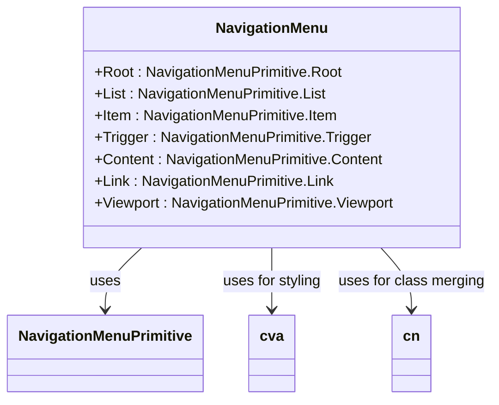
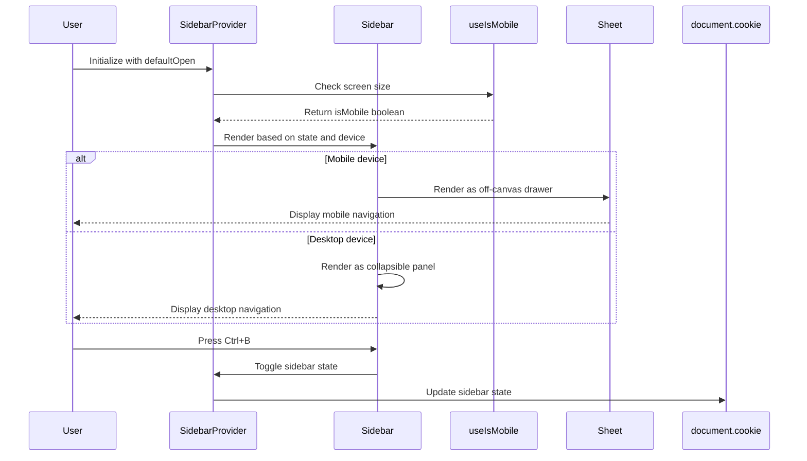
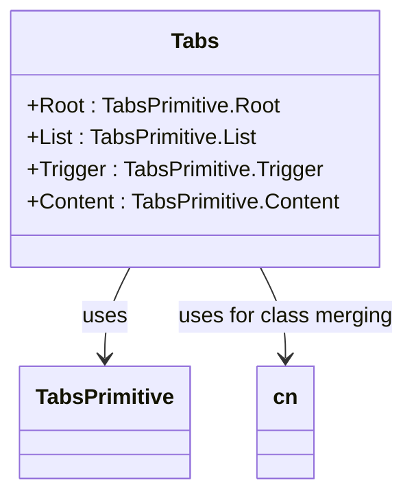
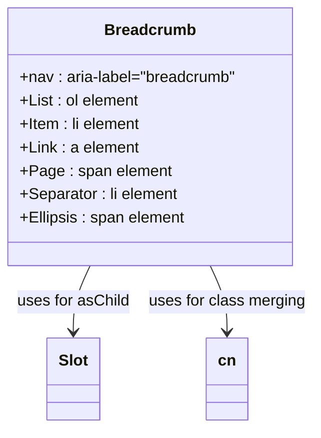
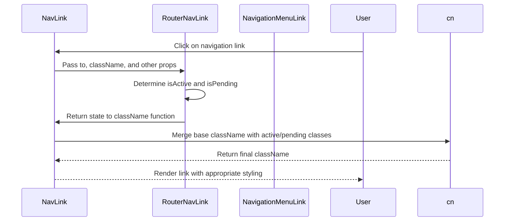
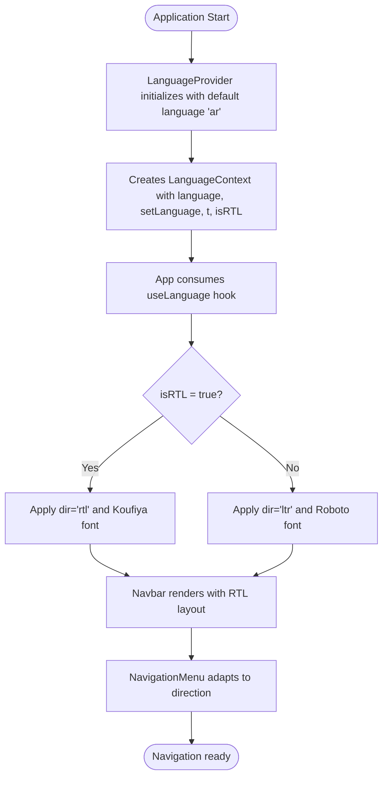

# Navigation Components

> **Referenced Files in This Document**   
> - [navigation-menu.tsx](src/components/ui/navigation-menu.tsx)
> - [sidebar.tsx](src/components/ui/sidebar.tsx)
> - [tabs.tsx](src/components/ui/tabs.tsx)
> - [breadcrumb.tsx](src/components/ui/breadcrumb.tsx)
> - [Navbar.tsx](src/components/Navbar.tsx)
> - [NavLink.tsx](src/components/NavLink.tsx)
> - [App.tsx](src/App.tsx)
> - [LanguageContext.tsx](src/contexts/LanguageContext.tsx)
> - [use-mobile.tsx](src/hooks/use-mobile.tsx)

## Table of Contents
1. [Introduction](#introduction)
2. [Core Navigation Components](#core-navigation-components)
3. [NavigationMenu Implementation](#navigationmenu-implementation)
4. [Sidebar Functionality](#sidebar-functionality)
5. [Tabs Component](#tabs-component)
6. [Breadcrumb Component](#breadcrumb-component)
7. [Integration with React Router](#integration-with-react-router)
8. [Accessibility Features](#accessibility-features)
9. [RTL Layout Support](#rtl-layout-support)
10. [Customization and Theming](#customization-and-theming)
11. [Common Issues and Troubleshooting](#common-issues-and-troubleshooting)
12. [Conclusion](#conclusion)

## Introduction
This document provides comprehensive documentation for the navigation-related components in the Syrian Community Day of Freedom application. The navigation system is designed to provide an intuitive user experience across different devices and languages, with special consideration for Arabic language support and RTL (right-to-left) layouts. The components covered include NavigationMenu, Sidebar, Tabs, and Breadcrumb, each serving specific roles in the site's information architecture and user navigation.

## Core Navigation Components

The application implements a comprehensive navigation system using four primary components that work together to create a cohesive user experience. These components are built using Radix UI primitives for accessibility and enhanced with Tailwind CSS for styling. The NavigationMenu serves as the primary navigation in the navbar, the Sidebar provides responsive off-canvas navigation, Tabs enable section switching within pages, and Breadcrumb maintains hierarchy tracking for complex content structures.

**Section sources**
- [navigation-menu.tsx](src/components/ui/navigation-menu.tsx)
- [sidebar.tsx](src/components/ui/sidebar.tsx)
- [tabs.tsx](src/components/ui/tabs.tsx)
- [breadcrumb.tsx](src/components/ui/breadcrumb.tsx)

## NavigationMenu Implementation

The NavigationMenu component is implemented as a sophisticated dropdown menu system that integrates seamlessly with the application's navbar. Built on Radix UI's NavigationMenu primitive, it provides accessible navigation with proper ARIA roles and keyboard navigation support. The component supports nested menu structures with smooth animations for content entry and exit, using data attributes to control animation states.

**Diagram sources**
- [navigation-menu.tsx](src/components/ui/navigation-menu.tsx)

**Section sources**
- [navigation-menu.tsx](src/components/ui/navigation-menu.tsx)
- [Navbar.tsx](src/components/Navbar.tsx)

## Sidebar Functionality

The Sidebar component implements a responsive, collapsible navigation panel that adapts to different screen sizes. It provides both desktop and mobile navigation patterns, with a floating sidebar on larger screens and an off-canvas drawer on mobile devices. The component maintains its state across sessions using cookies and supports keyboard shortcuts (Ctrl+B) for toggling visibility. The implementation includes features like collapsible icons, tooltips for collapsed states, and resizable panels.

**Diagram sources**
- [sidebar.tsx](src/components/ui/sidebar.tsx)

**Section sources**
- [sidebar.tsx](src/components/ui/sidebar.tsx)
- [use-mobile.tsx](src/hooks/use-mobile.tsx)

## Tabs Component

The Tabs component provides a clean interface for switching between different sections of content within a page. Built on Radix UI's Tabs primitive, it ensures proper accessibility with ARIA tablist roles and keyboard navigation support. The implementation includes visual indicators for the active tab, with smooth transitions between states. The component is styled to match the application's design system, with hover effects and focus indicators that enhance usability.

**Diagram sources**
- [tabs.tsx](src/components/ui/tabs.tsx)

**Section sources**
- [tabs.tsx](src/components/ui/tabs.tsx)

## Breadcrumb Component

The Breadcrumb component implements a hierarchical navigation aid that helps users understand their location within the site's structure. It follows accessibility best practices with proper ARIA labels and semantic HTML. The component supports custom separators and can be easily extended to include ellipsis for long navigation paths. The implementation uses semantic elements like nav, ol, and li to maintain proper document structure.

**Diagram sources**
- [breadcrumb.tsx](src/components/ui/breadcrumb.tsx)

**Section sources**
- [breadcrumb.tsx](src/components/ui/breadcrumb.tsx)

## Integration with React Router

The navigation components are integrated with React Router through a custom NavLink component that wraps the router's NavLink. This implementation allows for style customization based on navigation state (active, pending) while maintaining all the functionality of React Router. The NavLink component uses the cn utility to merge class names and apply different styles based on whether a link is active, enabling visual feedback for the current page.

**Diagram sources**
- [NavLink.tsx](src/components/NavLink.tsx)

**Section sources**
- [NavLink.tsx](src/components/NavLink.tsx)
- [App.tsx](src/App.tsx)

## Accessibility Features

The navigation components implement comprehensive accessibility features to ensure usability for all users. Keyboard navigation is fully supported across all components, with proper focus management and logical tab order. ARIA roles are correctly applied: menu roles for NavigationMenu, tablist roles for Tabs, and appropriate landmark roles for navigation regions. Focus indicators are visible and meet contrast requirements, and screen reader announcements are implemented through aria-labels and aria-current attributes.

The components also support keyboard shortcuts for enhanced navigation efficiency. The Sidebar can be toggled with Ctrl+B, and all interactive elements are accessible via keyboard tabbing. Navigation menus support arrow key navigation, and tabs can be switched using left/right arrow keys. These features ensure that users who rely on keyboard navigation can efficiently interact with all navigation elements.

**Section sources**
- [navigation-menu.tsx](src/components/ui/navigation-menu.tsx)
- [sidebar.tsx](src/components/ui/sidebar.tsx)
- [tabs.tsx](src/components/ui/tabs.tsx)
- [breadcrumb.tsx](src/components/ui/breadcrumb.tsx)

## RTL Layout Support

The application provides robust RTL (right-to-left) layout support, particularly important for Arabic language users. The LanguageContext manages the current language and directionality, with isRTL flag set to true when the language is Arabic. This context is consumed by the App component, which applies the appropriate dir attribute to the root element and adjusts the font family accordingly.

The navigation components automatically adapt to RTL layouts, with directional CSS variables and Tailwind classes that flip the layout. The Sidebar component, for example, adjusts its positioning and animation directions based on the text direction. The NavigationMenu's dropdown positioning and animations are also reversed in RTL mode to maintain intuitive user experience.

**Diagram sources**
- [LanguageContext.tsx](src/contexts/LanguageContext.tsx)

**Section sources**
- [LanguageContext.tsx](src/contexts/LanguageContext.tsx)
- [App.tsx](src/App.tsx)
- [Navbar.tsx](src/components/Navbar.tsx)

## Customization and Theming

The navigation components are highly customizable through Tailwind CSS variants and theme-aware design. The components use the cn utility function to merge class names, allowing for easy customization while preserving base functionality. The Sidebar component, for example, supports different variants (sidebar, floating, inset) and collapsible modes (offcanvas, icon, none), enabling different layout patterns for various use cases.

Theme-aware icons from Lucide React are used throughout the navigation components, ensuring visual consistency and proper color application based on the current theme. The components also support customization through props like asChild, which allows wrapping arbitrary content while maintaining navigation semantics and styling.

**Section sources**
- [navigation-menu.tsx](src/components/ui/navigation-menu.tsx)
- [sidebar.tsx](src/components/ui/sidebar.tsx)
- [lib/utils.ts](src/lib/utils.ts)

## Common Issues and Troubleshooting

Several common issues may arise when implementing and using the navigation components. One potential issue is touch swipe conflicts on mobile devices, where swipe gestures might interfere with sidebar opening/closing. This can be addressed by implementing proper touch event handling and gesture recognition.

Tab activation problems can occur when dynamic content loading affects the tab state. Ensuring proper key management and state synchronization between the UI and React Router can resolve these issues. For RTL layout flipping, developers should verify that all directional CSS properties are properly inverted and that animations maintain their intended behavior.

Performance issues may arise with complex navigation structures. Implementing lazy loading for navigation content and optimizing re-renders with React.memo can help maintain smooth performance. Additionally, ensuring proper cleanup of event listeners (as seen in the Sidebar's keyboard shortcut implementation) prevents memory leaks.

**Section sources**
- [sidebar.tsx](src/components/ui/sidebar.tsx)
- [use-mobile.tsx](src/hooks/use-mobile.tsx)
- [NavLink.tsx](src/components/NavLink.tsx)

## Conclusion
The navigation components in the Syrian Community Day of Freedom application provide a robust, accessible, and internationalized navigation system. By leveraging Radix UI primitives, React Router integration, and Tailwind CSS customization, the components deliver a seamless user experience across devices and languages. The implementation demonstrates best practices in accessibility, responsive design, and internationalization, particularly with comprehensive RTL support for Arabic language users. These components form the backbone of the application's user interface, enabling intuitive navigation and content discovery.