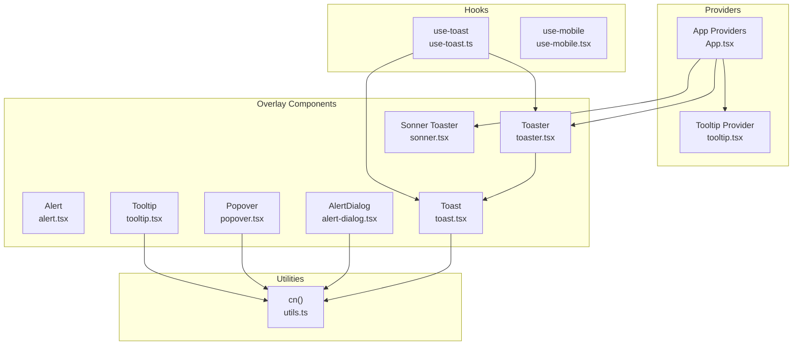
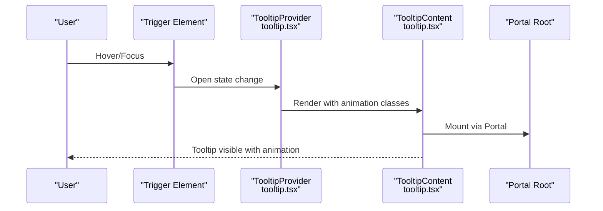
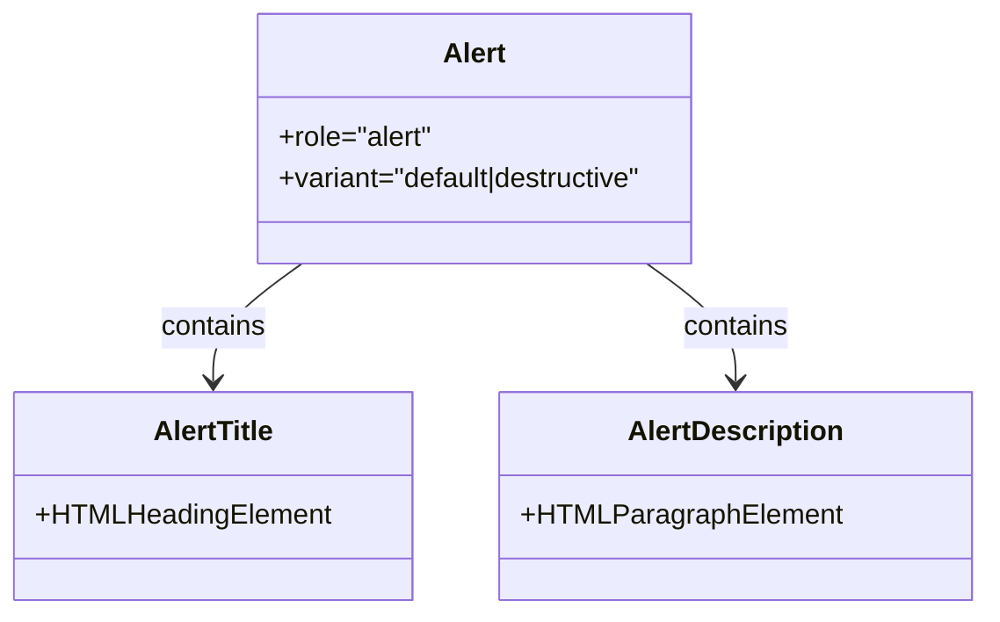
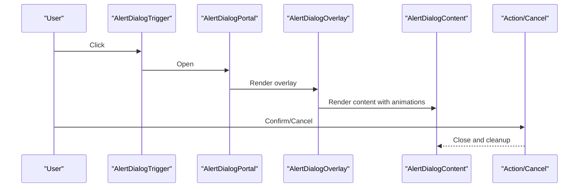
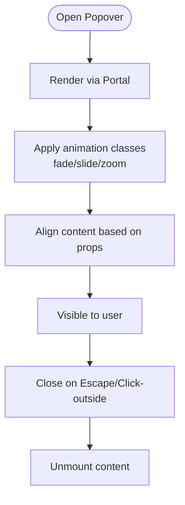
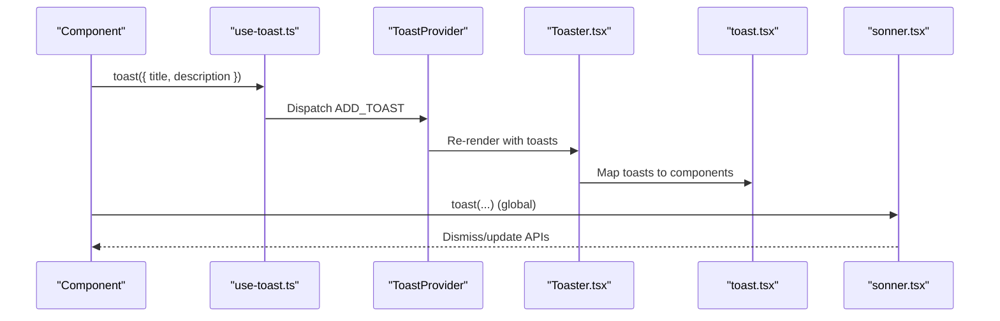
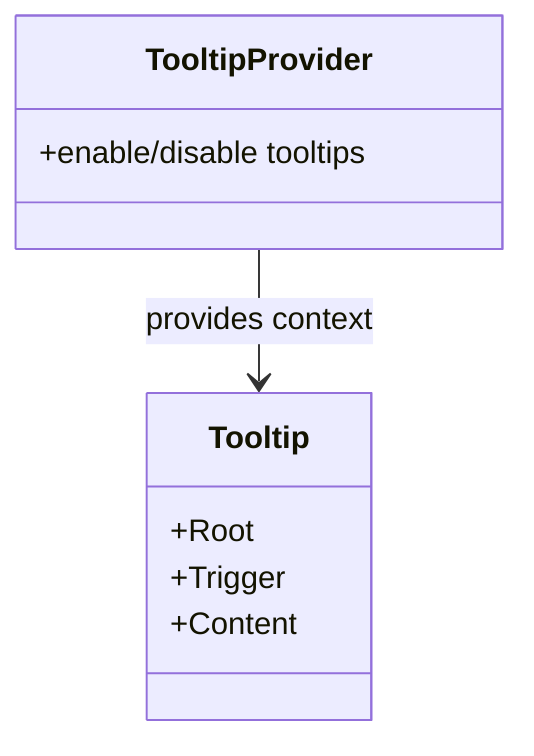
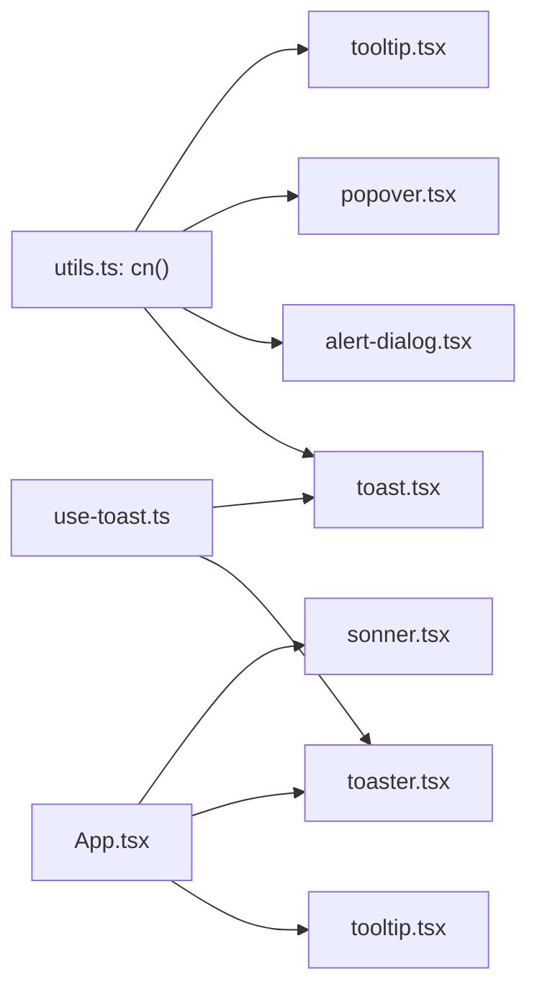

# Overlay Components

> **Referenced Files in This Document**
> - [alert.tsx](src/components/ui/alert.tsx)
> - [alert-dialog.tsx](src/components/ui/alert-dialog.tsx)
> - [popover.tsx](src/components/ui/popover.tsx)
> - [toast.tsx](src/components/ui/toast.tsx)
> - [toaster.tsx](src/components/ui/toaster.tsx)
> - [sonner.tsx](src/components/ui/sonner.tsx)
> - [tooltip.tsx](src/components/ui/tooltip.tsx)
> - [use-toast.ts](src/hooks/use-toast.ts)
> - [utils.ts](src/lib/utils.ts)
> - [use-mobile.tsx](src/hooks/use-mobile.tsx)
> - [App.tsx](src/App.tsx)
> - [Index.tsx](src/pages/Index.tsx)

## Table of Contents
1. [Introduction](#introduction)
2. [Project Structure](#project-structure)
3. [Core Components](#core-components)
4. [Architecture Overview](#architecture-overview)
5. [Detailed Component Analysis](#detailed-component-analysis)
6. [Dependency Analysis](#dependency-analysis)
7. [Performance Considerations](#performance-considerations)
8. [Accessibility and UX Patterns](#accessibility-and-ux-patterns)
9. [Usage Examples](#usage-examples)
10. [Troubleshooting Guide](#troubleshooting-guide)
11. [Conclusion](#conclusion)

## Introduction
This document describes the overlay components that provide feedback and contextual information across the application. It focuses on Alert for status messages, AlertDialog for confirmations, Popover for tooltips and dropdowns, Toast/Toaster/Sonner for notifications, and Tooltip for helper text. It explains shared patterns such as portal rendering, escape key dismissal, click-outside closing, and Tailwind-driven animations. It also covers accessibility requirements (live regions and focus management), z-index stacking, mobile responsiveness, and performance tips.

## Project Structure
The overlay components are implemented as reusable UI primitives under the ui folder. They integrate with Radix UI primitives for accessible base behavior and Tailwind classes for styling and animations. The App bootstraps providers for tooltips and toasts, and exposes a Sonner-based Toaster for global notifications.

**Diagram sources**
- [tooltip.tsx](src/components/ui/tooltip.tsx#L1-L29)
- [App.tsx](src/App.tsx#L1-L43)
- [toaster.tsx](src/components/ui/toaster.tsx#L1-L25)
- [toast.tsx](src/components/ui/toast.tsx#L1-L112)
- [use-toast.ts](src/hooks/use-toast.ts#L1-L187)
- [utils.ts](src/lib/utils.ts#L1-L7)

**Section sources**
- [App.tsx](src/App.tsx#L1-L43)
- [Index.tsx](src/pages/Index.tsx#L1-L32)

## Core Components
- Alert: Status message container with accessible role and semantic title/description parts.
- AlertDialog: Confirmation dialog with portal rendering, overlay, and animated content.
- Popover: Contextual overlay with portal rendering and directional animations.
- Toast/Toaster/Sonner: Notification system with viewport, provider, and global Sonner integration.
- Tooltip: Helper text overlay with provider and animated content.

**Section sources**
- [alert.tsx](src/components/ui/alert.tsx#L1-L44)
- [alert-dialog.tsx](src/components/ui/alert-dialog.tsx#L1-L105)
- [popover.tsx](src/components/ui/popover.tsx#L1-L30)
- [toast.tsx](src/components/ui/toast.tsx#L1-L112)
- [toaster.tsx](src/components/ui/toaster.tsx#L1-L25)
- [sonner.tsx](src/components/ui/sonner.tsx#L1-L28)
- [tooltip.tsx](src/components/ui/tooltip.tsx#L1-L29)

## Architecture Overview
The overlay system relies on:
- Radix UI primitives for accessible semantics and state management.
- Portal rendering to attach overlays to the document body for correct stacking and layout.
- Tailwind classes and data attributes for declarative animations.
- A centralized toast store and provider for global notifications.

**Diagram sources**
- [tooltip.tsx](src/components/ui/tooltip.tsx#L1-L29)

## Detailed Component Analysis

### Alert
- Purpose: Present status messages with accessible roles and semantic parts.
- Accessibility: Uses role="alert" on the container and separate title/description parts for clarity.
- Variants: Default and destructive variants via class variance authority.
- Usage: Wrap content with Alert, AlertTitle, and AlertDescription.

**Diagram sources**
- [alert.tsx](src/components/ui/alert.tsx#L1-L44)

**Section sources**
- [alert.tsx](src/components/ui/alert.tsx#L1-L44)

### AlertDialog
- Purpose: Confirmations and destructive actions with modal behavior.
- Portal rendering: Content is rendered inside a portal to ensure correct stacking.
- Overlay and animation: Overlay fades in/out; content slides and zooms with Tailwind data-state selectors.
- Triggers and actions: Separate trigger, overlay, content, header/footer, title, description, action, cancel.

**Diagram sources**
- [alert-dialog.tsx](src/components/ui/alert-dialog.tsx#L1-L105)

**Section sources**
- [alert-dialog.tsx](src/components/ui/alert-dialog.tsx#L1-L105)

### Popover
- Purpose: Tooltips and dropdown menus with contextual content.
- Portal rendering: Content is mounted via a portal for correct stacking.
- Animation: Fade and slide transitions based on side and open/closed state.
- Alignment: Supports alignment and offset configuration.

**Diagram sources**
- [popover.tsx](src/components/ui/popover.tsx#L1-L30)

**Section sources**
- [popover.tsx](src/components/ui/popover.tsx#L1-L30)

### Toast/Toaster/Sonner
- Toast: Individual notification item with title, description, close, and optional action.
- Toaster: Renders the toast list and viewport; integrates with the toast store.
- Sonner: Global toast provider with theme-aware styling and class mapping.
- Store: Hook manages toast lifecycle, limits, and removal timers.

**Diagram sources**
- [use-toast.ts](src/hooks/use-toast.ts#L1-L187)
- [toaster.tsx](src/components/ui/toaster.tsx#L1-L25)
- [toast.tsx](src/components/ui/toast.tsx#L1-L112)
- [sonner.tsx](src/components/ui/sonner.tsx#L1-L28)

**Section sources**
- [toast.tsx](src/components/ui/toast.tsx#L1-L112)
- [toaster.tsx](src/components/ui/toaster.tsx#L1-L25)
- [sonner.tsx](src/components/ui/sonner.tsx#L1-L28)
- [use-toast.ts](src/hooks/use-toast.ts#L1-L187)

### Tooltip
- Purpose: Short helper text overlays.
- Provider: Wraps the app to enable tooltip behavior.
- Content: Animated with fade and directional slide transitions.

**Diagram sources**
- [tooltip.tsx](src/components/ui/tooltip.tsx#L1-L29)

**Section sources**
- [tooltip.tsx](src/components/ui/tooltip.tsx#L1-L29)

## Dependency Analysis
- Shared utilities: cn() merges and normalizes Tailwind classes.
- Providers: TooltipProvider wraps the app; Toaster and Sonner are mounted at the root.
- Toast store: use-toast.ts orchestrates toast lifecycle and state updates.

**Diagram sources**
- [utils.ts](src/lib/utils.ts#L1-L7)
- [toast.tsx](src/components/ui/toast.tsx#L1-L112)
- [alert-dialog.tsx](src/components/ui/alert-dialog.tsx#L1-L105)
- [popover.tsx](src/components/ui/popover.tsx#L1-L30)
- [tooltip.tsx](src/components/ui/tooltip.tsx#L1-L29)
- [use-toast.ts](src/hooks/use-toast.ts#L1-L187)
- [toaster.tsx](src/components/ui/toaster.tsx#L1-L25)
- [sonner.tsx](src/components/ui/sonner.tsx#L1-L28)
- [App.tsx](src/App.tsx#L1-L43)

**Section sources**
- [utils.ts](src/lib/utils.ts#L1-L7)
- [App.tsx](src/App.tsx#L1-L43)

## Performance Considerations
- Limit concurrent toasts: The toast store enforces a limit to prevent UI overload.
- Toast duration: Use appropriate durations; Sonner allows configuring toast options globally.
- Smooth animations: Prefer requestAnimationFrame for custom animations; the components rely on Tailwind transitions for efficient rendering.
- Portal mounting: Rendering overlays via portals avoids expensive reflows in deeply nested DOM trees.
- Mobile responsiveness: Use responsive breakpoints and viewport positioning; the toast viewport adapts to bottom/right on small screens.

[No sources needed since this section provides general guidance]

## Accessibility and UX Patterns
- Live regions and screen readers:
  - Use role="alert" on Alert containers to signal urgent status to assistive technologies.
  - For Toasts, ensure announcements are handled by the toast library or Sonner; configure aria-live regions if needed.
- Focus management:
  - AlertDialog sets focus to actionable elements on open; ensure triggers and actions are keyboard accessible.
  - Popover and Tooltip should not trap focus; manage focus on open/close to avoid losing context.
- Escape key dismissal:
  - AlertDialog and Popover support closing on Escape key via Radix UI defaults.
- Click-outside closing:
  - AlertDialog overlay and Popover content can be configured to close when clicking outside.
- Animations:
  - All overlays use data-state selectors to animate in/out with fade/slide/zoom transitions.

**Section sources**
- [alert.tsx](src/components/ui/alert.tsx#L1-L44)
- [alert-dialog.tsx](src/components/ui/alert-dialog.tsx#L1-L105)
- [popover.tsx](src/components/ui/popover.tsx#L1-L30)
- [tooltip.tsx](src/components/ui/tooltip.tsx#L1-L29)

## Usage Examples
- Alert for registration feedback:
  - Display a status message after form submission using Alert, AlertTitle, and AlertDescription.
  - Example reference: [alert.tsx](src/components/ui/alert.tsx#L1-L44)
- Toast for language switch confirmation:
  - Use the global toast API to show a brief confirmation after changing language.
  - Example reference: [sonner.tsx](src/components/ui/sonner.tsx#L1-L28), [use-toast.ts](src/hooks/use-toast.ts#L1-L187)

**Section sources**
- [alert.tsx](src/components/ui/alert.tsx#L1-L44)
- [sonner.tsx](src/components/ui/sonner.tsx#L1-L28)
- [use-toast.ts](src/hooks/use-toast.ts#L1-L187)

## Troubleshooting Guide
- Overlays not appearing:
  - Ensure providers are mounted at the root (TooltipProvider, Toaster, Sonner).
  - Verify portal rendering is active for dialogs/popovers.
- Z-index stacking issues:
  - Dialogs and popovers use high z-index values; adjust if conflicting with custom modals.
  - Toast viewport uses a high z-index; ensure no parent containers override it.
- Mobile responsiveness:
  - Toast viewport positions notifications at the bottom/right on small screens; verify media queries and breakpoints.
  - Popover alignment and offsets may need adjustment on small devices.
- Performance:
  - Limit concurrent toasts to reduce layout thrashing.
  - Avoid heavy computations during open/close transitions; leverage CSS/Tailwind animations.

**Section sources**
- [App.tsx](src/App.tsx#L1-L43)
- [toast.tsx](src/components/ui/toast.tsx#L1-L112)
- [popover.tsx](src/components/ui/popover.tsx#L1-L30)
- [use-mobile.tsx](src/hooks/use-mobile.tsx#L1-L20)

## Conclusion
The overlay components provide a cohesive, accessible, and performant foundation for feedback and contextual information. By leveraging Radix UI primitives, portal rendering, and Tailwind animations, the system ensures predictable behavior across devices and assistive technologies. The toast store and Sonner integration offer scalable notification management, while shared patterns like escape key dismissal and click-outside closing improve usability.