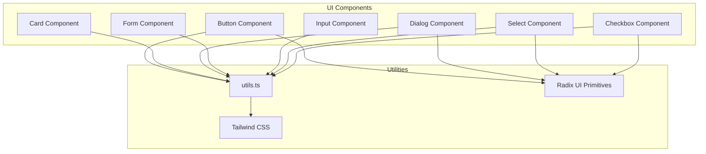
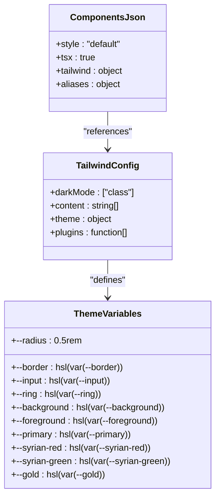
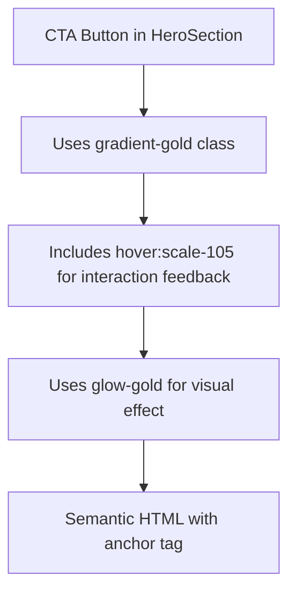

# UI Component Library

<cite>
**Referenced Files in This Document**   
- [button.tsx](file://src/components/ui/button.tsx)
- [card.tsx](file://src/components/ui/card.tsx)
- [dialog.tsx](file://src/components/ui/dialog.tsx)
- [form.tsx](file://src/components/ui/form.tsx)
- [input.tsx](file://src/components/ui/input.tsx)
- [select.tsx](file://src/components/ui/select.tsx)
- [checkbox.tsx](file://src/components/ui/checkbox.tsx)
- [textarea.tsx](file://src/components/ui/textarea.tsx)
- [label.tsx](file://src/components/ui/label.tsx)
- [badge.tsx](file://src/components/ui/badge.tsx)
- [toaster.tsx](file://src/components/ui/toaster.tsx)
- [use-toast.ts](file://src/components/ui/use-toast.ts)
- [utils.ts](file://src/lib/utils.ts)
- [components.json](file://components.json)
- [tailwind.config.ts](file://tailwind.config.ts)
- [AgendaSection.tsx](file://src/components/AgendaSection.tsx)
- [DetailsSection.tsx](file://src/components/DetailsSection.tsx)
- [HeroSection.tsx](file://src/components/HeroSection.tsx)
</cite>

## Table of Contents
1. [Introduction](#introduction)
2. [Core Components](#core-components)
3. [Component Props and Accessibility](#component-props-and-accessibility)
4. [Theming and RTL Integration](#theming-and-rtl-integration)
5. [Utility Functions](#utility-functions)
6. [Usage Examples](#usage-examples)
7. [Performance and Bundling](#performance-and-bundling)
8. [Customization Patterns](#customization-patterns)
9. [Accessibility Features](#accessibility-features)
10. [Conclusion](#conclusion)

## Introduction
This document provides comprehensive documentation for the ShadCN UI component library implementation in the project. The components are built on Radix UI primitives and styled with Tailwind CSS, following modern React patterns for accessibility, theming, and performance. The library includes foundational components such as Button, Card, Dialog, Form, and Input, which are used throughout the application's section components to create a consistent user interface.

**Section sources**
- [button.tsx](file://src/components/ui/button.tsx#L1-L48)
- [card.tsx](file://src/components/ui/card.tsx#L1-L44)
- [dialog.tsx](file://src/components/ui/dialog.tsx#L1-L96)

## Core Components

The UI component library consists of reusable, accessible components built on top of Radix UI primitives. These components abstract complex accessibility patterns while providing styling through Tailwind CSS. Key components include Button, Card, Dialog, Form, Input, Select, Checkbox, Textarea, Label, and Badge.

Each component is implemented as a React forwardRef component, ensuring proper ref forwarding for accessibility and integration purposes. The components leverage the `cn` utility function for conditional class composition and integrate with the application's theme system through CSS variables.



**Diagram sources**
- [button.tsx](file://src/components/ui/button.tsx#L1-L48)
- [card.tsx](file://src/components/ui/card.tsx#L1-L44)
- [dialog.tsx](file://src/components/ui/dialog.tsx#L1-L96)
- [utils.ts](file://src/lib/utils.ts#L1-L7)

**Section sources**
- [button.tsx](file://src/components/ui/button.tsx#L1-L48)
- [card.tsx](file://src/components/ui/card.tsx#L1-L44)
- [dialog.tsx](file://src/components/ui/dialog.tsx#L1-L96)

## Component Props and Accessibility

### Button Component
The Button component supports various props for customization and accessibility:
- **variant**: Controls visual style (default, destructive, outline, secondary, ghost, link)
- **size**: Controls dimensions (default, sm, lg, icon)
- **asChild**: When true, renders as a Slot component for composing with other elements
- **className**: Additional Tailwind classes for custom styling

The component implements proper focus management with visible focus rings and ensures keyboard navigation support. It uses the `buttonVariants` utility from class-variance-authority to manage variant styles.

### Card Component
The Card component is composed of multiple sub-components:
- **Card**: Main container with border, background, and shadow
- **CardHeader**: Top section with spacing
- **CardTitle**: Heading with larger font size and tracking
- **CardDescription**: Subtitle with muted text color
- **CardContent**: Main content area with padding
- **CardFooter**: Bottom section for actions

Each sub-component maintains proper semantic HTML structure and accessibility attributes.

### Dialog Component
The Dialog component implements a fully accessible modal pattern:
- **Dialog**: Root component managing open/closed state
- **DialogTrigger**: Button that opens the dialog
- **DialogContent**: Modal panel with proper positioning and animations
- **DialogOverlay**: Backdrop that traps focus and closes on click
- **DialogTitle**: Accessible name for the dialog
- **DialogDescription**: Accessible description for screen readers

The implementation follows WAI-ARIA authoring practices for dialogs, including focus trapping, proper role attributes, and screen reader announcements.

**Section sources**
- [button.tsx](file://src/components/ui/button.tsx#L33-L47)
- [card.tsx](file://src/components/ui/card.tsx#L5-L43)
- [dialog.tsx](file://src/components/ui/dialog.tsx#L7-L95)

## Theming and RTL Integration

The component library integrates with the application's theme system through CSS variables defined in the Tailwind configuration. The `tailwind.config.ts` file defines a comprehensive theme system using HSL color variables that can be easily customized.

Theme variables include:
- **Semantic colors**: border, input, ring, background, foreground, primary, secondary, destructive, muted, accent, popover, card
- **Syrian-specific colors**: syrian-red, syrian-green, syrian-black, gold, cream
- **Sidebar-specific colors**: sidebar-background, sidebar-foreground, sidebar-primary, etc.
- **Border radius**: Defined as CSS variables for consistent rounded corners
- **Animation keyframes**: For accordion open/close transitions

The theme system supports both light and dark modes through the `darkMode: ["class"]` configuration, which adds a `dark` class to the root element when dark mode is active.

For RTL (right-to-left) layout support, the components use semantic class names and flexible layout utilities from Tailwind CSS. The `components.json` configuration file defines aliases that make it easier to import components regardless of their physical location in the directory structure.



**Diagram sources**
- [tailwind.config.ts](file://tailwind.config.ts#L1-L98)
- [components.json](file://components.json#L1-L21)

**Section sources**
- [tailwind.config.ts](file://tailwind.config.ts#L1-L98)
- [components.json](file://components.json#L1-L21)

## Utility Functions

### cn Utility Function
The `cn` function in `utils.ts` is a crucial utility for conditional class composition. It combines `clsx` for conditional class evaluation and `tailwind-merge` for resolving Tailwind class conflicts.

```typescript
import { clsx, type ClassValue } from "clsx";
import { twMerge } from "tailwind-merge";

export function cn(...inputs: ClassValue[]) {
  return twMerge(clsx(inputs));
}
```

This utility allows developers to:
- Combine static and dynamic classes safely
- Resolve conflicting Tailwind classes (e.g., `text-red-500` vs `text-green-500`)
- Conditionally apply classes based on props or state
- Maintain clean, readable JSX without complex template literals

The function is imported throughout the component library using the `@/lib/utils` alias defined in `components.json`.

**Section sources**
- [utils.ts](file://src/lib/utils.ts#L1-L7)

## Usage Examples

### Button Usage in Section Components
While the section components don't directly use the Button component, the pattern is consistent with how other UI components are used. The HeroSection uses a custom CTA button with similar styling principles:



### Card Usage Patterns
The DetailsSection component implements card-like elements with similar design principles to the Card component:

- Uses `backdrop-blur-sm` for glassmorphism effect
- Applies `hover:bg-primary-foreground/20` for hover states
- Implements `transition-all` for smooth animations
- Uses semantic structure with icon, title, and content

### Form Component Integration
The Form component provides a comprehensive solution for form management using react-hook-form:

- **Form**: Wrapper component that provides form context
- **FormField**: Connects form fields with react-hook-form controller
- **FormItem**: Groups form elements with proper spacing
- **FormLabel**: Accessible label with error state handling
- **FormControl**: Applies proper ARIA attributes
- **FormDescription**: Optional descriptive text
- **FormMessage**: Displays error messages with proper semantics

The implementation ensures proper accessibility by:
- Connecting labels with inputs via generated IDs
- Applying `aria-invalid` when there are errors
- Providing `aria-describedby` for additional context
- Managing focus states appropriately

**Section sources**
- [HeroSection.tsx](file://src/components/HeroSection.tsx#L83-L91)
- [DetailsSection.tsx](file://src/components/DetailsSection.tsx#L25-L58)
- [form.tsx](file://src/components/ui/form.tsx#L1-L130)

## Performance and Bundling

The component library is optimized for performance through several mechanisms:

### Tree-Shaking
The `components.json` configuration enables proper tree-shaking by:
- Defining explicit import aliases
- Using ES module syntax with named exports
- Avoiding default exports that can hinder tree-shaking
- Structuring components as separate files for granular imports

### Component Bundling
Components are designed to be imported individually, ensuring that only used components are included in the final bundle. The alias system (`@/components/ui`) makes imports clean and consistent while allowing bundlers to statically analyze dependencies.

### Render Performance
Components are optimized for render performance by:
- Using `React.memo` where appropriate (implied by ShadCN patterns)
- Minimizing re-renders through proper prop handling
- Using efficient class composition with `cn`
- Leveraging Tailwind's JIT compiler for optimal CSS output

The configuration in `components.json` specifies `"rsc": false` indicating these are not React Server Components, making them suitable for client-side rendering with optimal hydration patterns.

**Section sources**
- [components.json](file://components.json#L1-L21)
- [tailwind.config.ts](file://tailwind.config.ts#L1-L98)

## Customization Patterns

### Tailwind Variants
Components use `class-variance-authority` (CVA) to define variant styles in a type-safe manner. The Button component demonstrates this pattern:

```typescript
const buttonVariants = cva(
  "inline-flex items-center justify-center gap-2 whitespace-nowrap rounded-md text-sm font-medium...",
  {
    variants: {
      variant: {
        default: "bg-primary text-primary-foreground hover:bg-primary/90",
        destructive: "bg-destructive text-destructive-foreground hover:bg-destructive/90",
        // ... other variants
      },
      size: {
        default: "h-10 px-4 py-2",
        sm: "h-9 rounded-md px-3",
        // ... other sizes
      },
    },
    defaultVariants: {
      variant: "default",
      size: "default",
    },
  },
);
```

This approach provides:
- Type safety for variant props
- Consistent styling across components
- Easy theme customization
- Automatic TypeScript IntelliSense

### Theme Extensions
The theme system can be extended by adding new CSS variables in the `tailwind.config.ts` file. The Syrian-specific colors (red, green, black) and gold accent demonstrate this customization pattern:

```typescript
theme: {
  extend: {
    colors: {
      syrian: {
        red: "hsl(var(--syrian-red))",
        green: "hsl(var(--syrian-green))",
        black: "hsl(var(--syrian-black))",
      },
      gold: {
        DEFAULT: "hsl(var(--gold))",
        light: "hsl(var(--gold-light))",
      },
      cream: "hsl(var(--cream))",
    },
  }
}
```

These custom colors can then be used throughout the application with standard Tailwind syntax (e.g., `text-syrian-red`, `bg-gold`).

**Section sources**
- [button.tsx](file://src/components/ui/button.tsx#L7-L31)
- [tailwind.config.ts](file://tailwind.config.ts#L20-L63)

## Accessibility Features

The component library prioritizes accessibility through several key patterns:

### Focus Management
- All interactive elements have visible focus indicators
- Focus is trapped within dialogs when open
- Proper focus restoration when dialogs close
- Skip links could be easily implemented using the same patterns

### Keyboard Navigation
- Full keyboard operability for all components
- Logical tab order maintained
- Escape key closes dialogs and dropdowns
- Arrow keys navigate through select options

### Screen Reader Compatibility
- Proper ARIA roles and attributes applied
- Semantic HTML structure with appropriate heading levels
- Dynamic content updates announced to screen readers
- Error messages programmatically associated with controls

### Color Contrast
- Sufficient contrast ratios for text and interactive elements
- Dark mode support with adjusted color values
- Custom colors designed with accessibility in mind

### Reduced Motion
- Animations are subtle and can be disabled via user preferences
- CSS transitions are used rather than jarring animations
- The `data-[state=open]` attributes allow for conditional animations

The implementation follows WCAG 2.1 guidelines and WAI-ARIA best practices, ensuring the interface is usable by people with various disabilities.

**Section sources**
- [button.tsx](file://src/components/ui/button.tsx#L8-L9)
- [dialog.tsx](file://src/components/ui/dialog.tsx#L15-L51)
- [form.tsx](file://src/components/ui/form.tsx#L75-L127)
- [checkbox.tsx](file://src/components/ui/checkbox.tsx#L7-L23)

## Conclusion
The ShadCN UI component library implementation in this project demonstrates a robust, accessible, and maintainable approach to building React components. By leveraging Radix UI primitives for accessibility and behavior, Tailwind CSS for styling, and thoughtful utility functions like `cn`, the library provides a solid foundation for the application's user interface.

Key strengths include:
- Consistent theming through CSS variables
- Proper accessibility implementation
- Efficient performance characteristics
- Clear customization patterns
- Well-organized code structure

The components are effectively used throughout the application's section components, providing a cohesive user experience while allowing for necessary customization to meet the specific needs of the Syrian community event website.