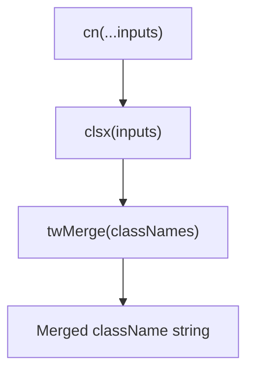
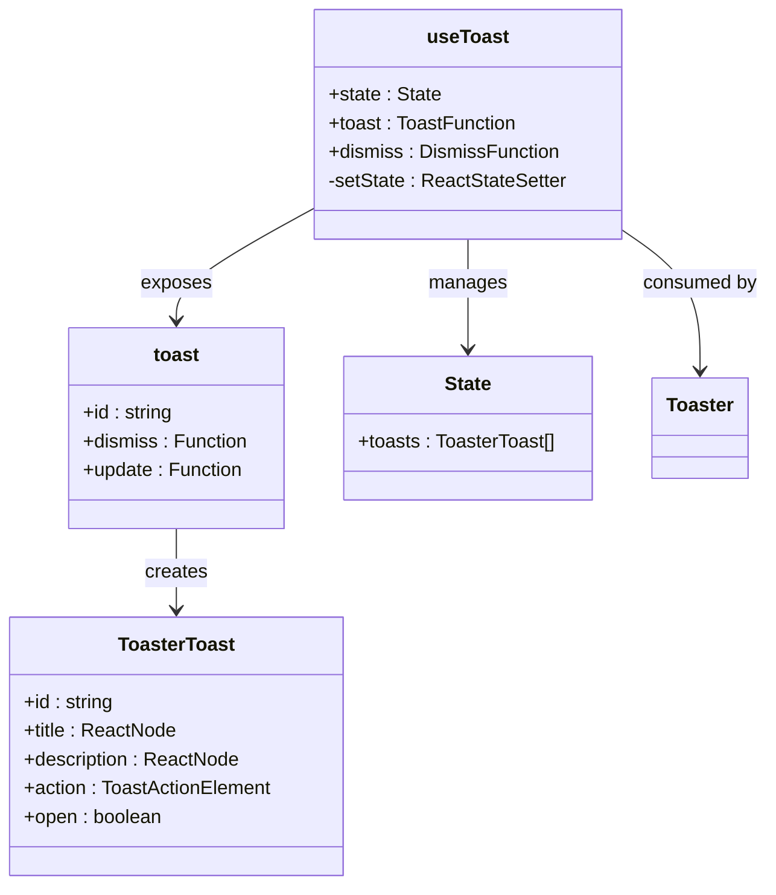
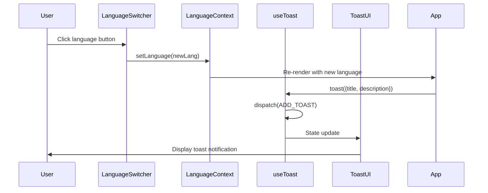
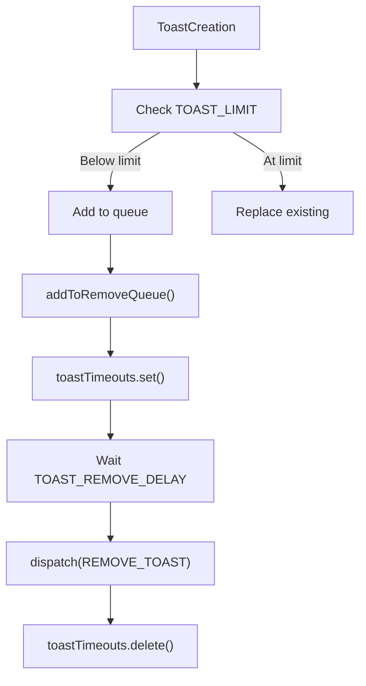

# Utility Components & Hooks

> **Referenced Files in This Document**   
> - [utils.ts](src/lib/utils.ts)
> - [use-toast.ts](src/hooks/use-toast.ts)
> - [sonner.tsx](src/components/ui/sonner.tsx)
> - [toaster.tsx](src/components/ui/toaster.tsx)
> - [toast.tsx](src/components/ui/toast.tsx)
> - [LanguageContext.tsx](src/contexts/LanguageContext.tsx)
> - [App.tsx](src/App.tsx)
> - [components.json](components.json)

## Table of Contents
1. [Introduction](#introduction)
2. [Core Utility Functions](#core-utility-functions)
3. [Conditional Class Composition with cn](#conditional-class-composition-with-cn)
4. [Toast Notification System](#toast-notification-system)
5. [Integration with Theme and RTL](#integration-with-theme-and-rtl)
6. [Usage Patterns Across Codebase](#usage-patterns-across-codebase)
7. [Type Safety and TypeScript Interfaces](#type-safety-and-typescript-interfaces)
8. [Tree-Shaking and Module Optimization](#tree-shaking-and-module-optimization)
9. [Performance Considerations](#performance-considerations)
10. [Troubleshooting Common Issues](#troubleshooting-common-issues)
11. [Conclusion](#conclusion)

## Introduction
This document provides comprehensive architectural documentation for utility components and hooks in the sc-dof application, focusing on the `cn` function for conditional className composition and the `useToast` hook for programmatic toast notifications. These utilities are foundational to the application's UI consistency, accessibility, and user experience. The `cn` function enables robust class composition using Tailwind Merge and clsx, while the toast system provides a centralized mechanism for user feedback. Both systems are deeply integrated with the application's theming, internationalization, and RTL support infrastructure.

## Core Utility Functions

The utility system in sc-dof consists of two primary components: the `cn` function for className composition and the `useToast` hook for notification management. These utilities are designed to be lightweight, type-safe, and easily composable across the application.

**Section sources**
- [utils.ts](src/lib/utils.ts#L1-L7)
- [use-toast.ts](src/hooks/use-toast.ts#L1-L187)

## Conditional Class Composition with cn

### Function Implementation
The `cn` function is a utility wrapper that combines `clsx` for conditional class evaluation and `tailwind-merge` for conflict resolution in Tailwind CSS classes. This combination ensures that when multiple conflicting Tailwind classes are applied, the last one takes precedence while maintaining proper class ordering.



**Diagram sources**
- [utils.ts](src/lib/utils.ts#L4-L6)

### Theme Integration
The `cn` function plays a critical role in theme integration by resolving class conflicts that occur when applying theme-specific classes. When components receive className props from both the parent and internal implementation, `cn` ensures that user-provided classes take precedence over default styles while properly merging non-conflicting classes.

### RTL Class Switching
For RTL (Right-to-Left) support, particularly with Arabic language selection, the `cn` function enables dynamic layout adjustments. When the `isRTL` flag from `LanguageContext` is true, components can conditionally apply RTL-specific classes that are properly merged with existing styles without conflicts.

**Section sources**
- [utils.ts](src/lib/utils.ts#L1-L7)
- [App.tsx](src/App.tsx#L13-L20)

## Toast Notification System

### Architecture Overview
The toast notification system is built on a reducer-based state management pattern that operates as a singleton across the application. It uses an in-memory state store with global listeners to enable toast functionality without requiring React context for state propagation.



**Diagram sources**
- [use-toast.ts](src/hooks/use-toast.ts#L166-L186)
- [toaster.tsx](src/components/ui/toaster.tsx#L1-L24)

### Core Components
The toast system consists of several key components:
- `useToast`: Custom hook that provides access to toast state and creation functions
- `toast`: Imperative function for creating toast notifications
- `Toaster`: UI component that renders active toasts
- `Sonner`: External toast library integration for enhanced styling

**Section sources**
- [use-toast.ts](src/hooks/use-toast.ts#L1-L187)
- [toaster.tsx](src/components/ui/toaster.tsx#L1-L24)
- [sonner.tsx](src/components/ui/sonner.tsx#L1-L28)

## Integration with Theme and RTL

### Theme Integration
The toast system integrates with the application's theme through the `Sonner` component, which consumes the `useTheme` hook from `next-themes`. This allows toast notifications to automatically adapt to the current theme (light, dark, or system) with appropriate styling for background, text, and border colors.

```mermaid
flowchart TD
ThemeProvider --> useTheme
useTheme --> Sonner
Sonner --> ToastStyles
ToastStyles --> group-[.toaster]:bg-background
ToastStyles --> group-[.toaster]:text-foreground
ToastStyles --> group-[.toaster]:border-border
```

**Diagram sources**
- [sonner.tsx](src/components/ui/sonner.tsx#L1-L28)
- [App.tsx](src/App.tsx#L1-L43)

### RTL Support
The toast system respects RTL layout when Arabic is selected as the interface language. The `Toaster` component's positioning is adjusted through Tailwind's directional utilities, ensuring that toast notifications appear in the correct location (top-left for RTL, bottom-right for LTR).

**Section sources**
- [App.tsx](src/App.tsx#L13-L20)
- [LanguageContext.tsx](src/contexts/LanguageContext.tsx#L276-L277)

## Usage Patterns Across Codebase

### Language Change Success Messages
When users change the interface language via the `LanguageSwitcher` component, the application can programmatically show toast notifications to confirm the change. This pattern demonstrates the integration between the internationalization system and the toast notification system.



**Diagram sources**
- [LanguageSwitcher.tsx](src/components/LanguageSwitcher.tsx#L1-L43)
- [LanguageContext.tsx](src/contexts/LanguageContext.tsx#L269-L283)
- [use-toast.ts](src/hooks/use-toast.ts#L137-L164)

### Common Usage Patterns
The `cn` function is widely used throughout UI components for conditional class application. Common patterns include:
- Combining base styles with variant styles
- Applying responsive classes
- Adding state-based classes (hover, focus, active)
- Merging user-provided className props with component defaults

**Section sources**
- [utils.ts](src/lib/utils.ts#L1-L7)
- [toast.tsx](src/components/ui/toast.tsx#L6)
- [accordion.tsx](src/components/ui/accordion.tsx#L12)

## Type Safety and TypeScript Interfaces

### cn Function Typing
The `cn` function is fully type-safe with TypeScript, using the `ClassValue` type from `clsx` to accept a wide range of input types including strings, objects, and arrays. This ensures type safety while maintaining flexibility in class composition.

```typescript
export function cn(...inputs: ClassValue[]): string
```

### Toast System Interfaces
The toast system defines several TypeScript interfaces to ensure type safety:
- `ToastProps`: Defines the props for the Toast component
- `ToastActionElement`: Type for toast action elements
- `ToasterToast`: Extended toast interface with id and state
- `Action`: Union type for toast actions (ADD, UPDATE, DISMISS, REMOVE)

**Section sources**
- [utils.ts](src/lib/utils.ts#L4-L6)
- [toast.tsx](src/components/ui/toast.tsx#L97-L100)
- [use-toast.ts](src/hooks/use-toast.ts#L8-L13)

## Tree-Shaking and Module Optimization

### components.json Configuration
The `components.json` file enables tree-shaking benefits by defining aliases and configuration for the component library. This allows bundlers to eliminate unused code and optimize the final bundle size.

```json
{
  "aliases": {
    "components": "@/components",
    "utils": "@/lib/utils",
    "ui": "@/components/ui",
    "lib": "@/lib",
    "hooks": "@/hooks"
  }
}
```

The alias configuration ensures that imports are resolved consistently and enables better dead code elimination during the build process.

**Section sources**
- [components.json](components.json#L1-L21)
- [tsconfig.json](tsconfig.json)

## Performance Considerations

### Memoizing cn Results
While the `cn` function is lightweight, in performance-critical components it's recommended to memoize the results when the input classes are derived from props or state. This prevents unnecessary re-computation on every render.

### Avoiding Toast Stacking
The toast system implements several performance safeguards:
- `TOAST_LIMIT = 1`: Limits the number of simultaneous toasts to prevent stacking
- `TOAST_REMOVE_DELAY = 1000000`: Long delay before automatic removal to prevent premature cleanup
- Map-based timeout tracking to prevent memory leaks from uncleaned timeouts



**Diagram sources**
- [use-toast.ts](src/hooks/use-toast.ts#L5-L7)
- [use-toast.ts](src/hooks/use-toast.ts#L53-L69)

**Section sources**
- [use-toast.ts](src/hooks/use-toast.ts#L1-L187)

## Troubleshooting Common Issues

### Class Ordering Conflicts
When using the `cn` function, developers may encounter class ordering conflicts where expected styles are overridden. This occurs because Tailwind classes are applied in order, and later classes take precedence. To resolve this:

1. Ensure the desired classes are ordered correctly in the `cn` function call
2. Use `!important` sparingly with Tailwind's `!` prefix when necessary
3. Leverage `tailwind-merge`'s conflict resolution rules

### Toast Persistence Bugs
Common toast persistence issues include:
- Toasts not disappearing automatically
- Memory leaks from uncleaned timeouts
- Duplicate toasts appearing

These issues are addressed through:
- Proper cleanup in `useEffect` return functions
- Using a Map to track and prevent duplicate timeouts
- Ensuring the `listeners` array is properly managed

**Section sources**
- [use-toast.ts](src/hooks/use-toast.ts#L53-L69)
- [use-toast.ts](src/hooks/use-toast.ts#L166-L186)

## Conclusion
The utility components and hooks in sc-dof provide a robust foundation for className composition and user notifications. The `cn` function enables reliable class merging with proper conflict resolution, while the toast system offers a flexible, type-safe mechanism for user feedback. Both systems are deeply integrated with the application's theming, internationalization, and RTL support, ensuring a consistent user experience across all languages and themes. By following the documented patterns and best practices, developers can effectively leverage these utilities while avoiding common pitfalls related to performance and usability.