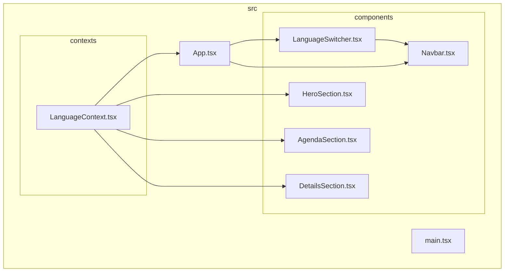
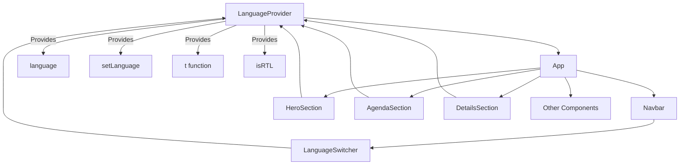
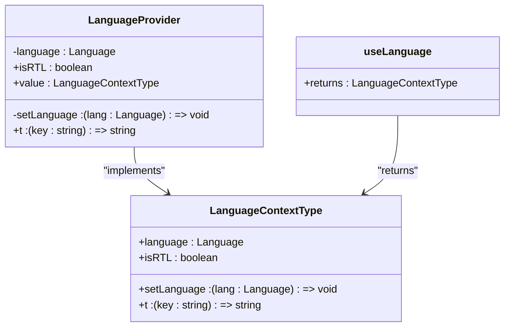
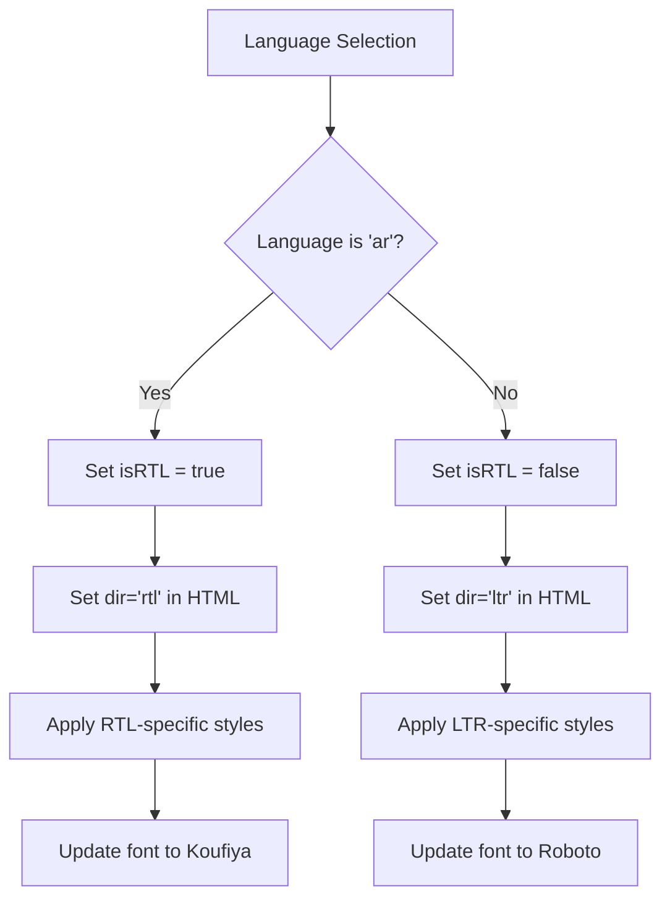
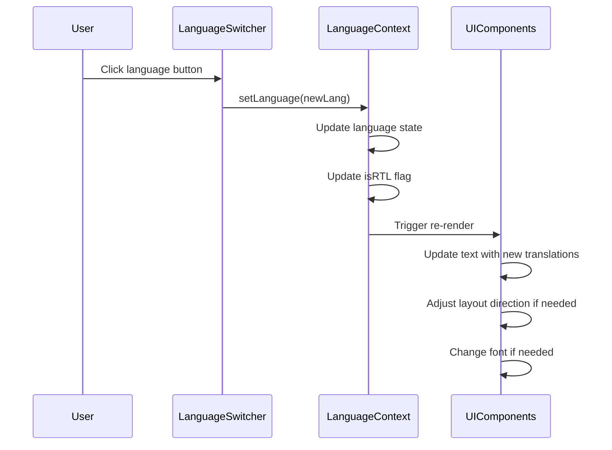
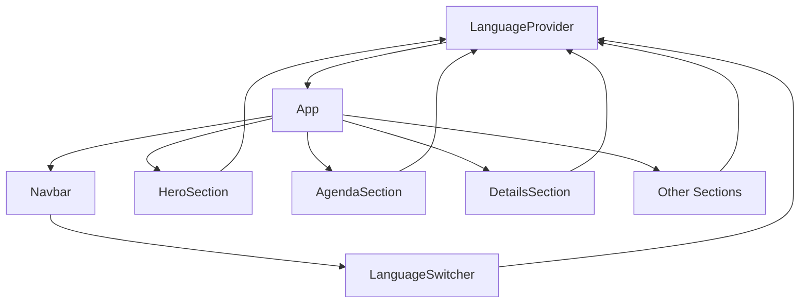

# Adding New Languages

<cite>
**Referenced Files in This Document**   
- [LanguageContext.tsx](file://src/contexts/LanguageContext.tsx)
- [LanguageSwitcher.tsx](file://src/components/LanguageSwitcher.tsx)
- [App.tsx](file://src/App.tsx)
- [Navbar.tsx](file://src/components/Navbar.tsx)
- [HeroSection.tsx](file://src/components/HeroSection.tsx)
- [AgendaSection.tsx](file://src/components/AgendaSection.tsx)
- [DetailsSection.tsx](file://src/components/DetailsSection.tsx)
</cite>

## Table of Contents
1. [Introduction](#introduction)
2. [Project Structure](#project-structure)
3. [Core Components](#core-components)
4. [Architecture Overview](#architecture-overview)
5. [Detailed Component Analysis](#detailed-component-analysis)
6. [Dependency Analysis](#dependency-analysis)
7. [Performance Considerations](#performance-considerations)
8. [Troubleshooting Guide](#troubleshooting-guide)
9. [Conclusion](#conclusion)

## Introduction
This document provides a comprehensive guide for adding new languages to the sc-dof platform by extending the LanguageContext system. It details the process of integrating new language options into the existing internationalization framework, with specific focus on supporting right-to-left (RTL) languages like Arabic alongside left-to-right languages such as English and Turkish. The documentation covers the technical implementation steps, best practices for translation management, and strategies for maintaining UI consistency across language switches.

## Project Structure
The sc-dof platform follows a component-based React architecture with a clear separation of concerns. Language-related functionality is centralized in the contexts directory, while UI components consume translations through the LanguageContext. The project structure shows a well-organized codebase with dedicated folders for components, contexts, hooks, and pages.



**Diagram sources**
- [LanguageContext.tsx](file://src/contexts/LanguageContext.tsx)
- [App.tsx](file://src/App.tsx)
- [LanguageSwitcher.tsx](file://src/components/LanguageSwitcher.tsx)
- [Navbar.tsx](file://src/components/Navbar.tsx)
- [HeroSection.tsx](file://src/components/HeroSection.tsx)
- [AgendaSection.tsx](file://src/components/AgendaSection.tsx)
- [DetailsSection.tsx](file://src/components/DetailsSection.tsx)

**Section sources**
- [LanguageContext.tsx](file://src/contexts/LanguageContext.tsx)
- [App.tsx](file://src/App.tsx)
- [LanguageSwitcher.tsx](file://src/components/LanguageSwitcher.tsx)

## Core Components
The internationalization system in sc-dof revolves around three core components: the LanguageContext which manages language state and provides translation functions, the LanguageSwitcher component that allows users to change languages, and the t() function that retrieves translated strings throughout the application. These components work together to provide a seamless multilingual experience.

**Section sources**
- [LanguageContext.tsx](file://src/contexts/LanguageContext.tsx#L3-L292)
- [LanguageSwitcher.tsx](file://src/components/LanguageSwitcher.tsx#L1-L44)
- [App.tsx](file://src/App.tsx#L1-L43)

## Architecture Overview
The internationalization architecture in sc-dof follows the React Context pattern, providing a global state management solution for language preferences and translations. The LanguageProvider wraps the entire application, making language state available to all components through the useLanguage hook. When a user selects a new language via the LanguageSwitcher, the context updates, triggering re-renders across all components that consume translations.



**Diagram sources**
- [LanguageContext.tsx](file://src/contexts/LanguageContext.tsx#L269-L283)
- [App.tsx](file://src/App.tsx#L36-L38)
- [LanguageSwitcher.tsx](file://src/components/LanguageSwitcher.tsx#L14-L40)

## Detailed Component Analysis

### Language Context Implementation
The LanguageContext is implemented using React's createContext and useContext hooks, providing a type-safe interface for language management. The context maintains the current language state, a translation function (t), and an isRTL flag that determines text direction.



**Diagram sources**
- [LanguageContext.tsx](file://src/contexts/LanguageContext.tsx#L5-L10)
- [LanguageContext.tsx](file://src/contexts/LanguageContext.tsx#L269-L291)

**Section sources**
- [LanguageContext.tsx](file://src/contexts/LanguageContext.tsx#L1-L292)

### Translation System
The translation system is built around a nested object structure that organizes translations by language and functional area. Each language ('ar', 'en', 'tr') has its own set of key-value pairs following a dot-notation hierarchy (e.g., 'nav.home', 'hero.title'). The t() function serves as the primary interface for retrieving translations, with fallback behavior that returns the key itself when a translation is missing.

```mermaid
erDiagram
TRANSLATIONS {
string ar PK
string en PK
string tr PK
}
ARABIC {
string nav.home
string nav.why
string hero.title
string hero.subtitle
string details.title
string agenda.title
}
ENGLISH {
string nav.home
string nav.why
string hero.title
string hero.subtitle
string details.title
string agenda.title
}
TURKISH {
string nav.home
string nav.why
string hero.title
string hero.subtitle
string details.title
string agenda.title
}
TRANSLATIONS ||--o{ ARABIC : "contains"
TRANSLATIONS ||--o{ ENGLISH : "contains"
TRANSLATIONS ||--o{ TURKISH : "contains"
```

**Diagram sources**
- [LanguageContext.tsx](file://src/contexts/LanguageContext.tsx#L12-L264)

**Section sources**
- [LanguageContext.tsx](file://src/contexts/LanguageContext.tsx#L12-L264)
- [HeroSection.tsx](file://src/components/HeroSection.tsx#L7-L48)
- [AgendaSection.tsx](file://src/components/AgendaSection.tsx#L6-L24)

### RTL Support
The platform provides built-in support for right-to-left languages through the isRTL flag in the LanguageContext. This flag is automatically set to true when the language is 'ar' (Arabic), triggering RTL layout throughout the application. The App component uses this flag to set the document direction, while specific components can access it for conditional styling.



**Diagram sources**
- [LanguageContext.tsx](file://src/contexts/LanguageContext.tsx#L276)
- [App.tsx](file://src/App.tsx#L13-L20)

**Section sources**
- [LanguageContext.tsx](file://src/contexts/LanguageContext.tsx#L276)
- [App.tsx](file://src/App.tsx#L13-L20)

### Language Switcher Component
The LanguageSwitcher component provides a user interface for changing languages, with visual indicators for each available language. It supports two presentation modes (floating and navbar) and handles both emoji flags for English and Turkish, and a custom Syrian flag image for Arabic.



**Diagram sources**
- [LanguageSwitcher.tsx](file://src/components/LanguageSwitcher.tsx#L14-L40)
- [LanguageContext.tsx](file://src/contexts/LanguageContext.tsx#L7)
- [App.tsx](file://src/App.tsx#L13-L20)

**Section sources**
- [LanguageSwitcher.tsx](file://src/components/LanguageSwitcher.tsx#L1-L44)
- [Navbar.tsx](file://src/components/Navbar.tsx#L4-L8)

## Dependency Analysis
The internationalization system has well-defined dependencies between components, with the LanguageContext serving as the central hub. The dependency graph shows how language state flows from the provider to all consuming components, ensuring consistent behavior across the application.



**Diagram sources**
- [App.tsx](file://src/App.tsx#L36-L38)
- [LanguageContext.tsx](file://src/contexts/LanguageContext.tsx#L269-L283)
- [LanguageSwitcher.tsx](file://src/components/LanguageSwitcher.tsx#L4-L5)

**Section sources**
- [App.tsx](file://src/App.tsx#L1-L43)
- [LanguageContext.tsx](file://src/contexts/LanguageContext.tsx#L1-L292)

## Performance Considerations
The current implementation efficiently manages language state using React Context, with minimal performance overhead. The translation object is defined once at the module level and reused across renders. The t() function provides fast key lookups with O(1) complexity. For large-scale applications, consider lazy-loading translation files or implementing code splitting for language-specific bundles.

## Troubleshooting Guide
Common issues when adding new languages include missing translation keys, incorrect RTL behavior, and font display problems. Always verify that new language entries are added to all relevant sections in the translations object. Test thoroughly with actual content to ensure proper text alignment and layout. Use the fallback behavior of the t() function to identify missing keys during development.

**Section sources**
- [LanguageContext.tsx](file://src/contexts/LanguageContext.tsx#L273)
- [App.tsx](file://src/App.tsx#L16-L17)

## Conclusion
The sc-dof platform provides a robust foundation for multilingual support through its well-structured LanguageContext system. Adding new languages requires updating the Language type union, expanding the translations object with new key-value pairs, and integrating the language into the LanguageSwitcher component. The system automatically handles RTL support for Arabic and font switching between Koufiya and Roboto. By following the patterns established in the existing implementation, new languages can be added consistently while maintaining UI integrity and accessibility standards.