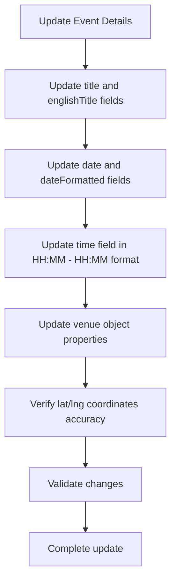
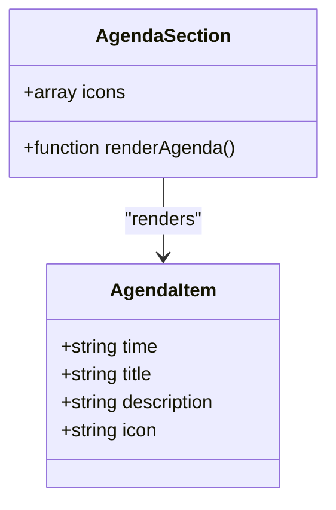
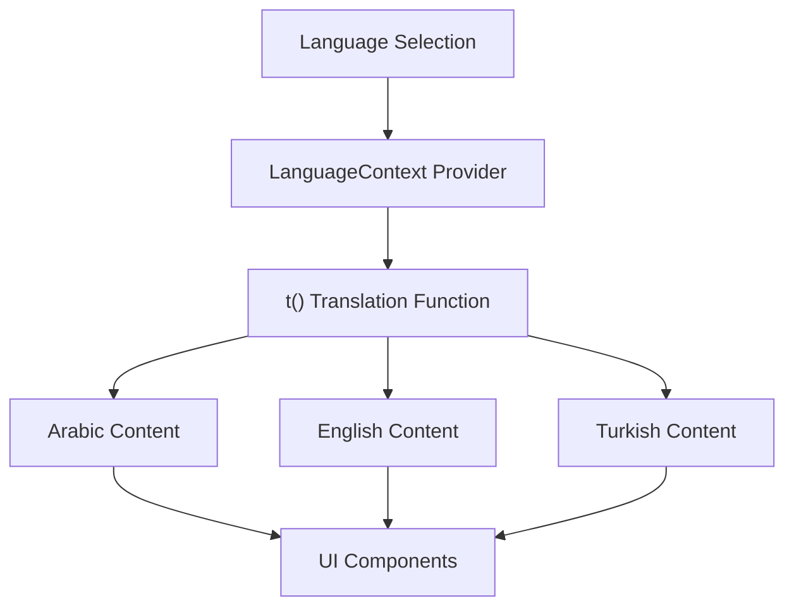

# Content Updates

<cite>
**Referenced Files in This Document**   
- [eventData.ts](file://src/data/eventData.ts)
- [AgendaSection.tsx](file://src/components/AgendaSection.tsx)
- [DetailsSection.tsx](file://src/components/DetailsSection.tsx)
- [GoalsSection.tsx](file://src/components/GoalsSection.tsx)
- [OrganizersSection.tsx](file://src/components/OrganizersSection.tsx)
- [SpeakersSection.tsx](file://src/components/SpeakersSection.tsx)
- [LanguageContext.tsx](file://src/contexts/LanguageContext.tsx)
- [HeroSection.tsx](file://src/components/HeroSection.tsx)
- [WhySection.tsx](file://src/components/WhySection.tsx)
</cite>

## Table of Contents
1. [Introduction](#introduction)
2. [Event Data Model Structure](#event-data-model-structure)
3. [Updating Event Details](#updating-event-details)
4. [Modifying Agenda Items](#modifying-agenda-items)
5. [Managing Organizers Information](#managing-organizers-information)
6. [Handling Multilingual Content](#handling-multilingual-content)
7. [Best Practices for Schema Updates](#best-practices-for-schema-updates)
8. [Validation and Testing](#validation-and-testing)

## Introduction
This document provides comprehensive guidance for updating event content within the sc-dof platform by modifying the eventData.ts data model. The platform is designed to manage event information for the Syrian Community Day of Freedom celebration, with a focus on maintaining consistency across multiple languages and ensuring proper data structure. The eventData.ts file serves as the central data source for all event-related content, which is then consumed by various UI components throughout the application. This documentation will explain how to properly update event details while maintaining data integrity and supporting the platform's multilingual capabilities.

## Event Data Model Structure
The eventData object in eventData.ts contains all the essential information for the event, organized into logical sections including title, date, venue, agenda, goals, organizers, and highlights. The structure is designed to support both Arabic as the primary language and English/Turkish as secondary languages through dedicated fields like title, englishTitle, and language-specific content in components. The data model uses a flat structure with nested objects for complex data like venue information and arrays for collections such as agenda items, goals, and organizers. Each section serves a specific purpose in presenting event information to users, with the data being consumed by corresponding React components that render the content in the user interface.

**Section sources**
- [eventData.ts](file://src/data/eventData.ts#L1-L109)

## Updating Event Details
To update basic event details such as title, date, time, and venue, modify the corresponding fields in the eventData object. For the event title, update both the Arabic title field and the englishTitle field to ensure proper display across language settings. Date information should be updated in both the date field (in YYYY-MM-DD format) and the dateFormatted field (in localized format), while maintaining consistency between these values. The time field should follow the HH:MM - HH:MM 24-hour format. Venue information can be updated by modifying the venue object properties including name, address, details, and Google Maps URL. When making these changes, ensure that coordinate values (lat, lng) remain accurate to the physical location.

**Diagram sources**
- [eventData.ts](file://src/data/eventData.ts#L2-L21)

**Section sources**
- [eventData.ts](file://src/data/eventData.ts#L2-L21)
- [DetailsSection.tsx](file://src/components/DetailsSection.tsx#L1-L65)
- [HeroSection.tsx](file://src/components/HeroSection.tsx#L1-L99)

## Modifying Agenda Items
Agenda items are managed as an array of objects within the eventData structure, with each item containing time, title, description, and icon properties. To add or modify agenda items, update the agenda array by adding new objects or modifying existing ones. Each agenda item should include a time field that indicates the sequence or timing of the event segment, a title for the segment name, a description providing details about the segment, and an emoji icon for visual representation. When adding new items, ensure the icon array in AgendaSection.tsx contains appropriate icons for all agenda items. The platform uses a predefined set of icons ['🎬', '🎤', '🎭', '🎵', '🤝', '🪘', '🎉'] which should be maintained or extended as needed.

**Diagram sources**
- [eventData.ts](file://src/data/eventData.ts#L47-L84)
- [AgendaSection.tsx](file://src/components/AgendaSection.tsx#L1-L64)

**Section sources**
- [eventData.ts](file://src/data/eventData.ts#L47-L84)
- [AgendaSection.tsx](file://src/components/AgendaSection.tsx#L1-L64)

## Managing Organizers Information
The organizers section contains information about the entities responsible for hosting the event, structured as an array of organizer objects. Each organizer includes properties such as name, description, mission, and activities. To add or modify organizers, update the organizers array in eventData.ts by adding new objects or editing existing ones with the appropriate information. The OrganizersSection component handles language-specific rendering by maintaining separate content for Arabic, English, and Turkish languages. When updating organizer information, ensure that all language variants are properly maintained to avoid display issues in different language modes. For organizers without detailed information like activities, only include the fields that have valid data to maintain consistency.

**Section sources**
- [eventData.ts](file://src/data/eventData.ts#L86-L107)
- [OrganizersSection.tsx](file://src/components/OrganizersSection.tsx#L1-L132)

## Handling Multilingual Content
The platform supports three languages (Arabic, English, and Turkish) through a combination of direct data fields and translation functions. While some content like titles have dedicated fields (title, englishTitle), most text content relies on the translation system implemented in LanguageContext.tsx. This context provides a t() function that maps translation keys to their corresponding values in the active language. When updating content that appears in multiple languages, ensure consistency across all language variants. For speaker information, the SpeakersSection component uses language-specific fields (nameEn, nameTr, roleEn, roleTr) to provide proper translations. When adding new content, follow the existing pattern of providing translations for all supported languages to maintain user experience consistency.

**Diagram sources**
- [LanguageContext.tsx](file://src/contexts/LanguageContext.tsx#L1-L292)
- [SpeakersSection.tsx](file://src/components/SpeakersSection.tsx#L1-L238)

**Section sources**
- [LanguageContext.tsx](file://src/contexts/LanguageContext.tsx#L1-L292)
- [SpeakersSection.tsx](file://src/components/SpeakersSection.tsx#L1-L238)

## Best Practices for Schema Updates
When extending or modifying the eventData schema, follow these best practices to maintain data integrity and application stability. Always preserve the existing data types and structure when possible, and when adding new fields, use consistent naming conventions and data types. For array-based sections like agenda, goals, and organizers, maintain the same object structure across all items to ensure proper rendering in UI components. When adding new features like highlights, follow the established pattern of using simple objects with icon, title, and description properties. Avoid making breaking changes to the data structure that would require simultaneous updates to multiple components. If schema changes are necessary, implement them incrementally and verify that all consuming components handle the changes appropriately.

**Section sources**
- [eventData.ts](file://src/data/eventData.ts#L1-L109)
- [GoalsSection.tsx](file://src/components/GoalsSection.tsx#L1-L54)
- [WhySection.tsx](file://src/components/WhySection.tsx#L1-L41)

## Validation and Testing
Before deploying event content updates, thoroughly validate the changes in a development environment. Verify that all JSON syntax is correct and that the eventData object maintains proper structure. Test the application in all supported languages (Arabic, English, Turkish) to ensure that content displays correctly and that translation keys are properly resolved. Check that all links, especially the Google Maps URL, are valid and accessible. Validate that date and time information is consistent across all components that display this information. Test on different screen sizes to ensure responsive design works correctly. Finally, verify that all interactive elements such as the language switcher and navigation links function properly with the updated content.

**Section sources**
- [eventData.ts](file://src/data/eventData.ts#L1-L109)
- [Index.tsx](file://src/pages/Index.tsx#L1-L32)
- [LanguageSwitcher.tsx](file://src/components/LanguageSwitcher.tsx#L1-L44)