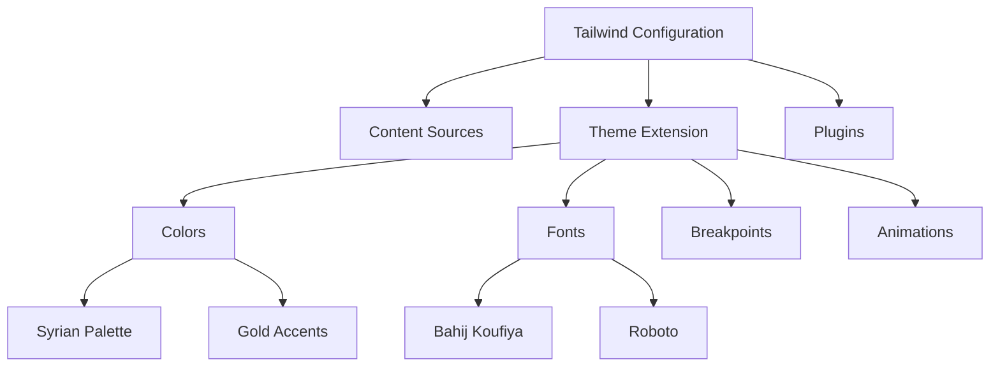
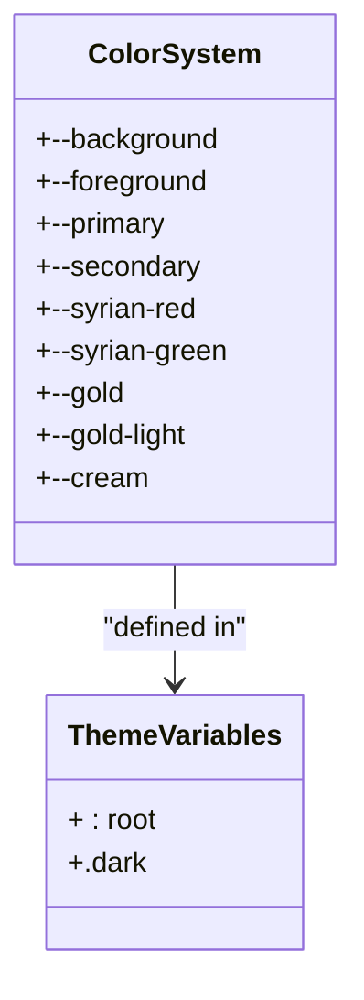
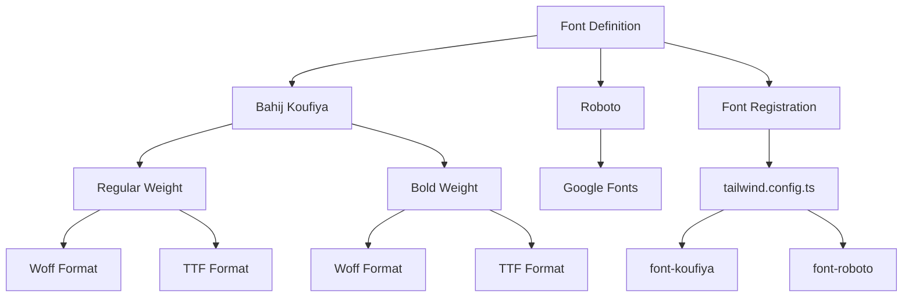
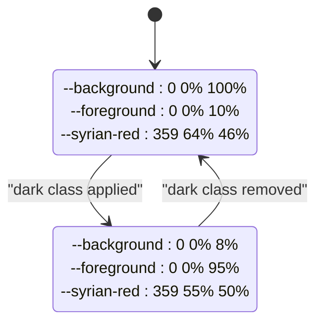
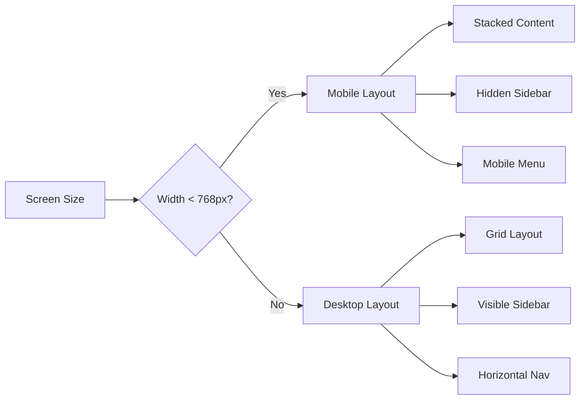
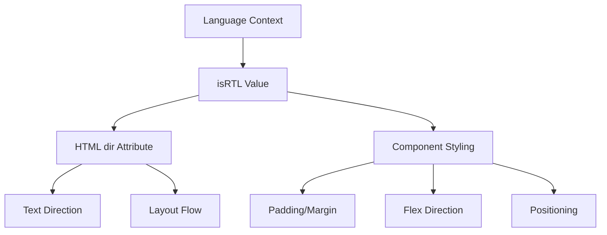
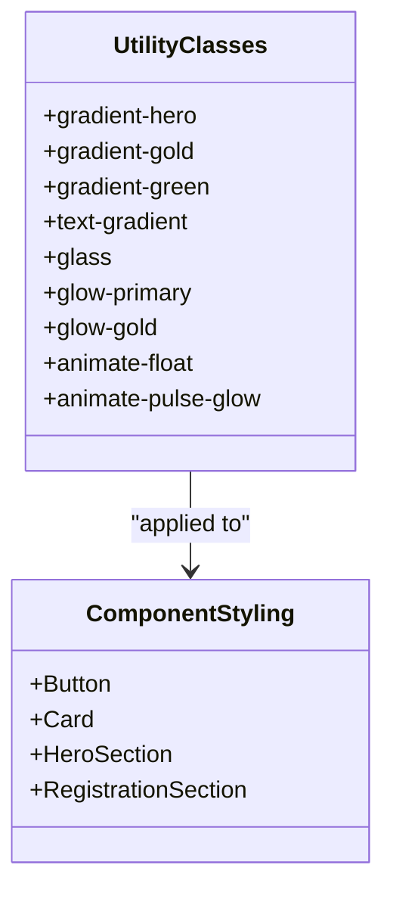

# Theme Customization

<cite>
**Referenced Files in This Document**   
- [tailwind.config.ts](file://tailwind.config.ts)
- [index.css](file://src/index.css)
- [HeroSection.tsx](file://src/components/HeroSection.tsx)
- [RegistrationSection.tsx](file://src/components/RegistrationSection.tsx)
- [LanguageSwitcher.tsx](file://src/components/LanguageSwitcher.tsx)
- [Navbar.tsx](file://src/components/Navbar.tsx)
- [button.tsx](file://src/components/ui/button.tsx)
- [use-mobile.tsx](file://src/hooks/use-mobile.tsx)
</cite>

## Table of Contents
1. [Introduction](#introduction)
2. [Theme Configuration](#theme-configuration)
3. [Custom Colors and CSS Variables](#custom-colors-and-css-variables)
4. [Font Integration](#font-integration)
5. [Dark Mode Support](#dark-mode-support)
6. [Responsive Design and Breakpoints](#responsive-design-and-breakpoints)
7. [RTL Compatibility](#rtl-compatibility)
8. [Utility Classes and Component Styling](#utility-classes-and-component-styling)
9. [Best Practices](#best-practices)
10. [Conclusion](#conclusion)

## Introduction
The sc-dof platform leverages Tailwind CSS for comprehensive theme customization, enabling the creation of a visually cohesive experience that reflects Syrian cultural identity through custom colors, fonts, and design elements. This documentation details the implementation of theme customization features including the Syrian color palette (syrian-red, syrian-green), custom typography (Bahij Koufiya, Roboto), and dynamic theming capabilities using CSS variables. The system supports dark mode, responsive layouts, and RTL compatibility for Arabic language content, providing a robust foundation for visual customization while maintaining accessibility and performance.

## Theme Configuration

The theme configuration is centralized in `tailwind.config.ts`, which extends the default Tailwind configuration with custom design tokens. The configuration file defines the content sources, theme extensions, and plugins that power the visual system.

**Diagram sources**
- [tailwind.config.ts](file://tailwind.config.ts#L1-L98)

**Section sources**
- [tailwind.config.ts](file://tailwind.config.ts#L1-L98)

## Custom Colors and CSS Variables

The platform implements a sophisticated color system using CSS variables in conjunction with Tailwind's `hsl(var(--color))` syntax, enabling dynamic theme switching and consistent color application across components. The custom color palette includes the Syrian national colors and gold accents that are applied throughout the interface.

The CSS variables are defined in `index.css` within the `:root` selector, establishing the light theme values, while the `.dark` class provides corresponding values for dark mode. This approach allows for seamless theme transitions without requiring changes to component-level styling.

**Diagram sources**
- [index.css](file://src/index.css#L25-L127)

**Section sources**
- [tailwind.config.ts](file://tailwind.config.ts#L20-L67)
- [index.css](file://src/index.css#L62-L67)

## Font Integration

The platform integrates custom typography through the Bahij Koufiya font for Arabic text and Roboto for Latin scripts, ensuring cultural authenticity while maintaining readability. Font faces are defined in `index.css` using `@font-face` rules, and font families are registered in the Tailwind configuration for use as utility classes.

The font configuration supports both regular and bold weights of Bahij Koufiya, with appropriate font-display settings to ensure optimal loading performance. The font families are applied globally to the body element and selectively to interface components based on language context.

**Diagram sources**
- [index.css](file://src/index.css#L1-L18)
- [tailwind.config.ts](file://tailwind.config.ts#L16-L19)

**Section sources**
- [index.css](file://src/index.css#L1-L18)
- [tailwind.config.ts](file://tailwind.config.ts#L16-L19)
- [LanguageSwitcher.tsx](file://src/components/LanguageSwitcher.tsx#L36)

## Dark Mode Support

Dark mode is implemented using Tailwind's class-based strategy with the `darkMode: ["class"]` configuration. The system uses CSS variables to define color values for both light and dark themes, allowing for smooth transitions and consistent styling across components without duplicating utility classes.

The color variables are defined in HSL format, which facilitates easy adjustment of hue, saturation, and lightness values between theme variants. This approach enables the creation of harmonious dark themes that maintain brand identity while improving readability in low-light environments.

**Diagram sources**
- [index.css](file://src/index.css#L89-L127)
- [tailwind.config.ts](file://tailwind.config.ts#L4)

**Section sources**
- [index.css](file://src/index.css#L89-L127)
- [tailwind.config.ts](file://tailwind.config.ts#L4)

## Responsive Design and Breakpoints

The platform implements responsive design principles through Tailwind's breakpoint system and custom hooks for device detection. The mobile breakpoint is defined at 768px, with responsive layouts adapting to different screen sizes through utility classes and component logic.

The `useIsMobile` hook provides programmatic access to the current device state, enabling components to adjust their behavior based on screen size. This approach complements Tailwind's utility-first responsive classes, offering both declarative and imperative methods for creating adaptive interfaces.

**Diagram sources**
- [use-mobile.tsx](file://src/hooks/use-mobile.tsx#L3-L19)
- [tailwind.config.ts](file://tailwind.config.ts#L11-L13)

**Section sources**
- [use-mobile.tsx](file://src/hooks/use-mobile.tsx#L3-L19)
- [tailwind.config.ts](file://tailwind.config.ts#L11-L13)
- [Navbar.tsx](file://src/components/Navbar.tsx#L62-L77)

## RTL Compatibility

The platform supports RTL (right-to-left) layout for Arabic language content through a combination of HTML `dir` attributes, CSS utilities, and React context. The `LanguageContext` provides the current language and directionality, which is applied to the document structure to ensure proper text alignment and component positioning.

RTL compatibility is implemented at multiple levels, from the root HTML element to individual components, ensuring that text, navigation, and layout elements are properly mirrored for Arabic readers while maintaining the visual integrity of the design system.

**Diagram sources**
- [Navbar.tsx](file://src/components/Navbar.tsx#L45)
- [LanguageSwitcher.tsx](file://src/components/LanguageSwitcher.tsx#L15)

**Section sources**
- [Navbar.tsx](file://src/components/Navbar.tsx#L7-L8)
- [LanguageSwitcher.tsx](file://src/components/LanguageSwitcher.tsx#L15)

## Utility Classes and Component Styling

The platform extends Tailwind's utility system with custom classes defined in the `@layer utilities` section of `index.css`. These include gradient backgrounds, glass morphism effects, and animation utilities that are applied consistently across components.

The component styling approach combines Tailwind's utility classes with semantic component structure, using the `cn` utility function to merge class names from multiple sources. This pattern enables the creation of reusable components with consistent styling while allowing for customization through props and context.

**Diagram sources**
- [index.css](file://src/index.css#L143-L249)
- [HeroSection.tsx](file://src/components/HeroSection.tsx#L87)
- [RegistrationSection.tsx](file://src/components/RegistrationSection.tsx#L85)

**Section sources**
- [index.css](file://src/index.css#L143-L249)
- [lib/utils.ts](file://src/lib/utils.ts#L4-L6)
- [HeroSection.tsx](file://src/components/HeroSection.tsx#L27-L28)

## Best Practices

The theme customization implementation follows several best practices for maintainable and scalable design systems:

1. **CSS Variables for Theme Values**: Using CSS variables for color and spacing values enables dynamic theme switching and consistent updates across the application.

2. **HSL Color Model**: The HSL color format facilitates the creation of color variants and ensures harmonious color relationships between light and dark themes.

3. **Layered CSS Architecture**: The use of Tailwind's `@layer` directive organizes styles into base, components, and utilities, following a logical cascade and specificity hierarchy.

4. **Font Loading Strategy**: The `font-display: swap` property ensures text remains visible during font loading, improving perceived performance.

5. **Animation Performance**: CSS transforms and opacity are used for animations rather than properties that trigger layout recalculations, ensuring smooth performance.

6. **Responsive Design**: A mobile-first approach with progressive enhancement ensures accessibility across devices.

7. **Accessibility**: Sufficient color contrast and semantic HTML structure support users with visual impairments.

8. **Code Organization**: Custom styles are organized in a logical structure that separates concerns and enables easy maintenance.

**Section sources**
- [tailwind.config.ts](file://tailwind.config.ts)
- [index.css](file://src/index.css)
- [components.json](file://components.json)

## Conclusion

The sc-dof platform's theme customization system demonstrates a sophisticated implementation of Tailwind CSS for creating a culturally resonant and visually cohesive user interface. By leveraging CSS variables, custom fonts, and responsive design principles, the system provides a flexible foundation for visual customization that supports both light and dark modes, multiple languages, and various screen sizes. The integration of Syrian national colors and traditional typography creates a distinctive identity while maintaining accessibility and performance standards. This approach serves as a model for implementing theme customization in modern web applications, balancing aesthetic considerations with technical best practices.