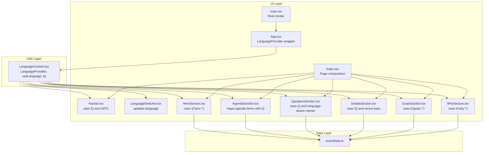
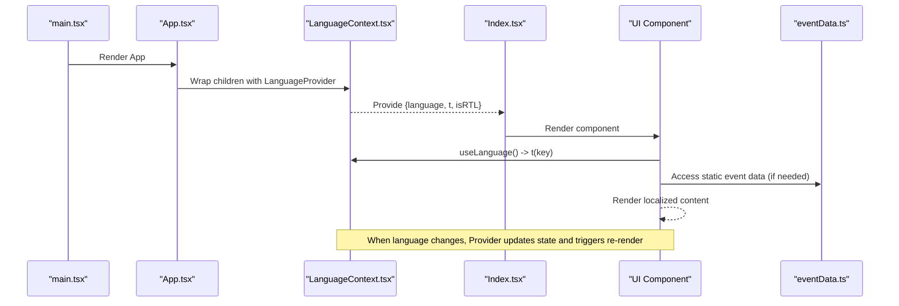
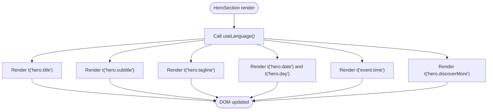
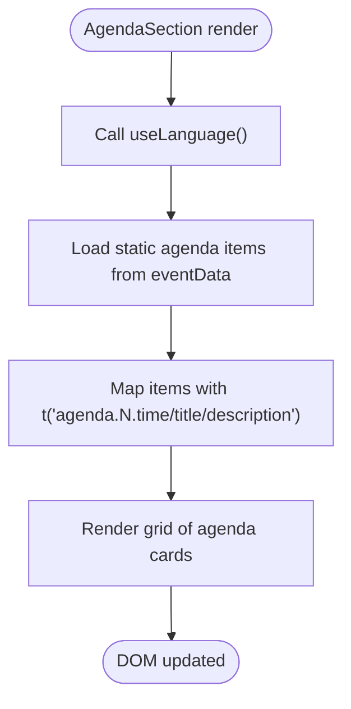
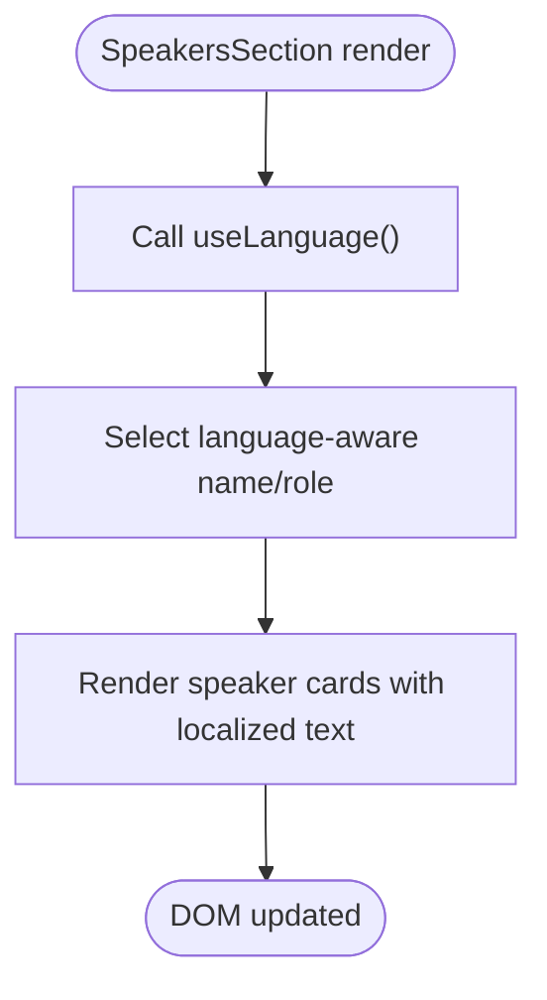
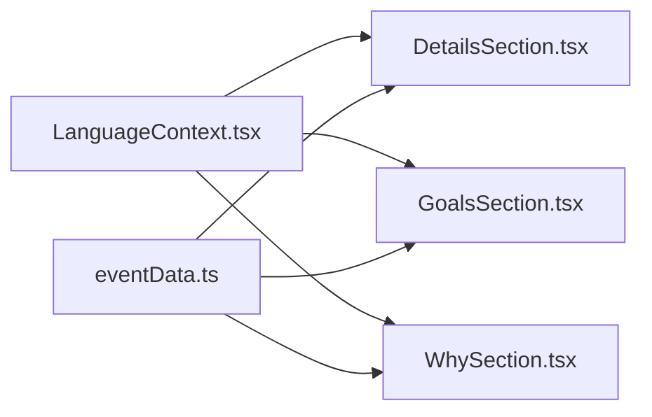
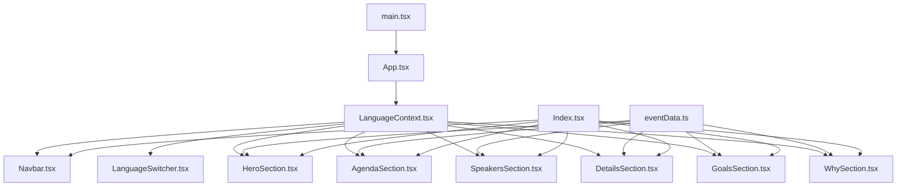

# Data Flow and Integration

> **Referenced Files in This Document**
> - [eventData.ts](src/data/eventData.ts)
> - [LanguageContext.tsx](src/contexts/LanguageContext.tsx)
> - [App.tsx](src/App.tsx)
> - [main.tsx](src/main.tsx)
> - [Index.tsx](src/pages/Index.tsx)
> - [HeroSection.tsx](src/components/HeroSection.tsx)
> - [AgendaSection.tsx](src/components/AgendaSection.tsx)
> - [SpeakersSection.tsx](src/components/SpeakersSection.tsx)
> - [DetailsSection.tsx](src/components/DetailsSection.tsx)
> - [GoalsSection.tsx](src/components/GoalsSection.tsx)
> - [WhySection.tsx](src/components/WhySection.tsx)
> - [LanguageSwitcher.tsx](src/components/LanguageSwitcher.tsx)
> - [Navbar.tsx](src/components/Navbar.tsx)

## Table of Contents
1. [Introduction](#introduction)
2. [Project Structure](#project-structure)
3. [Core Components](#core-components)
4. [Architecture Overview](#architecture-overview)
5. [Detailed Component Analysis](#detailed-component-analysis)
6. [Dependency Analysis](#dependency-analysis)
7. [Performance Considerations](#performance-considerations)
8. [Troubleshooting Guide](#troubleshooting-guide)
9. [Conclusion](#conclusion)

## Introduction
This document explains how static event data and dynamic translation data combine to render multilingual content across the application. It traces the data pathway from the static event data source to UI components such as HeroSection, AgendaSection, and SpeakersSection, and describes how React’s rendering lifecycle responds to language changes. It also covers component hierarchy, data dependencies, and strategies for maintaining data consistency, handling asynchronous updates, and optimizing re-renders during language switches.

## Project Structure
The application follows a layered structure:
- Data layer: Static event data is centralized in a single module.
- Internationalization layer: A React context manages language state and provides translation keys mapped to localized strings.
- UI layer: Page and component modules consume translation keys and static event data to render content.

**Diagram sources**
- [main.tsx](src/main.tsx#L1-L6)
- [App.tsx](src/App.tsx#L1-L43)
- [LanguageContext.tsx](src/contexts/LanguageContext.tsx#L1-L292)
- [Index.tsx](src/pages/Index.tsx#L1-L32)
- [Navbar.tsx](src/components/Navbar.tsx#L1-L123)
- [LanguageSwitcher.tsx](src/components/LanguageSwitcher.tsx#L1-L44)
- [HeroSection.tsx](src/components/HeroSection.tsx#L1-L99)
- [AgendaSection.tsx](src/components/AgendaSection.tsx#L1-L64)
- [SpeakersSection.tsx](src/components/SpeakersSection.tsx#L1-L238)
- [DetailsSection.tsx](src/components/DetailsSection.tsx#L1-L65)
- [GoalsSection.tsx](src/components/GoalsSection.tsx#L1-L54)
- [WhySection.tsx](src/components/WhySection.tsx#L1-L41)
- [eventData.ts](src/data/eventData.ts#L1-L109)

**Section sources**
- [main.tsx](src/main.tsx#L1-L6)
- [App.tsx](src/App.tsx#L1-L43)
- [Index.tsx](src/pages/Index.tsx#L1-L32)

## Core Components
- Static event data: Centralized in a single module exporting structured event metadata (title, date, venue, agenda, organizers, highlights).
- Translation provider: A React context that holds the current language, exposes a translation function, and computes directionality.
- UI components: Each component consumes translation keys via the hook and renders content accordingly.

Key responsibilities:
- eventData.ts: Provides static, immutable event data consumed by multiple UI sections.
- LanguageContext.tsx: Provides language state, translation function, and RTL detection; wraps the app.
- UI components: Render content using translation keys and static event data.

**Section sources**
- [eventData.ts](src/data/eventData.ts#L1-L109)
- [LanguageContext.tsx](src/contexts/LanguageContext.tsx#L1-L292)

## Architecture Overview
The data flow integrates static event data and dynamic translation keys into UI components through a predictable pipeline:
- App initialization sets up the translation provider and routes.
- Components request translations via the hook and render localized strings.
- Static event data is accessed directly by components that need structured content (e.g., agenda, organizers).
- Language changes propagate through the provider, causing components to re-render with updated content.

**Diagram sources**
- [main.tsx](src/main.tsx#L1-L6)
- [App.tsx](src/App.tsx#L1-L43)
- [LanguageContext.tsx](src/contexts/LanguageContext.tsx#L1-L292)
- [Index.tsx](src/pages/Index.tsx#L1-L32)
- [eventData.ts](src/data/eventData.ts#L1-L109)

## Detailed Component Analysis

### HeroSection: Rendering localized hero content
HeroSection demonstrates how static event data and translation keys are combined:
- Uses translation keys for hero-related labels.
- Uses static event data for formatted date and time.
- Integrates with countdown timer and CTA links.

**Diagram sources**
- [HeroSection.tsx](src/components/HeroSection.tsx#L1-L99)
- [LanguageContext.tsx](src/contexts/LanguageContext.tsx#L1-L292)
- [eventData.ts](src/data/eventData.ts#L1-L109)

**Section sources**
- [HeroSection.tsx](src/components/HeroSection.tsx#L1-L99)

### AgendaSection: Mapping agenda items with translated labels
AgendaSection builds a list of agenda items by combining:
- Static agenda data from the event data module.
- Translation keys for each agenda segment’s time, title, and description.

**Diagram sources**
- [AgendaSection.tsx](src/components/AgendaSection.tsx#L1-L64)
- [LanguageContext.tsx](src/contexts/LanguageContext.tsx#L1-L292)
- [eventData.ts](src/data/eventData.ts#L1-L109)

**Section sources**
- [AgendaSection.tsx](src/components/AgendaSection.tsx#L1-L64)

### SpeakersSection: Language-aware speaker names and roles
SpeakersSection demonstrates a hybrid approach:
- Uses translation keys for section titles and subtitles.
- Uses language-aware selection for speaker names and roles (Arabic, English, Turkish) directly from the static data.

**Diagram sources**
- [SpeakersSection.tsx](src/components/SpeakersSection.tsx#L1-L238)
- [LanguageContext.tsx](src/contexts/LanguageContext.tsx#L1-L292)
- [eventData.ts](src/data/eventData.ts#L1-L109)

**Section sources**
- [SpeakersSection.tsx](src/components/SpeakersSection.tsx#L1-L238)

### Additional UI components consuming translations and static data
- DetailsSection: Renders venue and schedule details using translation keys and venue keys.
- GoalsSection: Renders goals with translated titles and descriptions.
- WhySection: Renders thematic content using translation keys.

**Diagram sources**
- [LanguageContext.tsx](src/contexts/LanguageContext.tsx#L1-L292)
- [DetailsSection.tsx](src/components/DetailsSection.tsx#L1-L65)
- [GoalsSection.tsx](src/components/GoalsSection.tsx#L1-L54)
- [WhySection.tsx](src/components/WhySection.tsx#L1-L41)
- [eventData.ts](src/data/eventData.ts#L1-L109)

**Section sources**
- [DetailsSection.tsx](src/components/DetailsSection.tsx#L1-L65)
- [GoalsSection.tsx](src/components/GoalsSection.tsx#L1-L54)
- [WhySection.tsx](src/components/WhySection.tsx#L1-L41)

## Dependency Analysis
- Provider dependency: All components depend on the LanguageContext provider for translations and directionality.
- Static data dependency: Several components depend on the static event data module for structured content.
- Routing and layout: The page composes multiple sections; language changes affect all of them uniformly.

**Diagram sources**
- [LanguageContext.tsx](src/contexts/LanguageContext.tsx#L1-L292)
- [eventData.ts](src/data/eventData.ts#L1-L109)
- [App.tsx](src/App.tsx#L1-L43)
- [main.tsx](src/main.tsx#L1-L6)
- [Index.tsx](src/pages/Index.tsx#L1-L32)
- [Navbar.tsx](src/components/Navbar.tsx#L1-L123)
- [LanguageSwitcher.tsx](src/components/LanguageSwitcher.tsx#L1-L44)
- [HeroSection.tsx](src/components/HeroSection.tsx#L1-L99)
- [AgendaSection.tsx](src/components/AgendaSection.tsx#L1-L64)
- [SpeakersSection.tsx](src/components/SpeakersSection.tsx#L1-L238)
- [DetailsSection.tsx](src/components/DetailsSection.tsx#L1-L65)
- [GoalsSection.tsx](src/components/GoalsSection.tsx#L1-L54)
- [WhySection.tsx](src/components/WhySection.tsx#L1-L41)

**Section sources**
- [LanguageContext.tsx](src/contexts/LanguageContext.tsx#L1-L292)
- [eventData.ts](src/data/eventData.ts#L1-L109)
- [App.tsx](src/App.tsx#L1-L43)
- [Index.tsx](src/pages/Index.tsx#L1-L32)

## Performance Considerations
- Translation function cost: The translation function is lightweight and reads from an in-memory map keyed by language and key. It is efficient for typical UI sizes.
- Re-render scope: Changing the language updates the provider state, causing all consumers to re-render. This is expected and acceptable for a small-scale application.
- Memoization strategies:
  - Memoize derived arrays (e.g., agenda lists) inside components if they grow large.
  - Use React.memo for leaf components that render frequently.
  - Avoid unnecessary re-computation by passing pre-translated strings to deeply nested components.
- Asynchronous data migration:
  - If moving to external APIs, introduce caching and loading states to prevent UI thrashing.
  - Use a data fetching library with built-in caching and invalidation to minimize redundant requests.
- Font and directionality:
  - The app dynamically applies fonts and directionality based on language. Keep this minimal and avoid heavy computations in render paths.

[No sources needed since this section provides general guidance]

## Troubleshooting Guide
Common issues and resolutions:
- Missing translation keys:
  - Symptom: Keys fall back to themselves.
  - Resolution: Ensure keys exist in the translation map for all supported languages.
- Language switch not updating content:
  - Symptom: UI remains unchanged after switching language.
  - Resolution: Verify the provider is wrapping the app and that components call the hook correctly.
- Mixed language content in hybrid components:
  - Symptom: Some fields display in a different language than others.
  - Resolution: Use language-aware selection consistently (as shown in speakers) or rely on translation keys for uniformity.
- Static data not updating:
  - Symptom: Event dates/times do not reflect changes.
  - Resolution: Update the static data module and ensure components re-import the updated values.

**Section sources**
- [LanguageContext.tsx](src/contexts/LanguageContext.tsx#L1-L292)
- [eventData.ts](src/data/eventData.ts#L1-L109)

## Conclusion
The application cleanly separates static event data from dynamic translation data, enabling consistent multilingual rendering across components. The LanguageContext provider centralizes internationalization concerns, while components remain focused on presentation. The rendering lifecycle ensures immediate updates when language changes. For future enhancements—such as migrating to external APIs—the suggested memoization and caching strategies can help maintain responsiveness and data consistency.