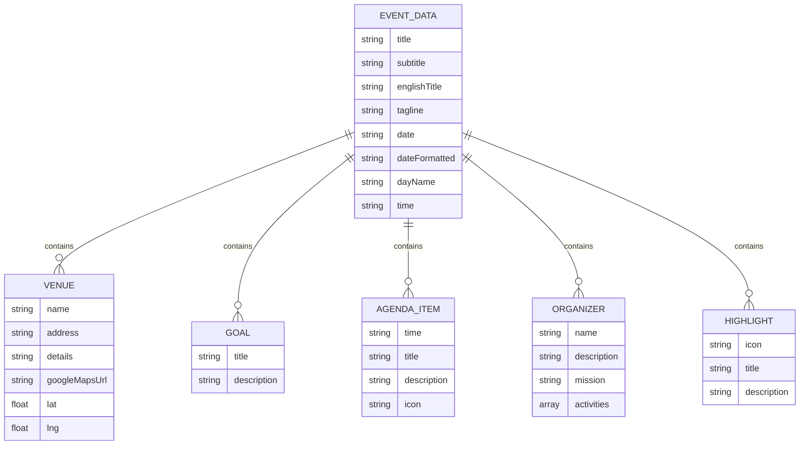
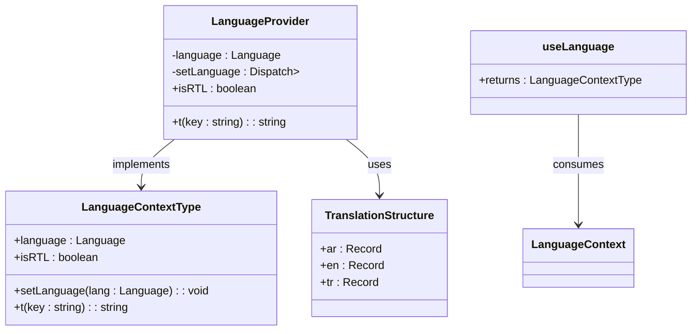
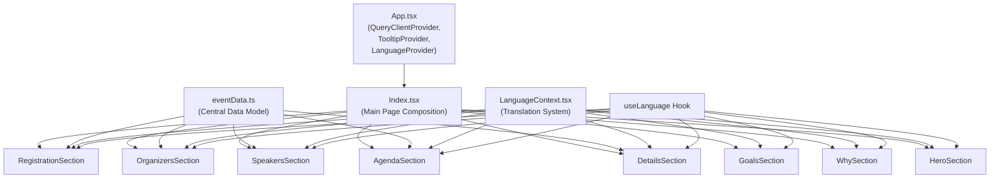
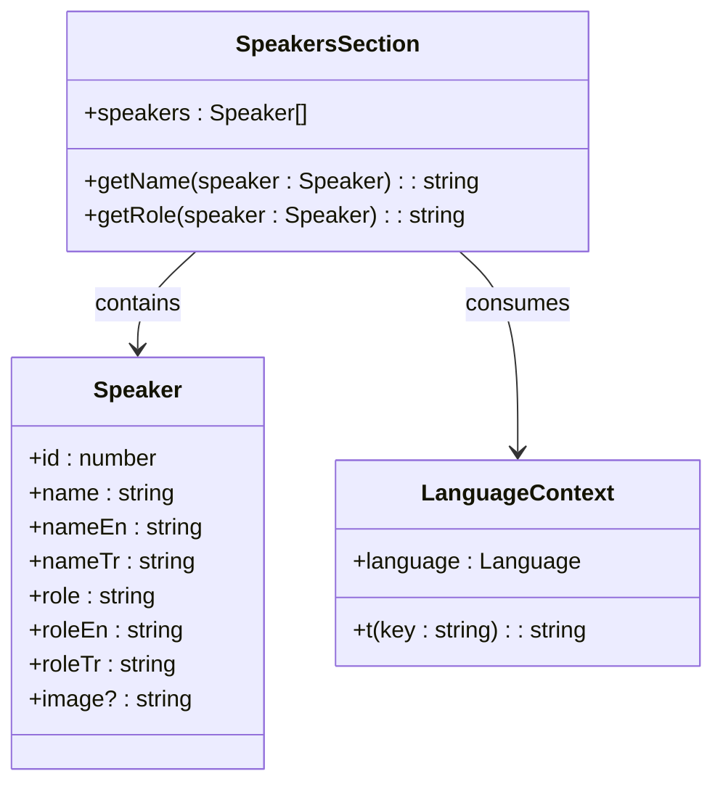
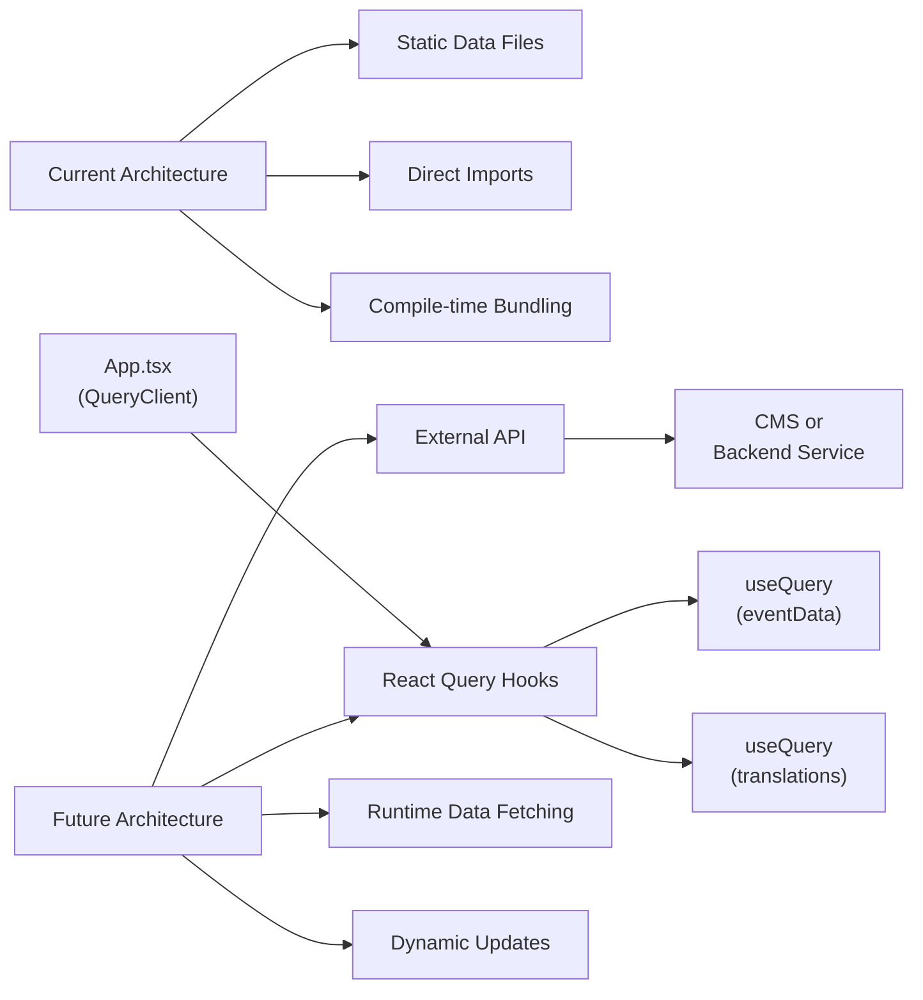

# Data Management

> **Referenced Files in This Document**   
> - [eventData.ts](src/data/eventData.ts)
> - [LanguageContext.tsx](src/contexts/LanguageContext.tsx)
> - [SpeakersSection.tsx](src/components/SpeakersSection.tsx)
> - [AgendaSection.tsx](src/components/AgendaSection.tsx)
> - [DetailsSection.tsx](src/components/DetailsSection.tsx)
> - [App.tsx](src/App.tsx)
> - [Index.tsx](src/pages/Index.tsx)

## Table of Contents
1. [Introduction](#introduction)
2. [Core Data Model: eventData.ts](#core-data-model-eventdatats)
3. [Translation System with LanguageContext](#translation-system-with-languagecontext)
4. [Data Flow and Component Integration](#data-flow-and-component-integration)
5. [Speakers Data Management](#speakers-data-management)
6. [Common Data Management Issues](#common-data-management-issues)
7. [Future Extensibility and External Data Loading](#future-extensibility-and-external-data-loading)
8. [Conclusion](#conclusion)

## Introduction
This document provides a comprehensive overview of the data management system for the Syrian Community event platform. The system is built around two core components: the `eventData.ts` file, which serves as the central data model containing all event information, and the `LanguageContext.tsx` file, which enables multilingual support across the application. The data architecture follows a static-first approach with potential for future dynamic data loading, using React's Context API for global state management and component-level data consumption patterns.

**Section sources**
- [eventData.ts](src/data/eventData.ts)
- [LanguageContext.tsx](src/contexts/LanguageContext.tsx)

## Core Data Model: eventData.ts
The `eventData.ts` file contains a comprehensive data model that defines all aspects of the Liberation Day event. This central configuration object includes event metadata such as title, date, and venue, as well as structured content for various sections of the application including goals, agenda items, organizers, and highlights.

The data structure is organized into logical sections:
- **Event Metadata**: Title, subtitle, date, time, and formatted date strings
- **Venue Information**: Complete venue details including name, address, Google Maps URL, and geographic coordinates
- **Content Sections**: Structured data for why celebration, goals, agenda, and organizers
- **Visual Highlights**: Icon-based highlights that summarize key event aspects

This centralized approach allows for easy maintenance and updates to event information without requiring changes to component logic. All components consume this data directly or through derived state, ensuring consistency across the application.

**Diagram sources **
- [eventData.ts](src/data/eventData.ts#L1-L109)

**Section sources**
- [eventData.ts](src/data/eventData.ts#L1-L109)

## Translation System with LanguageContext
The multilingual capabilities of the application are managed through the `LanguageContext.tsx` file, which implements React's Context API to provide translation services across all components. The system supports three languages: Arabic (ar), English (en), and Turkish (tr), with Arabic as the default language.

The translation system is built around a nested object structure where translations are organized by language and then by functional area (e.g., navigation, hero section, details). Each translation key follows a dot-notation pattern (e.g., 'nav.home', 'hero.title') that reflects its location and purpose in the application.

Key features of the translation system include:
- **Directionality Support**: Automatic RTL (right-to-left) layout for Arabic content
- **Translation Function**: A `t()` function that safely returns translation values or fallback keys
- **Language Switching**: State management for dynamic language changes
- **Component Integration**: Seamless integration with UI components through the `useLanguage` hook

The context provider wraps the entire application in `App.tsx`, ensuring that all components have access to the current language setting and translation functions.

**Diagram sources **
- [LanguageContext.tsx](src/contexts/LanguageContext.tsx#L5-L292)
- [App.tsx](src/App.tsx#L6-L31)

**Section sources**
- [LanguageContext.tsx](src/contexts/LanguageContext.tsx#L5-L292)

## Data Flow and Component Integration
The application follows a clear data flow pattern where the central `eventData` and `LanguageContext` are consumed by various UI components to render content. The `Index.tsx` page serves as the main composition point, importing and arranging all section components in the desired order.

Components access data through two primary mechanisms:
1. **Direct Import**: Components like `AgendaSection` and `DetailsSection` import `eventData` directly to access event-specific information
2. **Context Consumption**: All components use `LanguageContext` to access translations and current language settings

The integration pattern ensures that content remains consistent while allowing for language-specific adaptations. For example, the `DetailsSection` component uses translation keys to display labels while pulling date and venue information from `eventData`.

**Diagram sources **
- [App.tsx](src/App.tsx#L5-L43)
- [Index.tsx](src/pages/Index.tsx#L1-L32)
- [eventData.ts](src/data/eventData.ts)
- [LanguageContext.tsx](src/contexts/LanguageContext.tsx)

**Section sources**
- [App.tsx](src/App.tsx#L5-L43)
- [Index.tsx](src/pages/Index.tsx#L1-L32)

## Speakers Data Management
The speakers data is managed within the `SpeakersSection.tsx` component, which defines a comprehensive data structure for speaker information. Unlike other event data that comes from `eventData.ts`, the speakers data is co-located with its consuming component, following a colocation pattern that keeps related code together.

The speaker data model includes:
- **Multilingual Fields**: Name and role in Arabic, English, and Turkish
- **Identification**: Unique ID and image reference
- **Professional Information**: Role/position with language-specific variations

The component implements a language-aware rendering system that selects the appropriate name and role based on the current language setting from `LanguageContext`. This ensures that speaker information is presented in the user's preferred language while maintaining data consistency.

The data flow for speakers follows a self-contained pattern:
1. The component defines the speakers array with multilingual data
2. It consumes the current language setting via `useLanguage`
3. It uses helper functions (`getName`, `getRole`) to select language-appropriate values
4. It renders the speaker cards with proper images and formatting

This approach provides flexibility for speaker management while maintaining integration with the global translation system for section titles and UI elements.

**Diagram sources **
- [SpeakersSection.tsx](src/components/SpeakersSection.tsx#L1-L238)

**Section sources**
- [SpeakersSection.tsx](src/components/SpeakersSection.tsx#L1-L238)

## Common Data Management Issues
The current data management system presents several considerations and potential issues that should be addressed:

**Stale Data Risk**: Since all event data is statically defined in `eventData.ts`, there is a risk of information becoming outdated if not properly maintained. The lack of data validation or type checking increases the potential for errors in date formats, URL structures, or missing fields.

**Data Duplication**: Some information appears in multiple locations (e.g., venue details in both `eventData` and translations), creating maintenance challenges and potential inconsistencies when updates are needed.

**Limited Extensibility**: The static data model makes it difficult to add new event instances or support multiple events without significant code changes.

**Image Management**: Speaker images are imported directly in the component, which can lead to bundle size issues as the number of speakers grows.

**Translation Maintenance**: The translation system requires manual updates for new content, and there is no mechanism to identify missing translations or verify translation completeness.

Strategies to mitigate these issues include implementing data validation, creating a build-time check for translation completeness, and establishing clear ownership and update processes for the data files.

**Section sources**
- [eventData.ts](src/data/eventData.ts)
- [LanguageContext.tsx](src/contexts/LanguageContext.tsx)
- [SpeakersSection.tsx](src/components/SpeakersSection.tsx)

## Future Extensibility and External Data Loading
While the current implementation uses static data files, the architecture supports future extensibility through external data sources. The foundation is already in place with React Query being initialized in `App.tsx`, providing a mechanism for data fetching, caching, and synchronization.

Potential approaches for external data loading include:

**API Integration**: Create endpoints to serve event data in JSON format, allowing for dynamic content updates without redeployment. This could support multiple events or seasonal content changes.

**Content Management System**: Integrate with a headless CMS to allow non-technical users to update event information, speakers, and agenda items through a visual interface.

**Hybrid Approach**: Maintain critical data (like venue and date) in static files for reliability while loading dynamic content (like speaker updates or agenda changes) from an API.

**Internationalization Enhancement**: Implement a translation management system that allows for community contributions to translations, with versioning and review workflows.

The transition to external data sources would require minimal changes to the current architecture:
1. Replace direct imports of `eventData` with `useQuery` hooks
2. Update the `LanguageContext` to load translations from an API
3. Implement loading and error states for data fetching
4. Add caching strategies to minimize network requests

This evolutionary path maintains the current user experience while enabling more dynamic content management.

**Diagram sources **
- [App.tsx](src/App.tsx#L4-L10)
- [eventData.ts](src/data/eventData.ts)
- [LanguageContext.tsx](src/contexts/LanguageContext.tsx)

**Section sources**
- [App.tsx](src/App.tsx#L4-L10)

## Conclusion
The data management system for the Syrian Community event platform effectively combines a centralized data model with a robust translation system to deliver multilingual event information. The `eventData.ts` file serves as a single source of truth for event details, while the `LanguageContext.tsx` enables seamless language switching and RTL support. Components consume this data through direct imports and context consumption, creating a maintainable architecture that balances simplicity with functionality.

The system demonstrates good practices in data organization and internationalization, with opportunities for future enhancement through external data sources and improved data validation. By leveraging React Query (already initialized in the application), the platform is well-positioned to evolve from static data to dynamic content delivery while maintaining its core user experience.