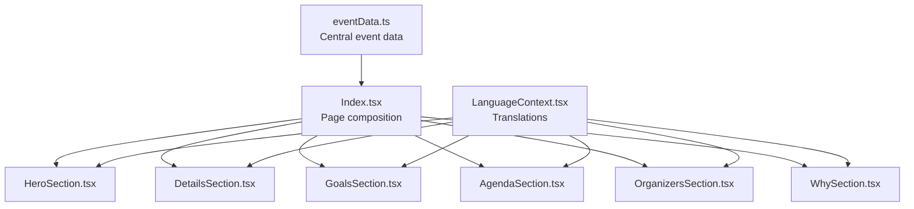
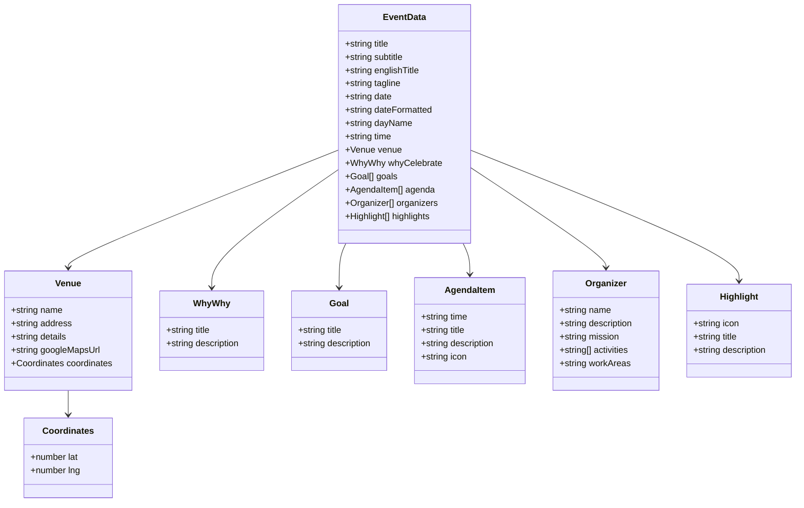
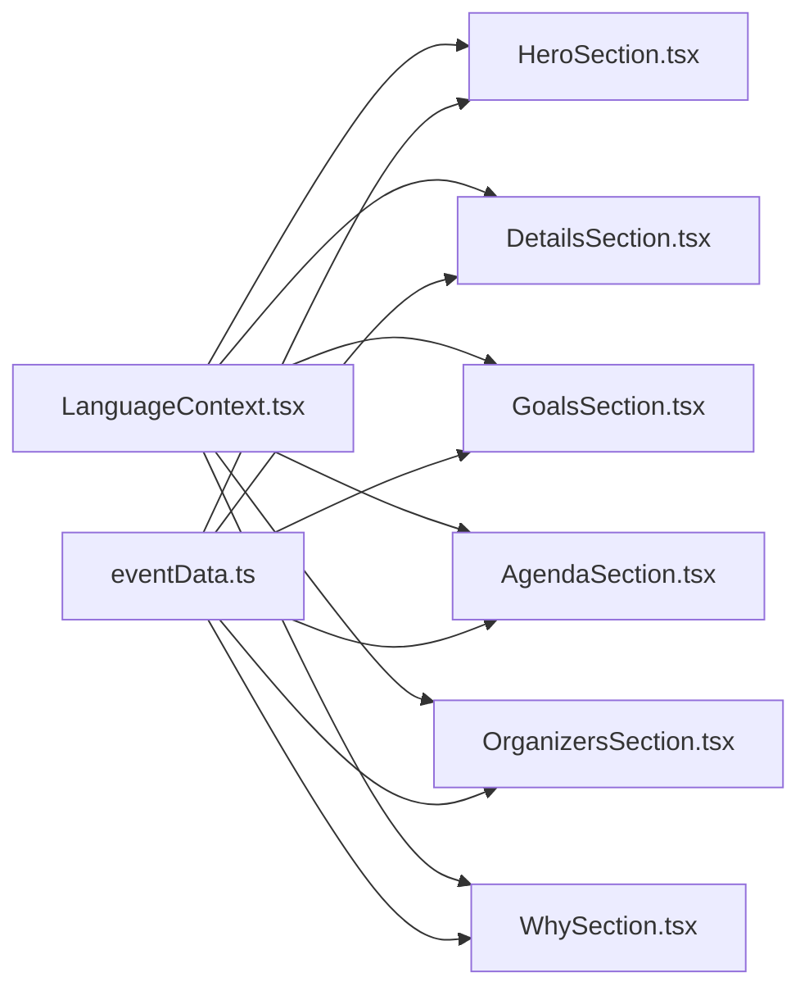

# Event Data Structure

> **Referenced Files in This Document**
> - [eventData.ts](src/data/eventData.ts)
> - [LanguageContext.tsx](src/contexts/LanguageContext.tsx)
> - [HeroSection.tsx](src/components/HeroSection.tsx)
> - [DetailsSection.tsx](src/components/DetailsSection.tsx)
> - [GoalsSection.tsx](src/components/GoalsSection.tsx)
> - [AgendaSection.tsx](src/components/AgendaSection.tsx)
> - [OrganizersSection.tsx](src/components/OrganizersSection.tsx)
> - [WhySection.tsx](src/components/WhySection.tsx)
> - [Index.tsx](src/pages/Index.tsx)

## Table of Contents
1. [Introduction](#introduction)
2. [Project Structure](#project-structure)
3. [Core Components](#core-components)
4. [Architecture Overview](#architecture-overview)
5. [Detailed Component Analysis](#detailed-component-analysis)
6. [Dependency Analysis](#dependency-analysis)
7. [Performance Considerations](#performance-considerations)
8. [Troubleshooting Guide](#troubleshooting-guide)
9. [Conclusion](#conclusion)
10. [Appendices](#appendices)

## Introduction
This document provides comprehensive data model documentation for the event data used across the application. It focuses on the central event data object exported from the data module and explains how each field contributes to the user experience across key UI sections. It also covers the translation system that renders multilingual content and outlines best practices for updating and extending the data model safely.

## Project Structure
The event data is defined in a single data module and consumed by multiple UI components. The translation system resides in a dedicated context provider that exposes a translation function used by components to render localized content.



**Diagram sources**
- [eventData.ts](src/data/eventData.ts#L1-L109)
- [Index.tsx](src/pages/Index.tsx#L1-L32)
- [LanguageContext.tsx](src/contexts/LanguageContext.tsx#L1-L292)
- [HeroSection.tsx](src/components/HeroSection.tsx#L1-L99)
- [DetailsSection.tsx](src/components/DetailsSection.tsx#L1-L65)
- [GoalsSection.tsx](src/components/GoalsSection.tsx#L1-L54)
- [AgendaSection.tsx](src/components/AgendaSection.tsx#L1-L64)
- [OrganizersSection.tsx](src/components/OrganizersSection.tsx#L1-L132)
- [WhySection.tsx](src/components/WhySection.tsx#L1-L41)

**Section sources**
- [eventData.ts](src/data/eventData.ts#L1-L109)
- [Index.tsx](src/pages/Index.tsx#L1-L32)
- [LanguageContext.tsx](src/contexts/LanguageContext.tsx#L1-L292)

## Core Components
This section documents the event data model and its role in rendering the event page.

- Event metadata
  - title: Primary event title
  - subtitle: Secondary title or tagline
  - englishTitle: Alternative English title
  - tagline: Short promotional phrase
- Date and time
  - date: ISO-like string representing the event date
  - dateFormatted: Localized formatted date string
  - dayName: Localized day of week
  - time: Localized time range string
- Venue
  - name: Venue name
  - address: Full address string
  - details: Localized city/region details
  - googleMapsUrl: External URL to venue on Google Maps
  - coordinates: Latitude and longitude pair
- Why celebrate
  - title: Heading for the “Why” section
  - description: Explanatory text for the celebration
- Goals
  - Array of goal objects with title and description
- Agenda
  - Array of agenda items with time, title, description, and icon
- Organizers
  - Array of organizer objects with name, description, optional mission, optional activities, and optional workAreas
- Highlights
  - Array of highlight objects with icon, title, and description

How components consume this data:
- HeroSection renders the hero title, subtitle, tagline, and date/day/time badges using translation keys.
- DetailsSection renders date, time, and venue information using translation keys and a static Google Maps URL.
- GoalsSection renders the four goals using translation keys.
- AgendaSection renders agenda items using translation keys and a predefined set of icons.
- OrganizersSection conditionally selects organizers based on language and renders their details.
- WhySection renders the “Why” content using translation keys.

**Section sources**
- [eventData.ts](src/data/eventData.ts#L1-L109)
- [HeroSection.tsx](src/components/HeroSection.tsx#L1-L99)
- [DetailsSection.tsx](src/components/DetailsSection.tsx#L1-L65)
- [GoalsSection.tsx](src/components/GoalsSection.tsx#L1-L54)
- [AgendaSection.tsx](src/components/AgendaSection.tsx#L1-L64)
- [OrganizersSection.tsx](src/components/OrganizersSection.tsx#L1-L132)
- [WhySection.tsx](src/components/WhySection.tsx#L1-L41)

## Architecture Overview
The event data is a static, centralized object that powers multiple UI sections. Components rely on the translation system to render content in the selected language. The data model is intentionally flat and straightforward to simplify maintenance and reduce coupling.



**Diagram sources**
- [eventData.ts](src/data/eventData.ts#L1-L109)

## Detailed Component Analysis

### Event Data Model Fields
- title, subtitle, englishTitle, tagline
  - Purpose: Hero presentation and promotional messaging
  - Consumption: HeroSection and translation keys
- date, dateFormatted, dayName, time
  - Purpose: Event scheduling display
  - Consumption: HeroSection and DetailsSection
- venue
  - name, address, details, googleMapsUrl, coordinates
  - Purpose: Location display and navigation
  - Consumption: DetailsSection and OrganizersSection
- whyCelebrate
  - title, description
  - Purpose: Motivation and context
  - Consumption: WhySection
- goals
  - Array of goal objects with title and description
  - Purpose: Event objectives
  - Consumption: GoalsSection
- agenda
  - Array of agenda items with time, title, description, icon
  - Purpose: Program schedule
  - Consumption: AgendaSection
- organizers
  - Array of organizer objects with name, description, mission, activities, workAreas
  - Purpose: Organization and collaboration display
  - Consumption: OrganizersSection
- highlights
  - Array of highlight objects with icon, title, description
  - Purpose: Event features and benefits
  - Consumption: Not directly used in the provided components

**Section sources**
- [eventData.ts](src/data/eventData.ts#L1-L109)
- [HeroSection.tsx](src/components/HeroSection.tsx#L1-L99)
- [DetailsSection.tsx](src/components/DetailsSection.tsx#L1-L65)
- [GoalsSection.tsx](src/components/GoalsSection.tsx#L1-L54)
- [AgendaSection.tsx](src/components/AgendaSection.tsx#L1-L64)
- [OrganizersSection.tsx](src/components/OrganizersSection.tsx#L1-L132)
- [WhySection.tsx](src/components/WhySection.tsx#L1-L41)

### Data Consumption by Components
- HeroSection
  - Uses translation keys for hero.title, hero.subtitle, hero.tagline, hero.date, hero.day
  - Displays countdown timer and date badge
  - References: [HeroSection.tsx](src/components/HeroSection.tsx#L1-L99)
- DetailsSection
  - Renders date, time, and venue using translation keys
  - Provides a static link to Google Maps
  - References: [DetailsSection.tsx](src/components/DetailsSection.tsx#L1-L65)
- GoalsSection
  - Renders four goals using translation keys for titles and descriptions
  - References: [GoalsSection.tsx](src/components/GoalsSection.tsx#L1-L54)
- AgendaSection
  - Renders seven agenda items using translation keys and predefined icons
  - References: [AgendaSection.tsx](src/components/AgendaSection.tsx#L1-L64)
- OrganizersSection
  - Conditionally selects organizers based on language and renders details
  - References: [OrganizersSection.tsx](src/components/OrganizersSection.tsx#L1-L132)
- WhySection
  - Renders the “Why” content using translation keys
  - References: [WhySection.tsx](src/components/WhySection.tsx#L1-L41)

```mermaid
sequenceDiagram
participant Page as "Index.tsx"
participant Hero as "HeroSection.tsx"
participant Details as "DetailsSection.tsx"
participant Goals as "GoalsSection.tsx"
participant Agenda as "AgendaSection.tsx"
participant Orgs as "OrganizersSection.tsx"
participant Why as "WhySection.tsx"
participant Lang as "LanguageContext.tsx"
participant Data as "eventData.ts"
Page->>Hero : Render hero section
Hero->>Lang : t("hero.title"), t("hero.subtitle"), t("hero.tagline")
Hero->>Data : Access date, dayName, time
Hero-->>Page : Rendered hero
Page->>Details : Render details section
Details->>Lang : t("details.title"), t("details.date"), t("details.time")
Details->>Data : Access venue and time
Details-->>Page : Rendered details
Page->>Goals : Render goals section
Goals->>Lang : t("goals.title"), t("goals.1.title"), t("goals.1.description")
Goals-->>Page : Rendered goals
Page->>Agenda : Render agenda section
Agenda->>Lang : t("agenda.title"), t("agenda.1.time"), t("agenda.1.title")
Agenda-->>Page : Rendered agenda
Page->>Orgs : Render organizers section
Orgs->>Lang : t("organizers.title")
Orgs->>Data : Access organizers
Orgs-->>Page : Rendered organizers
Page->>Why : Render why section
Why->>Lang : t("why.title"), t("why.description")
Why-->>Page : Rendered why
```

**Diagram sources**
- [Index.tsx](src/pages/Index.tsx#L1-L32)
- [HeroSection.tsx](src/components/HeroSection.tsx#L1-L99)
- [DetailsSection.tsx](src/components/DetailsSection.tsx#L1-L65)
- [GoalsSection.tsx](src/components/GoalsSection.tsx#L1-L54)
- [AgendaSection.tsx](src/components/AgendaSection.tsx#L1-L64)
- [OrganizersSection.tsx](src/components/OrganizersSection.tsx#L1-L132)
- [WhySection.tsx](src/components/WhySection.tsx#L1-L41)
- [LanguageContext.tsx](src/contexts/LanguageContext.tsx#L1-L292)
- [eventData.ts](src/data/eventData.ts#L1-L109)

## Dependency Analysis
- Internal dependencies
  - Index.tsx composes all sections
  - Each section consumes the translation system via the LanguageContext hook
  - DetailsSection uses a static Google Maps URL; it does not consume the venue.googleMapsUrl from the data module
- External dependencies
  - Translation keys are defined in LanguageContext.tsx
  - UI components rely on Lucide icons and Tailwind classes for styling



**Diagram sources**
- [LanguageContext.tsx](src/contexts/LanguageContext.tsx#L1-L292)
- [Index.tsx](src/pages/Index.tsx#L1-L32)
- [eventData.ts](src/data/eventData.ts#L1-L109)
- [HeroSection.tsx](src/components/HeroSection.tsx#L1-L99)
- [DetailsSection.tsx](src/components/DetailsSection.tsx#L1-L65)
- [GoalsSection.tsx](src/components/GoalsSection.tsx#L1-L54)
- [AgendaSection.tsx](src/components/AgendaSection.tsx#L1-L64)
- [OrganizersSection.tsx](src/components/OrganizersSection.tsx#L1-L132)
- [WhySection.tsx](src/components/WhySection.tsx#L1-L41)

**Section sources**
- [LanguageContext.tsx](src/contexts/LanguageContext.tsx#L1-L292)
- [Index.tsx](src/pages/Index.tsx#L1-L32)
- [eventData.ts](src/data/eventData.ts#L1-L109)

## Performance Considerations
- Static data model: The event data is a static object, minimizing runtime computation and network overhead.
- Translation lookups: Components call the translation function for each rendered key; keep translation keys minimal and consistent to avoid unnecessary re-renders.
- Venue map link: DetailsSection hardcodes the Google Maps URL; if the venue changes, update the hardcoded URL accordingly to prevent broken links.

[No sources needed since this section provides general guidance]

## Troubleshooting Guide
Common issues and resolutions:
- Missing translation keys
  - Symptom: Keys not found in the translation system return the key itself.
  - Resolution: Ensure all keys used by components exist in the LanguageContext translations for all supported languages.
  - References: [LanguageContext.tsx](src/contexts/LanguageContext.tsx#L1-L292)
- Incorrect date format
  - Symptom: Date appears inconsistent across components.
  - Resolution: Use the dateFormatted field for display and ensure the date field remains a valid date string.
  - References: [eventData.ts](src/data/eventData.ts#L1-L109)
- Broken venue map link
  - Symptom: Clicking the location card opens an outdated or invalid map link.
  - Resolution: Update the Google Maps URL in DetailsSection to match the venue’s current location.
  - References: [DetailsSection.tsx](src/components/DetailsSection.tsx#L1-L65)
- Missing organizer fields
  - Symptom: Some organizers lack mission or activities.
  - Resolution: Add optional fields as needed; components handle missing optional fields gracefully.
  - References: [OrganizersSection.tsx](src/components/OrganizersSection.tsx#L1-L132), [eventData.ts](src/data/eventData.ts#L1-L109)

**Section sources**
- [LanguageContext.tsx](src/contexts/LanguageContext.tsx#L1-L292)
- [eventData.ts](src/data/eventData.ts#L1-L109)
- [DetailsSection.tsx](src/components/DetailsSection.tsx#L1-L65)
- [OrganizersSection.tsx](src/components/OrganizersSection.tsx#L1-L132)

## Conclusion
The event data model is a simple, centralized structure that powers the event page. Its straightforward shape makes it easy to maintain and extend. The translation system ensures multilingual support, and components consume the data through consistent translation keys. By following the best practices outlined here, teams can confidently update and extend the event data for future events.

[No sources needed since this section summarizes without analyzing specific files]

## Appendices

### Validation Strategies
- Type safety with TypeScript
  - Define explicit TypeScript interfaces for each nested object (Venue, Coordinates, Goal, AgendaItem, Organizer, Highlight) and apply them to the event data object.
  - Example references for structure: [eventData.ts](src/data/eventData.ts#L1-L109)
- Date validation
  - Validate the date field against a strict date format and ensure dateFormatted aligns with the locale.
  - Example references: [eventData.ts](src/data/eventData.ts#L1-L109)
- Venue integrity
  - Verify that coordinates are valid numeric pairs and that the Google Maps URL is a valid URL.
  - Example references: [eventData.ts](src/data/eventData.ts#L1-L109)
- Agenda completeness
  - Ensure each agenda item includes time, title, description, and icon; maintain a consistent number of items if the UI expects a fixed count.
  - Example references: [AgendaSection.tsx](src/components/AgendaSection.tsx#L1-L64), [eventData.ts](src/data/eventData.ts#L1-L109)
- Organizers consistency
  - Confirm that organizers include required fields and handle optional fields gracefully.
  - Example references: [OrganizersSection.tsx](src/components/OrganizersSection.tsx#L1-L132), [eventData.ts](src/data/eventData.ts#L1-L109)

### Extending the Data Model for Future Events
- Add new agenda items
  - Append new agenda items to the agenda array with consistent fields.
  - Example references: [eventData.ts](src/data/eventData.ts#L1-L109)
- Introduce new organizers
  - Append new organizer objects to the organizers array with appropriate fields.
  - Example references: [eventData.ts](src/data/eventData.ts#L1-L109)
- Update venue details
  - Modify venue fields and update the Google Maps URL if the location changes.
  - Example references: [eventData.ts](src/data/eventData.ts#L1-L109)
- Localization updates
  - Add or update translation keys in the LanguageContext for new fields.
  - Example references: [LanguageContext.tsx](src/contexts/LanguageContext.tsx#L1-L292)

[No sources needed since this section provides general guidance]