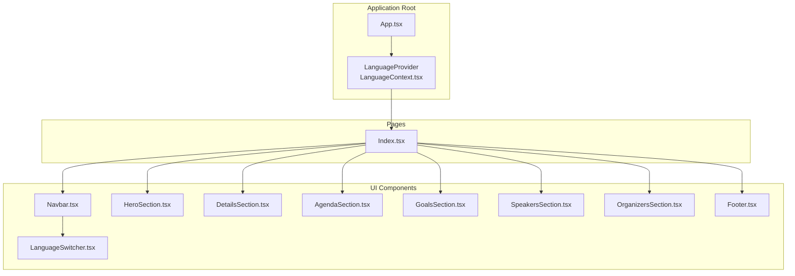
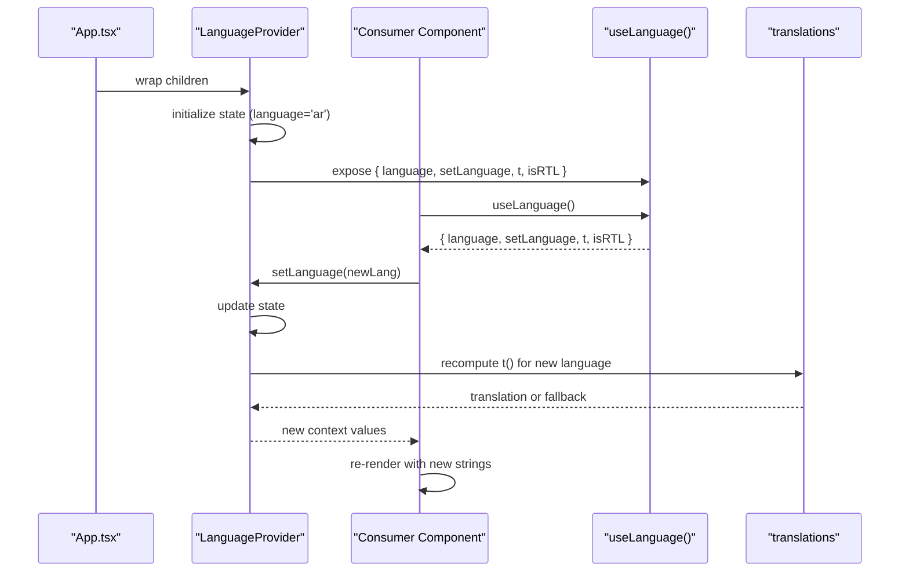
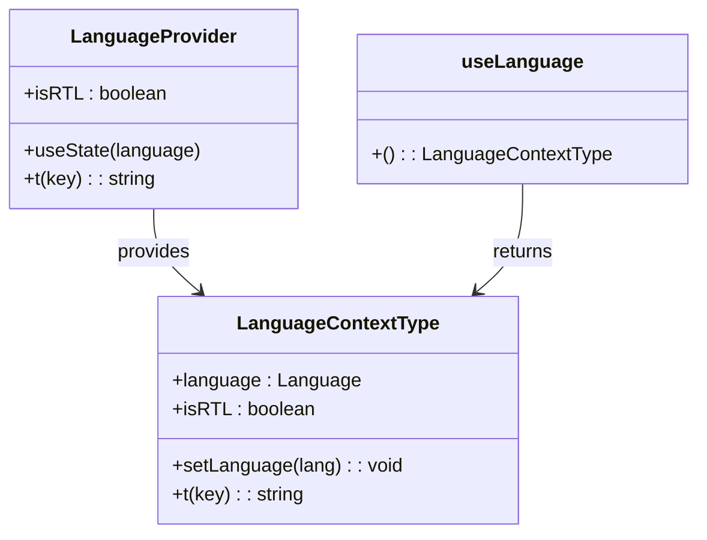
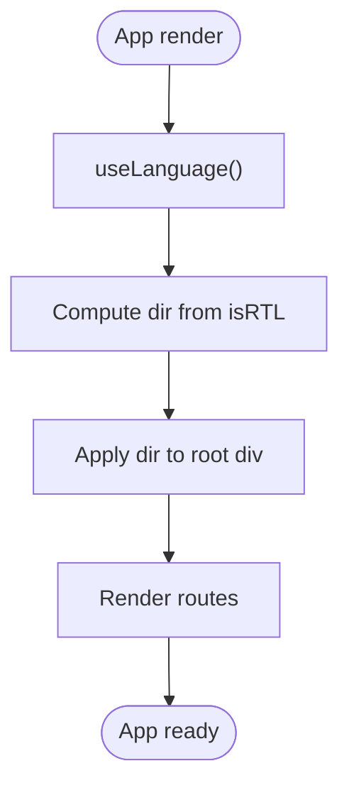
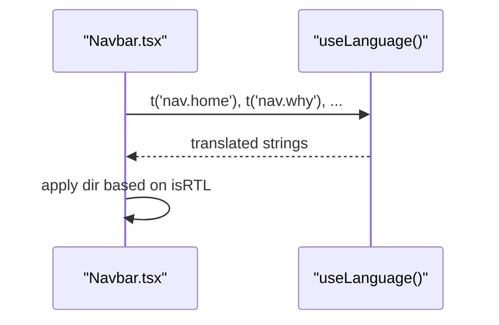
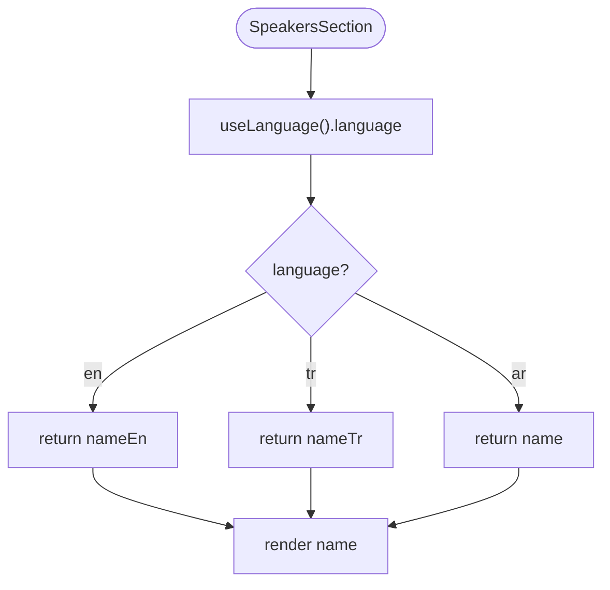
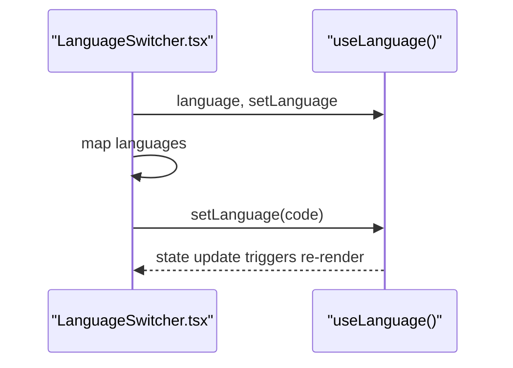
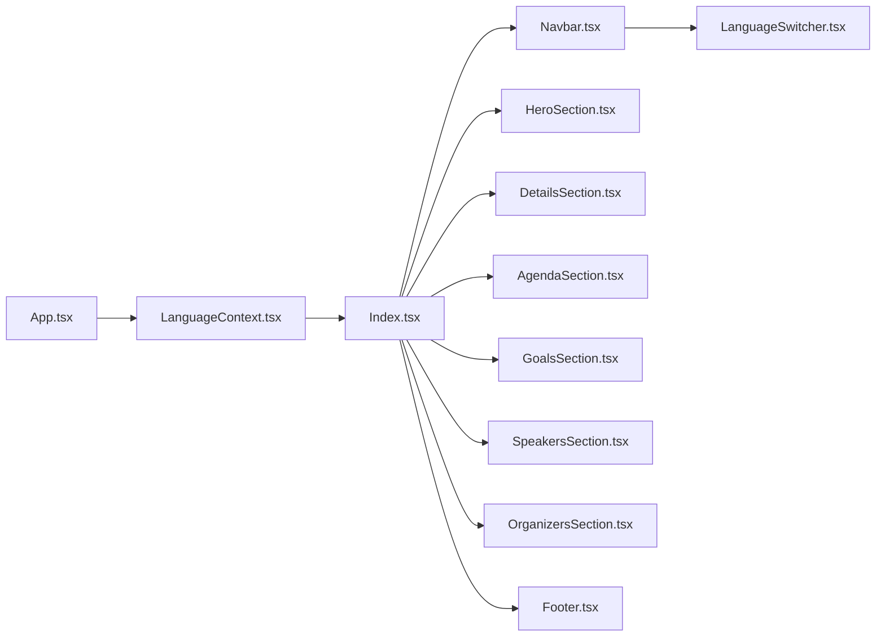

# Translation System

> **Referenced Files in This Document**
> - [LanguageContext.tsx](src/contexts/LanguageContext.tsx)
> - [LanguageSwitcher.tsx](src/components/LanguageSwitcher.tsx)
> - [App.tsx](src/App.tsx)
> - [Navbar.tsx](src/components/Navbar.tsx)
> - [HeroSection.tsx](src/components/HeroSection.tsx)
> - [DetailsSection.tsx](src/components/DetailsSection.tsx)
> - [AgendaSection.tsx](src/components/AgendaSection.tsx)
> - [GoalsSection.tsx](src/components/GoalsSection.tsx)
> - [SpeakersSection.tsx](src/components/SpeakersSection.tsx)
> - [OrganizersSection.tsx](src/components/OrganizersSection.tsx)
> - [Footer.tsx](src/components/Footer.tsx)
> - [Index.tsx](src/pages/Index.tsx)

## Table of Contents
1. [Introduction](#introduction)
2. [Project Structure](#project-structure)
3. [Core Components](#core-components)
4. [Architecture Overview](#architecture-overview)
5. [Detailed Component Analysis](#detailed-component-analysis)
6. [Dependency Analysis](#dependency-analysis)
7. [Performance Considerations](#performance-considerations)
8. [Troubleshooting Guide](#troubleshooting-guide)
9. [Conclusion](#conclusion)

## Introduction
This document explains the translation system implemented in the project’s LanguageContext.tsx. It covers the structure of the translations object, the t() function behavior, the LanguageProvider’s role in managing language state and propagating it via React Context, and the isRTL flag for Arabic layout direction. It also demonstrates how components consume translations using the useLanguage hook, and provides guidance on handling missing keys, performance implications, and strategies for adding new languages or managing dynamic content.

## Project Structure
The translation system centers around a single context provider and a small set of consumer components. The provider exposes language state, a translation function, and an RTL flag. Consumers use a simple hook to retrieve translated strings and react to language changes.

**Diagram sources**
- [App.tsx](src/App.tsx#L1-L43)
- [LanguageContext.tsx](src/contexts/LanguageContext.tsx#L269-L292)
- [Index.tsx](src/pages/Index.tsx#L1-L32)
- [Navbar.tsx](src/components/Navbar.tsx#L1-L123)
- [HeroSection.tsx](src/components/HeroSection.tsx#L1-L99)
- [DetailsSection.tsx](src/components/DetailsSection.tsx#L1-L65)
- [AgendaSection.tsx](src/components/AgendaSection.tsx#L1-L64)
- [GoalsSection.tsx](src/components/GoalsSection.tsx#L1-L54)
- [SpeakersSection.tsx](src/components/SpeakersSection.tsx#L1-L238)
- [OrganizersSection.tsx](src/components/OrganizersSection.tsx#L1-L132)
- [Footer.tsx](src/components/Footer.tsx#L1-L117)
- [LanguageSwitcher.tsx](src/components/LanguageSwitcher.tsx#L1-L44)

**Section sources**
- [App.tsx](src/App.tsx#L1-L43)
- [LanguageContext.tsx](src/contexts/LanguageContext.tsx#L1-L292)
- [Index.tsx](src/pages/Index.tsx#L1-L32)

## Core Components
- LanguageContext.tsx defines:
  - Language union type with supported languages.
  - Translations object keyed by language and then by dot-delimited keys.
  - LanguageProvider that manages language state, exposes t(), and computes isRTL.
  - useLanguage hook with runtime guard to ensure usage within provider.

Key responsibilities:
- translations: central dictionary of UI strings grouped by functional sections (navigation, hero, details, agenda, speakers, organizers, footer, venue).
- t(key): retrieves translation for current language or falls back to the key itself if missing.
- isRTL: true when language is Arabic, enabling RTL layout direction.

**Section sources**
- [LanguageContext.tsx](src/contexts/LanguageContext.tsx#L1-L292)

## Architecture Overview
The translation architecture is a minimal, centralized system built on React Context. The provider wraps the app and exposes a simple API to consumers.

**Diagram sources**
- [App.tsx](src/App.tsx#L1-L43)
- [LanguageContext.tsx](src/contexts/LanguageContext.tsx#L269-L292)

## Detailed Component Analysis

### LanguageContext.tsx
- Exposes Language union type and LanguageContextType interface.
- Defines translations object with three languages (ar, en, tr) and dot-separated keys for each section.
- Implements LanguageProvider with:
  - useState for language.
  - t(key) returning translations[language][key] or the key itself if missing.
  - isRTL computed from language.
  - Provider value includes language, setLanguage, t, isRTL.
- Provides useLanguage hook with a runtime error if used outside provider.

**Diagram sources**
- [LanguageContext.tsx](src/contexts/LanguageContext.tsx#L1-L292)

**Section sources**
- [LanguageContext.tsx](src/contexts/LanguageContext.tsx#L1-L292)

### App.tsx
- Wraps the app with LanguageProvider and TooltipProvider/QueryClientProvider.
- Uses useLanguage to compute dir and font class based on language.
- Applies dir={isRTL ? 'rtl' : 'ltr'} to the root container.

**Diagram sources**
- [App.tsx](src/App.tsx#L1-L43)
- [LanguageContext.tsx](src/contexts/LanguageContext.tsx#L269-L292)

**Section sources**
- [App.tsx](src/App.tsx#L1-L43)

### Navbar.tsx
- Consumes useLanguage to translate nav links and logo text.
- Applies dir={isRTL ? 'rtl' : 'ltr'} to the navbar container.

**Diagram sources**
- [Navbar.tsx](src/components/Navbar.tsx#L1-L123)
- [LanguageContext.tsx](src/contexts/LanguageContext.tsx#L269-L292)

**Section sources**
- [Navbar.tsx](src/components/Navbar.tsx#L1-L123)

### HeroSection.tsx
- Uses t() to translate title, subtitle, tagline, date, day, and discover-more CTA.

**Section sources**
- [HeroSection.tsx](src/components/HeroSection.tsx#L1-L99)

### DetailsSection.tsx
- Translates event details cards and venue metadata.

**Section sources**
- [DetailsSection.tsx](src/components/DetailsSection.tsx#L1-L65)

### AgendaSection.tsx
- Translates agenda segment titles and descriptions.

**Section sources**
- [AgendaSection.tsx](src/components/AgendaSection.tsx#L1-L64)

### GoalsSection.tsx
- Translates goal tiles.

**Section sources**
- [GoalsSection.tsx](src/components/GoalsSection.tsx#L1-L54)

### SpeakersSection.tsx
- Uses t() for section headers.
- Uses language-aware getters to select localized speaker names and roles.

**Diagram sources**
- [SpeakersSection.tsx](src/components/SpeakersSection.tsx#L1-L238)
- [LanguageContext.tsx](src/contexts/LanguageContext.tsx#L269-L292)

**Section sources**
- [SpeakersSection.tsx](src/components/SpeakersSection.tsx#L1-L238)

### OrganizersSection.tsx
- Uses t() for section headers.
- Switches organizer content based on language.

**Section sources**
- [OrganizersSection.tsx](src/components/OrganizersSection.tsx#L1-L132)

### Footer.tsx
- Uses t() for footer rights and other static strings.
- Uses language-aware subtitle and follow-us text.

**Section sources**
- [Footer.tsx](src/components/Footer.tsx#L1-L117)

### LanguageSwitcher.tsx
- Presents language options and updates language via setLanguage.

**Diagram sources**
- [LanguageSwitcher.tsx](src/components/LanguageSwitcher.tsx#L1-L44)
- [LanguageContext.tsx](src/contexts/LanguageContext.tsx#L269-L292)

**Section sources**
- [LanguageSwitcher.tsx](src/components/LanguageSwitcher.tsx#L1-L44)

## Dependency Analysis
- Provider dependency chain:
  - App.tsx -> LanguageProvider -> Index.tsx -> All UI components.
- Consumer dependency chain:
  - Navbar.tsx, HeroSection.tsx, DetailsSection.tsx, AgendaSection.tsx, GoalsSection.tsx, SpeakersSection.tsx, OrganizersSection.tsx, Footer.tsx -> useLanguage -> LanguageContext.tsx.
- LanguageSwitcher.tsx depends on useLanguage and LanguageContext.tsx.

**Diagram sources**
- [App.tsx](src/App.tsx#L1-L43)
- [LanguageContext.tsx](src/contexts/LanguageContext.tsx#L269-L292)
- [Index.tsx](src/pages/Index.tsx#L1-L32)
- [Navbar.tsx](src/components/Navbar.tsx#L1-L123)
- [LanguageSwitcher.tsx](src/components/LanguageSwitcher.tsx#L1-L44)

**Section sources**
- [App.tsx](src/App.tsx#L1-L43)
- [LanguageContext.tsx](src/contexts/LanguageContext.tsx#L269-L292)
- [Index.tsx](src/pages/Index.tsx#L1-L32)

## Performance Considerations
- Translation object size: The translations object contains multiple sections and many keys. While simple lookups are O(1), rendering many components with frequent re-renders can still cause overhead.
- Memoization strategies:
  - Wrap frequently used translated strings in useMemo/useCallback where appropriate to prevent unnecessary re-computation.
  - Consider splitting translations into smaller chunks per route or section to reduce re-renders when switching languages.
- Dynamic content:
  - For components with large lists (e.g., speakers), localize only the visible subset or virtualize lists to minimize DOM and re-render costs.
- Font and layout:
  - Applying dir and fonts at the root reduces layout thrashing compared to applying per component.

[No sources needed since this section provides general guidance]

## Troubleshooting Guide
Common issues and resolutions:
- Untranslated keys:
  - Symptom: Keys appear as-is in UI.
  - Cause: Missing key in translations object.
  - Resolution: Add the key to all languages in the translations object. The t() function returns the key itself if missing, which helps surface missing entries quickly.
- Incorrect layout direction:
  - Symptom: Text alignment or component ordering looks wrong for Arabic.
  - Cause: isRTL not applied consistently.
  - Resolution: Ensure dir is set on the root container and on containers that host inline directional content. The App.tsx applies dir based on isRTL; Navbar.tsx also applies dir locally.
- LanguageSwitcher not updating:
  - Symptom: Clicking a language does not change text.
  - Resolution: Verify LanguageSwitcher calls setLanguage and that components re-render after state changes.
- Mixed-language content in dynamic lists:
  - Symptom: Speaker names or roles show incorrect language.
  - Resolution: Use language-aware getters in components like SpeakersSection.tsx to select the correct localized field based on current language.

**Section sources**
- [LanguageContext.tsx](src/contexts/LanguageContext.tsx#L269-L292)
- [App.tsx](src/App.tsx#L1-L43)
- [Navbar.tsx](src/components/Navbar.tsx#L1-L123)
- [LanguageSwitcher.tsx](src/components/LanguageSwitcher.tsx#L1-L44)
- [SpeakersSection.tsx](src/components/SpeakersSection.tsx#L1-L238)

## Conclusion
The translation system is intentionally simple and robust: a centralized provider supplies language state, a translation function, and an RTL flag. Components consume translations via a straightforward hook, and the app applies layout direction globally. This design minimizes complexity while enabling easy maintenance and extension. To add a new language, extend the translations object and update LanguageSwitcher options. For dynamic content, prefer language-aware getters or memoization to keep performance predictable.