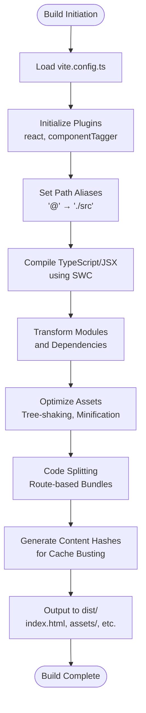

# Deployment Guide

> **Referenced Files in This Document**   
> - [vite.config.ts](vite.config.ts)
> - [package.json](package.json)
> - [README.md](README.md)
> - [index.html](index.html)
> - [App.tsx](src/App.tsx)
> - [tailwind.config.ts](tailwind.config.ts)
> - [tsconfig.app.json](tsconfig.app.json)

## Table of Contents
1. [Introduction](#introduction)
2. [Build Process Overview](#build-process-overview)
3. [Vite Configuration for Production](#vite-configuration-for-production)
4. [Deployment Options](#deployment-options)
5. [Troubleshooting Common Issues](#troubleshooting-common-issues)
6. [Performance Optimization Strategies](#performance-optimization-strategies)
7. [Conclusion](#conclusion)

## Introduction
This deployment guide provides comprehensive instructions for building and publishing the sc-dof application, a React-based single-page application (SPA) developed with Vite, TypeScript, and Tailwind CSS. The guide covers the complete build process, configuration settings, deployment platforms including Lovable, and solutions to common deployment challenges. The application is designed as a multilingual event website for the Syrian community, featuring RTL support and responsive design.

## Build Process Overview
The sc-dof application uses Vite as its build tool and development server. The build process is initiated through npm scripts defined in the package.json file. Running `npm run build` executes the Vite build command, which compiles and optimizes the TypeScript and React codebase into static assets suitable for production deployment.

The build process leverages Vite's native ES module-based build system, which provides fast bundling and code transformation. During the build, Vite processes all source files in the src directory, applies optimizations such as tree-shaking to eliminate unused code, and generates optimized JavaScript bundles. The output is placed in the dist directory by default, containing HTML, CSS, JavaScript, and asset files ready for deployment.

A development build variant is also available through the `npm run build:dev` script, which creates a non-optimized build with source maps for debugging purposes. This can be useful for testing deployment configurations without the minification and optimization applied in production builds.

**Section sources**
- [package.json](package.json#L7-L11)
- [vite.config.ts](vite.config.ts)

## Vite Configuration for Production
The Vite configuration in vite.config.ts defines key settings that affect the build output and development experience. The configuration imports necessary plugins including the React SWC plugin for fast TypeScript and JSX compilation, and path utilities for module resolution.

A notable feature of the configuration is the alias setup that maps the "@" symbol to the src directory, enabling cleaner import statements throughout the codebase (e.g., "@/components/ui/button" instead of relative paths). This alias is also reflected in the tsconfig.app.json file, ensuring consistent behavior between Vite and TypeScript.

The server configuration specifies port 8080 and enables IPv6 binding, which can be important for certain hosting environments. The conditional inclusion of the Lovable component tagger plugin in development mode suggests integration with the Lovable platform's development features while keeping production builds lean.

The build output structure follows Vite's default conventions, with hashed filenames for cache busting, code splitting for route-based lazy loading, and optimized asset handling. The configuration does not explicitly define a base path, so assets are referenced with relative paths, making the build portable across different deployment environments.

**Diagram sources**
- [vite.config.ts](vite.config.ts#L1-L18)
- [tsconfig.app.json](tsconfig.app.json#L24-L27)

**Section sources**
- [vite.config.ts](vite.config.ts)
- [tsconfig.app.json](tsconfig.app.json)

## Deployment Options
The sc-dof application can be deployed through multiple channels, with the Lovable platform providing the primary deployment method. According to the README documentation, deployment to Lovable is accomplished through the platform's interface by navigating to Share → Publish within the Lovable project dashboard. This streamlined process automatically builds and deploys the application using the configuration defined in the repository.

For custom domain configuration, the Lovable platform supports domain connection through the Project > Settings > Domains interface. This allows the application to be served from a custom domain while maintaining the benefits of the Lovable hosting infrastructure. The documentation references Lovable's custom domain setup guide for additional details on DNS configuration and SSL certificate provisioning.

Alternative deployment options include any static hosting service that supports single-page applications, such as Vercel, Netlify, GitHub Pages, or AWS S3. The build output in the dist directory consists of static files that can be served by any web server. When deploying to third-party platforms, developers would typically connect their GitHub repository to the hosting service and configure the build command as `npm run build` with the output directory set to `dist`.

The application's routing is managed by React Router DOM, which uses client-side routing. This requires server configuration to handle the SPA fallback pattern, where all routes serve the index.html file to allow client-side routing to function properly. Most modern hosting platforms provide built-in support for this pattern.

**Section sources**
- [README.md](README.md#L63-L74)
- [App.tsx](src/App.tsx#L5)
- [index.html](index.html)

## Troubleshooting Common Issues
### Routing in SPA Environments
The most common deployment issue with the sc-dof application relates to client-side routing in SPA environments. Since the application uses React Router with client-side routing, direct navigation to routes other than the root path (e.g., /about) will result in 404 errors if the server is not configured to serve index.html for all routes.

To resolve this, ensure your hosting server is configured with a fallback or rewrite rule that serves index.html for all routes that don't match static assets. For example, in a Netlify environment, this would require a _redirects file with the rule `/* /index.html 200`. For Vercel, a rewrite rule in vercel.json would be needed. The Lovable platform handles this configuration automatically.

### Asset Loading Problems
Asset loading issues can occur due to incorrect base path configuration. Since the Vite configuration does not specify a base path, the application expects to be served from the root of the domain. If deploying to a subdirectory, you would need to add `base: '/subdirectory/'` to the Vite configuration and potentially update the index.html links accordingly.

Another common issue is with the public directory assets. Files in the public directory (manifest.json, robots.txt, site.webmanifest) are served as static assets and should be accessible at the root path. Verify that these files are being copied to the dist directory during the build process and are accessible at their expected URLs.

### Caching Issues
The build process generates hashed filenames for JavaScript and CSS assets to enable long-term caching. However, the index.html file is not hashed, which can lead to caching issues where users continue to receive an old version of the HTML that references outdated asset hashes. To mitigate this, ensure your hosting provider is not aggressively caching the index.html file, or implement cache-busting strategies such as query parameters in deployment configurations.

### RTL and Font Loading
The application supports RTL layout for Arabic content and uses custom fonts (Bahij Koufiya and Roboto). Ensure that font files are properly hosted and accessible, as missing fonts can affect the visual presentation. The font loading is currently implemented via Google Fonts in the index.html file, which should remain accessible from all deployment environments.

**Section sources**
- [App.tsx](src/App.tsx#L22-L27)
- [index.html](index.html#L14-L17)
- [vite.config.ts](vite.config.ts)
- [NotFound.tsx](src/pages/NotFound.tsx)

## Performance Optimization Strategies
### Code Splitting
The application architecture naturally supports code splitting through React Router's route-based code splitting. Each route could be configured to load its components asynchronously, reducing the initial bundle size. While the current implementation loads the Index component eagerly, future enhancements could implement dynamic imports for route components to improve initial load performance.

Vite automatically applies code splitting to dependencies and can be configured to create additional split points. The build output already includes multiple chunks, with vendor libraries separated from application code, which allows for better caching strategies.

### Asset Optimization
The build process automatically optimizes assets through minification of JavaScript and CSS. For further optimization, consider implementing image optimization in the build process. Currently, images are referenced directly in the codebase, but could be processed through Vite plugins to generate responsive images or convert to modern formats like WebP.

The application uses Tailwind CSS with a comprehensive configuration that includes custom Syrian flag colors and typography settings. The Tailwind configuration is optimized through the content array that specifies which files to scan for class usage, enabling efficient tree-shaking of unused CSS classes.

### Preloading and Prefetching
To improve perceived performance, consider adding resource hints to the index.html file. This could include preconnect directives for external resources like Google Fonts, or prefetch links for critical routes. The current implementation already includes preconnect for fonts.googleapis.com, which helps reduce connection latency.

### Bundle Analysis
For ongoing optimization, use Vite's build analysis capabilities to identify large dependencies and optimize bundle size. This can be accomplished by adding the `--report` flag to the build command, which generates a visual bundle report. Regular analysis can help identify opportunities to replace large dependencies with lighter alternatives or implement lazy loading for non-critical features.

### Caching Strategy
Implement a comprehensive caching strategy by configuring appropriate cache headers for different asset types. Static assets with content hashes can be cached for long periods (1 year), while the index.html file should have a shorter cache duration or no caching to ensure users receive updates promptly.

**Section sources**
- [vite.config.ts](vite.config.ts)
- [tailwind.config.ts](tailwind.config.ts)
- [index.html](index.html)
- [package.json](package.json)

## Conclusion
The sc-dof application is designed for straightforward deployment using modern frontend tooling. The Vite-based build process generates optimized static assets in the dist directory when running `npm run build`, making the application suitable for deployment on any static hosting platform. The primary deployment method through Lovable provides a seamless publish experience with automatic handling of routing and domain configuration.

Key considerations for successful deployment include proper SPA routing configuration, asset path management, and performance optimization through the built-in code splitting and asset optimization features. The application's multilingual and RTL support is fully functional in the build output, with all necessary assets and configurations preserved.

For optimal results, follow the recommended deployment workflow: test the build locally with `npm run preview`, deploy to Lovable using the publish feature for production, and configure any custom domains through the platform's settings interface. Regularly monitor performance and use the optimization strategies outlined in this guide to maintain a fast, responsive user experience.