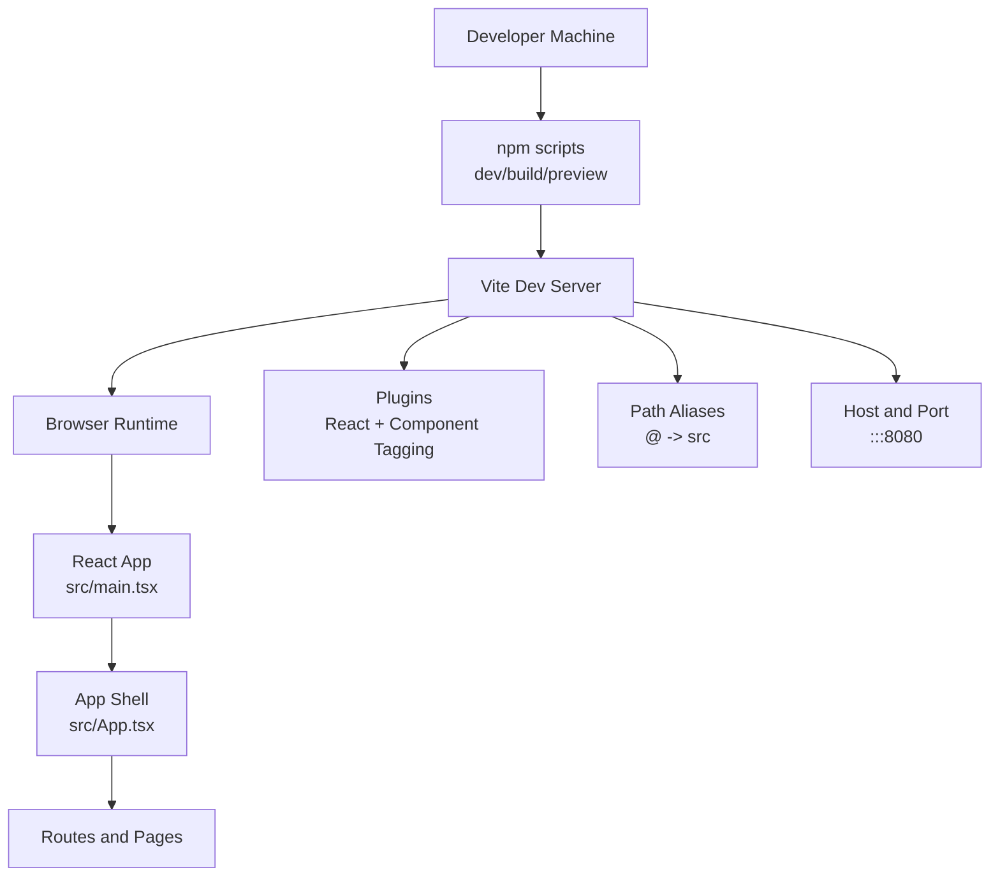

# Development Setup

<cite>
**Referenced Files in This Document**
- [README.md](file://README.md)
- [package.json](file://package.json)
- [vite.config.ts](file://vite.config.ts)
- [index.html](file://index.html)
- [src/main.tsx](file://src/main.tsx)
- [src/App.tsx](file://src/App.tsx)
- [tsconfig.json](file://tsconfig.json)
- [tailwind.config.ts](file://tailwind.config.ts)
- [eslint.config.js](file://eslint.config.js)
- [components.json](file://components.json)
</cite>

## Table of Contents
1. [Introduction](#introduction)
2. [Prerequisites](#prerequisites)
3. [Installation Steps](#installation-steps)
4. [Vite Configuration Deep Dive](#vite-configuration-deep-dive)
5. [Development Workflow](#development-workflow)
6. [Troubleshooting Common Issues](#troubleshooting-common-issues)
7. [Optimization Tips](#optimization-tips)
8. [Architecture Overview](#architecture-overview)
9. [Conclusion](#conclusion)

## Introduction
This guide helps contributors quickly set up and run the sc-dof codebase locally. It covers prerequisites, installation, development server startup, Vite configuration, and practical tips for a smooth development experience. The project is a React application with TypeScript, Vite, Tailwind CSS, and shadcn/ui components.

## Prerequisites
- Node.js and npm: The project requires Node.js and npm. The repository documentation recommends installing Node.js via nvm. Ensure you have a compatible Node.js version installed using nvm before proceeding.
- Git: To clone the repository and manage changes.

Key references:
- [README.md](file://README.md#L21-L23)

**Section sources**
- [README.md](file://README.md#L21-L23)

## Installation Steps
Follow these steps to prepare your local environment:

1. Clone the repository using the project’s Git URL.
2. Navigate to the project directory.
3. Install dependencies using the project’s script.
4. Start the development server with auto-reload.

These steps are documented in the repository’s README.

Key references:
- [README.md](file://README.md#L23-L37)
- [package.json](file://package.json#L6-L12)

**Section sources**
- [README.md](file://README.md#L23-L37)
- [package.json](file://package.json#L6-L12)

## Vite Configuration Deep Dive
The development server and build pipeline are configured via Vite. The configuration defines the dev server host/port, React plugin, component tagging in development, and path aliases.

Highlights:
- Dev server host and port: The server binds to a host suitable for network access and runs on a specific port.
- Plugins: React plugin is enabled. In development mode, a component tagger plugin is included.
- Path alias: An alias is defined for the src directory to simplify imports.

Key references:
- [vite.config.ts](file://vite.config.ts#L1-L19)
- [tsconfig.json](file://tsconfig.json#L1-L17)
- [components.json](file://components.json#L1-L21)

**Section sources**
- [vite.config.ts](file://vite.config.ts#L1-L19)
- [tsconfig.json](file://tsconfig.json#L1-L17)
- [components.json](file://components.json#L1-L21)

## Development Workflow
- Start the development server: Use the script defined in the project to launch Vite in development mode with hot module replacement.
- Entry point: The HTML file mounts the React root to a div with a specific ID and loads the TypeScript entry module.
- Application shell: The React app initializes providers for routing, internationalization, tooltips, and React Query, and renders the main routes.

Key references:
- [package.json](file://package.json#L6-L12)
- [index.html](file://index.html#L54-L59)
- [src/main.tsx](file://src/main.tsx#L1-L6)
- [src/App.tsx](file://src/App.tsx#L1-L43)

**Section sources**
- [package.json](file://package.json#L6-L12)
- [index.html](file://index.html#L54-L59)
- [src/main.tsx](file://src/main.tsx#L1-L6)
- [src/App.tsx](file://src/App.tsx#L1-L43)

## Troubleshooting Common Issues
- Port conflicts: The dev server listens on a specific port. If the port is in use, change the port in the Vite configuration or stop the conflicting process.
- Missing dependencies: Re-run the dependency installation script to ensure all packages are present.
- Build errors: Verify TypeScript configuration and Tailwind content paths align with your file structure.
- ESLint warnings: Address lint rules as configured in the project’s ESLint configuration.

Key references:
- [vite.config.ts](file://vite.config.ts#L8-L11)
- [package.json](file://package.json#L6-L12)
- [eslint.config.js](file://eslint.config.js#L1-L27)

**Section sources**
- [vite.config.ts](file://vite.config.ts#L8-L11)
- [package.json](file://package.json#L6-L12)
- [eslint.config.js](file://eslint.config.js#L1-L27)

## Optimization Tips
- Environment variables: Define environment variables for development and production as needed. Keep secrets out of version control and use environment-specific files if supported by your workflow.
- Effective debugging: Use browser developer tools to inspect React components, network requests, and console logs. Enable React DevTools for better component inspection.
- Fast reload: Leverage Vite’s hot module replacement to iterate quickly without full page reloads.
- Formatting and linting: Run the linter regularly to keep code quality consistent.

Key references:
- [package.json](file://package.json#L6-L12)
- [eslint.config.js](file://eslint.config.js#L1-L27)

**Section sources**
- [package.json](file://package.json#L6-L12)
- [eslint.config.js](file://eslint.config.js#L1-L27)

## Architecture Overview
The development stack integrates Vite, React, TypeScript, Tailwind CSS, and shadcn/ui components. The configuration establishes a predictable dev server, path aliases, and plugin chain for React and component tagging.

**Diagram sources**
- [vite.config.ts](file://vite.config.ts#L1-L19)
- [src/main.tsx](file://src/main.tsx#L1-L6)
- [src/App.tsx](file://src/App.tsx#L1-L43)
- [package.json](file://package.json#L6-L12)

## Conclusion
With Node.js installed via nvm, dependencies installed, and the Vite dev server running, contributors can efficiently develop and iterate on the sc-dof project. Use the provided configuration and scripts, follow the troubleshooting tips, and apply the optimization suggestions to streamline your workflow.