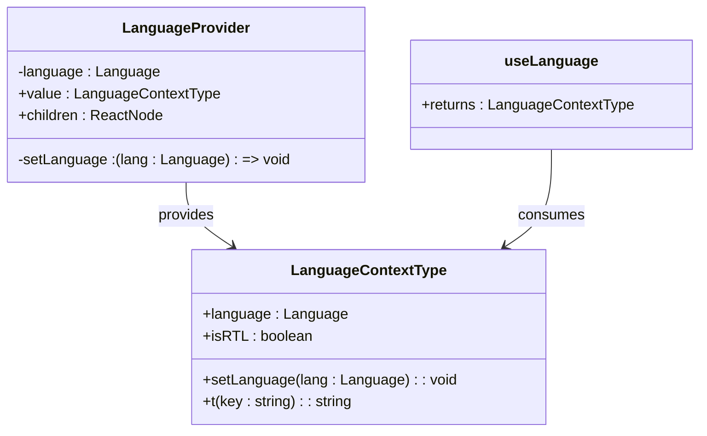
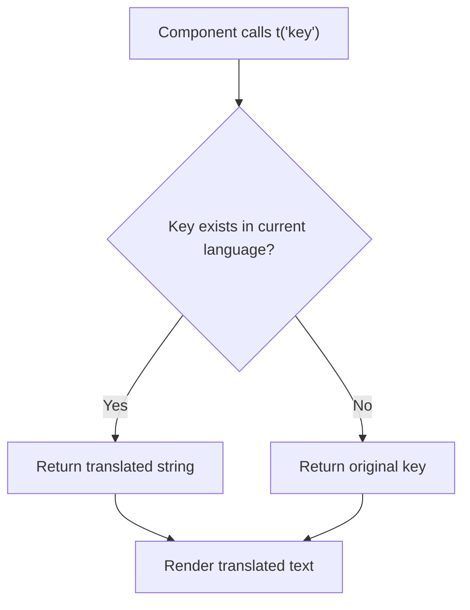
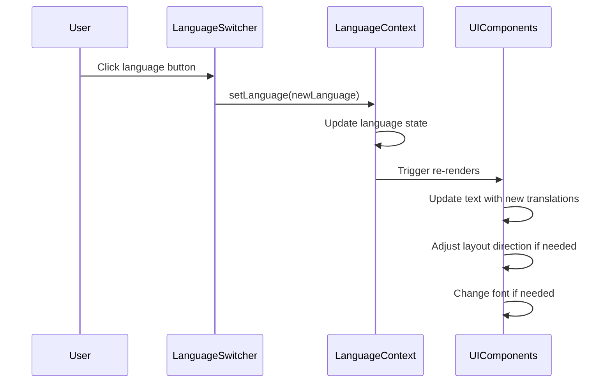
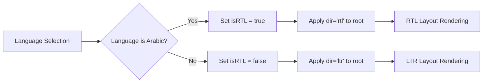
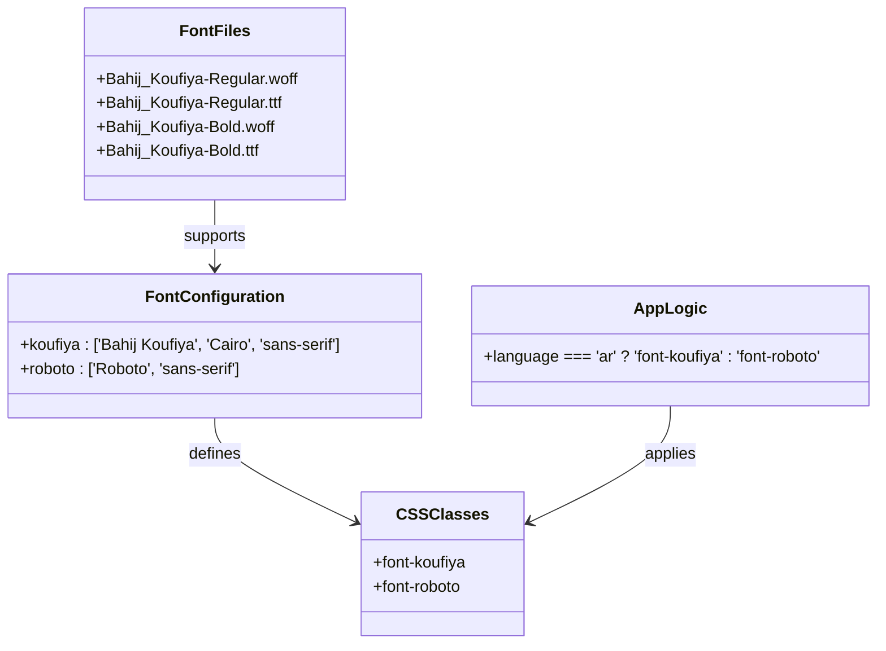

# Internationalization System

> **Referenced Files in This Document**   
> - [LanguageContext.tsx](src/contexts/LanguageContext.tsx)
> - [App.tsx](src/App.tsx)
> - [LanguageSwitcher.tsx](src/components/LanguageSwitcher.tsx)
> - [Navbar.tsx](src/components/Navbar.tsx)
> - [HeroSection.tsx](src/components/HeroSection.tsx)
> - [index.css](src/index.css)
> - [tailwind.config.ts](tailwind.config.ts)

## Table of Contents
1. [Introduction](#introduction)
2. [Language Context Implementation](#language-context-implementation)
3. [Translation System](#translation-system)
4. [Language Switcher Component](#language-switcher-component)
5. [RTL Support and Layout Direction](#rtl-support-and-layout-direction)
6. [Font Management System](#font-management-system)
7. [Component Integration Examples](#component-integration-examples)
8. [Common i18n Issues and Troubleshooting](#common-i18n-issues-and-troubleshooting)
9. [Conclusion](#conclusion)

## Introduction
The sc-dof platform implements a comprehensive internationalization system supporting Arabic (ar), English (en), and Turkish (tr) languages. This system enables users to seamlessly switch between languages while maintaining proper typography, layout direction, and visual consistency. The architecture is built around React's Context API, providing a centralized language state management solution that propagates changes throughout the application. The system handles not only text translation but also critical aspects like right-to-left (RTL) layout for Arabic and appropriate font selection for each language.

## Language Context Implementation

The internationalization system is centered around the `LanguageContext` implemented in `LanguageContext.tsx`. This context provides a unified interface for language management across all components. The context is defined with the `LanguageContextType` interface, which specifies the available properties and methods:

- `language`: Current language code ('ar', 'en', or 'tr')
- `setLanguage`: Function to update the language state
- `t`: Translation function for retrieving localized strings
- `isRTL`: Boolean flag indicating right-to-left layout requirement

The context is initialized with Arabic ('ar') as the default language. The `LanguageProvider` component wraps the application, making the context available to all descendants. The `useLanguage` hook provides a convenient way for components to access the context values. When the language is updated via `setLanguage`, React's state management triggers re-renders across all components that consume the context, ensuring immediate propagation of language changes.



**Diagram sources**
- [LanguageContext.tsx](src/contexts/LanguageContext.tsx#L5-L10)

**Section sources**
- [LanguageContext.tsx](src/contexts/LanguageContext.tsx#L1-L292)

## Translation System

The translation system is implemented through a comprehensive dictionary of localized strings organized by functional areas such as navigation, hero section, details, agenda, and others. The translations are structured as a nested object with language codes as top-level keys and dot-notation keys for specific strings. This hierarchical organization allows for logical grouping of related translations and easy maintenance.

The `t` function serves as the primary interface for components to retrieve translated strings. It accepts a key parameter and returns the corresponding translation based on the current language. The function includes a fallback mechanism that returns the key itself if a translation is missing, preventing blank text in the UI. This fail-safe approach ensures the application remains functional even when new translation keys are added without immediate translations.

Translation keys follow a consistent naming convention using dot-notation to indicate the component and specific string (e.g., 'nav.home', 'hero.title', 'agenda.1.title'). This systematic approach makes it easy to locate and manage translations. The system currently supports over 80 translation keys across the three languages, covering all major UI elements and content sections.



**Diagram sources**
- [LanguageContext.tsx](src/contexts/LanguageContext.tsx#L12-L264)

**Section sources**
- [LanguageContext.tsx](src/contexts/LanguageContext.tsx#L272-L274)

## Language Switcher Component

The `LanguageSwitcher` component provides a user interface for changing the application language. It supports two presentation modes through the `variant` prop: 'floating' (default) and 'navbar'. The floating variant appears as a fixed button in the top-left corner with a semi-transparent background, while the navbar variant integrates seamlessly into the navigation bar with a transparent background.

The component renders three language options: Arabic, English, and Turkish. Each option is represented by a button with visual indicators:
- Arabic: Custom Syrian flag image
- English: UK flag emoji (🇬🇧)
- Turkish: Turkey flag emoji (🇹🇷)

Visual feedback is provided through styling changes when a language is selected. The active language button displays a green background with white text, while inactive options show a subtle hover effect. The component consumes the `useLanguage` hook to access the current language state and the `setLanguage` function, ensuring immediate visual feedback when users switch languages.



**Diagram sources**
- [LanguageSwitcher.tsx](src/components/LanguageSwitcher.tsx#L1-L44)
- [LanguageContext.tsx](src/contexts/LanguageContext.tsx#L269-L283)

**Section sources**
- [LanguageSwitcher.tsx](src/components/LanguageSwitcher.tsx#L1-L44)

## RTL Support and Layout Direction

The system implements robust RTL (right-to-left) support for Arabic language rendering. The `isRTL` flag is derived from the current language state in the `LanguageContext`, returning `true` when the language is set to 'ar' (Arabic) and `false` for English and Turkish. This boolean value is consumed throughout the application to dynamically adjust layout direction.

In the `App.tsx` file, the root component uses the `isRTL` flag to set the `dir` attribute on the main container element. This fundamental HTML attribute controls the base direction of text and layout for all child elements, ensuring proper text alignment, component positioning, and navigation flow. When Arabic is selected, the entire application flips to RTL mode, with text aligning to the right and interactive elements repositioned accordingly.

The system handles mixed-direction content gracefully, maintaining visual consistency across language switches. Components like `Navbar` and `LanguageSwitcher` specifically consume the `isRTL` flag to adjust their internal layout, ensuring optimal user experience in both LTR and RTL modes.



**Diagram sources**
- [App.tsx](src/App.tsx#L13-L20)
- [LanguageContext.tsx](src/contexts/LanguageContext.tsx#L276)

**Section sources**
- [App.tsx](src/App.tsx#L13-L20)

## Font Management System

The platform implements a sophisticated font management system that automatically switches between different typefaces based on the selected language. This ensures optimal readability and cultural appropriateness for each language:

- Arabic: Bahij Koufiya font
- English and Turkish: Roboto font

The font switching logic is implemented in the `App.tsx` file, where a conditional expression determines the appropriate CSS class based on the current language. When Arabic is selected, the `font-koufiya` class is applied; for English and Turkish, the `font-roboto` class is used. This class is then applied to the root container element, cascading the font choice throughout the entire application.

The font families are defined in the `tailwind.config.ts` file, making them available as utility classes. The `index.css` file includes the `@font-face` declarations for Bahij Koufiya, specifying both regular and bold weights with WOFF and TTF formats for broad browser compatibility. The system uses `font-display: swap` to ensure text remains visible during font loading, preventing flash of invisible text (FOIT).

This font management approach ensures that Arabic text is rendered with a typeface designed specifically for Arabic script, providing proper glyph shaping and ligature support, while Latin script languages use the clean, modern Roboto font.



**Diagram sources**
- [App.tsx](src/App.tsx#L16-L17)
- [tailwind.config.ts](tailwind.config.ts#L16-L19)
- [index.css](src/index.css#L1-L18)

**Section sources**
- [App.tsx](src/App.tsx#L16-L17)

## Component Integration Examples

Components throughout the application consume the internationalization system in a consistent manner. The `Navbar` component demonstrates this integration pattern by using the `useLanguage` hook to access both the translation function (`t`) and the `isRTL` flag. Navigation links are translated using keys like 'nav.home', 'nav.why', and 'nav.goals', ensuring all text content adapts to the selected language.

The `HeroSection` component showcases translation usage for prominent content, with keys like 'hero.title', 'hero.subtitle', and 'hero.discoverMore'. These translations are applied to headings and call-to-action elements, making the core message accessible in all supported languages. The component also benefits from the automatic font and layout changes driven by the language context.

Multiple components, including `GoalsSection` and `WhySection`, use the translation system to render content-specific text. The pattern is consistent: import the `useLanguage` hook, call the `t` function with appropriate keys, and render the returned string. This approach ensures that all text content is localized while maintaining the component's structural integrity.

```mermaid
flowchart TD
A[Import useLanguage] --> B[Call useLanguage hook]
B --> C[Access t function and language state]
C --> D[Use t('key') for text content]
D --> E[Render translated text]
F[Language Change] --> G[Context update]
G --> H[Component re-render]
H --> I[New translations applied]
```

**Section sources**
- [Navbar.tsx](src/components/Navbar.tsx#L7-L28)
- [HeroSection.tsx](src/components/HeroSection.tsx#L7-L89)
- [GoalsSection.tsx](src/components/GoalsSection.tsx#L7-L47)

## Common i18n Issues and Troubleshooting

When implementing internationalization, several common issues may arise. For translation loading problems, ensure that new translation keys are added to all language objects in `LanguageContext.tsx`. Missing keys will fall back to displaying the key itself, which should be addressed by completing the translations.

RTL layout issues can occur when components have hardcoded positioning or when third-party libraries don't support RTL. Test the application thoroughly in Arabic mode to identify elements that don't align properly. Use the `dir` attribute and CSS logical properties to ensure consistent RTL behavior.

Font display issues may appear if the font files are not properly loaded or if there are network problems. The system uses `font-display: swap` to mitigate this, but verify that the font files exist in the public/fonts directory and are correctly referenced in `index.css`.

When adding new languages, extend the `Language` type union and add a new entry to the translations object. Ensure that RTL behavior is correctly configured for right-to-left languages by updating the `isRTL` calculation in `LanguageContext.tsx`.

For performance optimization, consider memoizing frequently used translation lookups and ensuring that components only re-render when necessary. The current context implementation may cause unnecessary re-renders; consider implementing memoization or using more granular state management for large applications.

## Conclusion
The sc-dof platform's internationalization system provides a robust foundation for multilingual support, enabling users to seamlessly switch between Arabic, English, and Turkish. The system effectively manages language state, text translation, layout direction, and typography through a well-structured context-based architecture. By leveraging React's Context API and Tailwind CSS, the implementation ensures consistent behavior across all components while maintaining performance and usability. The modular design allows for easy extension to support additional languages and locales in the future.