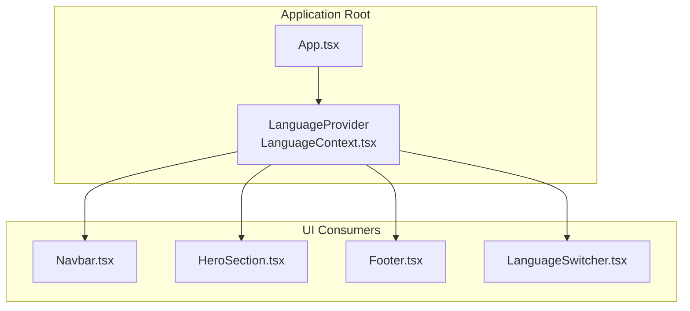
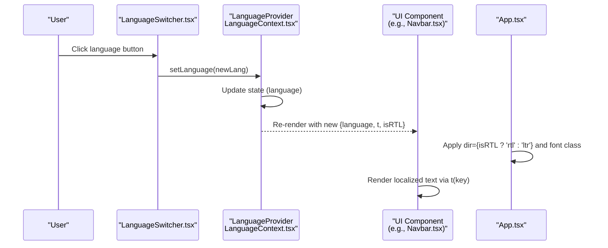
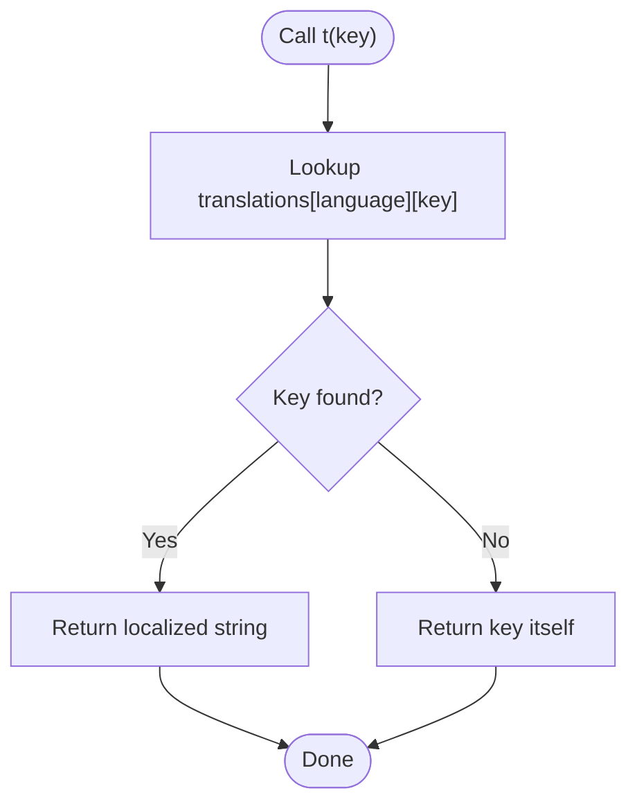
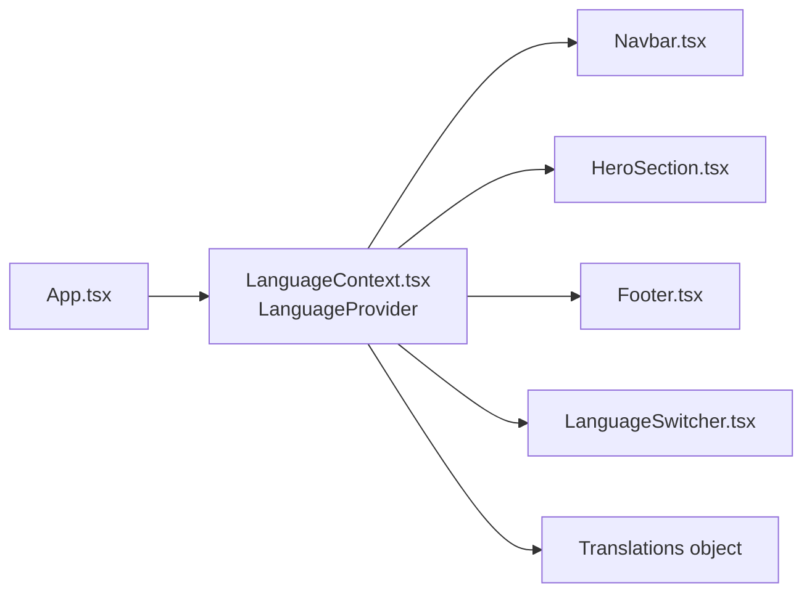

# Language Context Implementation

<cite>
**Referenced Files in This Document**
- [LanguageContext.tsx](file://src/contexts/LanguageContext.tsx)
- [LanguageSwitcher.tsx](file://src/components/LanguageSwitcher.tsx)
- [App.tsx](file://src/App.tsx)
- [Navbar.tsx](file://src/components/Navbar.tsx)
- [HeroSection.tsx](file://src/components/HeroSection.tsx)
- [Footer.tsx](file://src/components/Footer.tsx)
</cite>

## Table of Contents
1. [Introduction](#introduction)
2. [Project Structure](#project-structure)
3. [Core Components](#core-components)
4. [Architecture Overview](#architecture-overview)
5. [Detailed Component Analysis](#detailed-component-analysis)
6. [Dependency Analysis](#dependency-analysis)
7. [Performance Considerations](#performance-considerations)
8. [Troubleshooting Guide](#troubleshooting-guide)
9. [Conclusion](#conclusion)

## Introduction
This document explains the LanguageContext implementation for the sc-dof platform’s multilingual state management. It covers how the context is created and consumed, how language state is initialized and updated, how the translation function resolves localized strings, and how right-to-left (RTL) layout is supported. It also provides examples of component usage via the useLanguage hook and offers guidance on common pitfalls and performance best practices.

## Project Structure
The language system is centered around a React context provider and a small set of components that consume it. The provider wraps the application, and consumers use a custom hook to access language state, translation function, and RTL flag.

**Diagram sources**
- [App.tsx](file://src/App.tsx#L12-L41)
- [LanguageContext.tsx](file://src/contexts/LanguageContext.tsx#L269-L292)
- [Navbar.tsx](file://src/components/Navbar.tsx#L1-L123)
- [HeroSection.tsx](file://src/components/HeroSection.tsx#L1-L99)
- [Footer.tsx](file://src/components/Footer.tsx#L1-L117)
- [LanguageSwitcher.tsx](file://src/components/LanguageSwitcher.tsx#L1-L44)

**Section sources**
- [App.tsx](file://src/App.tsx#L12-L41)
- [LanguageContext.tsx](file://src/contexts/LanguageContext.tsx#L269-L292)

## Core Components
- LanguageContext provider and hook:
  - Defines the Language union and LanguageContextType interface.
  - Initializes language state to Arabic.
  - Exposes setLanguage to update language.
  - Provides t(key) for localized string retrieval with fallback to the key itself.
  - Computes isRTL based on current language.
  - Exposes useLanguage hook with runtime guard against misuse outside the provider.

- LanguageSwitcher component:
  - Presents language options with flags and labels.
  - Calls setLanguage when a language is selected.

- App root:
  - Wraps the app with LanguageProvider.
  - Uses isRTL and language to set document direction and font class.

- UI components consuming translations:
  - Navbar, HeroSection, and Footer demonstrate t usage and conditional RTL behavior.

**Section sources**
- [LanguageContext.tsx](file://src/contexts/LanguageContext.tsx#L1-L292)
- [LanguageSwitcher.tsx](file://src/components/LanguageSwitcher.tsx#L1-L44)
- [App.tsx](file://src/App.tsx#L12-L41)
- [Navbar.tsx](file://src/components/Navbar.tsx#L1-L123)
- [HeroSection.tsx](file://src/components/HeroSection.tsx#L1-L99)
- [Footer.tsx](file://src/components/Footer.tsx#L1-L117)

## Architecture Overview
The language system follows a classic React context pattern: a provider holds state and exposes it to consumers. Consumers subscribe via a custom hook and receive language, translation function, and RTL flag.

**Diagram sources**
- [LanguageSwitcher.tsx](file://src/components/LanguageSwitcher.tsx#L14-L41)
- [LanguageContext.tsx](file://src/contexts/LanguageContext.tsx#L269-L292)
- [Navbar.tsx](file://src/components/Navbar.tsx#L19-L37)
- [App.tsx](file://src/App.tsx#L12-L31)

## Detailed Component Analysis

### LanguageContext Provider and Hook
- Context definition and type:
  - Language union includes Arabic, English, and Turkish.
  - LanguageContextType includes language, setLanguage, t, and isRTL.

- Initial state:
  - language is initialized to Arabic.

- Translation function:
  - t(key) returns the localized string for the current language.
  - Fallback behavior: if a key is missing, the function returns the key itself.

- RTL computation:
  - isRTL is true when language equals Arabic.

- Provider value:
  - The provider supplies language, setLanguage, t, and isRTL to consumers.

- Hook safety:
  - useLanguage throws if used outside the provider, preventing runtime errors.

**Diagram sources**
- [LanguageContext.tsx](file://src/contexts/LanguageContext.tsx#L12-L268)
- [LanguageContext.tsx](file://src/contexts/LanguageContext.tsx#L269-L292)

**Section sources**
- [LanguageContext.tsx](file://src/contexts/LanguageContext.tsx#L1-L292)

### LanguageSwitcher Component
- Purpose:
  - Allows users to switch languages among Arabic, English, and Turkish.
  - Provides visual feedback for the active language.

- Behavior:
  - Uses useLanguage to read current language and setLanguage to change it.
  - Renders buttons with flags and labels; clicking a button invokes setLanguage.

**Section sources**
- [LanguageSwitcher.tsx](file://src/components/LanguageSwitcher.tsx#L1-L44)
- [LanguageContext.tsx](file://src/contexts/LanguageContext.tsx#L269-L292)

### App Root Integration
- Provider wrapping:
  - App.tsx wraps the entire app with LanguageProvider.

- Direction and fonts:
  - Applies dir attribute based on isRTL.
  - Sets font class based on language to use appropriate typography.

**Section sources**
- [App.tsx](file://src/App.tsx#L12-L41)
- [LanguageContext.tsx](file://src/contexts/LanguageContext.tsx#L269-L292)

### UI Components Using Translations
- Navbar:
  - Uses t for navigation labels and hero title.
  - Applies dir={isRTL ? 'rtl' : 'ltr'} to adapt layout direction.

- HeroSection:
  - Uses t for hero title, subtitle, tagline, date, day, and discover-more text.

- Footer:
  - Uses t for rights text and integrates language-aware subtitle and follow-us text.

**Section sources**
- [Navbar.tsx](file://src/components/Navbar.tsx#L1-L123)
- [HeroSection.tsx](file://src/components/HeroSection.tsx#L1-L99)
- [Footer.tsx](file://src/components/Footer.tsx#L1-L117)
- [LanguageContext.tsx](file://src/contexts/LanguageContext.tsx#L269-L292)

## Dependency Analysis
- Provider-to-consumer dependency:
  - All UI components depend on LanguageContext via useLanguage.
  - LanguageSwitcher depends on useLanguage to update language.

- Root-to-provider dependency:
  - App.tsx depends on LanguageProvider to wrap the app.

- Internal dependency within provider:
  - t function depends on the translations object and current language.
  - isRTL depends on current language.

**Diagram sources**
- [App.tsx](file://src/App.tsx#L12-L41)
- [LanguageContext.tsx](file://src/contexts/LanguageContext.tsx#L12-L268)
- [Navbar.tsx](file://src/components/Navbar.tsx#L1-L123)
- [HeroSection.tsx](file://src/components/HeroSection.tsx#L1-L99)
- [Footer.tsx](file://src/components/Footer.tsx#L1-L117)
- [LanguageSwitcher.tsx](file://src/components/LanguageSwitcher.tsx#L1-L44)

**Section sources**
- [App.tsx](file://src/App.tsx#L12-L41)
- [LanguageContext.tsx](file://src/contexts/LanguageContext.tsx#L12-L268)

## Performance Considerations
- Minimize re-renders:
  - Keep the provider near the root to avoid unnecessary re-renders in deep subtrees.
  - Avoid passing large objects through provider props; keep state minimal (language, t, isRTL).

- Translation function stability:
  - The t function is stable across renders because it is defined inside the provider and does not depend on props or external state changes.
  - Consumers will re-render when language changes, but the function reference remains constant.

- Conditional rendering and direction:
  - Applying dir and font classes at the root reduces layout thrashing and avoids per-component direction checks.

- Large translation objects:
  - The translations object is static and does not grow with component mounts; it is safe to keep it in the provider.

[No sources needed since this section provides general guidance]

## Troubleshooting Guide
- Context not available outside the provider:
  - Symptom: Error indicating useLanguage must be used within a LanguageProvider.
  - Cause: useLanguage was called without a LanguageProvider ancestor.
  - Solution: Ensure the app is wrapped with LanguageProvider at the root level.

- Missing translations:
  - Symptom: Keys appear instead of localized strings.
  - Cause: The key is not present in the translations object for the current language.
  - Solution: Add the key to all languages or handle missing keys gracefully in components.

- Mixed-direction text issues:
  - Symptom: Text alignment anomalies in mixed-language content.
  - Cause: Improper direction handling in components.
  - Solution: Use isRTL consistently and apply dir attributes where needed.

- Font selection not updating:
  - Symptom: Typography does not switch between Arabic and non-Arabic fonts.
  - Cause: Font class not applied conditionally based on language.
  - Solution: Ensure the root applies the font class based on language.

**Section sources**
- [LanguageContext.tsx](file://src/contexts/LanguageContext.tsx#L285-L292)
- [App.tsx](file://src/App.tsx#L12-L31)

## Conclusion
The LanguageContext implementation provides a clean, efficient foundation for multilingual support in the sc-dof platform. It initializes language to Arabic, exposes a stable translation function with fallback behavior, computes RTL support, and integrates seamlessly with UI components. Following the usage patterns shown here ensures consistent localization and responsive layout across languages while avoiding common pitfalls.