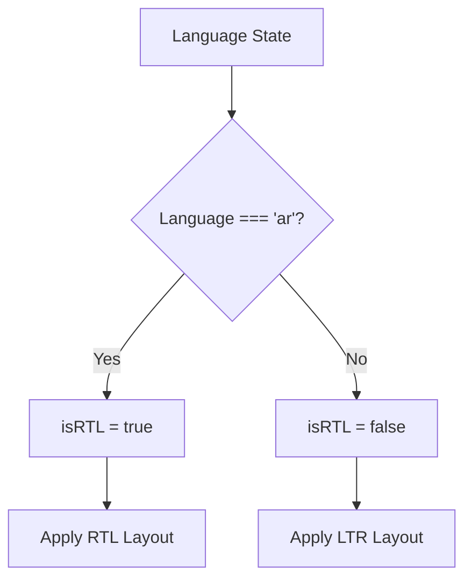
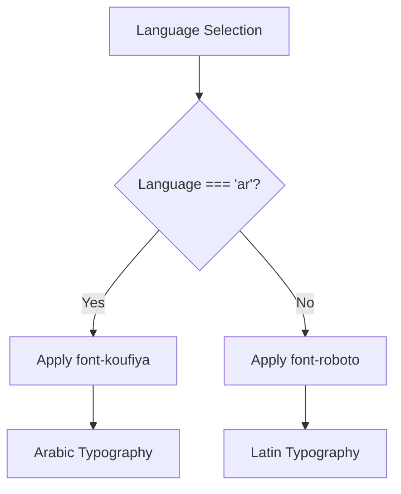
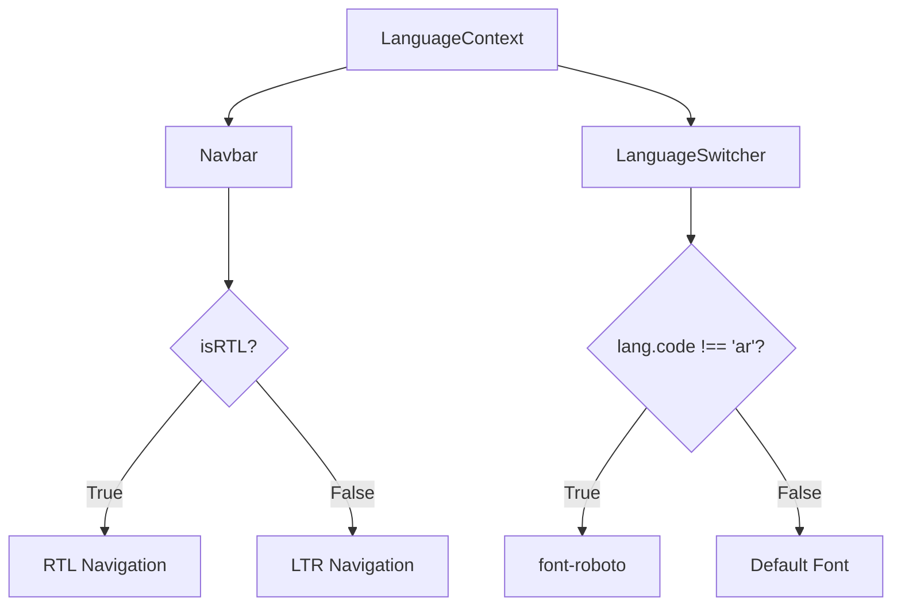

# RTL Support

<cite>
**Referenced Files in This Document**   
- [LanguageContext.tsx](file://src/contexts/LanguageContext.tsx)
- [App.tsx](file://src/App.tsx)
- [LanguageSwitcher.tsx](file://src/components/LanguageSwitcher.tsx)
- [Navbar.tsx](file://src/components/Navbar.tsx)
- [tailwind.config.ts](file://tailwind.config.ts)
- [index.css](file://src/index.css)
</cite>

## Table of Contents
1. [Introduction](#introduction)
2. [isRTL Flag Derivation](#isrtl-flag-derivation)
3. [Application-Level RTL Integration](#application-level-rtl-integration)
4. [Font Switching Mechanism](#font-switching-mechanism)
5. [Component-Level RTL Consumption](#component-level-rtl-consumption)
6. [Common RTL Layout Issues](#common-rtl-layout-issues)
7. [Best Practices for RTL Implementation](#best-practices-for-rtl-implementation)

## Introduction
The sc-dof platform implements a comprehensive RTL (Right-to-Left) support system to ensure proper rendering for Arabic language users. This documentation details how the platform dynamically adjusts layout direction, text alignment, and typography based on the current language state. The system leverages React's Context API to propagate directionality settings throughout the application, ensuring a consistent user experience across all components when the language is set to Arabic ('ar').

## isRTL Flag Derivation
The isRTL flag is derived directly from the current language state within the LanguageContext. When the language is set to 'ar' (Arabic), the isRTL flag evaluates to true, triggering RTL layout adjustments across the application.



**Diagram sources**
- [LanguageContext.tsx](file://src/contexts/LanguageContext.tsx#L276)

**Section sources**
- [LanguageContext.tsx](file://src/contexts/LanguageContext.tsx#L275-L277)

## Application-Level RTL Integration
The root App component integrates with LanguageContext to apply RTL settings at the application level. The AppContent component consumes the isRTL flag and language state, applying the appropriate direction attribute and font class to the root div element.

```mermaid
flowchart TD
A[LanguageProvider] --> B[AppContent]
B --> C{isRTL?}
C --> |True| D[dir="rtl"]
C --> |False| E[dir="ltr"]
B --> F{language === 'ar'?}
F --> |Yes| G[font-koufiya]
F --> |No| H[font-roboto]
```

**Diagram sources**
- [App.tsx](file://src/App.tsx#L12-L19)

**Section sources**
- [App.tsx](file://src/App.tsx#L12-L31)

## Font Switching Mechanism
The platform implements a font switching mechanism that applies different typography based on the selected language. The Koufiya font is used for Arabic text, while Roboto is applied for English and Turkish content.



**Diagram sources**
- [App.tsx](file://src/App.tsx#L16)
- [tailwind.config.ts](file://tailwind.config.ts#L17-L19)
- [index.css](file://src/index.css#L1-L9)

**Section sources**
- [App.tsx](file://src/App.tsx#L15-L17)
- [tailwind.config.ts](file://tailwind.config.ts#L16-L19)
- [index.css](file://src/index.css#L1-L18)

## Component-Level RTL Consumption
Individual components consume the isRTL flag to adjust their layout and behavior. The Navbar component, for example, applies the direction attribute to ensure proper navigation flow in RTL mode.



**Diagram sources**
- [Navbar.tsx](file://src/components/Navbar.tsx#L7)
- [LanguageSwitcher.tsx](file://src/components/LanguageSwitcher.tsx#L36)

**Section sources**
- [Navbar.tsx](file://src/components/Navbar.tsx#L6-L8)
- [LanguageSwitcher.tsx](file://src/components/LanguageSwitcher.tsx#L36)

## Common RTL Layout Issues
The platform addresses several common RTL layout challenges:

### Mixed-Direction Text
When displaying content with mixed Arabic and Latin script, the system ensures proper text isolation to prevent rendering issues. The use of Unicode bidirectional algorithm controls helps maintain correct text flow.

### Icon Positioning
Icons and decorative elements are repositioned appropriately in RTL mode. For example, chevron indicators in navigation menus reverse direction to match the reading flow.

### Form Element Alignment
Form elements maintain proper alignment in RTL mode, with labels and input fields positioned according to the current directionality. The form system ensures that error messages and helper text flow correctly with the surrounding content.

## Best Practices for RTL Implementation
The sc-dof platform follows several best practices for RTL implementation:

### Testing RTL Layouts
- Test all components in both LTR and RTL modes
- Verify text alignment, spacing, and overflow behavior
- Check form interactions and input field behavior
- Validate navigation flow and focus order

### Accessibility Compliance
- Ensure screen readers announce content in the correct order
- Maintain proper ARIA labels and roles
- Verify keyboard navigation follows logical RTL sequence
- Test color contrast and visual hierarchy in both modes

### Visual Consistency
- Maintain consistent spacing and padding values
- Ensure icons and imagery are culturally appropriate
- Verify font rendering quality for Arabic text
- Test responsive behavior across different screen sizes

### Performance Considerations
- Minimize re-renders when switching languages
- Optimize font loading for both Arabic and Latin scripts
- Cache translated content where appropriate
- Ensure smooth transitions between language states