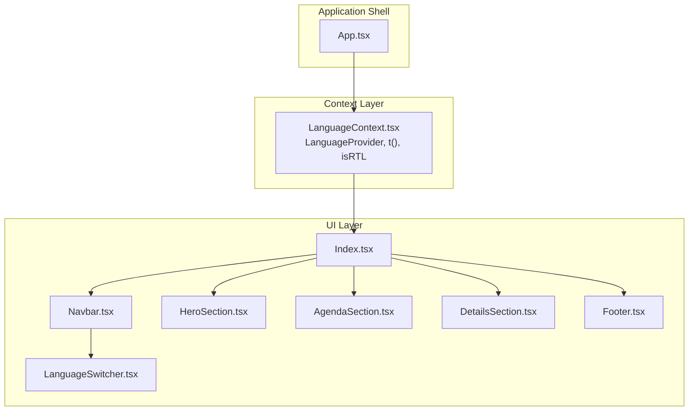
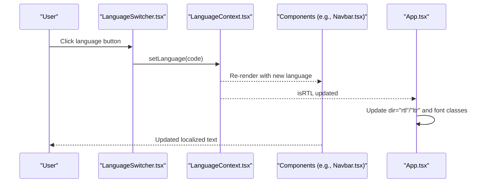
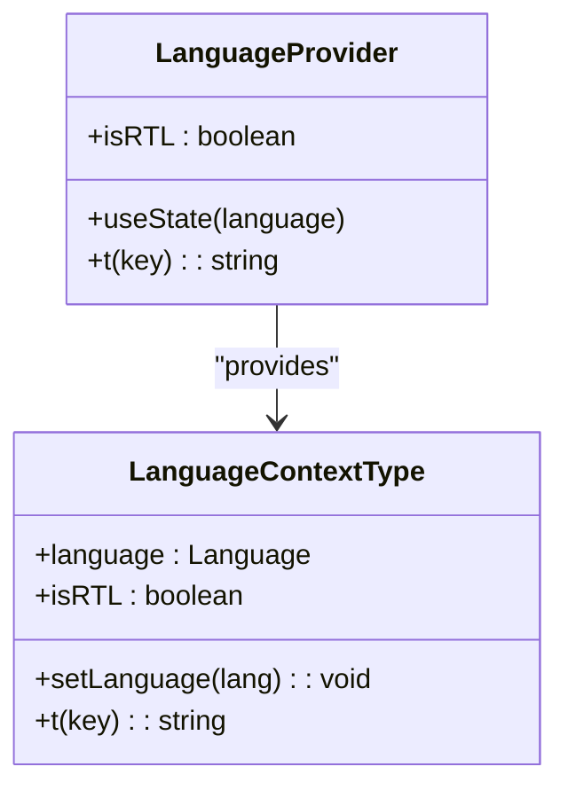
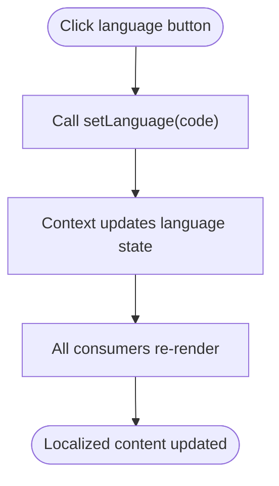
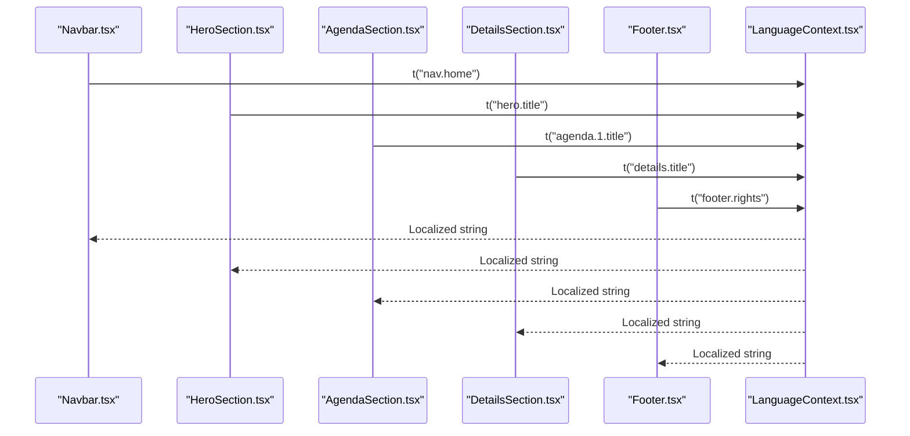
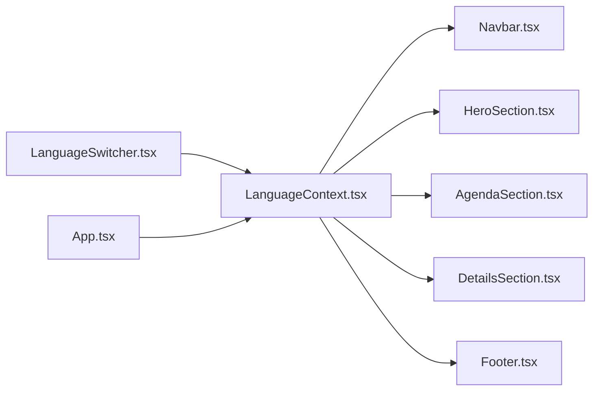

# Translation System

<cite>
**Referenced Files in This Document**
- [LanguageContext.tsx](file://src/contexts/LanguageContext.tsx)
- [LanguageSwitcher.tsx](file://src/components/LanguageSwitcher.tsx)
- [App.tsx](file://src/App.tsx)
- [Index.tsx](file://src/pages/Index.tsx)
- [Navbar.tsx](file://src/components/Navbar.tsx)
- [HeroSection.tsx](file://src/components/HeroSection.tsx)
- [AgendaSection.tsx](file://src/components/AgendaSection.tsx)
- [DetailsSection.tsx](file://src/components/DetailsSection.tsx)
- [Footer.tsx](file://src/components/Footer.tsx)
</cite>

## Table of Contents
1. [Introduction](#introduction)
2. [Project Structure](#project-structure)
3. [Core Components](#core-components)
4. [Architecture Overview](#architecture-overview)
5. [Detailed Component Analysis](#detailed-component-analysis)
6. [Dependency Analysis](#dependency-analysis)
7. [Performance Considerations](#performance-considerations)
8. [Troubleshooting Guide](#troubleshooting-guide)
9. [Conclusion](#conclusion)
10. [Appendices](#appendices)

## Introduction
This document explains the translation system used by the sc-dof platform to manage multilingual content across Arabic, English, and Turkish. It focuses on the LanguageContext implementation, the t() translation function, the dot-notation key structure, and how LanguageSwitcher drives language changes that propagate instantly to all components. It also covers best practices for organizing translation keys, maintaining consistency, and handling dynamic content safely.

## Project Structure
The translation system is centered around a React Context provider and a small set of components that consume it. The provider exposes:
- language: current language code
- setLanguage: function to change language
- t: translation function keyed by dot notation
- isRTL: boolean indicating right-to-left layout for Arabic

Key files:
- Provider and translation logic: [LanguageContext.tsx](file://src/contexts/LanguageContext.tsx)
- Language switcher UI: [LanguageSwitcher.tsx](file://src/components/LanguageSwitcher.tsx)
- Application shell applying direction and fonts: [App.tsx](file://src/App.tsx)
- Page composition: [Index.tsx](file://src/pages/Index.tsx)
- Example components consuming translations: [Navbar.tsx](file://src/components/Navbar.tsx), [HeroSection.tsx](file://src/components/HeroSection.tsx), [AgendaSection.tsx](file://src/components/AgendaSection.tsx), [DetailsSection.tsx](file://src/components/DetailsSection.tsx), [Footer.tsx](file://src/components/Footer.tsx)

**Diagram sources**
- [App.tsx](file://src/App.tsx#L1-L43)
- [LanguageContext.tsx](file://src/contexts/LanguageContext.tsx#L1-L292)
- [Index.tsx](file://src/pages/Index.tsx#L1-L32)
- [Navbar.tsx](file://src/components/Navbar.tsx#L1-L123)
- [HeroSection.tsx](file://src/components/HeroSection.tsx#L1-L99)
- [AgendaSection.tsx](file://src/components/AgendaSection.tsx#L1-L64)
- [DetailsSection.tsx](file://src/components/DetailsSection.tsx#L1-L65)
- [Footer.tsx](file://src/components/Footer.tsx#L1-L117)
- [LanguageSwitcher.tsx](file://src/components/LanguageSwitcher.tsx#L1-L43)

**Section sources**
- [App.tsx](file://src/App.tsx#L1-L43)
- [LanguageContext.tsx](file://src/contexts/LanguageContext.tsx#L1-L292)
- [Index.tsx](file://src/pages/Index.tsx#L1-L32)

## Core Components
- LanguageContext.tsx
  - Defines the Language union type and the LanguageContextType interface.
  - Provides the LanguageProvider that manages language state and exposes t() and isRTL.
  - Implements the translations dictionary with keys grouped by functional areas (nav, hero, details, goals, agenda, speakers, organizers, footer, venue).
  - Uses dot-notation keys like "nav.home", "hero.title", "agenda.1.title".
  - t() returns the localized string for the current language or falls back to the key itself if missing.
  - isRTL is true when language is Arabic.
- LanguageSwitcher.tsx
  - Renders buttons for Arabic, English, and Turkish.
  - Calls setLanguage on click to update the global language.
  - Applies visual feedback for the active language and displays flags.
- App.tsx
  - Wraps the app with LanguageProvider and TooltipProvider/QueryClientProvider.
  - Sets document direction based on isRTL and applies language-specific fonts.
- Index.tsx
  - Composes all page sections and makes them consumers of the translation context.

**Section sources**
- [LanguageContext.tsx](file://src/contexts/LanguageContext.tsx#L1-L292)
- [LanguageSwitcher.tsx](file://src/components/LanguageSwitcher.tsx#L1-L43)
- [App.tsx](file://src/App.tsx#L1-L43)
- [Index.tsx](file://src/pages/Index.tsx#L1-L32)

## Architecture Overview
The translation architecture follows a simple, predictable flow:
- LanguageProvider initializes state and exposes t() and isRTL.
- Components call t("area.key") to render localized text.
- LanguageSwitcher triggers setLanguage, which updates the context and re-renders all consumers.
- App.tsx reads isRTL to set document direction and font classes.

**Diagram sources**
- [LanguageSwitcher.tsx](file://src/components/LanguageSwitcher.tsx#L1-L43)
- [LanguageContext.tsx](file://src/contexts/LanguageContext.tsx#L1-L292)
- [App.tsx](file://src/App.tsx#L1-L43)
- [Navbar.tsx](file://src/components/Navbar.tsx#L1-L123)

## Detailed Component Analysis

### LanguageContext.tsx
- Purpose: Centralized translation and language state management.
- Data model:
  - Language union: 'ar' | 'en' | 'tr'
  - translations: nested object keyed by language, then by dot-notation keys
  - t(key): returns translations[language][key] or falls back to key
  - isRTL: true for Arabic
- Provider behavior:
  - Initializes language to Arabic
  - Exposes t() and isRTL to consumers
  - Throws if useLanguage is used outside provider
- Dot-notation key groups:
  - Navigation: nav.home, nav.why, nav.goals, nav.details, nav.agenda, nav.speakers, nav.organizers, nav.register
  - Hero: hero.title, hero.subtitle, hero.tagline, hero.discoverMore, hero.date, hero.day
  - Details: details.title, details.date, details.time, details.location, details.evening, details.viewMap, event.time
  - Goals: goals.title, goals.1.title, goals.1.description, ... up to goals.4.*
  - Agenda: agenda.title, agenda.subtitle, agenda.1.time..7.time, agenda.1.title..7.title, agenda.1.description..7.description
  - Speakers, Organizers, Footer, Venue: speakers.*, organizers.*, footer.*, venue.*

**Diagram sources**
- [LanguageContext.tsx](file://src/contexts/LanguageContext.tsx#L1-L292)

**Section sources**
- [LanguageContext.tsx](file://src/contexts/LanguageContext.tsx#L1-L292)

### LanguageSwitcher.tsx
- Purpose: UI to switch languages and reflect current selection.
- Behavior:
  - Defines language options with labels and flags
  - Calls setLanguage on click
  - Highlights active language with visual styles
  - Supports floating or navbar variants

**Diagram sources**
- [LanguageSwitcher.tsx](file://src/components/LanguageSwitcher.tsx#L1-L43)
- [LanguageContext.tsx](file://src/contexts/LanguageContext.tsx#L1-L292)

**Section sources**
- [LanguageSwitcher.tsx](file://src/components/LanguageSwitcher.tsx#L1-L43)

### App.tsx
- Purpose: Apply global directionality and fonts based on language.
- Behavior:
  - Reads isRTL from useLanguage
  - Sets dir="rtl"/"ltr" on the root div
  - Chooses font class based on language (Arabic vs others)
  - Wraps the app with providers

**Section sources**
- [App.tsx](file://src/App.tsx#L1-L43)

### Example Consumers: Navbar, HeroSection, AgendaSection, DetailsSection, Footer
- Navbar.tsx
  - Uses t() for nav links and logo text
  - Respects isRTL for layout direction
- HeroSection.tsx
  - Uses t() for hero title, subtitle, tagline, date, day, discover-more
- AgendaSection.tsx
  - Uses t() for agenda items, iterating through numbered entries
- DetailsSection.tsx
  - Uses t() for details cards and venue metadata
- Footer.tsx
  - Uses t() for rights and other static text

**Diagram sources**
- [Navbar.tsx](file://src/components/Navbar.tsx#L1-L123)
- [HeroSection.tsx](file://src/components/HeroSection.tsx#L1-L99)
- [AgendaSection.tsx](file://src/components/AgendaSection.tsx#L1-L64)
- [DetailsSection.tsx](file://src/components/DetailsSection.tsx#L1-L65)
- [Footer.tsx](file://src/components/Footer.tsx#L1-L117)
- [LanguageContext.tsx](file://src/contexts/LanguageContext.tsx#L1-L292)

**Section sources**
- [Navbar.tsx](file://src/components/Navbar.tsx#L1-L123)
- [HeroSection.tsx](file://src/components/HeroSection.tsx#L1-L99)
- [AgendaSection.tsx](file://src/components/AgendaSection.tsx#L1-L64)
- [DetailsSection.tsx](file://src/components/DetailsSection.tsx#L1-L65)
- [Footer.tsx](file://src/components/Footer.tsx#L1-L117)

## Dependency Analysis
- Provider-to-consumer dependency:
  - All components depend on LanguageContext via useLanguage
  - LanguageSwitcher depends on LanguageContext to change language
  - App.tsx depends on isRTL to set direction and fonts
- Internal dependencies:
  - t() depends on translations dictionary and current language
  - setLanguage updates state, causing re-renders across the tree
- No circular dependencies detected among these files.

**Diagram sources**
- [LanguageContext.tsx](file://src/contexts/LanguageContext.tsx#L1-L292)
- [LanguageSwitcher.tsx](file://src/components/LanguageSwitcher.tsx#L1-L43)
- [App.tsx](file://src/App.tsx#L1-L43)
- [Navbar.tsx](file://src/components/Navbar.tsx#L1-L123)
- [HeroSection.tsx](file://src/components/HeroSection.tsx#L1-L99)
- [AgendaSection.tsx](file://src/components/AgendaSection.tsx#L1-L64)
- [DetailsSection.tsx](file://src/components/DetailsSection.tsx#L1-L65)
- [Footer.tsx](file://src/components/Footer.tsx#L1-L117)

**Section sources**
- [LanguageContext.tsx](file://src/contexts/LanguageContext.tsx#L1-L292)
- [LanguageSwitcher.tsx](file://src/components/LanguageSwitcher.tsx#L1-L43)
- [App.tsx](file://src/App.tsx#L1-L43)
- [Navbar.tsx](file://src/components/Navbar.tsx#L1-L123)
- [HeroSection.tsx](file://src/components/HeroSection.tsx#L1-L99)
- [AgendaSection.tsx](file://src/components/AgendaSection.tsx#L1-L64)
- [DetailsSection.tsx](file://src/components/DetailsSection.tsx#L1-L65)
- [Footer.tsx](file://src/components/Footer.tsx#L1-L117)

## Performance Considerations
- Minimal re-renders: The provider updates a single state field; consumers only re-render when language changes.
- Avoid unnecessary recomputation: Keep translation keys stable and avoid constructing keys dynamically inside loops unless needed.
- Large dictionaries: The current dictionary is compact; if expanded, consider lazy-loading or splitting translations by route/page to reduce initial payload.
- Memoization: For expensive computed strings, memoize at the component level if needed, but t() itself is O(1).

## Troubleshooting Guide
Common issues and resolutions:
- Missing translations
  - Symptom: Keys appear as-is in UI (fallback behavior)
  - Resolution: Add the key to all languages in the translations object
  - Reference: [LanguageContext.tsx](file://src/contexts/LanguageContext.tsx#L272-L274)
- Inconsistent terminology
  - Symptom: Same concept appears differently across languages
  - Resolution: Define canonical keys and review across languages; keep dot-notation grouping consistent
  - Reference: Functional areas like nav.*, hero.*, agenda.* in [LanguageContext.tsx](file://src/contexts/LanguageContext.tsx#L12-L264)
- Dynamic content within translations
  - Symptom: Need to insert variables into translated strings
  - Resolution: Use a templating approach outside t() (e.g., pass variables to a helper that substitutes placeholders) or split translatable parts and concatenate safely
  - Reference: t() returns raw strings; no built-in interpolation in [LanguageContext.tsx](file://src/contexts/LanguageContext.tsx#L272-L274)
- Mixed-language text alignment
  - Symptom: Mixed RTL/LTR text causes layout issues
  - Resolution: Ensure isRTL is applied consistently; wrap mixed-content containers with appropriate direction classes
  - Reference: App.tsx sets direction based on isRTL [App.tsx](file://src/App.tsx#L12-L20)
- LanguageSwitcher not updating content
  - Symptom: Clicking buttons does nothing
  - Resolution: Verify LanguageProvider wraps the app and components; confirm useLanguage is used inside provider
  - References: [App.tsx](file://src/App.tsx#L33-L41), [LanguageSwitcher.tsx](file://src/components/LanguageSwitcher.tsx#L14-L39), [LanguageContext.tsx](file://src/contexts/LanguageContext.tsx#L285-L291)

**Section sources**
- [LanguageContext.tsx](file://src/contexts/LanguageContext.tsx#L272-L274)
- [LanguageSwitcher.tsx](file://src/components/LanguageSwitcher.tsx#L14-L39)
- [App.tsx](file://src/App.tsx#L12-L20)

## Conclusion
The sc-dof translation system is a minimal, robust solution that centralizes localization in a single provider and exposes a simple t() function. The dot-notation key structure organizes content by functional areas, and LanguageSwitcher provides immediate, global updates across the UI. By following the best practices below, teams can maintain consistency, avoid missing translations, and scale the system as needed.

## Appendices

### Best Practices for Translation Keys
- Group by functional areas using dot notation (nav.*, hero.*, agenda.*, etc.)
- Keep keys stable and avoid dynamic construction inside loops
- Maintain parity across languages; add missing keys to all languages
- Use canonical terminology and avoid ambiguous phrasing
- Prefer short, descriptive keys that clearly indicate context and purpose

### Adding New Translation Keys
Steps:
1. Choose a dot-notation key under the appropriate functional area
2. Add the key to all languages in the translations object
3. Import useLanguage in the component and call t("your.new.key")
4. Test language switching to ensure the new key renders correctly
5. Verify directionality and fonts remain consistent

References:
- Translations object and t() fallback: [LanguageContext.tsx](file://src/contexts/LanguageContext.tsx#L12-L274)
- Consumer usage examples: [Navbar.tsx](file://src/components/Navbar.tsx#L19-L28), [HeroSection.tsx](file://src/components/HeroSection.tsx#L47-L58), [AgendaSection.tsx](file://src/components/AgendaSection.tsx#L8-L16), [DetailsSection.tsx](file://src/components/DetailsSection.tsx#L28-L56), [Footer.tsx](file://src/components/Footer.tsx#L90-L93)

### Example Keys in Use
- Navigation: "nav.home", "nav.why", "nav.goals", "nav.details", "nav.agenda", "nav.speakers", "nav.organizers", "nav.register"
- Hero: "hero.title", "hero.subtitle", "hero.tagline", "hero.discoverMore", "hero.date", "hero.day"
- Details: "details.title", "details.date", "details.time", "details.location", "details.evening", "details.viewMap", "event.time"
- Goals: "goals.title", "goals.1.title", "goals.1.description", "goals.2.title", "goals.2.description", "goals.3.title", "goals.3.description", "goals.4.title", "goals.4.description"
- Agenda: "agenda.title", "agenda.subtitle", "agenda.1.time" through "agenda.7.time", "agenda.1.title" through "agenda.7.title", "agenda.1.description" through "agenda.7.description"
- Speakers, Organizers, Footer, Venue: "speakers.*", "organizers.*", "footer.*", "venue.*"

References:
- [LanguageContext.tsx](file://src/contexts/LanguageContext.tsx#L12-L264)
- [Navbar.tsx](file://src/components/Navbar.tsx#L19-L28)
- [HeroSection.tsx](file://src/components/HeroSection.tsx#L47-L58)
- [AgendaSection.tsx](file://src/components/AgendaSection.tsx#L8-L16)
- [DetailsSection.tsx](file://src/components/DetailsSection.tsx#L28-L56)
- [Footer.tsx](file://src/components/Footer.tsx#L90-L93)